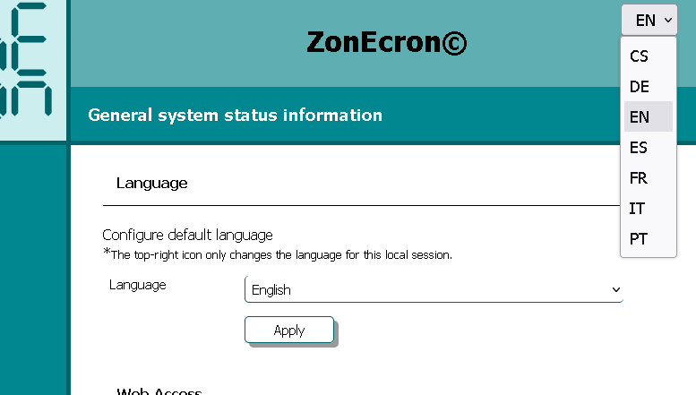
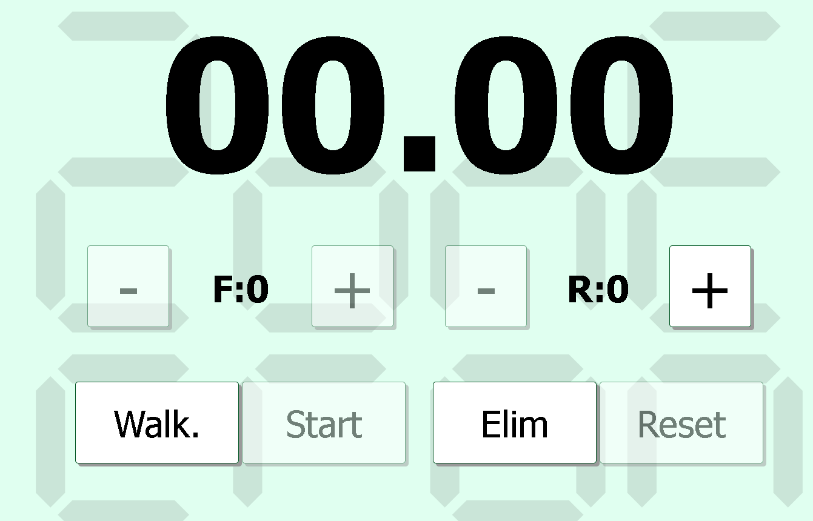
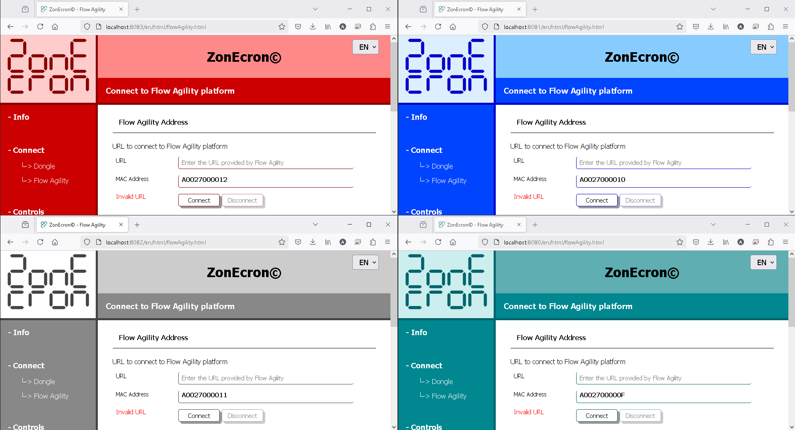

# ZONECRON DONGLE + APLIKACE
## Uživatelský Manuál

### Obsah

1. [Úvod](#1-úvod)
2. [Přípravy](#2-přípravy)
   - [2.1 Okno "Nezavírejte"](#21-okno-nezavírejte)
   - [2.2 Před Začátkem](#22-před-začátkem)
3. [Připojení A Přístupnost](#3-připojení-a-přístupnost)
   - [3.1 Připojení K Dongle Zonecron](#31-připojení-k-dongle-zonecron)
   - [3.2 Připojení K Flowagility](#32-připojení-k-flowagility)
   - [3.3 Přístup Z Jiných Zařízení V Síti](#33-přístup-z-jiných-zařízení-v-síti)
4. [Displeje A Ovládání](#4-displeje-a-ovládání)
   - [4.1 Ovládání Časoměřiče Z Aplikace](#41-ovládání-časoměřiče-z-aplikace)
   - [4.2 Zobrazení Časoměřiče Na Obrazovce](#42-zobrazení-časoměřiče-na-obrazovce)
   - [4.3 Ovládání A Zobrazení Pořadí Z Aplikace](#43-ovládání-a-zobrazení-pořadí-z-aplikace)
   - [4.4 Streaming](#44-streaming)
   - [4.5 Návod Na Streamovací Obrazy](#45-návod-na-streamovací-obrazy)
5. [Různé](#5-různé)
   - [5.1 Více Časovačů](#51-více-časovačů)
   - [5.2 Informace](#52-informace)
   - [5.3 Opouštění Aplikace](#53-opouštění-aplikace)

---

## 1 Úvod

ZonEcron©, a když říkáme ZonEcron©, chceme, abyste si představili neonová světla a ohňostroje na pozadí (dobře, tuto část pro zbytek manuálu přeskočím, jinak by byl příliš dlouhý)—jak jsem říkal, ZonEcron© byl navržen tak, aby splňoval potřebu časování provádění zón (dráha, palisáda a houpačka) a logicky také pro časování krátkých sekvencí k určení, která možnost je lepší.

Přidání donglu pro ovládání časovače z počítače bylo logickým vývojem. Tabule ZonEcron© již má svůj vlastní webový server, takže tato kombinace aplikace a batohu je nadbytečná. Proto pokud máte tabuli ZonEcron©, tento batoh s APLIKACÍ je nadbytečný způsob komunikace s časovačem.

Aplikaci si můžete stáhnout [zde](https://zonecron.github.io/ZonEcronGW/).

---

## 2. Přípravy

### 2.1 Okno "Nezavírejte"

1. Při spuštění aplikace se otevře okno, které nesmí být zavřeno. V tomto okně se objeví anglický text "DO NOT CLOSE THIS WINDOW".
2. Do tohoto okna lze zadávat různé příkazy pro testování nebo odstraňování problémů. Pro více informací zadejte do tohoto okna "HELP" a stiskněte klávesu Enter.
3. Příkazy a odpovědi v tomto okně jsou v angličtině. Pouze manuál a nápověda jsou přeloženy do výchozího nastaveného jazyka.

Nezavírejte okno

---

### 2.2 Před Začátkem

1. Při spuštění aplikace by se měl také otevřít prohlížeč (Firefox, Chrome atd.) s webovou stránkou obsahující tento manuál. Pokud se neotevře, může to být způsobeno bezpečnostními omezeními na počítači, kde je aplikace spuštěna. V takovém případě otevřete prohlížeč a zadejte následující adresu: 
    - http://localhost:8080 
2. Možná bude nutné vyzkoušet různé porty mezi 8081 a 8100, pokud byl port 8080 při spuštění aplikace již obsazen: 
    - http://localhost:8081
    - http://localhost:8082
    - ...
3. V pravém horním rohu lze změnit jazyk pro aktuální relaci, ale výchozí jazyk nebude změněn.
4. Nabídka vlevo má čtyři možnosti: "Informace", "Připojení", "Ovládání" a "Obrazovky". Při kliknutí například na sekci "Informace" se objeví podnabídka se čtyřmi dalšími možnostmi: "Manuál", "Systém", "Časy" a "Licence". Kliknutí například na "Systém" přesměruje na webovou stránku s možnostmi nastavení výchozího jazyka (aby nebylo nutné jej měnit při každém spuštění aplikace) a dalšími systémovými informacemi. Od této chvíle budou odkazy na jednotlivé sekce zkráceny. Tento příklad je zkrácen jako **Informace -> Systém**.
5. Počítač musí rozpoznat dongle ZonEcron po jeho připojení. Obvykle by měl zaznít tón při připojení jakéhokoli zařízení USB. Pokud ne, bude třeba nainstalovat ovladače pro čip CH340G. Zde je web výrobce: https://www.wch-ic.com/downloads/CH341SER_ZIP.html.
6. Pro následující kroky musí zůstat dongle odpojen od počítače, dokud nebude uvedeno jinak.
7. Pokud máte v úmyslu připojit se k platformě FlowAgility, ujistěte se, že má počítač přístup k internetu, například tím, že si otevřete zpravodajskou webovou stránku.

Výběr jazyka pro trvalou nebo dočasnou změnu (v pravém horním rohu).

---

## 3. Připojení A Přístupnost

### 3.1 Připojení K Dongle Zonecron

1. Pro připojení dongle k aplikaci klikněte v nabídce vlevo na **Připojení -> Dongle**.
2. Sekce "sériový port" obsahuje rozbalovací nabídku s dostupnými sériovými porty v počítači. Věnujte pozornost tomu, které z nich jsou k dispozici.
3. Připojte dongle ZonEcron k počítači.
4. Klikněte na "obnovit" a zkontrolujte sériové porty znovu. Dongle bude ten nový port, který tam předtím nebyl.
5. Klikněte na "připojit" a objeví se šedá zpráva: "Otevřeno. Čeká se na signál od dongle." Pokud vše proběhne dobře, po dvou až třech sekundách se zpráva změní na světle zelenou s textem "Dongle nalezen. Čeká se na signál od časovače."
6. Při spuštění nebo zastavení časovače přerušením paprsku buněk by se měla zpráva změnit na tmavě zelenou s textem "Dongle a časovač ověřeny." Pokud ne, zkontrolujte celý proces připojení.

Seznam sériových portů před a po připojení dongle.  
V tomto příkladu je dongle na portu COM4.

---

### 3.2 Připojení K Flowagility

1. V nabídce vlevo vyberte **Připojení -> FlowAgility**.
2. Zkopírujte 12místnou MAC adresu.
3. Na webu FlowAgility https://FlowAgility.com, po přihlášení, přejděte k testu, kde máte přístup na úrovni organizátora.
4. Vyberte ikonu pro správu časovače nahoře. Jakmile tam budete, vložte dříve zkopírovanou MAC adresu do příslušného pole a klikněte na "Připojit k časovači."
5. Stránka se změní a objeví se URL podobná "flowagility.com/ws/timer/123456ABCDEF". Zkopírujte tuto URL.
6. Zpět na stránce **Připojení -> FlowAgility** vložte URL do pole "URL" a klikněte na "připojit".
7. Pokud je vše správně, zobrazí se zelená zpráva "Připojeno." Pokud ne, zkontrolujte celý proces od kroku 2. Dávejte pozor, abyste při kopírování nezahrnuli žádné mezery před nebo za textem a nezahrnujte "https://" ani "www" – zkopírujte pouze poskytnutou URL.
8. Po připojení by se měl časovač zobrazit jako připojený i na stránce FlowAgility. Pokud ne, obnovte stránku.
9. Můžete otestovat spuštění a zastavení časovače a mělo by se to projevit i na stránce FlowAgility. Můžete také otestovat resetování časovače na stránce FlowAgility a zkontrolovat, zda byl časovač resetován.
10. Nyní je navázána obousměrná komunikace.

---

### 3.3 Přístup Z Jiných Zařízení V Síti

1. Tato aplikace umožňuje počítači, na kterém běží, fungovat jako lokální webový server. Proto lze k webovým stránkám přistupovat z jakéhokoli jiného zařízení (PC, tablet, mobilní telefon), které je připojeno ke stejné síti.
2. Pro přístup z jiného zařízení stačí otevřít webový prohlížeč (Firefox, Chrome, ...) a zadat adresu, která se zobrazí v části **Informace -> Systém** v řádku "Přístup k webu" pod "Z jiných zařízení v síti".
3. **Například**, je možné:
   - Nechat počítač stranou na stole s připojeným donglem a spuštěnou aplikací bez dohledu.
   - Zaznamenávat chyby a odmítnutí z mobilního telefonu na okraji arény.
   - Zobrazovat čas, chyby a odmítnutí na televizi u vchodu do kruhu.

Příklad IP pro přístup z jiného zařízení ve stejné síti.

---

## 4. Displeje A Ovládání

### 4.1 Ovládání Časoměřiče Z Aplikace

1. Časoměřič lze ovládat z aplikace kliknutím na sekci **Ovládání -> Časoměřič** v levém menu.
2. V předchozím příkladu by to bylo otevřeno na mobilním telefonu.
3. Ovládací prvky jsou velmi intuitivní. Můžete zvyšovat a snižovat počet chyb a odmítnutí, mazat a obnovovat, označovat časy uznání a další.
4. Je důležité poznamenat, že k resetování časoměřiče musí být pár nejprve odstraněn. To zabraňuje neúmyslným resetům, protože reset nelze vrátit zpět.
5. Pokud je aplikace připojena k FlowAgility, nejsou tyto ovládací prvky potřeba, protože použití obou možností najednou (ovládání a FlowAgility) může způsobit chyby při zaznamenávání výsledků.

Dálkové ovládání na PC.

---

### 4.2 Zobrazení Časoměřiče Na Obrazovce

1. Vyberte **Obrazovky -> Monitor** z levého menu.
2. V předchozím příkladu by to bylo otevřeno v prohlížeči chytré televize.
3. Tato stránka je navržena tak, aby zobrazovala časoměřič veřejnosti na středně velkém nebo velkém monitoru/televizi, která umožňuje čtení informací z určité vzdálenosti.
4. Zobrazí se běžící časoměřič a také chyby a odmítnutí přijaté z ovládacích prvků nebo platformy FlowAgility.
5. Ve spodní části jsou dva selektory pro změnu barvy pozadí a textu, pokud chcete dát stránce slavnostnější nebo firemní vzhled. Doporučujeme používat barvy s dobrým kontrastem mezi nimi.

Obrazovka časovače s vlastními barvami.

---

### 4.3 Ovládání A Zobrazení Pořadí Z Aplikace

1. Tato funkce je bonusem, který není přímo spojen s časoměřičem. Myšlenka je podobná jako u příkladu s časoměřičem, kdy z mobilního telefonu označujete číslo psa v kruhu, a na samostatném monitoru nebo televizi se toto číslo zobrazí ve velkém formátu.
2. Ovládání této funkce se nachází v levém menu pod **Ovládání -> Pořadí**. Je možné spravovat označení čísla psa v kruhu, stejně jako aktuální číslo výšky skoku: 20 (XS ve Španělsku), 30 (S), 40 (M), 50 (I) a 60 (L).
3. Pro zobrazení pořadí veřejnosti otevřete obrazovku umístěnou v levém menu pod **Obrazovky -> Pořadí** na monitoru nebo chytré televizi. Tato informace je velmi užitečná pro soutěžící, aby z dálky viděli číslo a mohli si naplánovat svůj přípravný čas.
4. Stejně jako u obrazovky s časoměřičem lze barvy pozadí a čísel změnit pomocí rozbalovacích nabídek ve spodní části.

Obrazovky zapnutí dálkového ovládání a displeje.

---

### 4.4 Streaming

1. Sekce **Obrazovky -> Streamování** a **Obrazovky -> Streamování FA** jsou navrženy tak, aby byly zachyceny programy pro streamování.
2. Liší se tím, že první je zjednodušená verze druhé pro případy, kdy není používána FlowAgility, ale má stejné možnosti přizpůsobení.

Webová stránka streamování při přizpůsobování.

---

### 4.5 Návod Na Streamovací Obrazy

Protože jsou streamovací obrazy speciálně navrženy a vysoce přizpůsobitelné, věnujeme této části sekci, která vysvětluje možnosti, které nabízejí.

1. Dvojitým kliknutím na prázdné místo obrazovky se otevře obecné okno.
2. V tomto obecném okně můžete ručně zadat vzdálenost dráhy pro zobrazení výpočtu rychlosti v reálném čase. Rychlost nebude zobrazena během prvních 5 sekund dráhy. Pole pro zadání "Max Speed" se používá k tomu, aby se zabránilo zobrazování nadměrně vysokých rychlostí. Pokud je aplikace připojena k FlowAgility, informace o vzdálenosti se automaticky aktualizují. Jinak je třeba vzdálenost zadat ručně pro každý běh.
3. Z tohoto obecného okna můžete také nahrát pozadí, které bude uloženo se zbytkem přizpůsobení při ukládání.
4. Na obrazovce "streaming FA" bude toto okno obsahovat možnost připojení k FlowAgility. Pro aktualizaci informací musíte zadat adresu URL připojení poskytnutou FlowAgility v této nabídce a stisknout tlačítko připojení.
5. Dole v tomto obecném okně je tlačítko pro vstup do režimu úprav. V tomto režimu můžete každé textové pole (čas, chyby, jméno psa atd.) přetáhnout na místo, kde chcete. Dvojitým kliknutím na každý text se otevře okno vlastností, kde můžete změnit jeho velikost, barvu, průhlednost atd. Pokud je jakékoli okno otevřeno, nemůžete nic přetahovat ani upravovat kromě samotného okna. Musí být zavřeno, abyste mohli přetahovat nebo upravovat další texty.
6. Aktivace možnosti "Skrýt" pro prvek ho nezakryje, dokud nevyjdete z režimu úprav. V normálním režimu (neúpravovém) se prvky "Eliminated" a "Faults" a "Refusals" budou střídat (jedno nebo druhé) v závislosti na tom, zda byla dvojice eliminována nebo ne. V režimu úprav budou oba viditelné, aby je bylo možné upravit. Například, pokud se rozhodnete trvale skrýt "Faults" a "Refusals" aktivací možnosti "Skrýt", prvek "Eliminated" si udržuje své chování v normálním režimu, pouze se stane viditelným, když je dvojice eliminována, a naopak.
7. V režimu úprav můžete zrušit posledních 100 akcí pomocí Ctrl + Z nebo znovu provést posledních 100 zrušených akcí pomocí Shift + Ctrl + Z.
8. Jakmile dokončíte přizpůsobení, dvojitým kliknutím na prázdné místo znovu zobrazíte obecné okno a stiskněte tlačítko pro opuštění režimu úprav.
9. V tomtéž okně stisknutí tlačítka pro uložení uloží provedené úpravy a zachová je i po zavření a pozdějším otevření webové stránky.
10. Stisknutí tlačítka pro uložení také synchronizuje tyto úpravy ve všech oknech **stejného prohlížeče**, která zobrazují stejnou streamovací stránku. Tato funkce umožňuje upravit design okna v jedné instanci a při uložení aktualizuje streamované okno, aniž by se zobrazovaly nabídky a vlastnosti otevřené pro úpravy.
11. V případě komunikační chyby s časovačem nebo platformou FlowAgility se pokus o obnovení připojení bude provádět neustále s 5 sekundovou pauzou mezi pokusy.
12. Tlačítko Import/Export umožňuje uložit konfiguraci do souboru pro zálohy nebo migrace. Funkce importu je k dispozici pouze pro nové nebo nedávno resetované konfigurace. Pokud se importní možnost nezobrazí, musíte stisknout tlačítko resetování pro restartování konfigurací, protože jakákoli změna změní tlačítko importu na tlačítko exportu.
13. Některá tlačítka nebo akce zobrazí pop-up nápovědní zprávu při kliknutí nebo při najetí myší na prvek na pár sekund.

---

## 5. Různé

### 5.1 Více Časovačů

1. Je možné spustit program vícekrát, pokud máte několik donglů se svými časovači pro současné závody, například.
2. V tomto případě každá instance aplikace vytvoří jiný přístupový bod, se stejnou adresou, ale jiným portem, například: 
    - http://localhost:8080 
    - http://localhost:8081 
3. Kódy potřebné pro připojení k FlowAgility (MAC adresa) budou po sobě jdoucí.
4. Stránky pro prvních 8 instancí se otevřou s různými barvami, aby je bylo snadno odlišit. Od deváté instance, pokud k tomu někdy dojde, se otevřou s výchozí barvou.

Více spuštění aplikace na stejném PC.

---

### 5.2 Informace

1. Na webové stránce **Information -> System** můžete:
   - Vybrat výchozí jazyk.
   - Zobrazit adresy pro přístup k aplikaci z počítače, na kterém běží, nebo z jiného zařízení ve stejné síti. Například, pokud je váš počítač připojen k Wi-Fi a váš mobilní telefon je také připojen ke stejné síti, můžete získat přístup k aplikaci z mobilu zadáním adresy uvedené v části "Web Access", na řádku "From other devices on the network."
   - Zobrazit stav baterie buněk ZonEcron.
   - Zobrazit základní informace o donglu (nudné).
   - Zobrazit posledních 10 časů zaznamenaných časovačem v aktuálním dni v obráceném pořadí (nejnovější první), pokud byla aplikace připojena k donglu.
2. Na webové stránce **Information -> Times** jsou zobrazeny všechny časy zaznamenané časovačem v aktuálním dni. Časy z předchozích dnů jsou také k dispozici v textových souborech (jeden na den) ve složce "logs" uvnitř aplikační složky.
3. Na webové stránce **Information -> Manual** můžete konzultovat tuto příručku.
4. Na webové stránce **Information -> About** si můžete přečíst licenci k použití.

---

### 5.3 Opouštění Aplikace

1. Chcete-li aplikaci zavřít, jednoduše zavřete okno "NEMAZAT" nebo do něj zadejte příkaz "exit".
2. Všechny webové stránky otevřené na jakémkoli zařízení ztratí komunikaci a přestanou přijímat aktualizované informace.
3. Všechna konfigurační data budou uložena. Pokud došlo k úspěšnému připojení k donglu nebo FlowAgility, tato konfigurace bude také uložena. Při příštím spuštění aplikace se automaticky pokusí připojit k donglu a FlowAgility pomocí této konfigurace.
4. V různé dny se připojení FlowAgility mění, takže nebude fungovat z jednoho dne na druhý.
