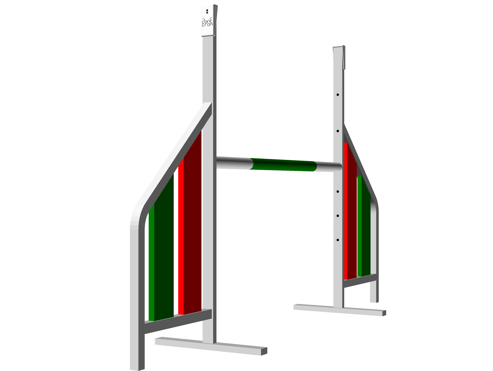
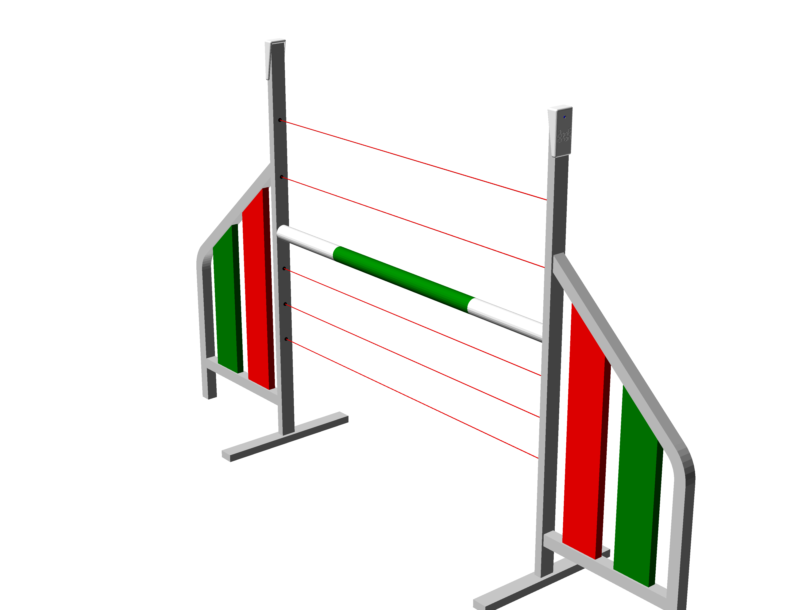

# ZonEcrón© Neviditelný  
## Uživatelská příručka  

  

## Obsah  

1. [Úvod](#1-úvod)  
   - [1.1 Účel zařízení](#11-účel-zařízení)  
   - [1.2 Hlavní vlastnosti](#12-hlavní-vlastnosti)  
   - [1.3 Porovnejte nás](#13-porovnejte-nás)  
2. [Použití](#2-použití)  
   - [2.1 Montáž a spuštění](#21-montáž-a-spuštění)  
   - [2.2 Zarovnání a detekce](#22-zarovnání-a-detekce)  
   - [2.3 Infračervené rušení](#23-infračervené-rušení)  
   - [2.4 Rádiová komunikace](#24-rádiová-komunikace)  
   - [2.5 Zobrazení na obrazovce](#25-zobrazení-na-obrazovce)  
   - [2.6 Napájení a nabíjení](#26-napájení-a-nabíjení)  
   - [2.7 Autonomie](#27-autonomie)  
   - [2.8 Slunce a déšť](#28-slunce-a-déšť)  
   - [2.9 Skladování](#29-skladování)  
3. [Epilog](#3-epilog)  
4. [Kontakt](#4-kontakt)  

---

## 1 Úvod  

### 1.1 Účel zařízení  

ZonEcrón® Neviditelný—když říkáme ZonEcrón®, představte si neonová světla a ohňostroje, atd.—byl navržen jako náhrada za konvenční systémy, které se obvykle instalují vedle nebo na vrchol prvního a posledního skoku a které částečně nebo zcela narušují běh vodiče nebo psa.  

S tímto záměrem a naší přirozenou tendencí k minimalizaci úsilí jsme přidali řadu podmínek podobných původnímu ZonEcrón®: snadná instalace, žádné kabely, atd. Díky našim zkušenostem s vývojem původního ZonEcrón® jsme přidali i podmínky, jako je zachování konstantní výšky detekce a instalace všeho uvnitř křídel překážky.  

Nakonec ZonEcrón® Neviditelný (dále jen ZonEcrón®) vznikl s cílem zlepšit současné systémy časomíry, nabízet větší jednoduchost použití a větší bezpečnost pro psy a jejich vodiče.  

---

### 1.2 Hlavní vlastnosti  

- Neviditelný (nebo téměř): všechny součásti jsou uvnitř konstrukce křídel.  
- Rychlá instalace: stejně rychlá jako sestavení překážky.  
- Vhodný pro venkovní použití: odolný vůči slunci i dešti.  
- Nabíjecí: přes USB, s výdrží baterie přes 30 hodin.  
- Bezpečný: neškodné signály (infračervené a WiFi) a bez ostrých hran.  
- Bezdrátový: žádné kabely, kromě nabíjení baterií.  
- Dlouhý dosah komunikace: testováno na 200 m, doporučeno 40 m.  
- 6 senzorů: zapomeňte na přesouvání buněk při změně výšky.  

---

### 1.3 Porovnejte nás  

Domníváme se, že jsme vyvinuli produkt, který je unikátní svými vlastnostmi. Nenašli jsme žádný jiný produkt, který by spojoval všechny vlastnosti ZonEcrón®, které zde nebudeme opakovat.  

Když jsme pocítili potřebu po časomíře pro soutěže, hledali jsme dlouho a pečlivě. Našli jsme jiné produkty se stejným cílem, ale žádný nesplňoval všechny naše požadavky, a proto jsme se rozhodli vytvořit vlastní.  

Pokud máte konkrétní požadavky, které ZonEcrón® nesplňuje, existují podobné produkty. Doporučujeme vám hledat, porovnávat, a pokud najdete… no, víte, zvídavá mysl je bdělá mysl.  

---

## 2 Použití

### 2.1 Montáž a zapnutí

ZonEcrón® je nainstalován uvnitř konstrukce překážky a protože není viditelný… nazvali jsme ho neviditelným… budu si muset promluvit s marketingovým týmem, protože to nevypadá, že by se moc snažili. U každé překážky jedna strana obsahuje infračervené vysílače (horní kryt má 1 LED a dekorativní prvky jsou bílé), zatímco druhá strana obsahuje infračervené přijímače (horní kryt má 2 LED a dekorativní prvky jsou černé):

|                   Vysílač                   |                   Přijímač                    |
|---------------------------------------------|-----------------------------------------------|
|  |  |

Takže je to vlastně „téměř neviditelné,“ ale dejte si pozor, abyste na stejné překážce nepoužili dvě strany s vysílači, protože logicky nebudou fungovat (a není to poprvé, co se to stalo). Ti všímavější si také uvědomí, že ani dvě strany s přijímači na stejné překážce nebudou fungovat.

Byli jsme dostatečně jasní? Pro jistotu: na každé překážce musí být jedna strana s vysílači a druhá s přijímači.

Jakmile jsou strany umístěny proti sobě, stačí je zapnout. Vypínač a konektor pro nabíjení baterie se nacházejí na spodní straně uvnitř horizontálního profilu. Jsou chráněny posuvným krytem s pružinou. Posuňte kryt a přepněte vypínač do polohy zapnuto (I).

LED diody (1 nebo 2 podle typu) se okamžitě rozsvítí. U přijímačů zůstávají LED diody svítit 5 sekund, zatímco se nastavuje rádiová komunikace. Modré LED diody zůstávají svítit, aby signalizovaly, že ZonEcrón® je… ano, přesně tak, zapnutý. Budu si muset promluvit i s vývojovým týmem, protože to vypadá, že jdou ve stopách marketingu.

---

### 2.2 Zarovnání a detekce

Jakmile jsou vysílač a přijímač postaveny proti sobě a zapnuty, vytvoří se šest infračervených paprsků mezi šesti vysílači a šesti přijímači, aby bylo možné detekovat průchod psa v jakékoli výšce:

Bílá LED dioda na přijímací straně zhasne, pokud je zarovnání správné, a rozsvítí se, aby signalizovala, že jeden z paprsků byl přerušen. LED dioda zůstane rozsvícena minimálně 0,5 sekundy, nebo pokud přerušení trvá déle, zůstane rozsvícena po tuto dobu.

Pokud je některá z těchto bariér přerušena, časovač se spustí nebo zastaví. Pokud je v důsledku umístění tyče pár vysílače a přijímače trvale blokován, bude tento pár po 5 sekundách ignorován a bílá LED dioda zhasne. Více párů může být blokováno současně, pokud je potřeba přidat další tyče pod překážkovou tyč, například aby se zabránilo tomu, že pes projde pod překážkou během tréninku. Jediný pár, který nelze trvale zablokovat, je ten horní.

Standardní použití je pro překážku, ale může být také použit k časování sekvencí tím, že se strany umístí bez tyče, například u východu z tunelu. Dávejte pozor na to, aby vysílač a přijímač nebyly příliš blízko sebe nebo paralelně ke stěnám, protože výkon vysílače je dostatečný k odrazu od blízkých objektů nebo jeho (neviditelný) paprsek může obejít ruku, pokud jsou příliš blízko. Doporučujeme minimální vzdálenost 1 metr. Maximální vzdálenost závisí na množství okolního světla, pohybuje se od 2 metrů za denního světla až po 20 metrů ve tmě s umělým osvětlením.

---

### 2.3 Infračervené samointerference

Vzhledem k výkonu infračervených paprsků navržených pro provoz na plném slunečním světle se může stát, že přijímač zachytí signály od dvou vysílačů. Tento jev je výraznější při slabém okolním osvětlení nebo v uzavřených prostorách.

Nejzřetelnějším příznakem je, že bílá LED dioda na přijímači se neustále rozsvěcuje a zhasíná a časovač se může spustit a zastavit, aniž by byl některý paprsek přerušen.

K tomu může dojít, pokud strany nejsou správně zarovnány. Například:

V tomto případě přijímač 1 (R1) zachycuje signály od vysílače 1 (E1) a vysílače 2 (E2), což způsobuje zmatení.

Aby se tomu zabránilo, nastavte dva přijímače opačnými směry, aby mohly přijímat signály pouze od jednoho vysílače. V předchozím příkladu byste to udělali takto:

---

### 2.4 Rádiová komunikace

Rádiová komunikace je automaticky nastavena mezi buňkami a dalšími možnými příslušenstvími z rodiny ZonEcrón®. Tato komunikace pracuje v rozsahu Wi-Fi frekvencí a může být ovlivněna v prostředích s mnoha aktivními Wi-Fi sítěmi.

Každý přijímač obsahuje vnitřní anténu pro tuto komunikaci. Teoretický maximální dosah je 80 metrů na otevřeném prostranství. Otestovali jsme dosah 200 metrů v rezidenčním parku s několika okolními Wi-Fi sítěmi bez komunikačních problémů. Pro optimální výkon doporučujeme nepřekročit 40 metrů na standardním hřišti.

---

### 2.5 Zobrazení na obrazovce

Na rozdíl od původního ZonEcrón® neobsahuje neviditelný systém integrovaný displej. Pro zobrazení časů budete potřebovat ZonEcrón® zobrazovací panel nebo ZonEcrón® dongle připojený k počítači s naší aplikací. Další informace naleznete v příslušných příručkách.

---

### 2.6 Napájení a nabíjení

Čtyři zařízení (dva vysílače a dva přijímače) mají interní dobíjecí lithiovou baterii, takže během používání není potřeba napájecí nebo komunikační kabely.

Úroveň baterie lze zkontrolovat v aplikaci ZonEcron nebo na displeji ZonEcron, v závislosti na používaném systému zobrazení. Doporučujeme prostudovat příručky pro další podrobnosti. Zařízení navíc ukazují stav baterie pomocí blikání modrých LED diod:
- **Baterie nad 30 %**: modrá LED svítí trvale.
- **Baterie mezi 30 % a 15 %**: modrá LED bliká pomalu.
- **Baterie pod 15 %**: modrá LED bliká rychle.

Tento ukazatel stavu baterie je **orientační**, protože vychází z měření napětí baterie, což ne vždy přesně odráží zbývající kapacitu. Proto je běžné, že procento nabití rychle klesne ze 100 % na 90 %, stabilně zůstane mezi 90 % a 10 % a poté rychle klesne z 10 % na 0 %. Doporučujeme baterii příliš nevybíjet, abyste předešli nepříjemným překvapením typu "jejda".

Zařízení jsou vybavena USB-C portem ve spodní části vedle vypínače. Pro nabíjení baterií musí být zařízení vypnuta a stačí připojit standardní USB kabel k USB nabíječce. Díky rozdílnému designu USB konektorů není možné je fyzicky zapojit nesprávně, takže i méně zruční uživatelé jsou v bezpečí.

**POZOR: EXTRÉMNÍ TEPLOTY.**

Lithiové baterie mají rozsah provozu a nabíjení mezi 5 °C a 50 °C. Mimo tento rozsah může docházet k výkyvům dodávané energie, což vede k nestabilnímu chování časovače. Také se zkracuje doba nabití.

Doporučujeme důrazně nepoužívat ani nenabíjet baterie mimo tento rozsah, zejména pokud jsou příliš chladné, protože to výrazně zkracuje jejich životnost nebo je může zcela zničit. Pokud byl den velmi chladný nebo horký, vypněte zařízení a nechte je v prostředí s přiměřenou teplotou. Počkejte hodinu, aby se přizpůsobila, a poté je nabijte.

**POZOR: NECHÁVAT ZAŘÍZENÍ BEZ DOZORU PŘI NABÍJENÍ JE NEBEZPEČNÉ.**

Žádné zařízení na baterie by nemělo být nabíjeno bez dozoru. Je běžné nechat mobilní telefon nabíjet přes noc, aniž by se něco stalo, ale to neznamená, že se nemůže nic stát. Nedávno měla velká společnost problémy s bateriemi svých mobilních telefonů, které se při nabíjení přehřívaly a explodovaly. Proto chraňte sebe i své okolí. Není nutné sledovat zařízení nepřetržitě, ale je vhodné být při nabíjení poblíž. Pokud to není možné, odpojte zařízení a pokračujte v nabíjení později. Tyto baterie netrpí paměťovým efektem a lze je nabíjet na etapy bez problémů.

**POZOR: KONTROLA PO NÁRAZU.**

Je pravděpodobné, že dříve či později dojde k nárazu psa do křídla, kde je připevněn ZonEcron©. Návrh zařízení byl zaměřen na co největší odolnost a pevné uchycení vnitřních částí, ale v těchto případech je nutné zařízení důkladně zkontrolovat. Pokud zaznamenáte poškození, slyšíte uvolněné části uvnitř nebo se zařízení při nabíjení přehřívá, okamžitě jej vypněte, odpojte a umístěte na bezpečné místo mimo dosah hořlavých materiálů. Kontaktujte nás, abychom mohli navrhnout řešení.

ZonEcron© je vybaven elektronickým obvodem, který řídí nabíjení a vybíjení baterií. Zabraňuje jejich přebití nebo nadměrnému vybití. Ukazatel 0 % baterie znamená minimální doporučenou úroveň, při které by se měl ZonEcron© nabít. Přístroj však zůstane zapnutý a využije zbývající energii baterie, dokud ochranný obvod nezastaví napájení. To může být užitečné v nouzových situacích, ale nemělo by to být běžnou praxí, protože to negativně ovlivňuje životnost baterií.

Rada, že baterie by měly být zcela vybité před dalším nabíjením, platí pro staré Ni-Cd baterie. U těchto "moderních" (dnes již standardních) lithiových baterií **je lepší je zcela nevybíjet** (je to naopak škodlivé). Mnohem vhodnější je dobíjet je, když jsou částečně nabité. Nabíjení na etapy nemá žádný negativní dopad.

---

### 2.7 Výdrž baterie

Nové zařízení má výdrž baterie přes 35 hodin, což je více než dostatečné pro dvoudenní soutěž. Tato výdrž se bude postupem času zkracovat v důsledku přirozeného životního cyklu lithiových baterií.

Také okolní teplota může negativně ovlivnit výdrž baterie:
- Během používání: Čím chladněji, tím kratší výdrž. Nedoporučuje se používat zařízení při teplotách pod 0 °C.
- Během nabíjení: Doporučuje se nabíjet při mírných teplotách mezi 10 °C a 30 °C, aby se zajistilo správné a úplné nabití.

Pro maximalizaci výdrže baterie byla implementována následující opatření:
- Během chodu časovače se snižuje jas obrazovky, protože nejdůležitější informací je naměřený čas. Po zastavení časovače se jas obrazovky zvýší.
- Po zastavení časovače a 30 sekundách nečinnosti se jas obrazovky opět sníží a po dalších 30 sekundách se obrazovka vypne. Obrazovka se poté rozsvítí na 1 sekundu každých 5 sekund.

---

### 2.8 Slunce a déšť

Původní ZonEcron byl navržen tak, aby bez problémů fungoval venku na slunci nebo v dešti.
- Jeho charakteristická bílá barva byla zvolena záměrně, aby zabránila přehřívání na slunci.
- Design umožňuje použití v dešti, pokud je zařízení drženo ve svislé poloze s konektory směřujícími dolů, aby se zabránilo vniknutí vody do otvorů.

---

### 2.9 Skladování

Při ukládání ZonEcron je třeba zohlednit vlhkost a stav baterie:
- Jak již bylo zmíněno, ZonEcron **je odolný proti dešti, ale ne proti vlhkosti**. Pokud zůstane několik dní vlhký, vlhkost postupně pronikne do krytu a může nenávratně poškodit elektronické součásti. Po použití v dešti je proto nutné nechat jej den v suchém prostředí, aby se zcela odstranila případná zbytková vlhkost.
- Pokud jde o baterii: Pokud plánujete ZonEcron© delší dobu nepoužívat, **nejlepší je ponechat baterie částečně nabité**, aby se maximalizovala jejich životnost. Dlouhodobé skladování plně nabitých nebo zcela vybitých lithiových baterií může výrazně snížit jejich výkon.

---

### 3 Epilog

Užívejte si čas se svými psy a nenechte se frustrovat srovnáváním svých časů s ostatními (i když zdravá soutěživost je zábavná). Musíte soutěžit jen sami se sebou.
Tento časovač byl navržen tak, aby usnadnil vaše soutěže, ať už při použití, nebo při změně výšky překážek.
Doufáme, že ZonEcron© využijete naplno, a pamatujte: žád

né chyby z lenosti… Dělejte to pořádně, do toho!

---

### 4 Kontakt

Pro technickou podporu, dotazy nebo návrhy nás můžete kontaktovat e-mailem: [zonecron@gmail.com](mailto:zonecron@gmail.com)
