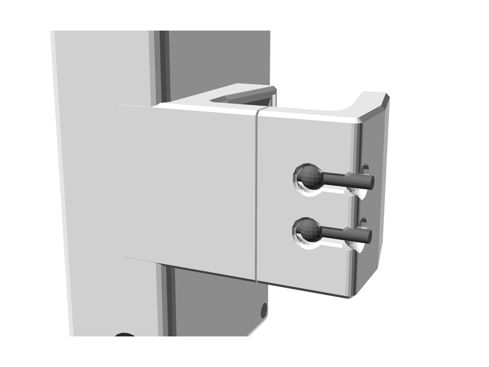

# ZonEcrón© Original
## Uživatelský manuál

### Obsah

1. [Úvod](#1-úvod)
   - [1.1 Účel zařízení](#11-účel-zařízení)
   - [1.2 Hlavní vlastnosti](#12-hlavní-vlastnosti)
   - [1.3 Porovnejte nás](#13-porovnejte-nás)
2. [Použití](#2-použití)
   - [2.1 Montáž a zapnutí](#21-montáž-a-zapnutí)
   - [2.2 Zarovnání a detekce](#22-zarovnání-a-detekce)
   - [2.3 Infračervené samo-rušení](#23-infračervené-samo-rušení)
   - [2.4 Rádio komunikace](#24-rádio-komunikace)
   - [2.5 Zobrazení na displeji](#25-zobrazení-na-displeji)
   - [2.6 Napájení a nabíjení](#26-napájení-a-nabíjení)
   - [2.7 Výdrž baterie](#27-výdrž-baterie)
   - [2.8 Slunce a déšť](#28-slunce-a-déšť)
   - [2.9 Skladování](#29-skladování)
3. [Epilog](#3-epilog)
4. [Kontakt](#4-kontakt)

---

## 1 Úvod

### 1.1 Účel zařízení

ZonEcrón© (a když říkáme ZonEcrón©, představte si neonová světla a ohňostroje v pozadí – dobře, tuto část vynechám pro zbytek manuálu, aby to nebylo příliš dlouhé) byl navržen tak, aby vyřešil potřebu měřit čas na konkrétních zónách (most, palisáda a houpačka) a logicky také měřit krátké sekvence, aby se určila nejlepší možnost.

S tímto cílem v mysli a naší tendencí k minimálnímu úsilí jsme přidali několik podmínek, jako je snadná instalace, bezdrátová konstrukce atd., a začali jsme experimentovat s různými technologiemi (infračervené paprsky, rádio, baterie, displeje atd.), které nás přibližovaly k našemu konečnému výsledku.

Původní ZonEcrón® (od nynějška jednoduše ZonEcrón®) vznikl s cílem splnit potřeby měření času v tréninku agility a je určen především pro tento kontext. I když vlastnosti zařízení umožňují jeho použití jako závodní časomíru, doporučujeme přidat některé další vybavení (velký displej, připojení k softwaru závodů, náhradní pár atd.) pro tento účel.

---

### 1.2 Hlavní vlastnosti

- Kompaktní, malý a vše integrované.
- Rychlé sestavení, navrženo tak, aby povzbuzovalo k častému použití.
- Vhodné pro venkovní použití, dobře viditelné na slunci a s určitou ochranou proti dešti.
- Nabíjecí přes USB, s výdrží přes 30 hodin.
- Bezpečné: neškodné signály (infračervené a wifi) a bez ostrých rohů.
- Pevné uchycení, kompatibilní s jakýmkoli materiálem (plast, hliník, železo).
- Bezdrátové. Nevyžaduje žádné kabely, kromě nabíjení baterií.
- Velký dosah komunikace. Otestováno na 80 m, doporučeno pro 40 m.
- Integrovaný 4místný displej s maximálním rozlišením pro zobrazený čas (milisekundy, setiny, desetiny nebo sekundy).
- Dvojitý senzor, horní a dolní, u každé brány.

---

### 1.3 Porovnejte nás

Věříme, že jsme vyvinuli jedinečný produkt co do funkcí. Nenašli jsme žádný jiný produkt, který by kombinoval všechny vlastnosti ZonEcrón©, které zde nebudeme opakovat.

Když jsme potřebovali tréninkový časoměřič, hledali jsme důkladně a našli jiné produkty se stejným cílem, ale žádný nevyhovoval všem našim požadavkům, proto jsme se rozhodli vytvořit jej sami.

Pokud máte konkrétní potřebu, kterou ZonEcrón© nesplňuje, existují i jiné podobné produkty. Zveme vás k hledání, porovnávání a pokud najdete... no, zvídavá mysl je bdělá mysl.

---

## 2 Použití

### 2.1 Nastavení a Zapnutí

Pár originálních zařízení ZonEcron© se skládá z infračerveného vysílače (krabička bez obrazovky) a infračerveného přijímače (krabička s obrazovkou).

Obě zařízení mají svorku s jednou pevnou stranou na krabičce a druhou, která se posouvá podél dvou ocelových tyčí. Vnitřní elastický pásek udržuje strany svorky pohromadě. Tento pásek lze rychle nastavit do tří úrovní napětí posunutím svázaných konců pásku, čímž se přizpůsobí různým šířkám nebo tloušťkám tyčí. Podívejte se na následující obrázky:

|                 Minimální napětí                    |                 Střední napětí                     |                 Maximální napětí                   |
|-----------------------------------------------------|----------------------------------------------------|----------------------------------------------------|
|   |  |  |
| Široký profil lišty.                                | Pro kulaté trubky.                                  | Úzký profil lišty.                                |
| např. hliníkové překážky.                           | např. PVC překážky nebo kulaté tyče.                | např. překážky z galvanizované oceli.             |

Posuňte svorku, abyste ji otevřeli, a umístěte ZonEcron© na svislou část křídla nebo na podpěru překážky. Vysílač se umístí napravo a přijímač nalevo, přičemž se dva vysílače zarovnají se dvěma přijímači:

Dále zapněte vysílač a přijímač. Chcete-li ověřit, že je vysílač zapnutý, zkontrolujte modrou LED diodu, která bude svítit nepřetržitě nebo blikat (pokud je baterie slabá). V případě přijímače se modré světlo po zapnutí okamžitě rozsvítí a na obrazovce se zobrazí různé zprávy. Jakmile čas ukazuje nulu (0,0), modré světlo zhasne, pokud je infračervený signál vysílače správně detekován. I když na pořadí nastavení a zapnutí nezáleží, doporučujeme nejprve umístit zařízení na místo a poté zapnout vysílač (bez obrazovky) před přijímačem (s obrazovkou). To umožňuje zkontrolovat stav baterie obou zařízení během úvodních zpráv na obrazovce.

**Je důležité** ponechat mezeru mezi tyčí a dolním vysílačem, aby se maximalizovala pravděpodobnost detekce. Doporučujeme umístit dolní vysílač 10 cm nad tyč pro velikosti XS, S a M a 15 cm pro velikosti L a XL. Například u velikosti M by to mělo vypadat takto:

---

### 2.2 Zarovnání a Detekce

Jakmile jsou vysílač a přijímač umístěny proti sobě a zapnuty, modré světlo na přijímači zhasne, pokud je zarovnání správné a žádné překážky neblokují infračervený paprsek. Když je paprsek přerušen (pohybem nebo špatným zarovnáním), modrá LED na přijímači se rozsvítí minimálně na 0,5 sekundy nebo déle, pokud přerušení trvá déle.

Vysílač má dvě infračervené LED diody, jednu horní a jednu dolní, a přijímač má dva senzory, jeden horní a jeden dolní. Příjem je selektivní, což znamená, že horní senzor reaguje pouze na infračervené světlo horní LED diody vysílače, a to samé platí pro spodní pár. To vytváří dvě přímé bariéry mezi vysílačem a přijímačem. Neexistuje žádná křížová detekce. Pokud je některá z těchto bariér přerušena, časování se spustí nebo zastaví.

Dávejte pozor, abyste neumisťovali vysílač a přijímač příliš blízko sebe nebo paralelně ke stěnám, protože výkon vysílače je dostatečný k odrazu od blízkých povrchů nebo jeho (neviditelný) jas může obejít ruku při testování na stole.

Doporučujeme minimální provozní vzdálenost 1 m. Maximální vzdálenost závisí na okolním světle, pohybuje se od 2 m za jasného slunečního světla až po 20 m ve tmě s umělým osvětlením dráhy.

---

### 2.3 Infračervené Rušení

Vzhledem k výkonu infračervených paprsků používaných pro provoz na přímém slunečním světle může přijímač zachytit signály ze dvou vysílačů. Tento jev je výraznější za nízkého osvětlení nebo v uzavřených prostorách.

Nejzjevnějším příznakem je, že modré světlo přijímače se neustále zapíná a vypíná a časovač se může neočekávaně spustit nebo zastavit, aniž by byl paprsek přerušen.

K tomu dochází, protože přijímač zachytí infračervené signály ze dvou vysílačů současně, kvůli jejich umístění na dráze nebo odrazům od blízkých povrchů (stěny nebo sklo). Například v tomto případě přijímač 1 (R1) přijímá infračervené signály od vysílače 1 (T1) i vysílače 2 (T2):

Aby se tomu předešlo, umístěte přijímače tak, aby přijímaly signály pouze od jednoho vysílače, například přepnutím strany na překážce. V předchozím příkladu postupujte takto:

Pokud není možné umístit pár 2 na opačnou stranu překážky, použijte delší podpěry nebo je v krajním případě otočte vzhůru nohama:

---

### 2.4 Rádiová Komunikace

Rádiová komunikace je automaticky navázána mezi všemi prvky rodiny ZonEcron©. Tato komunikace funguje v rozsahu frekvencí Wi-Fi a může být ovlivněna v prostředích s mnoha Wi-Fi sítěmi.

Originální ZonEcron© má v každém přijímači (krabička s obrazovkou) vnitřní anténu pro navázání této komunikace. Optimální spolehlivost a dosah komunikace se dosáhne, když jsou oba přijímače ve svislé poloze ve své obvyklé montážní poloze.

Teoretický maximální dosah je 80 m na otevřeném prostranství. Experimentálně bylo dosaženo dosahu 200 m v rezidenčním parku s mnoha okolními Wi-Fi sítěmi, bez výpadků komunikace. Doporučuje se však nepřekračovat 40 m na standardní dráze pro optimální výkon.

---

### 2.5 Displej obrazovky

Jakmile je přijímač zapnutý a zobrazí různé zprávy, jak bylo dříve vysvětleno, na obrazovce se na středních číslicích zobrazí "0,0". Pokud měření času začne u některého z párů vysílač-přijímač, čas začne běžet na obou obrazovkách. Během měření času se zobrazují sekundy a desetiny sekund a pozice číslic se mohou posunout, pokud sekundy přesáhnou 99, nebo mohou zmizet desetiny sekund, pokud sekundy přesáhnou 999.

Po zastavení měření času displej zobrazí čas s nejvyšším možným rozlišením:

| Rozlišení       | Od      | Do      | Příklad |
|-----------------|---------|---------|---------|
| milisekundy     | 0,000s  | 9,999s  | 5,417   |
| setiny sekundy  | 10,00s  | 99,99s  | 54,17   |
| desetiny sekundy| 100,0s  | 999,9s  | 541,7   |
| sekundy         |  1000s  |  9999s  | 5417    |

Obě obrazovky zobrazí stejný čas, protože jsou synchronizovány na začátku, během a na konci měření.

---

### 2.6 Napájení a nabíjení

Všechna čtyři zařízení (dva vysílače a dva přijímače) mají vestavěné dobíjecí lithiové baterie, takže během používání nejsou potřeba žádné napájecí ani komunikační kabely.

Úroveň nabití baterie lze zkontrolovat pomocí aplikace ZonEcrón nebo tabule ZonEcrón, v závislosti na použitém zobrazovacím systému. Doporučujeme konzultovat příslušné návody k obsluze pro další podrobnosti. Zařízení také indikují úroveň baterie pomocí blikání modré LED:

- **Baterie nad 30 %**: Modrá LED svítí nepřetržitě.
- **Baterie mezi 30 % a 15 %**: Modrá LED bliká pomalu.
- **Baterie pod 15 %**: Modrá LED bliká rychle.

Tento indikátor nabití je **přibližný**, protože je založen na měření napětí baterie, které ne vždy přesně odráží zbývající kapacitu. Proto je normální, že procento nabití rychle klesne ze 100 % na 90 %, zůstane stabilní mezi 90 % a 10 %, a poté rychle klesne z 10 % na 0 %. Doporučujeme vyhnout se nadměrnému vybití baterie, aby nedošlo k nepříjemným překvapením.

Zařízení mají port USB-C umístěný ve spodní části vedle vypínače. Pro dobití baterií vypněte zařízení a jednoduše připojte standardní USB kabel k USB nabíječce. Konstrukce USB konektorů zajišťuje, že nemohou být nesprávně připojeny, takže i ti nejnešikovnější uživatelé jsou v bezpečí.

**VAROVÁNÍ: EXTRÉMNÍ TEPLOTY.**  
Lithiové baterie mají provozní a nabíjecí rozsah mezi 5 °C a 50 °C. Mimo tento rozsah může jejich dodávka energie kolísat, což vede k nepravidelnému chování časovače. Také doba nabití bude kratší.  
Důrazně doporučujeme nepoužívat nebo nenabíjet baterie mimo tento rozsah, zejména pokud jsou příliš chladné, protože to drasticky zkrátí jejich životnost nebo je zcela znefunkční. Pokud byl den velmi chladný nebo horký, vypněte zařízení, nechte je hodinu na přiměřeně temperovaném místě a poté je nabijte.

**VAROVÁNÍ: NEPŘÍTEL NABÍJENÍ BEZ DOZORU.**  
Žádné zařízení napájené z baterií by nemělo být nabíjeno bez dozoru. Běžné je nechat telefon připojený přes noc bez problémů, ale to, že se nic nestalo, neznamená, že se nemůže stát. Nedávno měl velký výrobce problémy s přehříváním a dokonce explozí baterií během nabíjení. Chraňte sebe a své blízké. Není potřeba sledovat zařízení čtyři hodiny, ale pokud zahájíte nabíjení, doporučuje se zůstat poblíž a věnovat se jiným úkolům. Pokud není možné zůstat poblíž, je lepší odpojit a pokračovat v nabíjení později. Tyto baterie nemají paměťový efekt a lze je nabíjet po částech bez problémů.

**VAROVÁNÍ: KONTROLA PO NÁRAZU.**  
Je velmi pravděpodobné, že pes narazí do křídla držícího ZonEcrón©. Návrh zařízení je zaměřen na co největší odolnost a pevné upevnění vnitřních částí, ale v takových případech je povinné zařízení důkladně zkontrolovat. Pokud je viditelné poškození, uvnitř se ozývají uvolněné části nebo se během nabíjení přehřívá, okamžitě zařízení vypněte, odpojte a umístěte na bezpečné místo, kde nemůže způsobit požár. Kontaktujte nás pro konzultaci možných řešení.

Závěrem, ZonEcrón© má elektronický obvod, který řídí nabíjení a vybíjení baterie, aby nedošlo k přebití nebo hlubokému vybití. Indikace 0% baterie je doporučená minimální úroveň nabití, při které by mělo být zařízení nabito. Nicméně zařízení bude nadále fungovat, dokud ochranný obvod nevypne napájení. I když to může umožnit nouzové použití, není to vhodné jako běžná praxe, protože to negativně ovlivní životnost baterie.

Nakonec lidová moudrost, která radí baterie úplně vybít před nabitím, platí pro staré baterie Ni-Cd. U těchto „nových“ (i když již dlouho nejsou nové) lithiových baterií **je lepší je nevybíjet úplně** (ve skutečnosti je to škodlivé). Mnohem lepší je je nabíjet, když jsou z poloviny plné. I nabíjení po částech, trochu teď a trochu později, nemá žádný negativní dopad.

---

### 2.7 Výdrž baterie

Nový originální ZonEcrón má výdrž baterie přes 40 hodin, což je více než dostatečné pro použití jako časomíra během soutěže na celý den a dostatečné pro tréninkové jednotky. Tato výdrž baterie se bude postupně snižovat kvůli přirozené životnosti lithium-iontových baterií.

Okolní teplota může také negativně ovlivnit výdrž baterie:
- Během používání: Nižší teploty snižují výdrž baterie. Nedoporučuje se používat zařízení při teplotách pod 0 °C.
- Během nabíjení: Nabíjení se doporučuje při mírných teplotách mezi 10 °C a 30 °C, aby byla zajištěna správná a úplná nabíjení.

Pro prodloužení životnosti baterie byla implementována následující opatření:
- Když je časomíra aktivní, jas obrazovky se sníží, protože klíčová informace je konečný čas. Když se časomíra zastaví, jas obrazovky se zvýší na maximum.
- Po zastavení časomíry, pokud po dobu 30 sekund nedojde k žádné aktivitě, jas obrazovky se opět sníží a po dalších 30 sekundách se obrazovka vypne, přičemž se rozsvítí pouze na 1 sekundu každých 5 sekund.

---

### 2.8 Slunce a déšť

Originální ZonEcrón byl navržen pro perfektní provoz ve venkovních podmínkách, jak na slunci, tak v dešti.
- Jeho charakteristická bílá barva byla záměrně zvolena, aby se zabránilo přehřívání na slunci.
- Jeho konstrukce umožňuje použití v dešti, pokud je umístěn vertikálně s konektory směřujícími dolů, aby se zabránilo vniknutí vody otvory.

---

### 2.9 Skladování

Při skladování ZonEcrónu zvažte vlhkost a péči o baterii:
- Jak bylo zmíněno výše, ZonEcrón je odolný vůči dešti, nikoli však vůči dlouhodobé vlhkosti. Pokud zůstane vlhký po několik dní, vlhkost postupně pronikne krytem a může způsobit nevratné poškození elektronických součástí. Proto, pokud byl používán v dešti, nechte jej jeden den v suchém prostředí, aby se vlhkost před skladováním zcela odstranila.
- Co se týče baterie, pokud neplánujete ZonEcrón nějakou dobu používat, je nejlepší uložit baterie s polovičním nabitím, aby byla maximalizována jejich životnost. Skladování plně nabitých nebo zcela vybitých lithium-iontových baterií po delší dobu může výrazně snížit jejich výkon.

---

## 3 Epilog

Užijte si čas se svými psy a nenechte se frustrovat při porovnávání časů s ostatními (i když přátelská soutěž dělá trénink zábavnějším). Musíte soutěžit pouze sami se sebou.

Tento časoměr je navržen tak, aby vám pomohl najít tu nejplynulejší a nejrychlejší trasu pro vás a vaše psy.

Doufáme, že ZonEcrón© plně využijete, a pamatujte: žádné odmítnutí jen proto, abyste ušetřili krok, žádné odmítnutí z lenosti. Dejte do toho vše, lidi!

---

## 4 Kontakt

Pro technickou podporu, dotazy nebo návrhy nás můžete kontaktovat e-mailem na: [zonecron@gmail.com](mailto:zonecron@gmail.com)
