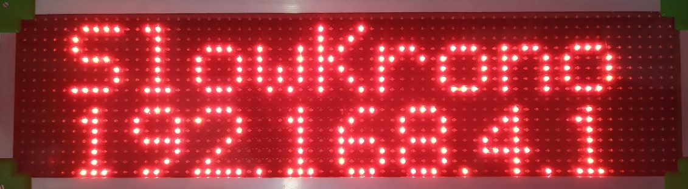
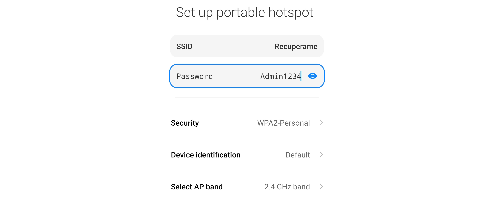
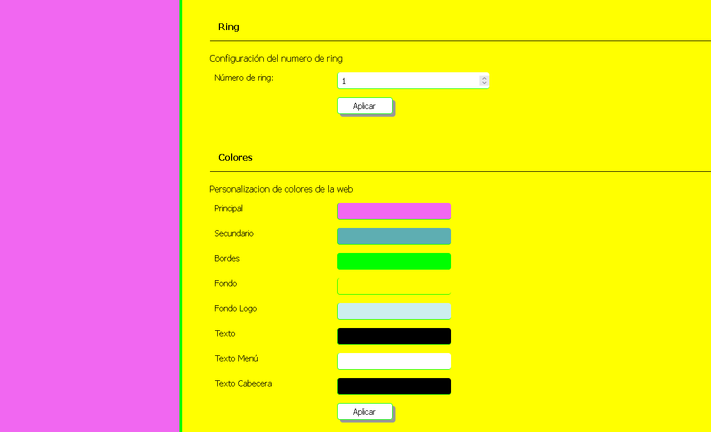
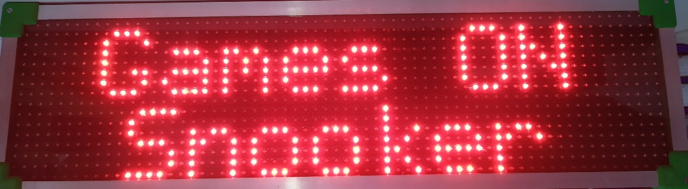

# Skórovací Tabule ZonEcron
## Uživatelská Příručka

1. [Úvod](#1-úvod)
   - [1.1 Technické Specifikace](#11-technické-specifikace)
   - [1.2 Hlavní Funkce](#12-hlavní-funkce)
   - [1.3 Komponenty](#13-komponenty)
   - [1.4 Montáž a Napájení](#14-montáž-a-napájení)
2. [Displej](#2-displej)
   - [2.1 Obecný Popis](#21-obecný-popis)
   - [2.2 Externí/Interní Bzučák](#22-externíinterní-bzučák)
   - [2.3 Komunikace s Ekosystémem ZonEcron](#23-komunikace-s-ekosystémem-zonecron)
   - [2.4 Zobrazení Režimů Provozu](#24-zobrazení-režimů-provozu)
     - [2.4.1 Režim Stopky](#241-režim-stopky)
     - [2.4.2 Režim Start](#242-režim-start)
     - [2.4.3 Režim Rozpoznání Dráhy](#243-režim-rozpoznání-dráhy)
     - [2.4.4 Režim Hry](#244-režim-hry)
   - [2.5 Zobrazení Zpráv](#25-zobrazení-zpráv)
     - [2.5.1 Úvodní Zprávy](#251-úvodní-zprávy)
     - [2.5.2 Baterie Senzorů](#252-baterie-senzorů)
     - [2.5.3 Chybové Zprávy Senzorů](#253-chybové-zprávy-senzorů)
     - [2.5.4 Šetřič Displeje](#254-šetřič-displeje)
     - [2.5.5 Vlastní Zprávy](#255-vlastní-zprávy)
   - [2.6 Limity](#26-limity)
3. [Vestavěný Webový Server](#3-vestavěný-webový-server)
   - [3.1 Popis](#31-popis)
   - [3.2 WiFi Sítě](#32-wifi-sítě)
     - [3.2.1 Připojení k WiFi Síti Skórovací Tabule](#321-připojení-k-wifi-síti-skórovací-tabule)
     - [3.2.2 Změna Názvu, Hesla a Zabezpečení](#322-změna-názvu-hesla-a-zabezpečení)
     - [3.2.3 Obnovení WiFi přihlašovacích údajů](#323-obnovení-wifi-přihlašovacích-údajů)
     - [3.2.4 Připojení Tabule k Externí WiFi Síti](#324-připojení-displeje-k-externí-wifi-síti)
   - [3.3 Webové Stránky](#33-webové-stránky)
     - [3.3.1 Info](#331-info)
     - [3.3.2 Soubory](#332-soubory)
     - [3.3.3 WiFi](#333-wifi)
     - [3.3.4 Přizpůsobení](#334-přizpůsobení)
     - [3.3.5 Speciální Režimy](#335-speciální-režimy)
     - [3.3.6 Dálkové Ovládání](#336-dálkové-ovládání)
     - [3.3.7 Monitor](#337-monitor)
     - [3.3.8 Software](#338-software)
     - [3.3.9 Streaming](#339-streaming)
4. [Kontakt](#4-kontakt)

---

## 1. Úvod

### 1.1 Technické Specifikace
**Obecné**
- Displej s vysokým jasem LED 16x64, zobrazující až 999,99s, chyby a odmítnutí.
- Napájení: 230V ±10% 50Hz
- Rozměry (bez stativu): 66cm x 18cm x 12cm
- Hmotnost: 5kg

**Řízení času**
- Signál hodinového křemenného krystalu 16 MHz XO.
- Maximální rozlišení: 0,001s.
- Průměrná odchylka za 24 hodin: ±20 ppm. (±0,07 s/h)
- Přesnost systému s [ZonEcron Original](./original.md) (časoměřič + senzory): od +0ms do +2ms.
- Přesnost systému s [pruhy](./sensorBars.md) nebo [neviditelné](./invisible.md) (časoměřič + senzory): od +0ms do +6ms.

**Webový server**
- Až 4 současní uživatelé.
- Hodiny reálného času s TCXO ±2ppm pro datum a čas s vyměnitelnou baterií na 10 let.
- Bezdrátová komunikace 2,4GHz.
- Paměť: 350 KB FLASH, přibližně 3000 záznamů výsledků, včetně data a času.

---

### 1.2 Hlavní Funkce
- Rozlišení na milisekundy pro časy pod 10 sekund nebo na setiny sekundy pro časy 10 sekund a více.
- Displej indikuje penalizace (max. 9), odmítnutí a diskvalifikaci.
- Upozornění na displeji na špatně zarovnané fotobuňky.
- Hodiny v reálném čase s datem a časem.
- Měření vnitřní teploty.
- Přizpůsobitelný šetřič obrazovky (přidejte název svého klubu!).
- Ovládání přes webovou stránku z mobilu/tabletu/PC.
- Odpočítávání pro rozpoznání dráhy s pauzou a nastavitelným krokem po 1 minutě.
- 15sekundové odpočítávání pro starty na nejvyšší úrovni soutěží.
- Kompatibilní s gamblerem a snookerem, včetně zvukového signálu.
- Vícenásobné průchody jednou buňkou na složitých tratích.
- Přizpůsobení barev webového rozhraní kdykoliv.
- Zobrazení vlastních zpráv na displeji po definovanou dobu.

---

### 1.3 Komponenty

Skórovací tabule ZonEcron obsahuje:
- LED displej.
- Stativ pro upevnění displeje.
- Standardní napájecí kabel (230V 50Hz).
- Kufr pro snadné přenášení.
- V závislosti na modelu interní nebo externí bzučák/siréna.

**Důležitá Poznámka**: Ujistěte se, že máte sadu bezdrátových senzorů ZonEcron (originálních nebo neviditelných) nakonfigurovanou pro komunikaci s displejem.

---

### 1.4 Montáž a Napájení

Montáž skórovací tabule ZonEcron je jednoduchá, ale zde je několik tipů pro dokonalý výsledek:

1. **Začněte se stativem**:
   - Roztáhněte nohy a zajistěte je. Utáhněte křídlové matice a ujistěte se, že je stativ stabilní na zemi.
   - Pokud nepotřebujete velkou výšku nebo je větrné počasí, raději neroztahujte nejtenčí části nohou. Pro větší stabilitu můžete na spodní hák zavěsit závaží.
   - Pokud je terén nerovný, upravte nohy a použijte vodováhu na stativu k zajištění vodorovné polohy.
   - Některé pohyby stativu byly úmyslně omezeny, aby byla zlepšena stabilita a zabránilo se pádu displeje. Hlava stativu se může otáčet pouze vertikálně pro orientaci displeje. Povolte rotaci pomocí bočního knoflíku.

2. **Umístěte obrazovku na stativ**:
   - Otevřete zajišťovací šroub na horní části stativu.
   - Zasuňte čtvercovou základnu obrazovky do držáku na stativu, dokud nebude pevně upevněna.
   - Zajistěte šroub a ověřte, že je vše správně upevněno.

   **Pozor!** Nepokoušejte se pohybovat stativem s nainstalovanou obrazovkou, protože by mohlo dojít k poškození upevňovací základny. Pokud potřebujete změnit polohu, nejprve sejměte obrazovku a poté přesuňte stativ.

3. **Připojte napájecí kabel**:
   - Nejprve připojte kabel k obrazovce a poté do elektrické zásuvky.
   - Pokud používáte prodlužovací kabel, rozviňte jej dostatečně, aby zůstal volný a předešlo se napětí při případném zakopnutí.

4. **Zapněte obrazovku**:
   - Stiskněte spínač na spodní straně obrazovky.
   - Pokud je vše v pořádku, spínač se rozsvítí a během méně než 2 sekund se na obrazovce začnou objevovat úvodní zprávy. Další informace naleznete v části [2.5.1](#251-úvodní-zprávy).
   - Pokud se spínač nerozsvítí, problém bude pravděpodobně v pojistce integrované do napájecí zásuvky obrazovky. Otevřete kryt pojistky. U nových zařízení vždy naleznete náhradní pojistku uvnitř stejného krytu, oddělenou od aktuálně používané pojistky. Vyměňte ji a zkuste to znovu.

---

## 2 Displej

### 2.1 Obecný Popis

Tabule ZonEcron je navržena s ohledem na funkčnost a odolnost, ale také na pohodlí uživatelů. Zde jsou její hlavní vlastnosti:

- **Materiál**: Hlavní konstrukce je z plastu, což je ideální pro podporu rádiové komunikace. Rohy jsou opatřeny 3D tištěnými díly se zaoblenými hranami, aby se zabránilo ostrým hranám.
- **Údržba**: Není nutná žádná údržba, kromě občasného otření vlhkým hadříkem. Pokud je třeba přistoupit k vnitřním komponentům, přední a zadní panely lze sejmout odšroubováním šroubů na hranách a rozích. Panely jsou utěsněny silikonem, aby byla zabráněna pronikání dešťové vody. Toto těsnění lze snadno odstranit, ale po otevření panelů je nutné nanést nový silikon.
- **Ventilace**: Displej má dvě mřížky; jedna obsahuje ventilátor, který odvádí horký vzduch z vnitřku, zatímco druhá umožňuje přívod čerstvého vzduchu, což zabraňuje přehřívání elektroniky.
- **Spodní část**:
  - Zásuvka na napájení s vypínačem a pojistkou.
  - Upevnění pro montáž displeje na stativ.
  - U verzí s externím bzučákem naleznete slot pro jeho upevnění a příslušný konektor.

---

### 2.2 Externí/Interní Bzučák

Bzučák vydává akustické signály v následujících situacích:
- **Konec času pro rozpoznání trati**: Bude pípat krátce a přerušovaně po dobu 8 sekund.
- **Herní režim snooker**: Když uplyne nastavený čas otevření, zazní pípnutí po nastavenou dobu.
- **Herní režim gambler**: Pípne jednou po uplynutí času otevření a podruhé po uplynutí času uzavření, opět po nastavenou dobu.

**Pozor!** U rozpoznání trati bzučák vždy vydává přerušovaný zvuk, podobně jako budík. U herních režimů bude signál odeslaný do bzučáku nepřerušovaný, ale některé modely bzučáků mají přerušování integrované ve své elektronice. Pokud chcete použít vlastní bzučák, zvolte takový, který funguje na 12V a spotřebovává méně než 0,5A.

---

### 2.3 Komunikace s Ekosystémem ZonEcron

Všechny zařízení ekosystému ZonEcron jsou předem nakonfigurovány tak, aby se automaticky připojily k sobě. Každá sada je unikátně kódována, aby se zabránilo rušení mezi blízkými tratěmi. Prvky jedné sady se tedy propojí pouze mezi sebou a nebude možné například použít buňky jedné sady s displejem jiné sady.

**Pořadí zapnutí** nezáleží; je jedno, zda nejprve zapnete displej, buňky nebo batoh – vše se připojí automaticky. Přesto doporučujeme nejprve zapnout a zarovnat buňky, než zapnete displej, aby bylo možné správně zobrazit úrovně baterie v úvodních zprávách. Podrobnosti naleznete v části [2.5.1](#251-úvodní-zprávy).

Navíc u [**ZonEcron Original**](./original.md) zmizí čas z malého displeje buňky a místo toho zobrazí úroveň baterie rozsvícením 4 bodů displeje následujícím způsobem:
- 100% až 81% -> 4 body.
- 80% až 61% -> 3 body.
- 60% až 41% -> 2 body.
- 40% až 21% -> 1 bod.
- 20% až 0% -> Displej vypnutý.

---

### 2.4 Zobrazení Režimů Provozu

#### 2.4.1 Režim Stopky

Toto je hlavní režim tabule ZonEcron, kde se zobrazuje:

- **Čas**: Zobrazen ve velkém formátu.
- **Chyby a Odmítnutí**: V pravé části, označené "F" a "R" před čísly. Pokud je označeno "vyloučeno", budou nahrazeny "ELI", ale stopky budou pokračovat, což umožňuje opravy nebo zaznamenání finálního času soutěžícího.

Displej s běžícím časem.

**Zobrazení času**:
- Když čas běží: Jeden desetinný údaj (aktualizován každou desetinu sekundy).
- Když je čas zastaven:
  - Milisekundy, pokud je čas pod 10 sekund.
  - Setiny sekundy, pokud je čas 10 sekund nebo více.

**Maximální čas**: Když čas přesáhne 100 sekund (vzácné na běžných tratích agility), číslice se zúží, aby bylo možné zobrazit pět číslic celkem. Maximální zobrazitelný čas tímto způsobem je 999,99 sekund. Celkový čas lze zobrazit na webu na [dálkovém ovládání](#336-dálkové-ovládání).

---

#### 2.4.2 Režim Start

V tomto režimu displej zobrazuje odpočítávání (sekundy a desetiny) předem nastavené, obvykle na 15 sekund.

Operátor stopek musí před každým soutěžícím resetovat tabuli pomocí [ovladače](#336-ovladač). Poté na pokyn rozhodčího spustí přednastavené odpočítávání. Poté:
- Pokud pes přeruší buňku během odpočítávání, stopky začnou normálně.
- Pokud odpočítávání dosáhne 0, aniž by byla přerušena buňka, stopky začnou tak jako tak, ignorujíc první průchod buňkou.

---

#### 2.4.3 Režim Rozpoznání Dráhy

Tento režim zobrazuje odpočítávání v minutách a sekundách pro rozpoznání dráhy. Výchozí nastavení je 7 minut, ale čas lze upravit v krocích po 1 minutě během pauzy nebo běhu:
- **Důležité**: V tomto režimu nemají buňky žádný efekt.
- **Po skončení odpočítávání**:
  - Zobrazí se zpráva "Čas vypršel".
  - Zazní přerušovaný signál po dobu 8 sekund.

---

#### 2.4.4 Režim Hry

Tento režim je navržen pro hry "snooker" a "gambler" podle pravidel WAO (World Agility Open).

- **Snooker**: Běžné měření času, dokud neuplyne nastavený čas, poté zazní akustický signál (délka signálu je nastavitelná).
- **Gambler**:
  - Čas zůstává skrytý za zprávou "Tempus Fugit."
  - Po uplynutí času pro otevření zazní první signál a čas se začne znovu zobrazovat.
  - Po uplynutí času pro uzavření zazní druhý signál (k dispozici pouze v režimu gambler).
  - V obou fázích, pokud je buňka přerušena před stanoveným časem, se zobrazí uplynulý čas a signál nezazní.
  - Druhý signál lze deaktivovat nastavením času pro uzavření na 0 sekund.

Příklad režimu gambler s časem pro otevření 30s a časem pro uzavření 12s:
- Na začátku běhu je čas skrytý a na obrazovce se zobrazuje "Tempus Fugit."
- Po 30 sekundách běhu zazní první signál a čas se začne normálně zobrazovat.
- Po 42 sekundách běhu (12 sekund po čase pro otevření) zazní druhý signál.

**TIP**: Pokud je prostředí hlučné, doporučuje se zesílit akustický signál píšťalkou nebo jiným manuálním upozorněním.

---

## 2.5 Zobrazení zpráv

### 2.5.1 Úvodní zprávy

Při zapnutí tabule ZonEcron se během prvních několika sekund zobrazí čtyři zprávy:
1. Značka a model.

2. Název klubu (nastavený spořič obrazovky).

3. Čas a datum zařízení.

4. Název WiFi sítě (vlastní nebo cizí) a IP adresa.

Pokud během těchto zpráv buňka detekuje průchod, budou zprávy přerušeny a časomíra se automaticky přepne na hlavní obrazovku a začne počítat. Proto, pokud potřebujete zkontrolovat čas, datum nebo síťové údaje, je lepší zapnout buňky až po zobrazení všech zpráv.

Zvláštní pozornost věnujte zprávám 3 a 4: ujistěte se, že datum a čas jsou správně nastaveny [viz část 3.3.1](#331-info) a že si pamatujete WiFi síť a přiřazenou IP adresu pro správu webového serveru [viz část 3.2](#32-připojení-k-serveru).

---

### 2.5.2 Baterie senzorů

Při prvním zapnutí páru buněk se zobrazí procento baterie přijímače. Rovněž se zobrazí baterie vysílače, pokud je správně zarovnána s přijímačem. Pokud chcete zkontrolovat stav baterií později, aniž byste museli vše vypínat a zapínat, můžete tak učinit přes webové rozhraní [viz část 3.3.1](#331-info).

---

### 2.5.3 Chybové zprávy senzorů

Pokud se senzor vychýlí (s výjimkou režimu rozpoznání dráhy), zobrazí se výstražná zpráva označující postižený senzor. Pokud časomíra běží, bude pokračovat v počítání, ale čas se nezobrazí, dokud nebude senzor správně zarovnán.

---

### 2.5.4 Šetřič Displeje

Pokud časomíra zůstane zastavená déle než 2 minuty, aktivuje se spořič obrazovky. Ten zobrazí posuvný text střídající se s aktuálním časem každých 10 sekund. Text, který se má zobrazit, lze nakonfigurovat [viz část 3.3.4](#334-přizpůsobení).

---

### 2.5.5 Vlastní zprávy

Lze nastavit vlastní zprávy na dvou řádcích, každý s maximálně 10 znaky. [Část 3.3.4](#334-přizpůsobení) vysvětluje, jak to udělat. Tyto zprávy se zobrazí pouze tehdy, když je časomíra zastavena, a zmizí, pokud je odeslán příkaz k resetu nebo pokud buňka detekuje průchod.

---

### 2.6 Limity

- Časomíra může měřit více než 1 000 sekund, ale obrazovka zobrazuje pouze až 999,99 sekund. Pro delší časy je můžete zkontrolovat na webových stránkách [dálkového ovládání](#336-dálkové-ovládání) nebo [monitoru](#337-monitor).
- Maximální počet chyb, které může časomíra zaznamenat, je 9.
- Maximální počet odmítnutí, které může zaznamenat, je 2. Od třetího odmítnutí bude zobrazeno jako vyloučení.

---

## 3 Vestavěný Webový Server

### 3.1 Popis

Tabule ZonEcron obsahuje vestavěný webový server, který vám umožní kontrolovat, konfigurovat a ovládat časomíru z libovolného zařízení s WiFi připojením (smartphone, tablet, PC) bez potřeby dalšího softwaru. Tento webový server se může připojit k existující WiFi síti nebo vytvořit vlastní WiFi síť, takže není vyžadováno internetové připojení.

---

### 3.2 WiFi sítě

#### 3.2.1 Připojení k WiFi Síti Skórovací Tabule

Při zapnutí tabule ZonEcron, pokud není nakonfigurována žádná jiná síť (například při prvním zapnutí), vytvoří svou vlastní WiFi síť. Každá tabule má unikátní název sítě a heslo:

  - **Název sítě**: ZonEcronXXXXXXXXXXXX
  - **Heslo**: XXXXXXXXXXXX

Kde "XXXXXXXXXXXX" jsou čísla a velká písmena od A do F. Při hledání a nalezení sítě tak již znáte heslo... vy a všichni ostatní... proto heslo (a název sítě) co nejdříve změňte, jak je vysvětleno v [části 3.3.3](#333-wifi).

Připojte se k této WiFi síti a po připojení:

1. Vaše zařízení vás může upozornit, že síť nemá připojení k internetu (samozřejmě). Ujistěte se, že připojení zůstane zachováno.

2. **Důležitá poznámka**: Některé smartphony mají funkci "WiFi+" (nebo podobnou), která automaticky přepíná na mobilní data, pokud WiFi síť nemá internet. Tuto funkci deaktivujte, aby nedošlo k problémům.
3. Otevřete webový prohlížeč (Chrome, Firefox atd.) a zadejte adresu `http://192.168.4.1`. Tím se dostanete na úvodní stránku tabule, kde můžete zobrazit její stav [viz část 3.3.1](#331-info).

---

#### 3.2.2 Změna názvu, hesla a zabezpečení

Doporučujeme změnit výchozí název sítě a heslo podle pokynů v [sekci 3.3.3](#333-wifi). To je důležité pro ochranu vašeho zařízení, stejně jako byste chránili svůj domácí router.

Při oficiálních soutěžích se vyhněte používání WiFi sítě generované displejem. Server je jednoduchý a jeho jedinou ochranou je heslo k síti. V těchto případech připojte displej k robustní WiFi síti vytvořené vhodným routerem pro prostředí s vysokým provozem nebo, jako poslední možnost, WiFi vypněte.

---

#### 3.2.3 Obnovení WiFi přihlašovacích údajů

Zapomněli jste heslo k WiFi síti vašeho displeje ZonEcron? Nebojte se, existuje jednoduchý postup, jak se znovu připojit k displeji:

1. Vypněte displej ZonEcron a buňky.
2. Vytvořte hotspot (sdílení WiFi) na svém smartphonu s názvem "**Recuperame**" (ve španělštině „obnov mě“) a heslem "**Admin1234**" (rozlišuje velká a malá písmena).

3. Zapněte displej ZonEcron.
4. Počkejte, až se připojí k síti "**Recuperame**" (z vašeho telefonu).
5. Na displeji ZonEcron se zobrazí název sítě ("Recuperame") a IP adresa přiřazená vaším telefonem.
6. Otevřete tuto IP adresu ve webovém prohlížeči vašeho telefonu a můžete znovu nastavit název a heslo sítě vytvořené displejem ZonEcron podle [sekce 3.3.3](#333-wifi).

**Nemůžete se připojit?**:
- Pokud se na displeji nezobrazuje "Recuperame", znamená to, že se displej nepřipojil k síti sdílené vaším telefonem. Zkontrolujte, zda jste správně zadali název sítě a heslo (pozor na velká a malá písmena) a že váš telefon vytváří síť 2,4 GHz. Novější sítě 5 GHz nejsou kompatibilní.
- Pokud se zobrazuje síť "Recuperame", ujistěte se, že je to vaše síť, a ne síť generovaná jiným telefonem v okolí.
- Pokud se stále nemůžete připojit, napište nám na [ZonEcron@gmail.com](mailto:ZonEcron@gmail.com?subject=Problémy%20s%20WiFi%20připojením) a my vám poskytneme personalizovanou podporu.

---

#### 3.2.4 Připojení displeje k externí WiFi síti

1. Při zapnutí displeje zkontrolujte v [úvodních zprávách](#251-úvodní-zprávy) WiFi síť a IP adresu.
2. Připojte svůj telefon/tablet/PC ke stejné WiFi síti. Pokud jde o síť vytvořenou displejem, postupujte podle kroků v [sekci 3.2.1](#321-připojení-k-síti-displeje).
3. Otevřete webovou stránku s [WiFi nastavením](#333-wifi).
4. V sekci "Připojit k jiné WiFi síti" se ujistěte, že je zapnutá; pokud ne, zapněte ji.
5. V rozbalovací nabídce této sekce vyberte WiFi síť, ke které chcete displej připojit, a zadejte a potvrďte heslo.
6. Po kliknutí na "Použít" se zobrazí upozornění, a po jeho potvrzení se webový server restartuje.
7. Sledujte zprávy na displeji, abyste ověřili, že je připojen k nakonfigurované WiFi síti. Pokud není, zopakujte kroky a ujistěte se, že zadáváte správné heslo.
8. **Důležité**: Heslo nesmí obsahovat zvláštní znaky, zpětné lomítko ( \ ) nebo středník ( ; ). WiFi síť musí být 2,4 GHz. Novější sítě 5 GHz nejsou podporovány.

**TIP**: Aby vám neunikly zprávy na displeji, protože by se mohl spustit časoměřič, proveďte tuto konfiguraci s vypnutými buňkami.

Podívejte se na video (Zapněte si titulky ve svém preferovaném jazyce, protože audio je ve španělštině):  
[Podívejte se na video na YouTube](https://youtu.be/FqYA5eCeje0)  

---

### 3.3 Webové stránky

Když přistupujete na webovou stránku displeje ZonEcron, hlavní stránkou bude karta "Info". V závislosti na tom, zda přistupujete z telefonu nebo PC, se karty zobrazí buď v horní části, nebo na levé straně. Každá karta nabízí různé možnosti konfigurace displeje nebo jen zobrazení určitých informací.

---

#### 3.3.1 Info

V této sekci můžete:

- **Synchronizovat datum a čas**: Nastavte datum a čas časomíry, aby odpovídaly vašemu zařízení, pouhým stisknutím tlačítka.
- **Zkontrolovat vnitřní teplotu**: Velmi užitečné pro ověření správné funkce.
- **Zobrazit stav buněk**: Pokud jsou zapnuté, můžete zkontrolovat procento baterie každé z nich.
- **Zobrazit informace o verzi displeje**.

Informační stránka:

---

#### 3.3.2 Soubory

V této kartě můžete spravovat soubory uložené na serveru displeje ZonEcron. Zejména zmíníme **časové záznamy**, což jsou soubory pojmenované `cronoLog#.txt`, které obsahují záznamy času. Zde `#` je číslo od 0 do 3. Klikněte na ně, abyste je zobrazili a prohlédli si všechny časy zaznamenané displejem.

- **Seznam souborů**: Zobrazuje seznam všech souborů a na konci seznamu celkové zabrané a dostupné místo. Tento server je velmi lehký, zabírá jen pár KB.
- **Nahrát soubory**: Tuto možnost byste za normálních okolností neměli používat. Proto zde nesdílíme potřebný klíč. Pokud byste to někdy potřebovali na naše doporučení, klíč vám poskytneme. Například nahrazení loga ZonEcron logem vaší asociace, ale soubor musí splňovat určité požadavky a požádáme vás o jeho kontrolu před nahráním.
- **Smazat soubory**: Totéž jako výše.
- **Smazat časové záznamy**: Zadáním klíče "disturbingLackOfFaith" server smaže všechny **časové záznamy** a začne zaznamenávat od nuly. To může být užitečné, pokud nechcete uchovávat záznamy z předchozí soutěže při zahájení nové, ale obecně to není nutné, protože displej přepíše nejstarší záznamy, aby se nikdy nevyčerpal prostor.

**TIP**: Pokud máte více časových záznamů, aktuální, do kterého displej zapisuje, bude mít nejmenší velikost.

Příklad časového záznamu: 

---

#### 3.3.3 WiFi

Displej ZonEcron může vytvořit vlastní WiFi síť nebo se připojit k existující. Ve výchozím nastavení si pamatuje poslední použitou síť a pokusí se k ní připojit. Pokud se to nepodaří, vytvoří vlastní WiFi síť.

Na této kartě můžete spravovat vlastní WiFi síť vytvořenou displejem a/nebo tu, ke které se má připojit. Pouze jeden režim (vlastní síť nebo externí síť) bude aktivní. I když je možné zapnout oba režimy současně pro dočasné změny konfigurace, nedoporučujeme běžně používat oba režimy současně, protože by to mohlo způsobit problémy s připojením.

- **Vytvořit vlastní WiFi síť**: Zapněte nebo vypněte síť a změňte název a heslo podle svých potřeb. Užitečné pro obnovení WiFi.
- **Připojit se k existující síti**: Prohledejte dostupné sítě a vyberte, ke které se chcete připojit. Po připojení také ukazuje kvalitu signálu.
- **Restart**:
  - **Restartovat**: Tato možnost vypne a znovu zapne server (nikoli displej). Přeruší všechny aktuální WiFi připojení.
  - **Resetovat**: Tato možnost vymaže nastavení WiFi a obnoví tovární nastavení. Poté provede restart serveru jako v předchozí možnosti.

Jak již bylo zmíněno, tento server je velmi kompaktní a má omezenou kapacitu. Doporučujeme maximálně 3 současné uživatele pro plynulé připojení.

**TIP**: Pokud vypnete oba režimy (vlastní síť a externí síť), displej ZonEcron zůstane bez WiFi (buňky budou stále fungovat) až do restartu. To může být užitečné, pokud máte podezření na úmyslné rušení.

---

#### 3.3.4 Přizpůsobení

Zde můžete upravit různé aspekty tak, aby se časomíra ZonEcron přizpůsobila vašim potřebám:

- **Klub**: Nastavte dva řádky textu, každý s maximálně 10 znaky, obvykle název klubu. Tento text se použije jako spořič obrazovky, když je časomíra neaktivní déle než 2 minuty.
- **Dočasné zprávy**: Definujte zprávy, které se objeví na obrazovce, zatímco je časomíra zastavena. Můžete nastavit jejich délku trvání nebo je ponechat neurčené (čas 0). Tyto zprávy zmizí, pokud je časomíra resetována nebo pokud buňka detekuje průchod.
- **Barvy**: Změňte barvy webového rozhraní. Změny jsou okamžitě viditelné, ale nebudou uloženy, dokud je nepotvrdíte. Vyhněte se kombinacím, které by mohly být nepříjemné pro oči. Například:

---

#### 3.3.5 Speciální režimy

V této sekci můžete nastavit speciální režimy pro soutěže nebo tréninky:

- **Games**: Nakonfigurujte parametry pro uskutečnění kola her podle vysvětlení v [sekci 2.4.4](#244-režim-games).
- **Vícenásobná detekce**: Nastavte další detekce potřebné k tomu, aby se časomíra zastavila a displej zobrazil zmrazený čas během mezilehlých detekcí, zatímco časomíra pokračuje.
- **Startovní čas**: Aktivujte režim startu a nastavte čas startu (výchozí je 15 sekund), aby fungoval podle vysvětlení v [sekci 2.4.2](#242-režim-start).

Při použití režimu Hry nebo režimu Vícenásobné detekce se na obrazovce zobrazí potvrzovací zpráva (pokud je časovač zastaven):

- Režim games:

- Režim vícenásobné detekce:

---

#### 3.3.6 Dálkové ovládání

Z této obrazovky může obsluha časomíry (například pomocí mobilního telefonu) ovládat hlavní funkce časomíry, včetně:

- Zaznamenání chyb, odmítnutí a vyloučení.
- Resetování časomíry.
- Aktivace režimu rozpoznání trati a nastavení času.

Ovladač na mobilním zařízení:

Ovladač také zobrazuje aktuální čas běhu, stav slabé baterie nebo nesprávné zarovnání článků a posledních 5 výsledků ve spodní části pro rychlou konzultaci týmem na trati.

Několik pravidel:

- **Odmítnutí na startu**: Pokud je časomíra resetována, označení odmítnutí spustí čas a ignoruje první průchod buňkou. (Pokud časomíra není resetována, odmítnutí se přidá k výsledku na obrazovce).
- **Opravy**: Můžete opravit chyby, odmítnutí a vyloučení i po dokončení trati.
- **Reset**: Toto tlačítko je aktivní pouze 5 sekund po dokončení trati nebo při vyloučení soutěžícího, aby se zabránilo nechtěným resetům (které nelze vrátit zpět).

---

#### 3.3.7 Monitor

Monitorovací obrazovka zobrazuje stejné informace jako dálkové ovládání, ale bez tlačítek. Je ideální pro veřejné video tabule, protože může také zobrazovat logo klubu jako pozadí.

---

#### 3.3.8 Software

V této sekci můžete nastavit připojení časomíry k softwaru třetí strany prostřednictvím websocketu. Ačkoli byl původně navržen pro komunikaci s platformou [FlowAgility](https://www.flowagility.com/), časomíra se může připojit k jakémukoli softwaru, který má websocketový server, pomocí protokolu zpráv [popsaného zde](https://github.com/ZonEcron/ZonEcron-Interfacing/blob/main/WebsocketClient.md#4-mode-meanings-and-examples).

Upozorňujeme, že pro připojení časomíry tímto způsobem musí být připojena k externí WiFi síti, jak je popsáno v [sekci 3.2.4](#324-připojení-časomíry-k-externí-wifi-síti). Kromě toho, pokud software funguje jako online platforma, například FlowAgility, tato externí WiFi síť musí mít přístup k internetu.

Na této stránce naleznete:

- **Adresa softwaru**: Tato sekce obsahuje údaje potřebné k připojení k platformě FlowAgility (a případně k jinému softwaru třetí strany):
  - URL: Adresa, na kterou se má časomíra pokusit připojit. Tuto adresu musí poskytnout software, ke kterému se chcete připojit.
  - MAC adresa: MAC adresa časomíry. FlowAgility vyžaduje tuto adresu pro vytvoření výše zmíněné připojovací URL.
  - Konečně zde najdete indikátor aktuálního stavu připojení.
- **Serial & WS client connection log**: Zobrazuje zprávy přicházející z časomíry a softwaru třetí strany. Tento log má maximálně 5000 znaků; při dosažení limitu budou nejstarší zprávy odstraněny, aby se zobrazily ty nejnovější. Tento log se navíc neukládá; pokud opustíte nebo obnovíte webovou stránku, log začne od začátku.
- **DANGER ZONE - KEEP AWAY BUTTERFINGERS**: V této sekci, kterou doporučujeme nepoužívat (pokud nevíte, co děláte), se po stisknutí tlačítka zobrazí následující pole:
  - SSL: Pro použití zabezpečeného websocketového připojení (wss) nebo běžného (ws).
  - Port: Pro změnu portu serveru, ke kterému se má časomíra připojit.
  - Extra Info: Pro zobrazení dalších informací v logu.

---

#### 3.3.9 Streaming

Tato obrazovka není přímo přístupná z nabídky, ale lze ji zobrazit v seznamu souborů.

Je navržena tak, aby ji mohly zachytit streamovací programy a zobrazit počítání v reálném čase.  

Pokud potřebujete něco sofistikovanějšího nebo přizpůsobitelného, můžete použít [náš přizpůsobitelný HTML](https://github.com/ZonEcron/FlowAgilityStreamingInfo). Je navržen tak, aby se mohl připojit také k FlowAgility, ale není to povinné a nepoužívané informace lze skrýt. Přizpůsobte si ho podle svých potřeb a připojte jej k výsledkové tabuli pro působivý streaming/videostěnu.  
  

---

## 4 Kontakt

Pro technickou podporu, dotazy nebo návrhy nás kontaktujte e-mailem: [ZonEcron@gmail.com](mailto:ZonEcron@gmail.com?subject=Časomíra%20ZonEcron).
