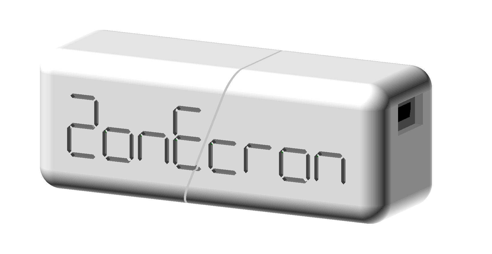

# ZONECRON GATEWAY - HANDBUCH
## Benutzerhandbuch

### Inhalt

1. [Einleitung](#1-einleitung)
2. [Vorbereitungen](#2-vorbereitungen)
   - [2.1 "Nicht schließen"-Fenster](#21-nicht-schließen-fenster)
   - [2.2 Vor dem Start](#22-vor-dem-start)
3. [Verbindungen und Zugänglichkeit](#3-verbindungen-und-zugänglichkeit)
   - [3.1 Verbindung mit Zonecron-Dongle](#31-verbindung-mit-zonecron-dongle)
   - [3.2 Verbindung mit Flowagility](#32-verbindung-mit-flowagility)
   - [3.3 Zugriff von anderen Geräten im Netzwerk](#33-zugriff-von-anderen-geräten-im-netzwerk)
4. [Anzeigen und Bedienung](#4-anzeigen-und-bedienung)
   - [4.1 Bedienung des Timers über die App](#41-bedienung-des-timers-über-die-app)
   - [4.2 Timer auf einem Bildschirm anzeigen](#42-timer-auf-einem-bildschirm-anzeigen)
   - [4.3 Turnus](#43-turnus)
   - [4.4 Streaming-Anzeigen](#44-streaming-anzeigen)
   - [4.5 Streaming-Anpassung](#45-streaming-anpassung)
5. [Verschiedenes](#5-verschiedenes)
   - [5.1 Mehrere Timer](#51-mehrere-timer)
   - [5.2 Informationen](#52-informationen)
   - [5.3 Beenden der Anwendung](#53-beenden-der-anwendung)

---

## 1 Einleitung

Das ZonEcron©, und wenn wir ZonEcron© sagen, möchten wir, dass Sie sich Neonlichter und Feuerwerk im Hintergrund vorstellen (okay, ich werde diesen Teil für den Rest des Handbuchs überspringen, sonst wird es zu lang)—wie ich sagte, das ZonEcron© wurde entwickelt, um den Bedarf an der zeitlichen Ausführung von Zonen (Landebahn, Palisade und Wippe) zu decken und logischerweise auch kurze Sequenzen zu messen, um festzustellen, welche Option besser ist.

Das Hinzufügen eines Dongles zur Steuerung des Timers über einen Computer war eine logische Weiterentwicklung. Die ZonEcron©-Anzeigetafel verfügt bereits über einen eigenen Webserver, wodurch diese Kombination aus App und Rucksack redundant wird. Wenn Sie also eine ZonEcron©-Anzeigetafel besitzen, ist dieser Rucksack mit der APP ein redundanter Weg, mit dem Timer zu kommunizieren.

Die APP kann [hier](https://zonecron.github.io/ZonEcronGW/) heruntergeladen werden.

---

## 2. Vorbereitungen

### 2.1 "Nicht schließen"-Fenster

1. Wenn die Anwendung startet, öffnet sich ein Fenster, das nicht geschlossen werden darf. In diesem Fenster erscheint "NICHT DIESES FENSTER SCHLIESSEN" auf Englisch.
2. Eine Reihe von Befehlen kann in dieses Fenster eingegeben werden, um Tests oder Fehlersuche durchzuführen. Geben Sie in diesem Fenster "HELP" ein und drücken Sie die Eingabetaste für weitere Informationen.
3. Die Befehle und Antworten in diesem Fenster sind auf Englisch. Nur das Handbuch und die Hilfe sind in die standardmäßig konfigurierte Sprache übersetzt.

---

### 2.2 Vor dem Start

1. Wenn die Anwendung startet, sollte sich auch ein Browser (Firefox, Chrome usw.) mit der Webseite öffnen, die dieses Handbuch enthält. Wenn es sich nicht öffnet, kann dies an Sicherheitsbeschränkungen auf dem Computer liegen, der die Anwendung ausführt. In diesem Fall öffnen Sie einen Browser und geben Sie die folgende Adresse ein: 
    - http://localhost:8080 
2. Möglicherweise müssen Sie verschiedene Ports zwischen 8081 und 8100 ausprobieren, wenn Port 8080 bereits belegt war, als die Anwendung startete: 
    - http://localhost:8081
    - http://localhost:8082
    - ...
3. In der oberen rechten Ecke kann die Sprache für die aktuelle Sitzung geändert werden, aber die Standardsprache wird nicht verändert.
4. Das Menü auf der linken Seite hat vier Optionen: "Information", "Verbinden", "Steuerungen" und "Bildschirme". Wenn Sie zum Beispiel auf den Abschnitt "Information" klicken, erscheint ein Untermenü mit vier weiteren Optionen: "Handbuch", "System", "Zeiten" und "Lizenz". Wenn Sie beispielsweise auf "System" klicken, werden Sie zur Webseite mit Optionen für die Konfiguration der Standardsprache weitergeleitet (damit Sie diese nicht jedes Mal ändern müssen, wenn die Anwendung gestartet wird) und anderen Systeminformationen. Ab hier werden die Referenzen zu jedem Abschnitt abgekürzt. Dieses Beispiel wird als **Information -> System** abgekürzt.
5. Der Computer muss den ZonEcron-Dongle erkennen, wenn er angeschlossen ist. Normalerweise sollte ein Ton zu hören sein, wenn ein USB-Gerät angeschlossen wird. Wenn nicht, müssen Sie die Treiber für den CH340G-Chip installieren. Hier ist die Website des Herstellers: https://www.wch-ic.com/downloads/CH341SER_ZIP.html .
6. Für die folgenden Schritte muss der Dongle bis auf Weiteres vom Computer getrennt bleiben.
7. Wenn Sie beabsichtigen, eine Verbindung zur FlowAgility-Plattform herzustellen, stellen Sie sicher, dass der Computer über Internetzugang verfügt, indem Sie beispielsweise eine Nachrichtenwebsite besuchen.

---

## 3. Verbindungen und Zugänglichkeit

### 3.1 Verbindung mit Zonecron-Dongle

1. Um den Dongle mit der Anwendung zu verbinden, klicken Sie im Menü auf der linken Seite auf **Verbinden -> Dongle**.
2. Der Abschnitt "Serieller Port" hat ein Dropdown-Menü mit den verfügbaren seriellen Ports auf dem Computer. Achten Sie genau darauf, welche es sind.
3. Schließen Sie den ZonEcron-Dongle an den Computer an.
4. Klicken Sie auf Aktualisieren und überprüfen Sie die seriellen Ports erneut. Der Dongle wird der neue Port sein, der zuvor nicht vorhanden war.
5. Klicken Sie auf Verbinden, und eine graue Nachricht erscheint: "Geöffnet. Warten auf ein Signal vom Dongle." Wenn alles gut geht, wird es nach zwei oder drei Sekunden hellgrün und zeigt "Dongle gefunden. Warten auf ein Signal des Timers" an.
6. Wenn der Timer gestartet oder gestoppt wird, indem der Lichtstrahl der Zellen unterbrochen wird, sollte die Nachricht auf "Dongle und Timer verifiziert." in dunkelgrün wechseln. Wenn nicht, überprüfen Sie den gesamten Verbindungsprozess.

---

### 3.2 Verbindung mit Flowagility

1. Wählen Sie im Menü auf der linken Seite **Verbinden -> FlowAgility**.
2. Kopieren Sie die 12-stellige MAC-Adresse.
3. Gehen Sie auf die FlowAgility-Website https://FlowAgility.com , loggen Sie sich ein und greifen Sie auf den Test zu, zu dem Sie Zugriff auf Organisator-Ebene haben.
4. Wählen Sie das Symbol für die Timer-Verwaltung oben. Fügen Sie dort die zuvor kopierte MAC-Adresse in das entsprechende Feld ein und klicken Sie auf "Mit Timer koppeln".
5. Die Seite ändert sich, und eine URL wie "flowagility.com/ws/timer/123456ABCDEF" erscheint. Kopieren Sie diese URL.
6. Gehen Sie zurück zur **Verbinden -> FlowAgility**-Seite, fügen Sie die URL in das Feld "URL" ein und klicken Sie auf Verbinden.
7. Wenn alles korrekt ist, sollte die Nachricht "Verbunden." in grün erscheinen. Andernfalls überprüfen Sie den gesamten Prozess ab Schritt 2. Achten Sie darauf, keine Leerzeichen vor oder nach dem Text beim Kopieren einzufügen, und schließen Sie "https://" oder "www" nicht ein – kopieren Sie einfach die bereitgestellte URL.
8. Sobald Sie verbunden sind, sollte der Timer auch auf der FlowAgility-Seite als verbunden angezeigt werden. Wenn nicht, aktualisieren Sie die Seite.
9. Sie können testen, ob der Timer startet und stoppt, und er sollte auf der FlowAgility-Seite starten und stoppen. Sie können auch testen, ob der Timer von der FlowAgility-Seite zurückgesetzt wird, und überprüfen, ob der Timer zurückgesetzt wurde.
10. Jetzt ist die bidirektionale Kommunikation hergestellt.

---

### 3.3 Zugriff von anderen Geräten im Netzwerk

1. Diese Anwendung lässt den Computer, auf dem sie ausgeführt wird, als lokalen Webserver fungieren. Daher können die Webseiten von jedem anderen Gerät (PC, Tablet, Mobiltelefon) im selben Netzwerk zugegriffen werden.
2. Um von einem anderen Gerät zuzugreifen, öffnen Sie einfach einen Webbrowser (Firefox, Chrome, ...) und geben Sie die Adresse ein, die unter **Information -> System** im Abschnitt "Webzugang" in der Zeile "Von anderen Geräten im Netzwerk" angezeigt wird.
3. **Zum Beispiel** ist es möglich:
    - Den Computer auf einem Tisch abzustellen, mit dem Dongle verbunden und die Anwendung unbeaufsichtigt auszuführen
    - Fehler und Ablehnungen von einem Mobiltelefon am Rand der Arena zu markieren
    - Die Zeit, Fehler und Ablehnungen auf einem Fernseher am Eingang der Arena anzuzeigen

---

## 4. Anzeigen und Bedienung

### 4.1 Bedienung des Timers über die App

1. Der Timer kann von der Anwendung aus gesteuert werden, indem Sie im linken Menü auf den Abschnitt **Steuerungen -> Timer** klicken.
2. Im vorherigen Beispiel wäre dies das, was auf dem Mobiltelefon geöffnet wird.
3. Die Steuerelemente sind recht intuitiv. Sie können Fehler und Ablehnungen erhöhen und verringern, löschen und wiederherstellen, Anerkennungszeiten markieren und mehr.
4. Es ist zu beachten, dass der Timer zurückgesetzt werden muss, nachdem das Paar zuerst eliminiert wurde. Dies soll versehentliche Rücksetzungen verhindern, da ein Zurücksetzen nicht rückgängig gemacht werden kann.
5. Wenn die Anwendung mit FlowAgility verbunden ist, sind diese Steuerelemente nicht erforderlich, da die gleichzeitige Verwendung beider Optionen (Steuerelemente und FlowAgility) Fehler bei der Ergebniserfassung verursachen kann.

---

### 4.2 Timer auf einem Bildschirm anzeigen

1. Wählen Sie im linken Menü **Bildschirme -> Monitor**.
2. Im vorherigen Beispiel wäre dies das, was im Webbrowser eines Smart-TVs geöffnet wird.
3. Diese Seite ist dafür konzipiert, den Timer der Öffentlichkeit auf einem mittelgroßen bis großen Monitor/Fernseher anzuzeigen, sodass die Informationen aus einer bestimmten Entfernung gelesen werden können.
4. Der laufende Timer sowie die Fehler und Ablehnungen, die von den Steuerelementen oder der FlowAgility-Plattform empfangen wurden, werden angezeigt.
5. Unten befinden sich zwei Auswahlfelder, um die Hintergrund- und Textfarben zu ändern, wenn Sie ein festlicheres oder Unternehmensdesign geben möchten. Wir empfehlen die Verwendung von Farben mit gutem Kontrast zueinander.

---

### 4.3 Turnus

1. Diese Funktionalität ist ein Bonus, der nicht mit dem Timer selbst zu tun hat. Die Idee ist ähnlich wie im Timer-Beispiel, wo Sie von einem Mobiltelefon aus die Hundenummer im Ring angeben und auf einem separaten Monitor oder Fernseher diese Nummer in großem Format angezeigt wird.
2. Die Steuerung für diese Funktion befindet sich im linken Menü unter **Steuerungen -> Zug**. Es ist möglich, die Angabe der Hundenummer im Ring sowie die aktuelle Sprunghöhenzahl zu verwalten: 20 (XS in Spanien), 30 (S), 40 (M), 50 (I) und 60 (L).
3. Um den Zug der Öffentlichkeit anzuzeigen, zeigen Sie den Bildschirm im linken Menü unter **Bildschirme -> Zug** auf einem Monitor oder Smart-TV an. Diese Informationen sind für die Teilnehmer sehr nützlich, um die Nummer aus der Ferne zu sehen und ihre Vorbereitungszeiten zu organisieren.
4. Wie bei der Timer-Anzeige können die Hintergrund- und Zahlenfarben mit den Dropdowns unten geändert werden.

---

### 4.4 Streaming-Anzeigen

1. Die Abschnitte **Bildschirme -> Streaming** und **Bildschirme -> Streaming FA** sind dafür ausgelegt, von Streaming-Programmen erfasst zu werden.
2. Sie unterscheiden sich darin, dass die erste eine vereinfachte Version der zweiten ist, wenn FlowAgility nicht verwendet wird, jedoch mit denselben Anpassungsoptionen.

---

### 4.5 Streaming-Anpassung

Da die Streaming-Bilder speziell gestaltet und hochgradig anpassbar sind, widmen wir einen Abschnitt, um die Möglichkeiten zu erklären, die sie bieten.

1. Ein Doppelklick auf einen leeren Bereich des Bildschirms öffnet das allgemeine Fenster.
2. In diesem allgemeinen Fenster können Sie manuell die Kursdistanz eingeben, um die Geschwindigkeitsberechnung in Echtzeit anzuzeigen. Die Geschwindigkeit wird in den ersten 5 Sekunden des Kurses nicht angezeigt. Das Eingabefeld "Max Geschwindigkeit" dient dazu, übermäßig hohe Geschwindigkeiten zu vermeiden. Wenn die Anwendung mit FlowAgility verbunden ist, werden die Distanzinformationen automatisch aktualisiert. Andernfalls muss die Distanz für jeden Lauf manuell eingegeben werden.
3. Aus diesem allgemeinen Fenster können Sie auch ein Hintergrundbild hochladen, das zusammen mit dem Rest der Anpassungen gespeichert wird, wenn Sie speichern.
4. Auf dem Bildschirm "Streaming FA" wird dieses Fenster die Option enthalten, sich mit FlowAgility zu verbinden. Um die Informationen zu aktualisieren, müssen Sie die Verbindungs-URL eingeben, die von FlowAgility in diesem Menü bereitgestellt wird, und die Schaltfläche "Verbinden" drücken.
5. Am unteren Ende dieses allgemeinen Fensters gibt es eine Schaltfläche, um in den Bearbeitungsmodus zu wechseln. In diesem Modus können Sie jeden Text (Zeit, Fehler, Name des Hundes usw.) per Drag & Drop an die gewünschte Position verschieben. Ein Doppelklick auf jeden Text öffnet ein Eigenschaftenfenster, in dem Sie Größe, Farbe, Transparenz usw. ändern können. Wenn ein Fenster geöffnet ist, können Sie nichts anderes per Drag & Drop verschieben, außer das Fenster selbst. Es muss geschlossen sein, um andere Texte zu ziehen oder zu bearbeiten.
6. Die Aktivierung der Option "Ausblenden" für ein Element blendet es erst aus, wenn Sie den Bearbeitungsmodus verlassen. Im normalen Modus (nicht Bearbeiten) wechseln das Element "Eliminiert" und die Elemente "Fehler" und "Verweigerungen" ab (entweder das eine oder das andere), abhängig davon, ob das Paar eliminiert wurde oder nicht. Im Bearbeitungsmodus sind beide sichtbar, damit sie bearbeitet werden können. Wenn Sie beispielsweise entscheiden, "Fehler" und "Verweigerungen" dauerhaft auszublenden, indem Sie die Option "Ausblenden" aktivieren, behält das Element "Eliminiert" sein Verhalten im normalen Modus bei und wird nur sichtbar, wenn das Paar eliminiert ist, und umgekehrt.
7. Im Bearbeitungsmodus können Sie die letzten 100 Aktionen mit Ctrl + Z rückgängig machen oder die letzten 100 rückgängig gemachten Aktionen mit Shift + Ctrl + Z wiederherstellen.
8. Nachdem Sie die Anpassungen abgeschlossen haben, doppelklicken Sie auf einen leeren Bereich, um das allgemeine Fenster erneut anzuzeigen, und drücken Sie die Schaltfläche "Bearbeitungsmodus verlassen".
9. In demselben Fenster speichert das Drücken der Schaltfläche "Speichern" die vorgenommenen Anpassungen und behält sie sogar bei, wenn die Webseite geschlossen und später wieder geöffnet wird.
10. Das Drücken der Schaltfläche "Speichern" synchronisiert diese Anpassungen auch über alle **gleichen Browser**-Fenster, die dieselbe Streaming-Seite anzeigen. Diese Funktion ermöglicht es Ihnen, das Design des Fensters in einer Instanz zu ändern, und wenn Sie speichern, wird das gestreamte Fenster aktualisiert, ohne die Menüs und Eigenschaften anzuzeigen, die zur Bearbeitung geöffnet sind.
11. Im Falle eines Kommunikationsfehlers mit dem Timer oder der FlowAgility-Plattform wird kontinuierlich mit einer 5-sekündigen Pause zwischen den Versuchen ein Verbindungsversuch unternommen.
12. Die Schaltfläche Import/Export ermöglicht es Ihnen, die Konfiguration in einer Datei für Backups oder Migrationen zu speichern. Die Importfunktion ist nur für neue oder kürzlich zurückgesetzte Konfigurationen verfügbar. Wenn die Importoption nicht angezeigt wird, müssen Sie die Schaltfläche "Zurücksetzen" drücken, um die Konfigurationen neu zu starten, da jede Änderung die Importtaste in eine Exporttaste umwandelt.
13. Einige Schaltflächen oder Aktionen zeigen eine Popup-Hilfenachricht an, wenn sie angeklickt werden oder wenn die Maus für ein paar Sekunden über dem Element schwebt.

---

## 5. Verschiedenes

### 5.1 Mehrere Timer

1. Es ist möglich, das Programm mehrfach auszuführen, wenn Sie mehrere Dongles mit ihren Timern für gleichzeitige Kurse haben.
2. In diesem Fall erstellt jede Instanz der Anwendung einen anderen Zugangspunkt mit derselben Adresse, aber einem anderen Port, z. B.: 
    - http://localhost:8080 
    - http://localhost:8081 
3. Die Codes, die zur Verbindung mit FlowAgility benötigt werden (MAC-Adresse), sind aufeinanderfolgend.
4. Die Seiten für die ersten 8 Instanzen werden mit unterschiedlichen Farben geöffnet, um sie leicht zu unterscheiden. Ab der neunten werden sie mit der Standardfarbe geöffnet, falls dies je geschieht.

---

### 5.2 Informationen

1. Auf der Webseite **Information -> System** können Sie:
   - Die Standardsprache auswählen.
   - Die Adressen anzeigen, um auf die Anwendung vom Computer aus zuzugreifen, auf dem sie läuft, oder von einem anderen Gerät im selben Netzwerk. Wenn Ihr Computer z. B. mit Wi-Fi verbunden ist und Ihr Mobiltelefon ebenfalls mit demselben Netzwerk verbunden ist, können Sie auf die Anwendung von Ihrem Mobilgerät aus zugreifen, indem Sie die Adresse eingeben, die im Abschnitt "Webzugriff" in der Zeile "Von anderen Geräten im Netzwerk" angezeigt wird.
   - Den Batteriestatus der ZonEcron-Zellen anzeigen.
   - Grundlegende Informationen über den Dongle anzeigen (langweilig).
   - Die letzten 10 Zeiten anzeigen, die von dem Timer am aktuellen Tag in umgekehrter Reihenfolge (neueste zuerst) aufgezeichnet wurden, sofern die Anwendung mit dem Dongle verbunden war.
2. Auf der Webseite **Information -> Zeiten** werden alle vom Timer am aktuellen Tag aufgezeichneten Zeiten angezeigt. Zeiten von vorherigen Tagen sind ebenfalls in Textdateien (eine pro Tag) im Ordner "logs" im Anwendungsordner verfügbar.
3. Auf der Webseite **Information -> Handbuch** können Sie dieses Handbuch einsehen.
4. Auf der Webseite **Information -> Über** können Sie die Lizenz zur Nutzung lesen.

---

### 5.3 Beenden der Anwendung

1. Um die Anwendung zu schließen, schließen Sie einfach das Fenster "NICHT SCHLIESSEN" oder geben Sie den Befehl "exit" ein.
2. Alle auf einem beliebigen Gerät geöffneten Webseiten verlieren die Kommunikation und hören auf, aktualisierte Informationen zu empfangen.
3. Alle Konfigurationsdaten werden gespeichert. Wenn eine erfolgreiche Verbindung mit dem Dongle oder FlowAgility hergestellt wurde, wird auch diese Konfiguration gespeichert. Beim nächsten Start der Anwendung wird automatisch versucht, eine Verbindung mit dem Dongle und FlowAgility unter Verwendung dieser Konfiguration herzustellen.
4. An verschiedenen Tagen ändert sich die Verbindung zu FlowAgility, sodass sie von einem Tag auf den anderen nicht funktionieren wird.
