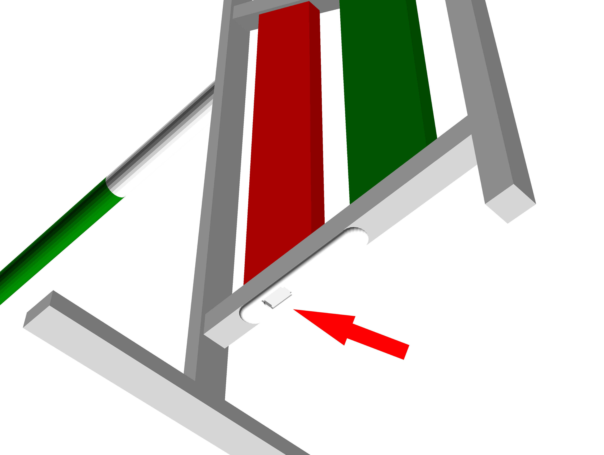

# ZonEcrón© Unsichtbar  
## Benutzerhandbuch  

  

## Inhalt  

1. [Einleitung](#1-einleitung)  
   - [1.1 Zweck des Geräts](#11-zweck-des-geräts)  
   - [1.2 Hauptmerkmale](#12-hauptmerkmale)  
   - [1.3 Vergleichen Sie uns](#13-vergleichen-sie-uns)  
2. [Verwendung](#2-verwendung)  
   - [2.1 Montage und Einschalten](#21-montage-und-einschalten)  
   - [2.2 Ausrichtung und Erkennung](#22-ausrichtung-und-erkennung)  
   - [2.3 Infrarot-Selbstinterferenzen](#23-infrarot-selbstinterferenzen)  
   - [2.4 Funkkommunikation](#24-funkkommunikation)  
   - [2.5 Anzeige auf dem Bildschirm](#25-anzeige-auf-dem-bildschirm)  
   - [2.6 Stromversorgung und Aufladen](#26-stromversorgung-und-aufladen)  
   - [2.7 Autonomie](#27-autonomie)  
   - [2.8 Sonne und Regen](#28-sonne-und-regen)  
   - [2.9 Lagerung](#29-lagerung)  
3. [Epilog](#3-epilog)  
4. [Kontakt](#4-kontakt)  

---

## 1 Einleitung  

### 1.1 Zweck des Geräts  

Der ZonEcrón® Unsichtbar—und wenn wir ZonEcrón® sagen, stellen Sie sich Neonlichter und Feuerwerke vor, etc.—wurde als Ersatz für herkömmliche Systeme konzipiert, die normalerweise neben oder über dem ersten und letzten Sprung montiert werden und den Lauf des Führers oder Hundes in unterschiedlichem Maße behindern.  

Mit diesem Ziel vor Augen und unserem natürlichen Hang zum minimalen Aufwand haben wir eine Reihe von Bedingungen hinzugefügt, die den Eigenschaften des ursprünglichen ZonEcrón® ähneln: einfache Installation, keine Kabel, etc. Aufbauend auf unseren Erfahrungen mit der Entwicklung des ursprünglichen ZonEcrón® haben wir weitere Anforderungen hinzugefügt, wie die Beibehaltung einer konstanten Erkennungshöhe und die vollständige Integration aller Komponenten in die Flügel eines Hindernisses.  

Schließlich wurde der ZonEcrón® Unsichtbar (fortan einfach ZonEcrón®) mit dem Ziel entwickelt, die derzeit verfügbaren Zeitmesssysteme zu verbessern, indem er eine einfachere Bedienung und mehr Sicherheit für Hunde und Führer bietet.  

---

### 1.2 Hauptmerkmale  

- Unsichtbar (oder fast): Alle Komponenten sind in der Struktur der Flügel integriert.  
- Schnell aufzubauen: genauso schnell wie der Aufbau eines Hindernisses.  
- Für den Außeneinsatz geeignet: widerstandsfähig gegen Sonne und Regen.  
- Wiederaufladbar: über USB, mit einer Batterielaufzeit von über 30 Stunden.  
- Sicher: Unschädliche Signale (Infrarot und WLAN) und keine scharfen Kanten.  
- Kabellos: keine Kabel, außer zum Aufladen der Batterien.  
- Lange Kommunikationsreichweite: getestet bis 200 m, empfohlen 40 m.  
- 6 Sensoren: Kein Umstellen der Zellen bei Höhenänderungen erforderlich.  

---

### 1.3 Vergleichen Sie uns  

Wir glauben, ein Produkt entwickelt zu haben, das in seinen Funktionen einzigartig ist. Wir haben kein anderes Produkt gefunden, das alle Eigenschaften des ZonEcrón® vereint, die wir hier nicht noch einmal wiederholen werden.  

Als wir den Bedarf an einer Wettbewerbszeitmessung hatten, haben wir lange und gründlich gesucht. Wir haben andere Produkte mit dem gleichen Ziel gefunden, aber keines erfüllte alle unsere Anforderungen, also beschlossen wir, unser eigenes zu entwickeln.  

Wenn Sie spezifische Anforderungen haben, die der ZonEcrón® nicht erfüllt, gibt es ähnliche Produkte. Wir empfehlen Ihnen, zu suchen, zu vergleichen, und wenn Sie finden… nun, eine fragende Haltung ist eine wache Haltung.  

---

## 2 Verwendung

### 2.1 Montage und Einschalten

Der ZonEcrón® ist in der Struktur eines Hindernisses integriert, und da er unsichtbar ist… haben wir ihn unsichtbar genannt… ich muss wohl mit dem Marketing-Team sprechen, da es nicht so aussieht, als würden sie sich sehr anstrengen. Für jedes Hindernis enthält eine Flügelseite die Infrarotsender (die obere Abdeckung hat eine LED, und die Zierblenden sind weiß), während die andere Flügelseite die Infrarotempfänger beherbergt (die obere Abdeckung hat zwei LEDs, und die Zierblenden sind schwarz):

|                   Sender                   |                   Empfänger                    |
|--------------------------------------------|------------------------------------------------|
|  |  |

Er ist also „fast unsichtbar“, aber achten Sie darauf, keine zwei Flügel mit Sendern am gleichen Hindernis zu verwenden, da dies logischerweise nicht funktioniert (das wäre nicht das erste Mal). Die Aufmerksamen unter Ihnen werden auch bemerken, dass zwei Flügel mit Empfängern am selben Hindernis ebenfalls nicht funktionieren.

Haben wir uns klar genug ausgedrückt? Nur zur Sicherheit: Für jedes Hindernis benötigen Sie einen Flügel mit Sendern und einen Flügel mit Empfängern.

Sobald die Flügel einander gegenüber positioniert sind, müssen sie nur noch eingeschaltet werden. Der Schalter und der Ladeanschluss für die Batterie befinden sich an der Unterseite des Flügels im horizontalen Profil. Sie sind durch eine federbelastete Schiebeabdeckung geschützt. Schieben Sie die Abdeckung und stellen Sie den Schalter auf die Position „Ein“ (I).

Die LEDs (1 oder 2 je nach Typ) leuchten sofort auf. Bei den Empfängern bleiben die LEDs für 5 Sekunden an, während die Funkverbindung hergestellt wird. Die blauen LEDs bleiben eingeschaltet, um anzuzeigen, dass der ZonEcrón®… na, wer weiß es… genau! Die LEDs bleiben an, um anzuzeigen, dass der ZonEcrón® eingeschaltet ist. Ich werde wohl auch mit dem R&D-Team sprechen müssen, sie scheinen den gleichen Weg wie das Marketing-Team einzuschlagen.

---

### 2.2 Ausrichtung und Erkennung

Sobald der Sender und der Empfänger einander gegenüber positioniert und eingeschaltet sind, werden sechs Infrarotstrahlen zwischen den sechs Sendern und den sechs Empfängern erzeugt, um den Durchgang eines Hundes in jeder Höhe zu erkennen:

Die weiße LED auf dem Empfängerflügel erlischt, wenn die Ausrichtung korrekt ist, und leuchtet auf, um anzuzeigen, dass einer der Strahlen unterbrochen wurde. Die LED bleibt mindestens 0,5 Sekunden eingeschaltet oder, wenn die Unterbrechung länger dauert, so lange, wie die Unterbrechung anhält.

Wenn eine dieser Barrieren unterbrochen wird, startet oder stoppt der Timer. Wenn durch die Platzierung der Stange ein Sender-Empfänger-Paar dauerhaft blockiert ist, wird dieses Paar nach 5 Sekunden ignoriert, und die weiße LED erlischt. Mehrere Paare können gleichzeitig blockiert werden, wenn zusätzliche Stangen unter der Sprungstange benötigt werden, beispielsweise um zu verhindern, dass ein Hund während des Trainings unter einem Hindernis hindurchläuft. Das einzige Paar, das nicht dauerhaft blockiert werden kann, ist das obere.

Der Standardgebrauch ist für ein Hindernis, aber es kann auch verwendet werden, um Sequenzen zu timen, indem die Flügel ohne Stange beispielsweise am Ausgang eines Tunnels positioniert werden. Achten Sie darauf, Sender und Empfänger nicht zu nah aneinander oder parallel zu Wänden zu platzieren, da die Leistung des Senders ausreicht, um von nahen Objekten zu reflektieren, oder sein (unsichtbarer) Strahl kann eine Hand umgehen, wenn sie zu nah sind. Wir empfehlen einen Mindestabstand von 1 Meter. Die maximale Entfernung hängt von der Umgebungsbeleuchtung ab, die von 2 Metern bei Tageslicht bis zu 20 Metern in Dunkelheit mit künstlicher Beleuchtung reicht.

---

### 2.3 Infrarot-Selbstinterferenz

Aufgrund der Leistung der Infrarotstrahlen, die für den Einsatz bei voller Sonneneinstrahlung ausgelegt sind, kann es vorkommen, dass ein Empfänger Signale von zwei Sendern empfängt. Dieser Effekt ist bei schwacher Umgebungsbeleuchtung oder in geschlossenen Räumen stärker ausgeprägt.

Das offensichtlichste Symptom ist, dass die weiße LED eines Empfängers ständig ein- und ausgeschaltet wird und der Timer gestartet und gestoppt werden kann, ohne dass ein Strahl unterbrochen wurde.

Dies kann passieren, wenn die Flügel nicht richtig ausgerichtet sind. Beispiel:

In diesem Fall empfängt Empfänger 1 (R1) Signale von Sender 1 (E1) und Sender 2 (E2), was zu Verwirrung führt.

Um dies zu vermeiden, stellen Sie die beiden Empfänger in entgegengesetzte Richtungen, sodass sie Signale nur von einem Sender empfangen können. Im obigen Beispiel würden Sie dies tun:

---

### 2.4 Funkkommunikation

Die Funkkommunikation wird automatisch zwischen den Zellen und anderen möglichen Zubehörteilen der ZonEcrón®-Familie hergestellt. Diese Kommunikation arbeitet im Bereich der Wi-Fi-Frequenzen und kann in Umgebungen mit vielen aktiven Wi-Fi-Netzwerken beeinträchtigt werden.

Jeder Empfänger enthält eine interne Antenne, um diese Kommunikation herzustellen. Die theoretische maximale Reichweite beträgt 80 Meter in offenem Gelände. Wir haben eine Reichweite von 200 Metern in einem Wohnpark mit mehreren umliegenden Wi-Fi-Netzwerken getestet, ohne Kommunikationsprobleme. Für optimale Leistung empfehlen wir, in einer regulären Kursgröße eine Entfernung von 40 Metern nicht zu überschreiten.

---

### 2.5 Anzeige auf dem Bildschirm

Im Gegensatz zum ursprünglichen ZonEcrón® verfügt das unsichtbare System nicht über ein integriertes Display. Um die Zeiten anzuzeigen, benötigen Sie eine ZonEcrón®-Anzeigetafel oder einen ZonEcrón®-Dongle, der an einen Computer mit unserer Anwendung angeschlossen ist. Weitere Informationen finden Sie in den entsprechenden Handbüchern.

---

### 2.6 Stromversorgung und Aufladung

Die vier Geräte (zwei Sender und zwei Empfänger) verfügen über einen internen, wiederaufladbaren Lithium-Akku, sodass während des Betriebs keine Strom- oder Kommunikationskabel benötigt werden.

Die Akkustände können über die ZonEcron-App oder das ZonEcron-Display je nach verwendetem Anzeigesystem überprüft werden. Wir empfehlen, die spezifischen Handbücher für weitere Details zu konsultieren. Außerdem zeigen die Geräte den Akkustand über das Blinken der blauen LEDs an:
- **Akku über 30 %**: Blaues LED durchgehend leuchtend.
- **Akku zwischen 30 % und 15 %**: Blaues LED blinkt langsam.
- **Akku unter 15 %**: Blaues LED blinkt schnell.

Diese Ladestandanzeige ist **ungefähr**, da sie auf der Messung der Batteriespannung basiert, die nicht immer die verbleibende Ladung genau widerspiegelt. Daher ist es normal, dass der Ladezustand schnell von 100 % auf 90 % fällt, stabil zwischen 90 % und 10 % bleibt und dann schnell von 10 % auf 0 % sinkt. Wir empfehlen, den Akku nicht bis zur völligen Entladung zu nutzen, um unangenehme Überraschungen wie "Oh nein"-Momente zu vermeiden.

Die Geräte verfügen über einen USB-C-Anschluss an der Unterseite neben dem Schalter. Zum Aufladen der Akkus müssen die Geräte ausgeschaltet und ein Standard-USB-Kabel an ein USB-Ladegerät angeschlossen werden. Durch das Design der USB-Anschlüsse ist es physisch nicht möglich, sie falsch anzuschließen, sodass auch die ungeschicktesten Nutzer sicher sind.

**ACHTUNG: EXTREME TEMPERATUREN.**

Lithium-Akkus haben einen Betriebs- und Ladebereich von 5 °C bis 50 °C. Außerhalb dieses Bereichs kann die bereitgestellte Energie schwanken, was zu unregelmäßigem Verhalten des Timers führen kann. Auch die Akkulaufzeit wird verkürzt.

Wir empfehlen dringend, die Akkus nicht außerhalb dieses Bereichs zu verwenden oder aufzuladen, insbesondere wenn sie zu kalt sind, da dies ihre Lebensdauer drastisch verkürzt oder sie unbrauchbar macht. Wenn der Tag extrem kalt oder heiß war, schalten Sie die Geräte aus und lassen Sie sie in einem Raum mit angemessener Temperatur. Warten Sie eine Stunde, bis sie sich an die Temperatur angepasst haben, und laden Sie sie dann auf.

**ACHTUNG: GERÄTE NICHT UNBEAUFSICHTIGT LADEN.**

Kein batteriebetriebenes Gerät sollte unbeaufsichtigt geladen werden. Es ist zwar üblich, ein Smartphone über Nacht angeschlossen zu lassen, ohne dass etwas passiert, aber das bedeutet nicht, dass es unmöglich ist. Vor kurzem hatte ein großes Unternehmen Probleme mit den Batterien seiner Handys, die sich beim Laden überhitzten und explodierten. Deshalb: Schützen Sie sich und Ihre Lieben. Es geht nicht darum, 4 Stunden lang darauf zu starren, aber es ist ratsam, in der Nähe zu bleiben, während die Geräte geladen werden. Wenn dies nicht möglich ist, ziehen Sie sie lieber ab und setzen Sie den Ladevorgang später fort. Diese Akkus haben keinen Memory-Effekt und können problemlos in Intervallen geladen werden.

**ACHTUNG: KONTROLLE NACH EINEM AUFPRALL.**

Es ist sehr wahrscheinlich, dass früher oder später ein Hund mit dem Flügel kollidiert, an dem das ZonEcron© befestigt ist. Das Design wurde so entwickelt, dass das Gerät möglichst robust ist und die internen Komponenten sicher befestigt sind. Trotzdem ist es in solchen Fällen obligatorisch, das Gerät gründlich zu überprüfen. Wenn Schäden festgestellt werden, wenn lose Teile im Inneren zu hören sind oder wenn es sich beim Laden überhitzt, schalten Sie das Gerät sofort aus, trennen Sie es und legen Sie es an einen sicheren Ort, fern von brennbaren Materialien. Kontaktieren Sie uns, um mögliche Lösungen zu besprechen.

Das ZonEcron© verfügt über eine elektronische Schaltung, die das Laden und Entladen der Batterien steuert. Sie verhindert, dass die Batterien überladen oder übermäßig entladen werden. Die Anzeige von 0 % Akku entspricht dem minimal empfohlenen Akkustand, ab dem das ZonEcron© aufgeladen werden sollte. Es bleibt jedoch eingeschaltet, bis die Schutzschaltung die Stromversorgung unterbricht, um die Batterie maximal auszunutzen. Dies kann in Notfällen hilfreich sein, sollte jedoch nicht zur Gewohnheit werden, da dies die Lebensdauer der Batterien negativ beeinflusst.

Schließlich ist der verbreitete Ratschlag, Akkus vollständig zu entladen, bevor sie wieder aufgeladen werden, nur für alte Ni-Cd-Batterien gültig. Für diese "modernen" Lithium-Akkus (die inzwischen nicht mehr so neu sind) **ist es besser, sie nicht vollständig zu entladen** (das ist sogar schädlich). Es ist viel empfehlenswerter, sie aufzuladen, wenn sie etwa halb geladen sind. Auch das Laden in Intervallen hat keine negativen Auswirkungen.

---

### 2.7 Akkulaufzeit

Ein neues Gerät hat eine Akkulaufzeit von über 35 Stunden, was mehr als genug für einen zweitägigen Wettbewerb ist. Diese Laufzeit wird im Laufe der Zeit aufgrund des normalen Lebenszyklus von Lithium-Akkus abnehmen.

Auch die Umgebungstemperatur kann die Akkulaufzeit negativ beeinflussen:
- Während der Nutzung: Je kälter es ist, desto kürzer ist die Laufzeit. Es wird nicht empfohlen, die Geräte bei Temperaturen unter 0 °C zu verwenden.
- Während des Ladens: Es wird empfohlen, den Ladevorgang bei moderaten Temperaturen zwischen 10 °C und 30 °C durchzuführen, um eine korrekte und vollständige Ladung zu gewährleisten.

Um die Akkulaufzeit zu maximieren, wurden folgende Strategien implementiert:
- Während der Timer läuft, wird die Helligkeit des Bildschirms reduziert, da die Zeitmessung die wichtigste Information ist. Wenn der Timer gestoppt wird, wird die Bildschirmhelligkeit maximiert.
- Nach dem Stoppen des Timers wird die Bildschirmhelligkeit nach 30 Sekunden Inaktivität weiter reduziert und nach weiteren 30 Sekunden ausgeschaltet. Der Bildschirm leuchtet dann nur 1 Sekunde alle 5 Sekunden auf.

---

### 2.8 Sonne und Regen

Das ursprüngliche ZonEcron wurde so konzipiert, dass es im Freien, sowohl bei Sonnenschein als auch bei Regen, einwandfrei funktioniert.
- Die charakteristische weiße Farbe wurde speziell gewählt, um ein Überhitzen in der Sonne zu vermeiden.
- Das Design erlaubt die Nutzung im Regen, sofern es aufrecht positioniert wird und die Anschlüsse nach unten zeigen, um das Eindringen von Wasser in die Öffnungen zu vermeiden.

---

### 2.9 Lagerung

Beim Verstauen des ZonEcron sollten sowohl Feuchtigkeit als auch der Akku berücksichtigt werden:
- Wie bereits erwähnt, ist das ZonEcron **regenfest, aber nicht feuchtigkeitsresistent**. Wenn es mehrere Tage feucht bleibt, dringt die Feuchtigkeit allmählich in das Gehäuse ein und kann die elektronischen Komponenten irreparabel beschädigen. Daher sollte es nach Gebrauch im Regen vor der Lagerung für einen Tag in einer trockenen Umgebung verbleiben, um mögliche Restfeuchtigkeit vollständig zu entfernen.
- In Bezug auf den Akku: Wenn Sie planen, das ZonEcron© für längere Zeit nicht zu verwenden, **ist es am besten, die Batterien halb geladen zu lassen**, um ihre Lebensdauer zu maximieren. Lithium-Akkus, die vollständig geladen oder entladen über einen längeren Zeitraum gelagert werden, können erheblich an Leistung verlieren.

---

### 3 Epilog

Genießen Sie die Zeit mit Ihren Hunden und lassen Sie sich nicht frustrieren, wenn Sie Ihre Zeiten mit denen anderer vergleichen (obwohl ein gesunder Wettbewerb den Spaß erhöht). Sie müssen nur mit sich selbst konkurrieren.

Dieser Timer wurde entwickelt, um Ihre Wettkämpfe einfacher zu gestalten, sowohl bei der Verwendung als auch beim Wechsel der Höhen.

Wir hoffen, dass Sie das ZonEcron© optimal nutzen, und denken Sie daran: Keine Fehler aus Faulheit... Geben Sie alles, los geht’s!

---

### 4 Kontakt

Für technischen Support, Fragen oder Anregungen können Sie uns per E-Mail kontaktieren: [zonecron@gmail.com](mailto:zonecron@gmail.com)
