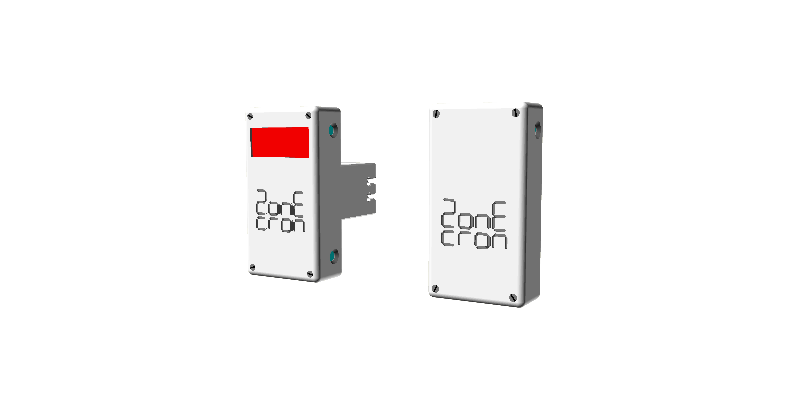
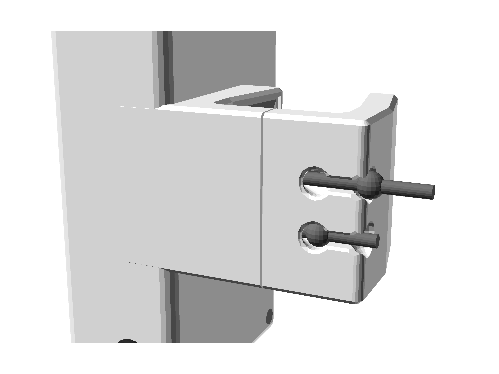
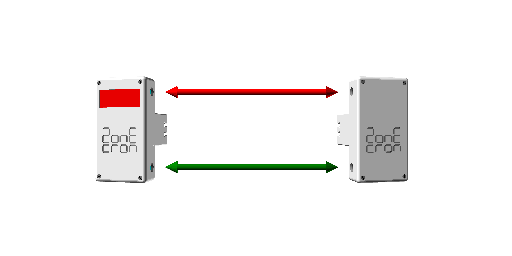
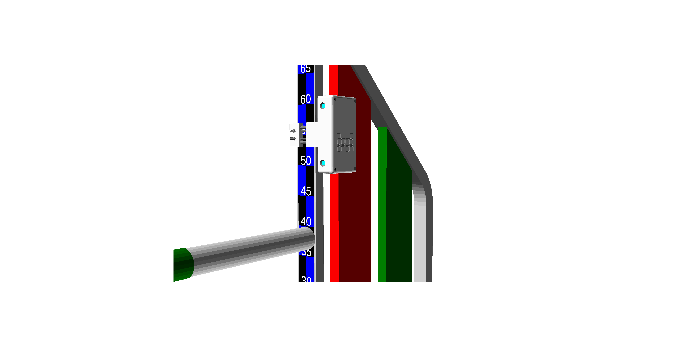

# ZonEcrón© Original
## Benutzerhandbuch

### Inhalt

1. [Einführung](#1-einführung)
   - [1.1 Zweck des Geräts](#11-zweck-des-geräts)
   - [1.2 Hauptmerkmale](#12-hauptmerkmale)
   - [1.3 Vergleichen Sie uns](#13-vergleichen-sie-uns)
2. [Verwendung](#2-verwendung)
   - [2.1 Montage und Einschalten](#21-montage-und-einschalten)
   - [2.2 Ausrichtung und Erkennung](#22-ausrichtung-und-erkennung)
   - [2.3 Infrarot-Selbstinterferenz](#23-infrarot-selbstinterferenz)
   - [2.4 Funkkommunikation](#24-funkkommunikation)
   - [2.5 Bildschirmanzeige](#25-bildschirmanzeige)
   - [2.6 Stromversorgung und Aufladen](#26-stromversorgung-und-aufladen)
   - [2.7 Laufzeit](#27-laufzeit)
   - [2.8 Sonne und Regen](#28-sonne-und-regen)
   - [2.9 Lagerung](#29-lagerung)
3. [Epilog](#3-epilog)
4. [Kontakt](#4-kontakt)

---

## 1 Einführung

### 1.1 Zweck des Geräts

Der ZonEcrón© (und wenn wir ZonEcrón© sagen, stellt euch Neonlichter und Feuerwerke im Hintergrund vor – okay, diesen Teil lasse ich im weiteren Handbuch weg, um es nicht zu lang zu machen) wurde entwickelt, um den Bedarf an Zeitmessung in bestimmten Bereichen (Laufsteg, Palisade und Wippe) zu decken und, logischerweise, um kurze Sequenzen zu messen, um die beste Option zu bestimmen.

Mit diesem Ziel vor Augen und unserer Neigung zum minimalen Aufwand haben wir mehrere Anforderungen hinzugefügt: einfache Installation, kabellos usw., und begannen mit verschiedenen Technologien zu experimentieren (Infrarot, Funk, Batterien, Displays usw.), um unser Endziel zu erreichen.

Letztendlich wurde der ursprüngliche ZonEcrón® geschaffen, um den Timing-Bedarf im Agility-Training zu erfüllen, und genau in diesem Kontext soll er verwendet werden. Obwohl die Geräteeigenschaften die Verwendung als Wettkampf-Timer ermöglichen, wären einige zusätzliche Geräte (großes Display, Verbindung zur Wettkampf-Software, ein Ersatzpaar usw.) für diesen Zweck empfehlenswert.

---

### 1.2 Hauptmerkmale

- Kompakt, klein und mit allem integriert.
- Schnell zu installieren und fördert den häufigen Einsatz.
- Für den Außeneinsatz geeignet, sichtbar bei Sonneneinstrahlung und mit gewissem Regenschutz.
- Per USB aufladbar, mit über 30 Stunden Laufzeit.
- Sicher: Unschädliche Signale (Infrarot und WLAN) und ohne scharfe Kanten.
- Fester Halt, geeignet für alle Materialien (Kunststoff, Aluminium, Eisen).
- Kabellos. Keine Kabel werden verwendet, außer zum Laden der Batterien.
- Große Kommunikationsreichweite. Getestet bis 80 m, empfohlen bis 40 m.
- Integriertes 4-stelliges Display mit der höchstmöglichen Auflösung für die angezeigte Zeit (Millisekunden, Hundertstel, Zehntel oder Sekunden).
- Doppelter Sensor, oben und unten, an jedem Tor.

---

### 1.3 Vergleichen Sie uns

Wir glauben, ein einzigartiges Produkt in Bezug auf die Funktionen entwickelt zu haben. Wir haben kein anderes Produkt gefunden, das alle Eigenschaften des ZonEcrón© vereint, die wir hier nicht noch einmal wiederholen möchten.

Als der Bedarf an einem Trainings-Timer aufkam, suchten wir intensiv und fanden andere Produkte mit dem gleichen Ziel, aber keines erfüllte all unsere Anforderungen, also entschieden wir uns, ihn selbst zu entwickeln.

Wenn Sie ein spezifisches Bedürfnis haben, das der ZonEcrón© nicht erfüllt, gibt es ähnliche Produkte. Wir ermutigen Sie, zu suchen, zu vergleichen und, falls Sie fündig werden… nun, ein fragender Geist ist ein wacher Geist.

---

## 2 Nutzung

### 2.1 Einrichtung und Einschalten

Ein Paar original ZonEcron©-Geräte besteht aus einem Infrarotsender (die Box ohne Bildschirm) und einem Infrarotempfänger (die Box mit Bildschirm).

Beide verfügen über eine Klemme mit einer festen Seite an der Box und der anderen, die entlang zweier Stahlstäbe gleitet. Ein internes elastisches Band hält die Seiten der Klemme zusammen. Dieses Band kann schnell auf drei Spannungsstufen eingestellt werden, indem die gebundenen Enden des Bandes verschoben werden, sodass es sich an unterschiedliche Breiten oder Stärken von Stangen anpassen kann. Siehe die folgenden Bilder:

|                      Minimale Spannung                   |                     Mittlere Spannung                    |                      Maximale Spannung                   |
|----------------------------------------------------------|----------------------------------------------------------|----------------------------------------------------------|
|  |  |  |
| Breites Schienenprofil.                                  | Für runde Rohre.                                         | Schmales Schienenprofil.                                 |
| z.B. Aluminiumsprünge.                                   | z.B. PVC-Sprünge oder Stangen.                           | z.B. Sprünge aus verzinktem Stahl.                       |

Schieben Sie die Klemme, um sie zu öffnen, und platzieren Sie den ZonEcron© an der vertikalen Seite des Stützpfostens oder einer Sprungstange. Der Sender wird rechts und der Empfänger links positioniert, sodass die beiden Sender mit den beiden Empfängern ausgerichtet sind:

Schalten Sie anschließend den Sender und den Empfänger ein. Um zu überprüfen, ob der Sender eingeschaltet ist, prüfen Sie die blaue LED, die entweder durchgehend leuchtet oder blinkt (bei niedrigem Batteriestand). Beim Empfänger leuchtet das blaue Licht unmittelbar nach dem Einschalten auf und zeigt verschiedene Nachrichten auf dem Bildschirm an. Sobald die Zeit auf null (0,0) steht, erlischt das blaue Licht, wenn das Infrarotsignal des Senders korrekt erkannt wird. Obwohl die Reihenfolge der Einrichtung und des Einschaltens nicht wichtig ist, empfehlen wir, die Geräte zuerst zu positionieren und dann den Sender (ohne Bildschirm) vor dem Empfänger (mit Bildschirm) einzuschalten. Dadurch kann der Batteriestand beider Geräte während der anfänglichen Bildschirmnachrichten überprüft werden.

**Es ist wichtig**, einen Abstand zwischen der Stange und dem unteren Sender zu lassen, um die Erkennungswahrscheinlichkeit zu maximieren. Wir empfehlen, den unteren Sender 10 cm über der Stange für XS, S und M sowie 15 cm für L und XL zu positionieren. Zum Beispiel für M sollte es so aussehen:

---

### 2.2 Ausrichtung und Erkennung

Sobald der Sender und der Empfänger einander zugewandt positioniert und eingeschaltet sind, erlischt das blaue Licht am Empfänger, wenn die Ausrichtung korrekt ist und keine Hindernisse den Infrarotstrahl blockieren. Wenn der Strahl unterbrochen wird (durch Vorbeigehen oder Fehlausrichtung), leuchtet die blaue LED am Empfänger für mindestens 0,5 Sekunden oder länger, wenn die Unterbrechung länger anhält.

Der Sender verfügt über zwei Infrarot-LEDs, eine obere und eine untere, und der Empfänger über zwei Sensoren, einen oberen und einen unteren. Der Empfang ist selektiv, sodass der obere Sensor nur auf das Infrarot der oberen LED des Senders reagiert, und das gleiche gilt für das untere Paar. Dies schafft zwei lineare Barrieren zwischen Sender und Empfänger. Es gibt keine Kreuzerkennung. Wenn eine dieser Barrieren unterbrochen wird, startet oder stoppt die Zeitmessung.

Achten Sie darauf, den Sender und den Empfänger nicht zu nah aneinander oder parallel zu Wänden zu platzieren, da die Leistung des Senders ausreicht, um sich von nahegelegenen Oberflächen zu reflektieren, oder sein (unsichtbares) Leuchten könnte eine Hand umgehen, wenn auf einem Tisch getestet wird.

Wir empfehlen einen minimalen Betriebsabstand von 1 m. Die maximale Entfernung hängt vom Umgebungslicht ab und reicht von 2 m bei direkter Sonneneinstrahlung bis zu 20 m im Dunkeln mit künstlicher Bahnbeleuchtung.

---

### 2.3 Infrarot-Selbstinterferenz

Aufgrund der Leistung, die von den Infrarotstrahlen verwendet wird, um bei direktem Sonnenlicht zu arbeiten, kann ein Empfänger Signale von zwei Sendern aufnehmen. Dieser Effekt tritt häufiger bei schlechten Lichtverhältnissen oder in geschlossenen Räumen auf.

Das offensichtlichste Symptom ist, dass das blaue Licht des Empfängers ständig ein- und ausgeschaltet wird und der Timer möglicherweise unerwartet startet oder stoppt, ohne dass der Strahl unterbrochen wurde.

Dies geschieht, weil ein Empfänger Infrarotsignale von zwei Sendern gleichzeitig empfängt, aufgrund der Positionierung auf der Bahn oder Reflexionen von nahegelegenen Oberflächen (Wände oder Glas). Zum Beispiel empfängt in diesem Fall der Empfänger 1 (R1) die Infrarotsignale sowohl vom Sender 1 (T1) als auch vom Sender 2 (T2):

Um dies zu vermeiden, positionieren Sie die Empfänger so, dass sie nur Infrarotsignale von einem einzigen Sender empfangen, indem Sie beispielsweise die Seite des Sprungs wechseln. Im obigen Beispiel tun Sie dies:

Wenn es unvermeidlich ist, Paar 2 auf derselben Seite des Sprungs zu belassen, verwenden Sie längere Sprungstangen oder platzieren Sie sie im Notfall auf den Kopf:

---

### 2.4 Funkkommunikation

Die Funkkommunikation wird automatisch zwischen allen Elementen der ZonEcron©-Familie hergestellt. Diese Kommunikation erfolgt im Wi-Fi-Frequenzbereich und kann in Umgebungen mit vielen Wi-Fi-Netzwerken beeinträchtigt werden.

Der originale ZonEcron© verfügt über eine interne Antenne in jedem Empfänger (Box mit Bildschirm), um diese Kommunikation herzustellen. Die optimale Kommunikationszuverlässigkeit und Reichweite werden erreicht, wenn beide Empfänger vertikal in ihrer üblichen Montageposition stehen.

Die theoretische maximale Reichweite beträgt 80 m im offenen Raum. Experimentell wurde eine Reichweite von 200 m in einem Wohnpark mit zahlreichen umliegenden Wi-Fi-Netzwerken erreicht, ohne Kommunikationsausfälle. Es wird jedoch empfohlen, auf einer Standardbahn nicht mehr als 40 m zu überschreiten, um optimale Leistung zu gewährleisten.

---

### 2.5 Bildschirmanzeige

Nachdem der Empfänger eingeschaltet wurde und die verschiedenen Nachrichten wie zuvor beschrieben angezeigt wurden, erscheint auf dem Bildschirm "0,0" in den mittleren Ziffern. Wenn die Zeitmessung bei einem der Sender-Empfänger-Paare beginnt, läuft die Zeit auf beiden Bildschirmen. Während der Zeitmessung werden Sekunden und Zehntelsekunden angezeigt, und die Ziffernpositionen können sich verschieben, wenn die Sekunden 99 überschreiten, oder Zehntelsekunden verschwinden, wenn die Sekunden 999 überschreiten.

Nach Beendigung der Zeitmessung zeigt das Display die Zeit mit der höchstmöglichen Auflösung an:

| Auflösung     | Von     | Bis     | Beispiel |
|---------------|---------|---------|----------|
| Millisekunden | 0,000s  | 9,999s  | 5,417    |
| Hundertstel   | 10,00s  | 99,99s  | 54,17    |
| Zehntel       | 100,0s  | 999,9s  | 541,7    |
| Sekunden      |  1000s  |  9999s  | 5417     |

Beide Bildschirme zeigen die gleiche Zeit an, da sie zu Beginn, während und am Ende der Messung synchronisiert werden.

---

### 2.6 Stromversorgung und Aufladen

Alle vier Geräte (zwei Sender und zwei Empfänger) verfügen über eingebaute, wiederaufladbare Lithiumbatterien, sodass während des Gebrauchs keine Strom- oder Kommunikationskabel erforderlich sind.

Der Akkustand kann über die ZonEcron-App oder die ZonEcron-Anzeigetafel überprüft werden, abhängig vom verwendeten Anzeigesystem. Wir empfehlen, die entsprechenden Handbücher für weitere Details zu konsultieren. Die Geräte zeigen den Akkustand auch über das Blinken der blauen LED an:

- **Batterie über 30 %**: Blaue LED leuchtet durchgehend.
- **Batterie zwischen 30 % und 15 %**: Blaue LED blinkt langsam.
- **Batterie unter 15 %**: Blaue LED blinkt schnell.

Dieser Ladeindikator ist **ungefähr**, da er auf der Messung der Batteriespannung basiert, die nicht immer die verbleibende Ladung genau widerspiegelt. Es ist daher normal, dass der Ladeprozentsatz schnell von 100 % auf 90 % fällt, stabil zwischen 90 % und 10 % bleibt und dann schnell von 10 % auf 0 % abnimmt. Wir empfehlen, eine übermäßige Entladung der Batterie zu vermeiden, um unangenehme Überraschungen zu verhindern.

Die Geräte verfügen über einen USB-C-Anschluss an der Unterseite, neben dem Schalter. Um die Batterien aufzuladen, schalten Sie die Geräte aus und schließen Sie einfach ein Standard-USB-Kabel an ein USB-Ladegerät an. Die Konstruktion der USB-Stecker gewährleistet, dass sie nicht falsch angeschlossen werden können, sodass auch der ungeschickteste Benutzer sicher ist.

**WARNUNG: EXTREME TEMPERATUREN.**  
Lithiumbatterien haben einen Betriebs- und Ladebereich zwischen 5 °C und 50 °C. Außerhalb dieses Bereichs kann ihre Energieversorgung schwanken, was zu einem unregelmäßigen Verhalten des Timers führt. Auch die Ladezeit wird kürzer.  
Wir empfehlen dringend, die Batterien nicht außerhalb dieses Bereichs zu verwenden oder aufzuladen, insbesondere wenn sie zu kalt sind, da dies ihre Lebensdauer drastisch verkürzt oder sie völlig unbrauchbar macht. Wenn der Tag sehr kalt oder heiß war, schalten Sie die Geräte aus, lassen Sie sie eine Stunde an einem gemäßigt temperierten Ort und laden Sie sie dann auf.

**WARNUNG: NIEMALS UNBEAUFSICHTIGT AUFLADEN.**  
Kein batteriebetriebenes Gerät sollte unbeaufsichtigt aufgeladen werden. Es ist üblich, ein Telefon über Nacht angeschlossen zu lassen, ohne dass etwas passiert, aber nur weil nichts passiert ist, heißt das nicht, dass es nicht passieren kann. Vor nicht allzu langer Zeit hatte ein großer Hersteller Probleme mit Überhitzung und sogar Explosionen von Telefonbatterien während des Ladens. Schützen Sie sich und Ihre Lieben. Sie müssen das Gerät nicht vier Stunden lang anstarren, aber wenn Sie mit dem Aufladen beginnen, sollten Sie in der Nähe bleiben und andere Aufgaben erledigen. Wenn es nicht möglich ist, in der Nähe zu bleiben, ist es besser, das Gerät abzustecken und das Laden später fortzusetzen. Diese Batterien haben keinen Memory-Effekt und können ohne Probleme in "Raten" aufgeladen werden.

**WARNUNG: NACH EINEM AUFPRALL UNTERSUCHEN.**  
Es ist sehr wahrscheinlich, dass ein Hund irgendwann mit der Stange kollidiert, die den ZonEcron© hält. Das Design des Geräts ist darauf ausgelegt, so widerstandsfähig wie möglich zu sein und die internen Teile fest zu sichern, aber in solchen Fällen ist es obligatorisch, das Gerät gründlich zu untersuchen. Wenn Schäden sichtbar sind, lose Teile im Inneren zu hören sind oder es sich während des Ladens überhitzt, schalten Sie das Gerät sofort aus, trennen Sie es vom Strom und stellen Sie es an einen sicheren Ort, an dem es kein Feuer verursachen kann. Kontaktieren Sie uns, um mögliche Lösungen zu besprechen.

Abschließend verfügt der ZonEcron© über eine elektronische Schaltung, die das Laden und Entladen der Batterie steuert, um eine Überladung oder Tiefentladung zu verhindern. Die 0%-Batterieanzeige ist der empfohlene Mindestladestand, bei dem der ZonEcron© aufgeladen werden sollte. Das Gerät wird jedoch weiterhin laufen, bis die Schutzschaltung die Stromzufuhr abschaltet. Auch wenn dies eine Notfallnutzung ermöglichen kann, wird dies nicht als regelmäßige Praxis empfohlen, da es die Lebensdauer der Batterie negativ beeinflusst.

Abschließend gilt die alte Weisheit, Batterien vor dem Aufladen vollständig zu entladen, für alte Ni-Cd-Batterien. Für diese "neuen" (wenn auch nicht mehr so neuen) Lithiumbatterien **ist es besser, sie nicht vollständig zu entladen** (tatsächlich ist dies schädlich). Es ist viel besser, sie aufzuladen, wenn sie halb voll sind. Selbst das Aufladen in Intervallen, ein bisschen jetzt und ein bisschen später, hat keine negativen Auswirkungen.

---

### 2.7 Akkulaufzeit

Ein neuer originaler ZonEcrón hat eine Akkulaufzeit von über 40 Stunden, was mehr als ausreichend ist, um ihn einen ganzen Tag als Wettkampf-Timer zu verwenden, und völlig ausreichend für Trainingseinheiten. Diese Akkulaufzeit wird sich im Laufe der Zeit aufgrund der natürlichen Lebensdauer von Lithiumbatterien verringern.

Die Umgebungstemperatur kann die Akkulaufzeit ebenfalls negativ beeinflussen:
- Während des Gebrauchs: Niedrigere Temperaturen verringern die Akkulaufzeit. Es wird nicht empfohlen, die Geräte bei Temperaturen unter 0 °C zu verwenden.
- Während des Ladens: Das Laden wird bei moderaten Temperaturen zwischen 10 °C und 30 °C empfohlen, um eine ordnungsgemäße und vollständige Ladung zu gewährleisten.

Um die Akkulaufzeit zu verlängern, wurden die folgenden Strategien implementiert:
- Während der Timer läuft, wird die Bildschirmhelligkeit reduziert, da die wichtigste Information die Endzeit ist. Wenn der Timer stoppt, wird die Bildschirmhelligkeit auf das Maximum erhöht.
- Nach dem Stoppen des Timers wird, wenn 30 Sekunden lang keine Aktivität festgestellt wird, die Bildschirmhelligkeit erneut reduziert, und nach weiteren 30 Sekunden wird der Bildschirm ausgeschaltet und nur noch für 1 Sekunde alle 5 Sekunden beleuchtet.

---

### 2.8 Sonne und Regen

Der originale ZonEcrón wurde für den perfekten Einsatz im Freien sowohl bei Sonnenschein als auch bei Regen entwickelt.
- Seine charakteristische weiße Farbe wurde bewusst gewählt, um eine Überhitzung in der Sonne zu vermeiden.
- Sein Design ermöglicht die Verwendung bei Regen, vorausgesetzt, er wird vertikal mit nach unten gerichteten Anschlüssen aufgestellt, um das Eindringen von Wasser in die Öffnungen zu verhindern.

---

### 2.9 Lagerung

Beim Lagern des ZonEcróns sollten Sie auf Feuchtigkeit und den Zustand der Batterie achten:
- Wie bereits erwähnt, ist der ZonEcrón regenfest, aber nicht feuchtigkeitsresistent. Wenn er mehrere Tage lang feucht bleibt, dringt die Feuchtigkeit langsam in das Gehäuse ein und kann irreversible Schäden an den elektronischen Komponenten verursachen. Daher sollte er, wenn er im Regen verwendet wurde, einen Tag lang in einer trockenen Umgebung aufbewahrt werden, um mögliche Feuchtigkeit vor der Lagerung vollständig zu entfernen.
- Was die Batterie betrifft, so ist es am besten, sie bei halber Ladung zu lagern, wenn Sie den ZonEcrón längere Zeit nicht verwenden möchten. Das Lagern von vollständig geladenen oder vollständig entladenen Lithiumbatterien über längere Zeiträume kann ihre Leistung erheblich beeinträchtigen.

---

## 3 Epilog

Genießen Sie die Zeit mit Ihren Hunden und lassen Sie sich nicht frustrieren, wenn Sie Ihre Zeiten mit anderen vergleichen (obwohl ein freundlicher Wettbewerb das Training unterhaltsamer macht). Sie müssen nur gegen sich selbst antreten.

Dieser Timer soll Ihnen helfen, die geschmeidigste und schnellste Linie für Sie und Ihre Hunde zu finden.

Wir hoffen, dass Sie den ZonEcrón© optimal nutzen, und denken Sie daran: keine Ausreden, um einen Schritt zu sparen, keine Ausreden aus Faulheit. Geben Sie alles, Leute!

---

## 4 Kontakt

Für technischen Support, Fragen oder Vorschläge können Sie uns per E-Mail erreichen: [zonecron@gmail.com](mailto:zonecron@gmail.com)
