# ZonEcron Anzeigetafel
## Benutzerhandbuch

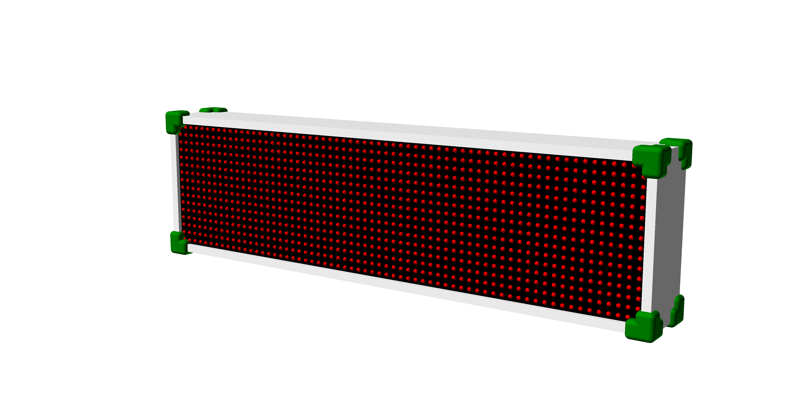

1. [Einleitung](#1-einleitung)
   - [1.1 Technische Spezifikationen](#11-technische-spezifikationen)
   - [1.2 Wichtige Funktionen](#12-wichtige-funktionen)
   - [1.3 Komponenten](#13-komponenten)
   - [1.4 Aufbau und Stromversorgung](#14-aufbau-und-stromversorgung)
2. [Anzeige](#2-anzeige)
   - [2.1 Allgemeine Beschreibung](#21-allgemeine-beschreibung)
   - [2.2 Integrierter Summer](#22-integrierter-summer)
   - [2.3 Kommunikation mit dem ZonEcron-Ökosystem](#23-kommunikation-mit-dem-zonecron-ökosystem)
   - [2.4 Anzeige der Betriebsmodi](#24-anzeige-der-betriebsmodi)
     - [2.4.1 Stoppuhr-Modus](#241-stoppuhr-modus)
     - [2.4.2 Startmodus](#242-startmodus)
     - [2.4.3 Streckenerkennungsmodus](#243-streckenerkennungsmodus)
     - [2.4.4 Spielmodus](#244-spielmodus)
   - [2.5 Anzeige von Nachrichten](#25-anzeige-von-nachrichten)
     - [2.5.1 Startnachrichten](#251-startnachrichten)
     - [2.5.2 Sensorbatterie](#252-sensorbatterie)
     - [2.5.3 Sensorfehlermeldungen](#253-sensorfehlermeldungen)
     - [2.5.4 Bildschirmschoner](#254-bildschirmschoner)
     - [2.5.5 Benutzerdefinierte Nachrichten](#255-benutzerdefinierte-nachrichten)
   - [2.6 Grenzen](#26-grenzen)
3. [Eingebetteter Webserver](#3-eingebetteter-webserver)
   - [3.1 Beschreibung](#31-beschreibung)
   - [3.2 WiFi-Netzwerke](#32-wifi-netzwerke)
     - [3.2.1 Verbindung mit dem WiFi-Netzwerk der Anzeigetafel](#321-verbindung-mit-dem-wifi-netzwerk-der-anzeigetafel)
     - [3.2.2 Ändern von Name, Passwort und Sicherheit](#322-ändern-von-name-passwort-und-sicherheit)
     - [3.2.3 Wiederherstellung von WiFi-Zugangsdaten](#323-wiederherstellung-von-wifi-zugangsdaten)
     - [3.2.4 Verbindung der Anzeigetafel mit einem externen WiFi-Netzwerk](#324-verbinden-des-displays-mit-einem-externen-wifi-netzwerk)
   - [3.3 Webseiten](#33-webseiten)
     - [3.3.1 Info](#331-info)
     - [3.3.2 Dateien](#332-dateien)
     - [3.3.3 WiFi](#333-wifi)
     - [3.3.4 Anpassung](#334-anpassung)
     - [3.3.5 Spezialfunktionen](#335-spezialfunktionen)
     - [3.3.6 Fernbedienung](#336-fernbedienung)
     - [3.3.7 Monitor](#337-monitor)
     - [3.3.8 Software](#338-software)
     - [3.3.9 Streaming](#339-streaming)
4. [Kontakt](#4-kontakt)

---

## 1. Einleitung

### 1.1 Technische Spezifikationen
**Allgemein**
- 16x64 hochhelles LED-Display mit Anzeige bis zu 999,99s, Fehlern und Verweigerungen.
- Stromversorgung: 230V ±10% 50Hz
- Abmessungen (ohne Stativ): 66cm x 18cm x 12cm
- Gewicht: 5kg

**Zeitkontrolle**
- 16 MHz XO Quarzkristall-Uhrensignal.
- Maximale Auflösung: 0,001s.
- Durchschnittliche Abweichung über 24 Stunden: ±20 ppm. (±0,07 s/h)
- Systemgenauigkeit mit [ZonEcron Original](./original.md) (Timer + Sensoren): von +0ms bis +2ms.
- Systemgenauigkeit mit [Balken](./sensorBars.md) oder [unsichtbar](./invisible.md) (Timer + Sensoren): von +0ms bis +6ms.

**Webserver**
- Bis zu 4 gleichzeitige Benutzer.
- Echtzeituhr mit TCXO ±2ppm für Datum und Uhrzeit mit austauschbarer Batterie für 10 Jahre.
- Drahtlose Kommunikation mit 2,4GHz.
- Speicher: 350 KB FLASH, ca. 3000 Ergebnisprotokolle, einschließlich Datum und Uhrzeit.

---

### 1.2 Wichtige Funktionen
- Millisekundengenaue Auflösung für Zeiten unter 10 Sekunden, Zentisekundengenaue Auflösung für Zeiten ab 10 Sekunden.
- Bildschirmanzeigen für Fehlversuche (maximal 9), Zurückweisungen und Disqualifikation.
- Warnungen auf dem Bildschirm bei nicht ausgerichteten Lichtschranken.
- Echtzeituhr mit Datum und Uhrzeit.
- Messung der internen Temperatur.
- Anpassbarer Bildschirmschoner (füge z. B. den Namen deines Vereins hinzu!).
- Steuerung über eine Webseite von Smartphone/Tablet/PC.
- Countdown für Streckenerkennung, mit Pause und in 1-Minuten-Schritten einstellbar.
- 15-Sekunden-Countdown für Starts bei hochklassigen Wettbewerben.
- Kompatibel mit Gambler und Snooker, einschließlich akustischem Signal.
- Mehrfache Durchläufe durch die gleiche Zelle bei komplexen Kursen.
- Anpassung der Farben der Weboberfläche jederzeit möglich.
- Benutzerdefinierte Nachrichtenanzeige für eine definierte Zeit.

---

### 1.3 Komponenten

Die ZonEcron-Anzeigetafel besteht aus:
- Einer LED-Anzeige.
- Einem Stativ zur Befestigung der Anzeige.
- Einem Standard-Netzkabel (230V 50Hz).
- Einem Transportkoffer für einen einfachen Transport.
- Je nach Modell einem internen oder externen Summer/Sirene.

**Wichtiger Hinweis**: Stelle sicher, dass du ein Set von drahtlosen ZonEcron-Zellen (original oder unsichtbar) hast, die so konfiguriert sind, dass sie mit der Anzeige kommunizieren können.

---

### 1.4 Aufbau und Stromversorgung

Das Einrichten der ZonEcron-Anzeigetafel ist einfach, aber hier sind einige Tipps für ein perfektes Ergebnis:

1. **Beginne mit dem Stativ**:
   - Klappe die Beine aus und ziehe sie aus. Sichere sie mit den Flügelmuttern und stelle sicher, dass das Stativ stabil auf dem Boden steht.
   - Wenn keine große Höhe benötigt wird oder es windig ist, lass die dünnsten Teile der Beine eingezogen. Du kannst auch ein Gewicht am unteren Haken aufhängen, um mehr Stabilität zu gewährleisten.
   - Wenn der Untergrund uneben ist, passe die Beine an und nutze die Libellen am Stativ, um sicherzustellen, dass der Kopf waagerecht ist.
   - Bestimmte Bewegungen des Stativs wurden absichtlich eingeschränkt, um die Stabilität zu verbessern und ein Umkippen der Anzeige zu verhindern. Der Kopf des Stativs kann nur vertikal gedreht werden, um die Anzeige auszurichten. Löse die Drehung mit dem seitlichen Knopf.

2. **Befestige die Anzeige am Stativ**:
   - Öffne die Flügelmutter an der Oberseite des Stativs.
   - Setze die quadratische Basis der Anzeige in die Halterung des Stativs ein, bis sie sicher sitzt.
   - Ziehe die Flügelmutter fest und überprüfe, ob alles fest sitzt.

   **Achtung!** Versuche nicht, das Stativ mit der angebrachten Anzeige zu bewegen, da dies die Befestigungsbasis beschädigen könnte. Wenn du den Standort ändern musst, entferne zuerst die Anzeige und bewege dann das Stativ.

3. **Verbinde das Netzkabel**:
   - Stecke das Kabel zuerst in die Anzeige und dann in eine Steckdose.
   - Wenn du ein Verlängerungskabel verwendest, lasse genügend Spielraum, um Zugbelastungen bei Stolpern zu vermeiden.

4. **Schalte die Anzeige ein**:
   - Drücke den Schalter an der Unterseite der Anzeige.
   - Wenn alles korrekt ist, leuchtet der Schalter auf, und in weniger als 2 Sekunden erscheinen die Startnachrichten auf dem Bildschirm. Siehe Abschnitt [2.5.1](#251-startnachrichten) für Details.
   - Wenn der Schalter nicht leuchtet, liegt das Problem wahrscheinlich an der Sicherung in der Strombuchse der Anzeige. Öffne das Sicherungsfach. Neue Anzeigetafeln enthalten immer eine Ersatzsicherung im selben Fach, getrennt von der aktiven Sicherung. Tausche sie aus und versuche es erneut.

---

## 2 Bildschirm

### 2.1 Allgemeine Beschreibung

Die ZonEcron-Anzeigetafel wurde mit Blick auf Funktionalität und Langlebigkeit entwickelt, bietet jedoch auch Benutzerfreundlichkeit. Hier sind ihre Hauptmerkmale:

- **Material**: Die Hauptstruktur besteht aus Kunststoff, ideal für die Förderung der Funkkommunikation. Die Ecken sind mit 3D-gedruckten Teilen mit abgerundeten Kanten versehen, um scharfe Kanten zu vermeiden.
- **Wartung**: Es ist keine Wartung erforderlich, außer einer Außenreinigung mit einem feuchten Tuch. Falls der Zugang zu den internen Komponenten notwendig ist, können die Front- und Rückplatten durch Lösen der Schrauben an den Kanten und Ecken entfernt werden. Die Platten sind mit Silikon abgedichtet, um das Eindringen von Regenwasser zu verhindern. Diese Abdichtung lässt sich leicht entfernen, muss jedoch nach dem Öffnen der Platten neu aufgetragen werden.
- **Belüftung**: Verfügt über zwei Gitter; eines enthält einen Ventilator, der warme Luft aus dem Inneren abführt, während das andere frische Luft hineinlässt, um eine Überhitzung der Elektronik zu vermeiden.
- **Unterseite**:
  - Stromanschluss mit Schalter und Sicherung.
  - Halterung zur Befestigung des Bildschirms am Stativ.
  - Bei Versionen mit externem Summer finden Sie die Befestigungslasche und den entsprechenden Anschluss.

---

### 2.2 Externer/Interner Summer

Der Summer gibt akustische Signale in den folgenden Fällen aus:
- **Ende der Erkennungszeit der Strecke**: Er piept kurz und intermittierend für 8 Sekunden.
- **Spielmodus Snooker**: Wenn die eingestellte Öffnungszeit erreicht ist, ertönt ein Signalton für die konfigurierte Dauer.
- **Spielmodus Gambler**: Ein Signalton ertönt am Ende der Öffnungszeit und ein weiteres am Ende der Schließzeit, jeweils für die konfigurierte Dauer.

**Achtung!** Im Fall der Streckenerkennung gibt der Summer immer ein intermittierendes Signal ab, ähnlich einem Wecker. Im Spielmodus wird das an den Summer gesendete Signal kontinuierlich sein, jedoch haben einige Summermodelle eine integrierte Signalunterbrechung. Wenn Sie Ihren eigenen Summer verwenden möchten, wählen Sie einen, der mit 12V arbeitet und weniger als 0,5A verbraucht.

---

### 2.3 Kommunikation mit dem ZonEcron-Ökosystem

Alle Geräte des ZonEcron-Ökosystems sind vorkonfiguriert, um sich automatisch miteinander zu verbinden. Jedes Set ist eindeutig codiert, um Störungen zwischen nahegelegenen Bahnen zu vermeiden. Die Elemente eines Sets kommunizieren nur miteinander, und es ist nicht möglich, z. B. die Zellen eines Sets mit der Anzeigetafel eines anderen zu verwenden.

Die **Einschaltreihenfolge** ist beliebig; es spielt keine Rolle, ob Sie zuerst den Bildschirm, die Zellen oder den Rucksack einschalten – alles wird sich automatisch verbinden. Es wird jedoch empfohlen, die Zellen einzuschalten und auszurichten, bevor Sie den Bildschirm einschalten, um die Batteriestände in den Anfangsnachrichten korrekt anzuzeigen. Weitere Details finden Sie in Abschnitt [2.5.1](#251-startnachrichten).

Außerdem wird beim [**ZonEcron Original**](./original.md) die Zeit vom kleinen Display der Zellen verschwinden und durch den Batteriestand ersetzt, wobei die 4 Punkte des Displays wie folgt leuchten:
- 100% bis 81% -> 4 Punkte.
- 80% bis 61% -> 3 Punkte.
- 60% bis 41% -> 2 Punkte.
- 40% bis 21% -> 1 Punkt.
- 20% bis 0% -> Display aus.

---

### 2.4 Anzeige der Betriebsmodi

#### 2.4.1 Stoppuhrmodus

Dies ist der Hauptmodus der ZonEcron-Anzeigetafel, in dem Folgendes angezeigt wird:

- **Zeit**: Groß dargestellt.
- **Fehler und Verweigerungen**: Rechts mit einem "F" und "R" vor den Zahlen. Wenn "disqualifiziert" markiert ist, werden diese durch "DISQ" ersetzt, aber die Stoppuhr läuft weiter, um Korrekturen oder die Erfassung der Endzeit des Teilnehmers zu ermöglichen.

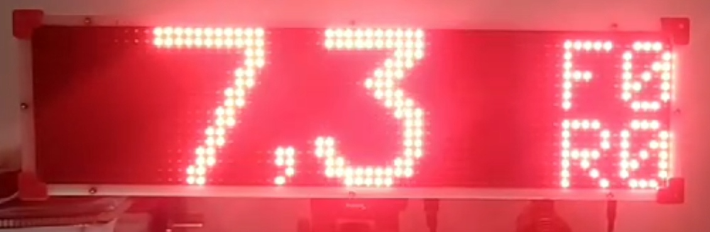
Bildschirm mit laufender Zeit.

**Zeitanzeige**:
- Wenn die Zeit läuft: Eine Dezimalstelle (aktualisiert jede Zehntelsekunde).
- Wenn die Zeit gestoppt ist:
  - Millisekunden, wenn die Zeit unter 10 Sekunden liegt.
  - Hundertstelsekunden, wenn die Zeit 10 Sekunden oder mehr beträgt.

**Maximale Zeit**: Überschreitet die Zeit 100 Sekunden (selten bei normalen Agility-Strecken), werden die Zahlen schmaler, um insgesamt fünf Ziffern anzuzeigen. Die maximal anzeigbare Zeit beträgt auf diese Weise 999,99 Sekunden. Die Gesamtzeit kann im Web auf der [Fernbedienung](#336-fernbedienung) eingesehen werden.

---

#### 2.4.2 Startmodus

In diesem Modus zeigt der Bildschirm einen Countdown (Sekunden und Zehntel) an, der zuvor eingestellt wurde, normalerweise 15 Sekunden.

Der Zeitnehmer muss die Anzeigetafel vor jedem Teilnehmer mit der [Steuerung](#336-websteuerung) zurücksetzen. Danach muss er auf das Signal des Schiedsrichters den vordefinierten Countdown starten. Anschließend:
- Wenn der Hund die Zelle während des Countdowns unterbricht, startet die Stoppuhr normal.
- Wenn der Countdown 0 erreicht, ohne dass die Zelle unterbrochen wurde, startet die Stoppuhr dennoch, und der erste Durchgang durch die Zelle wird ignoriert.

---

#### 2.4.3 Streckenerkennungsmodus

In diesem Modus wird ein Countdown in Minuten und Sekunden für die Streckenerkennung angezeigt. Standardmäßig beginnt er bei 7 Minuten, aber die Zeit kann in Schritten von 1 Minute angepasst werden, während er pausiert oder läuft:
- **Wichtig**: In diesem Modus haben die Zellen keine Wirkung.
- **Am Ende des Countdowns**:
  - Es erscheint die Nachricht "Zeit abgelaufen".
  - Ein intermittierender Signalton ertönt für 8 Sekunden.

---

#### 2.4.4 Spielmodus

Dieser Modus ist für die Spiele "Snooker" und "Gambler" der WAO (World Agility Open) ausgelegt.

- **Snooker**: Normale Zeitmessung bis zum Erreichen der konfigurierten Zeit, woraufhin ein akustisches Signal ertönt (die Dauer dieses Signals ist einstellbar).
- **Gambler**:
  - Die Zeit bleibt hinter der Nachricht "Tempus Fugit" verborgen.
  - Nach Ablauf der Öffnungszeit ertönt das erste Signal, und die Zeit wird wieder normal angezeigt.
  - Nach Ablauf der Schließzeit ertönt das zweite Signal (nur im Gambler-Modus verfügbar).
  - In beiden Phasen, wenn die Lichtschranke vor der eingestellten Zeit ausgelöst wird, wird die verstrichene Zeit angezeigt und das Signal ertönt nicht.
  - Das zweite Signal kann deaktiviert werden, indem die Schließzeit auf 0 Sekunden gesetzt wird.

Beispiel für Gambler mit einer Öffnungszeit von 30s und einer Schließzeit von 12s:
- Zu Beginn des Laufs ist die Zeit verborgen, und auf dem Bildschirm erscheint "Tempus Fugit".
- Nach 30 Sekunden des Laufs ertönt das erste Signal und die Zeit wird normal angezeigt.
- Nach 42 Sekunden des Laufs (12 Sekunden nach der Öffnungszeit) ertönt das zweite Signal.

**TIPP**: Wenn die Umgebung laut ist, wird empfohlen, das akustische Signal mit einer Trillerpfeife oder einem anderen manuellen Signal zu verstärken.

---

## 2.5 Anzeige von Nachrichten

### 2.5.1 Startnachrichten

Beim Einschalten der ZonEcron-Anzeigetafel erscheinen in den ersten Sekunden vier Nachrichten auf dem Bildschirm:
1. Marke und Modell.
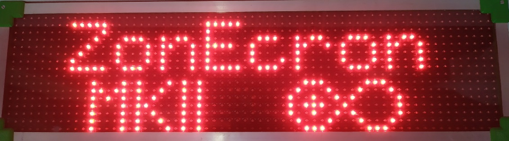
2. Name des Vereins (konfigurierter Bildschirmschoner).
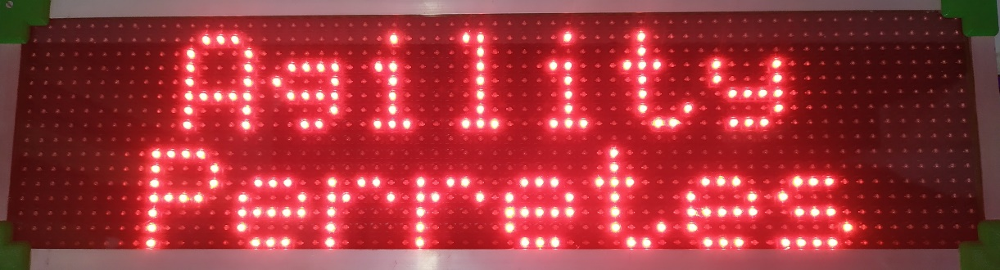
3. Uhrzeit und Datum des Geräts.
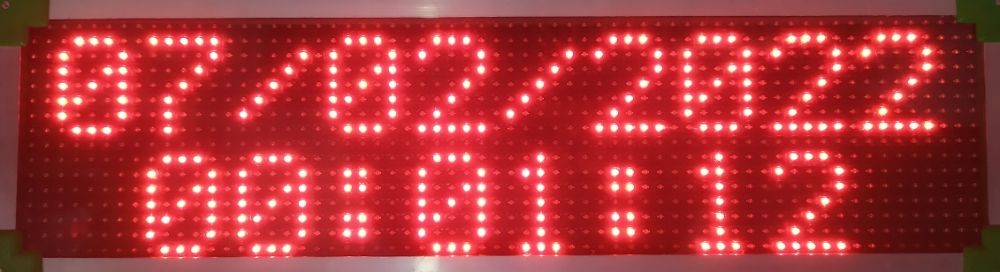
4. Name des WiFi-Netzwerks (eigenes oder fremdes) und IP-Adresse.
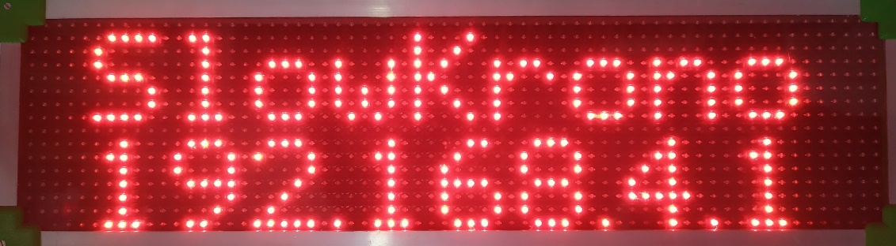

Wenn während dieser Nachrichten eine Lichtschranke eine Passage erkennt, werden die Nachrichten unterbrochen und der Timer wechselt automatisch zur Hauptanzeige und beginnt zu zählen. Daher ist es besser, die Lichtschranken erst einzuschalten, nachdem alle Nachrichten angezeigt wurden, falls Sie die Uhrzeit, das Datum oder die Netzwerkinformationen überprüfen müssen.

Besondere Aufmerksamkeit für die Nachrichten 3 und 4: Stellen Sie sicher, dass Datum und Uhrzeit korrekt eingestellt sind [siehe Abschnitt 3.3.1](#331-info) und merken Sie sich das WiFi-Netzwerk und die zugewiesene IP-Adresse, um den Webserver zu verwalten [siehe Abschnitt 3.2](#32-server-verbindung).

---

### 2.5.2 Batteriestatus der Sensoren

Beim ersten Einschalten eines Paars von Lichtschranken wird der Batteriestatus des Empfängers angezeigt. Auch die Batterie des Senders wird angezeigt, wenn dieser korrekt mit dem Empfänger ausgerichtet ist. Wenn Sie den Batteriestatus später überprüfen möchten, ohne alles auszuschalten und neu zu starten, können Sie dies über die Weboberfläche tun [siehe Abschnitt 3.3.1](#331-info).

---

### 2.5.3 Fehlermeldungen der Sensoren

Wenn ein Sensor nicht korrekt ausgerichtet ist (außer im Streckenerkennungsmodus), erscheint eine Warnmeldung, die den betroffenen Sensor angibt. Wenn der Timer läuft, zählt er weiter, zeigt jedoch keine Zeit an, bis der Sensor korrekt ausgerichtet ist.

---

### 2.5.4 Bildschirmschoner

Wenn der Timer länger als 2 Minuten angehalten ist, wird der Bildschirmschoner aktiviert. Dieser zeigt einen scrollenden Text an, der sich alle 10 Sekunden mit der Uhrzeit abwechselt. Der anzuzeigende Text kann konfiguriert werden [siehe Abschnitt 3.3.4](#334-anpassung).

---

### 2.5.5 Benutzerdefinierte Nachrichten

Es ist möglich, benutzerdefinierte Nachrichten auf zwei Zeilen zu konfigurieren, mit bis zu 10 Zeichen pro Zeile. [Abschnitt 3.3.4](#334-anpassung) erklärt, wie dies gemacht wird. Diese Nachrichten werden nur angezeigt, wenn der Timer angehalten ist, und verschwinden, wenn ein Reset-Befehl gesendet wird oder eine Lichtschranke eine Passage erkennt.

---

### 2.6 Grenzen

- Der Timer kann mehr als 1.000 Sekunden messen, aber das Display zeigt nur bis zu 999,99 Sekunden an. Für längere Zeiten können Sie die Webseiten der [Fernbedienung](#336-fernbedienung) oder des [Monitors](#337-monitor) einsehen.
- Die maximale Anzahl von Fehlern, die das Display registrieren kann, beträgt 9.
- Die maximale Anzahl von Verweigerungen beträgt 2. Ab der dritten Verweigerung wird der Teilnehmer als disqualifiziert angezeigt.

---

## 3 Eingebetteter Webserver

### 3.1 Beschreibung

Die ZonEcron-Anzeigetafel enthält einen integrierten Webserver, mit dem Sie den Timer von jedem Gerät mit WiFi-Verbindung (Smartphone, Tablet, PC) aus überprüfen, konfigurieren und steuern können, ohne zusätzliche Software zu installieren. Dieser Webserver kann sich mit einem vorhandenen WiFi-Netzwerk verbinden oder ein eigenes WiFi-Netzwerk erstellen, sodass keine Internetverbindung erforderlich ist.

---

### 3.2 WiFi-Netzwerke

#### 3.2.1 Verbindung mit dem WiFi-Netzwerk der Anzeigetafel

Wenn Sie die ZonEcron-Anzeigetafel einschalten und kein anderes Netzwerk konfiguriert wurde (z. B. beim ersten Einschalten), erstellt sie ihr eigenes WiFi-Netzwerk. Jede Anzeigetafel hat einen eindeutigen Netzwerknamen und ein Passwort:

  - **Netzwerkname**: ZonEcronXXXXXXXXXXXX
  - **Passwort**: XXXXXXXXXXXX

Dabei sind "XXXXXXXXXXXX" Zahlen und Großbuchstaben von A bis F. Wenn Sie also nach dem Netzwerk suchen und es finden, kennen Sie das Passwort bereits... Sie und alle anderen... daher sollten Sie das Passwort (und den Netzwerknamen) so bald wie möglich ändern, wie in [Abschnitt 3.3.3](#333-wifi) beschrieben.
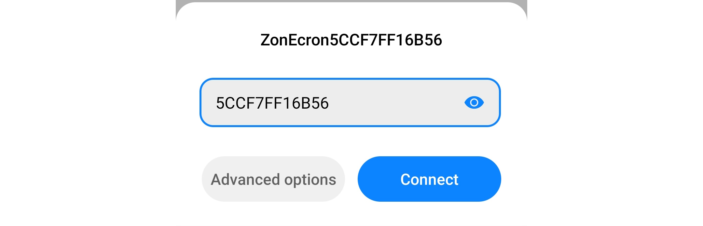

Verbinden Sie sich mit diesem WiFi-Netzwerk, und sobald die Verbindung hergestellt ist:

1. Ihr Gerät kann Sie darauf hinweisen, dass das Netzwerk keine Internetverbindung hat (natürlich). Stellen Sie sicher, dass die Verbindung erhalten bleibt.
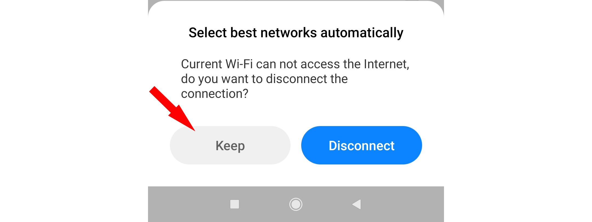

2. **Wichtiger Hinweis**: Einige Smartphones verfügen über eine Funktion "WiFi+" (oder ähnlich), die automatisch auf mobile Daten umschaltet, wenn das WiFi-Netzwerk kein Internet hat. Deaktivieren Sie diese Funktion, um Probleme zu vermeiden.
3. Öffnen Sie einen Webbrowser (Chrome, Firefox usw.) und geben Sie die Adresse `http://192.168.4.1` ein. Dadurch gelangen Sie zur Startseite der Anzeigetafel, auf der Sie deren Status anzeigen können [siehe Abschnitt 3.3.1](#331-info).

---

#### 3.2.2 Ändern von Name, Passwort und Sicherheit

Wir empfehlen, den Standardnetzwerknamen und das Passwort zu ändern, indem Sie die Anweisungen in [Abschnitt 3.3.3](#333-wifi) befolgen. Dies ist wichtig, um Ihr Gerät zu schützen, genau wie bei Ihrem Heimrouter.

Bei offiziellen Wettbewerben vermeiden Sie die Nutzung des vom Display generierten WiFi-Netzwerks. Der Server ist einfach, und seine einzige Schutzmaßnahme ist das Netzwerkpasswort. In solchen Fällen verbinden Sie das Display mit einem robusten WiFi-Netzwerk, das von einem geeigneten Router für belebte Umgebungen bereitgestellt wird, oder deaktivieren Sie als letzte Option das WiFi.

---

#### 3.2.3 Wiederherstellung von WiFi-Zugangsdaten

Haben Sie das Netzwerkpasswort Ihres ZonEcron-Displays vergessen? Keine Sorge, es gibt eine einfache Möglichkeit, die Verbindung wiederherzustellen:

1. Schalten Sie das ZonEcron-Display und die Zellen aus.
2. Erstellen Sie einen Hotspot (WLAN-Freigabe) auf Ihrem Smartphone mit dem Namen "**Recuperame**" (Spanisch für "hol mich zurück") und dem Passwort "**Admin1234**" (Groß- und Kleinschreibung beachten).
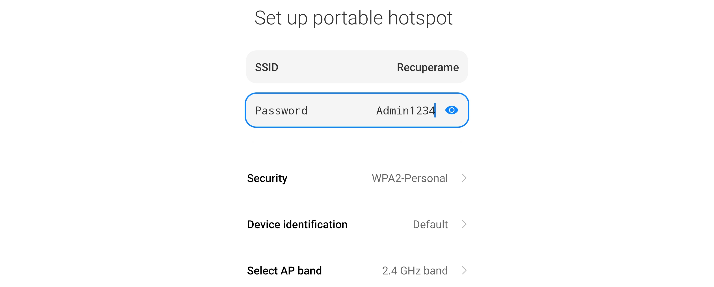

3. Schalten Sie das ZonEcron-Display ein.
4. Warten Sie, bis es sich mit dem Netzwerk "**Recuperame**" (Ihrem Smartphone) verbindet.
5. Auf dem Display des ZonEcron erscheinen der Netzwerkname ("Recuperame") und die IP-Adresse, die von Ihrem Smartphone zugewiesen wurde.
6. Greifen Sie über den Browser Ihres Smartphones auf diese IP-Adresse zu, um den Namen und das Passwort des Netzwerks, das vom ZonEcron-Display erstellt wird, gemäß [Abschnitt 3.3.3](#333-wifi) neu zu konfigurieren.

**Kein Zugriff möglich?**:
- Wenn "Recuperame" nicht auf dem Display angezeigt wird, hat sich das Display nicht mit dem von Ihrem Smartphone bereitgestellten Netzwerk verbunden. Stellen Sie sicher, dass der Netzwerkname und das Passwort korrekt eingegeben wurden (Groß- und Kleinschreibung beachten) und dass Ihr Smartphone ein 2,4-GHz-Netzwerk erstellt. Neuere 5-GHz-Netzwerke sind nicht kompatibel.
- Wenn das Netzwerk "Recuperame" angezeigt wird, vergewissern Sie sich, dass es sich um Ihr Netzwerk handelt und nicht um eines, das von einem anderen Smartphone in der Nähe erzeugt wird.
- Wenn Sie weiterhin keinen Zugriff haben, kontaktieren Sie uns für individuellen Support unter [ZonEcron@gmail.com](mailto:ZonEcron@gmail.com?subject=Verbindungsprobleme).

---

#### 3.2.4 Verbinden des Displays mit einem externen WiFi-Netzwerk

1. Überprüfen Sie beim Einschalten des Displays die WiFi-Netzwerk- und IP-Informationen in den [Startnachrichten](#251-startnachrichten).
2. Verbinden Sie Ihr Smartphone/Tablet/PC mit demselben WiFi-Netzwerk. Wenn es sich um das vom Display erstellte Netzwerk handelt, folgen Sie den Schritten in [Abschnitt 3.2.1](#321-verbinden-mit-dem-wifi-des-displays).
3. Greifen Sie auf die Webseite mit den [WiFi-Einstellungen](#333-wifi) zu.
4. Stellen Sie in der Sektion "Mit einem anderen WiFi-Netzwerk verbinden" sicher, dass sie aktiviert ist; falls nicht, aktivieren Sie sie.
5. Wählen Sie im Dropdown-Menü dieser Sektion das WiFi-Netzwerk aus, mit dem Sie das Display verbinden möchten, und geben Sie das Passwort ein und bestätigen Sie es.
6. Nach dem Klicken auf "Anwenden" erscheint eine Warnmeldung; nach der Bestätigung startet der Webserver neu.
7. Beobachten Sie die Nachrichten auf dem Display, um zu überprüfen, ob es sich mit dem konfigurierten WiFi-Netzwerk verbunden hat. Wenn nicht, wiederholen Sie die Schritte und stellen Sie sicher, dass das Passwort korrekt eingegeben wurde.
8. **Wichtig**: Das Passwort darf keine Sonderzeichen, keinen Backslash ( \ ) oder Semikolon ( ; ) enthalten. Das WiFi-Netzwerk muss 2,4 GHz sein. Neuere 5-GHz-Netzwerke werden nicht unterstützt.

**TIPP**: Um sicherzustellen, dass Sie keine Nachrichten auf dem Display verpassen, weil der Timer starten könnte, führen Sie diese Konfiguration mit ausgeschalteten Zellen durch.

Schau dir das Video an (Aktivieren Sie Untertitel in Ihrer bevorzugten Sprache, da der Ton auf Spanisch ist):  
[Video auf YouTube ansehen](https://youtu.be/FqYA5eCeje0)  

---

### 3.3 Webseiten

Wenn Sie auf die Webseite des ZonEcron-Displays zugreifen, wird die Hauptseite die Registerkarte "Info" sein. Je nachdem, ob Sie von einem Smartphone oder einem PC aus zugreifen, werden die Registerkarten entweder oben oder auf der linken Seite angezeigt. Jede Registerkarte bietet verschiedene Optionen zur Konfiguration des Displays oder zur Anzeige bestimmter Informationen.

---

#### 3.3.1 Info

In diesem Bereich können Sie:

- **Datum und Uhrzeit synchronisieren**: Stellen Sie Datum und Uhrzeit des Timers ein, sodass sie mit denen Ihres Geräts übereinstimmen, indem Sie einfach die Schaltfläche drücken.
- **Interne Temperatur überprüfen**: Sehr nützlich, um sicherzustellen, dass alles ordnungsgemäß funktioniert.
- **Zellenstatus anzeigen**: Wenn sie eingeschaltet sind, können Sie den Batteriestand jeder Zelle überprüfen.
- **Versionsinformationen des Displays anzeigen**.

Informationsseite:
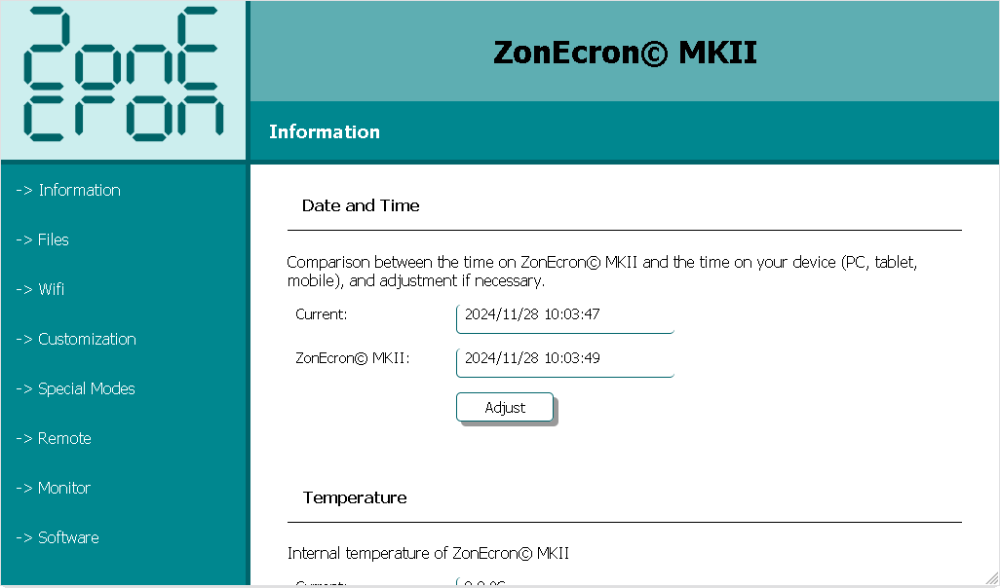

---

#### 3.3.2 Dateien

In dieser Registerkarte können Sie die auf dem Server des ZonEcron-Displays gespeicherten Dateien verwalten. Besonders hervorzuheben sind die **Zeitprotokolle**, die Dateien mit dem Namen `cronoLog#.txt` sind und Zeitaufzeichnungen enthalten. Hierbei steht `#` für eine Zahl von 0 bis 3. Klicken Sie darauf, um sie anzuzeigen und alle vom Display aufgezeichneten Zeiten zu überprüfen.

- **Dateiliste**: Zeigt eine Liste aller Dateien an und am Ende der Liste den insgesamt belegten und verfügbaren Speicherplatz. Dieser Server ist sehr kompakt und benötigt nur wenige KB.
- **Dateien hochladen**: Diese Option sollte unter normalen Umständen nicht verwendet werden. Aus diesem Grund teilen wir den benötigten Schlüssel hier nicht mit. Sollten Sie ihn jemals auf unsere Empfehlung hin benötigen, stellen wir ihn Ihnen zur Verfügung. Ein Beispiel wäre das Ersetzen des ZonEcron-Logos durch das Logo Ihrer Organisation, wobei die Datei bestimmte Anforderungen erfüllen muss; daher bitten wir Sie, sie vor dem Hochladen überprüfen zu lassen.
- **Dateien löschen**: Wie oben.
- **Zeitprotokolle löschen**: Durch Eingabe des Schlüssels "disturbingLackOfFaith" löscht der Server alle **Zeitprotokolle** und beginnt mit der Aufzeichnung von vorne. Dies kann nützlich sein, wenn Sie keine Protokolle eines vorherigen Wettbewerbs behalten möchten, bevor Sie einen neuen starten. Im Allgemeinen ist dies jedoch nicht erforderlich, da das Display die ältesten Protokolle überschreibt, um niemals den Speicherplatz zu erschöpfen.

**TIPP**: Wenn Sie mehrere **Zeitprotokolle** haben, ist das aktuelle, in das das Display schreibt, das kleinste.

Beispiel für Zeitprotokolle: 
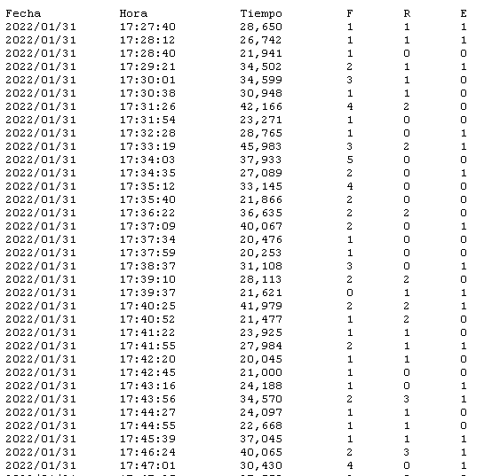

---

#### 3.3.3 WiFi

Das ZonEcron-Display kann entweder ein eigenes WiFi-Netzwerk erstellen oder sich mit einem vorhandenen verbinden. Standardmäßig merkt es sich das zuletzt verwendete Netzwerk und versucht, sich damit zu verbinden. Wenn dies nicht gelingt, erstellt es ein eigenes WiFi-Netzwerk.

In dieser Registerkarte können Sie das vom Display erstellte eigene WiFi-Netzwerk und/oder das Netzwerk, mit dem es sich verbinden soll, verwalten. Nur ein Modus (eigenes Netzwerk oder externes Netzwerk) ist aktiv. Obwohl es möglich ist, beide gleichzeitig für temporäre Konfigurationsänderungen zu aktivieren, wird nicht empfohlen, im normalen Betrieb beide Modi eingeschaltet zu lassen, da dies Verbindungsprobleme verursachen kann.

- **Eigenes WiFi-Netzwerk erstellen**: Aktivieren oder deaktivieren Sie das Netzwerk und ändern Sie den Namen und das Passwort nach Bedarf. Dies ist nützlich für die Wiederherstellung der WiFi-Verbindung.
- **Mit einem bestehenden Netzwerk verbinden**: Scannen Sie verfügbare Netzwerke und wählen Sie das Netzwerk aus, mit dem Sie sich verbinden möchten. Nach der Verbindung wird auch die Signalstärke angezeigt.
- **Neustart**:
  - **Neustart**: Diese Option schaltet den Server (nicht das Display) aus und wieder ein. Alle aktiven WiFi-Verbindungen werden unterbrochen.
  - **Zurücksetzen**: Diese Option löscht die WiFi-Konfigurationen und stellt die Werkseinstellungen wieder her. Anschließend wird der Server wie in der vorherigen Option neu gestartet.

Wie bereits erwähnt, ist dieser Server sehr kompakt und hat begrenzte Kapazitäten. Wir empfehlen maximal 3 gleichzeitige Benutzer für flüssige Verbindungen.

**TIPP**: Wenn Sie beide Modi (eigenes Netzwerk und externes Netzwerk) deaktivieren, bleibt das ZonEcron-Display ohne WiFi (die Zellen funktionieren weiterhin), bis es neu gestartet wird. Dies kann nützlich sein, wenn Sie verdächtige Störungen vermuten.

---

#### 3.3.4 Anpassung

Hier können Sie verschiedene Aspekte anpassen, um die ZonEcron-Anzeigetafel an Ihre Bedürfnisse anzupassen:

- **Verein**: Konfigurieren Sie zwei Textzeilen mit jeweils bis zu 10 Zeichen, normalerweise den Namen Ihres Vereins. Dieser Text wird als Bildschirmschoner verwendet, wenn die Anzeigetafel länger als 2 Minuten inaktiv ist.
- **Temporäre Nachrichten**: Definieren Sie Nachrichten, die auf dem Bildschirm erscheinen, während der Timer angehalten ist. Sie können deren Dauer festlegen oder sie unbegrenzt lassen (Zeit 0). Diese Nachrichten verschwinden, wenn der Timer zurückgesetzt wird oder eine Lichtschranke einen Durchgang erkennt.
- **Farben**: Ändern Sie die Farben der Weboberfläche. Änderungen sind sofort sichtbar, werden jedoch erst gespeichert, wenn Sie sie bestätigen. Vermeiden Sie Farbkombinationen, die unangenehm für die Augen sein könnten. Zum Beispiel:

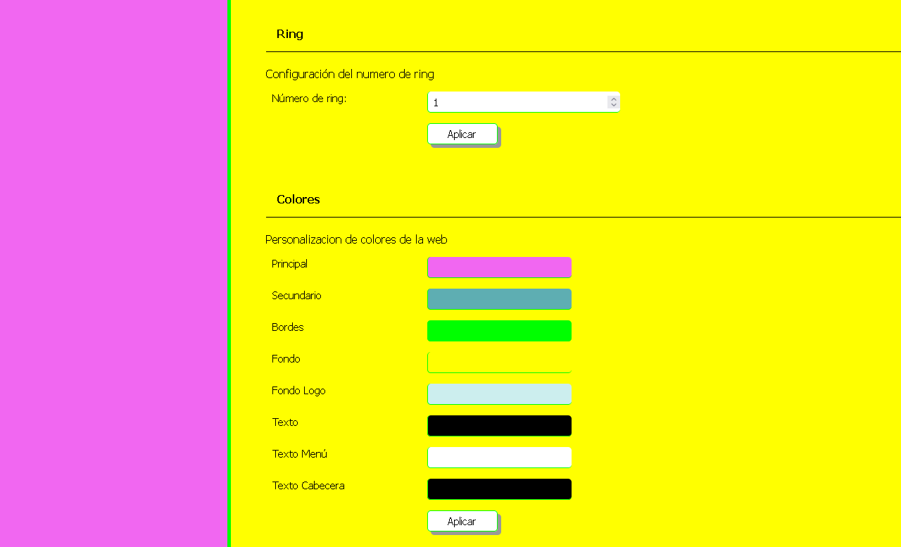

---

#### 3.3.5 Spezialmodi

In diesem Abschnitt können Sie spezielle Modi für Wettkämpfe oder Training konfigurieren:

- **Games**: Konfigurieren Sie die Parameter für das Durchführen einer Games-Runde gemäß der Funktionsweise, die in [Abschnitt 2.4.4](#244-games-modus) erklärt wird.
- **Mehrfacherkennung**: Richten Sie zusätzliche Erkennungen ein, die erforderlich sind, damit der Timer stoppt und die Anzeige die eingefrorene Zeit während der Zwischenzeiten zeigt, während der Timer weiterläuft.
- **Startzeit**: Aktivieren Sie den Startmodus und konfigurieren Sie die Startzeit (Standard: 15 Sekunden), um wie in [Abschnitt 2.4.2](#242-start-modus) beschrieben zu funktionieren.

Beim Aktivieren des Spielmodus oder des Modus Mehrfacherkennung wird eine Bestätigungsnachricht auf dem Bildschirm angezeigt (wenn der Timer angehalten ist):

- Modus games:
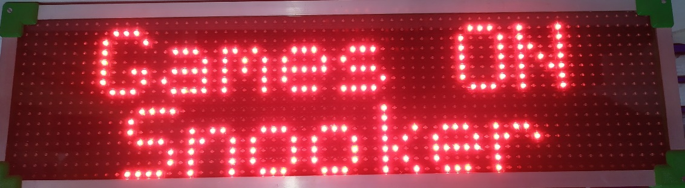

- Modus mehrfacherkennung:
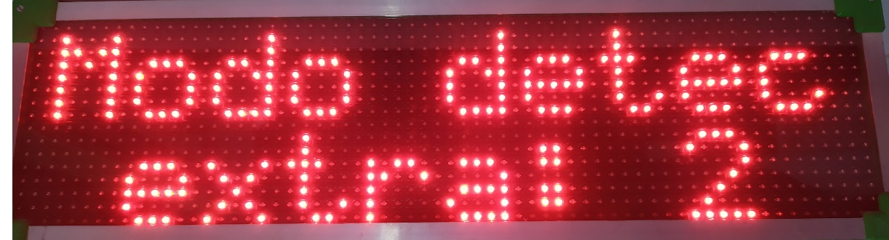

---

#### 3.3.6 Fernbedienung

Von diesem Bildschirm aus kann der Timer-Bediener (z. B. über sein Smartphone) die Hauptfunktionen des Timers verwalten, darunter:

- Anzeigen von Fehlern, Verweigerungen und Eliminierungen.
- Zurücksetzen des Timers.
- Aktivieren des Streckenerkennungsmodus und Einstellen der Zeit.

Fernbedienung auf einem Mobilgerät:
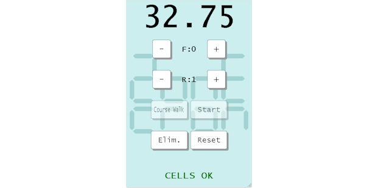

Die Fernbedienung zeigt außerdem die laufende Zeit, den Batteriestand bei niedriger Ladung oder die Fehlanpassung der Zellen sowie die letzten 5 Ergebnisse unten für eine schnelle Einsicht durch das Streckenteam an.

Einige Regeln:

- **Start-Verweigerungen**: Wenn der Timer zurückgesetzt ist, startet eine Verweigerung den Timer und ignoriert den ersten Durchgang durch die Lichtschranke. (Wenn der Timer nicht zurückgesetzt ist, wird die Verweigerung dem auf dem Bildschirm angezeigten Ergebnis hinzugefügt.)
- **Korrekturen**: Sie können Fehler, Verweigerungen und Eliminierungen auch nach Abschluss des Laufs korrigieren.
- **Zurücksetzen**: Dieser Button ist nur 5 Sekunden nach dem Ende eines Laufs oder bei Eliminierung des Teilnehmers aktiv, um versehentliche Resets (die nicht korrigiert werden können) zu vermeiden.

---

#### 3.3.7 Monitor

Der Monitorschirm zeigt die gleichen Informationen wie die Fernbedienung, jedoch ohne Buttons. Er ist ideal für öffentlich zugängliche Videodisplays, da er auch das Vereinslogo als Hintergrund anzeigen kann.

---

#### 3.3.8 Software

In diesem Abschnitt können Sie die Verbindung der Anzeigetafel mit einer Drittanbieter-Software über Websocket konfigurieren. Obwohl ursprünglich für die Kommunikation mit der Plattform [FlowAgility](https://www.flowagility.com/) gedacht, kann die Anzeigetafel mit jeder Software verbunden werden, die über einen Websocket-Server verfügt und das [hier beschriebene Nachrichtenprotokoll](https://github.com/ZonEcron/ZonEcron-Interfacing/blob/main/WebsocketClient.md#4-mode-meanings-and-examples) nutzt.

Beachten Sie, dass die Anzeigetafel für diese Art der Verbindung mit einem externen WiFi-Netzwerk verbunden sein muss, wie in [Abschnitt 3.2.4](#324-verbinden-der-anzeigetafel-mit-einem-externen-wifi-netzwerk) beschrieben. Darüber hinaus muss, wenn die Software eine Online-Plattform wie FlowAgility ist, dieses externe WiFi über eine Internetverbindung verfügen.

Auf dieser Seite finden Sie:

- **Softwareadresse**: In diesem Abschnitt finden Sie die notwendigen Daten, um eine Verbindung zur FlowAgility-Plattform (oder einer anderen Drittanbieter-Software) herzustellen:
  - URL: Die Adresse, zu der die Anzeigetafel eine Verbindung herstellen soll. Diese Adresse muss von der Software bereitgestellt werden, zu der Sie sich verbinden möchten.
  - MAC-Adresse: Die MAC-Adresse der Anzeigetafel. FlowAgility benötigt diese Adresse, um die oben genannte Verbindungs-URL zu generieren.
  - Ein Indikator zeigt den aktuellen Verbindungsstatus an.
- **Serial & WS client connection log**: Zeigt Nachrichten von der Timer-Seite und der Drittanbieter-Software an. Dieses Log hat ein Maximum von 5000 Zeichen; wenn das Limit erreicht ist, werden die ältesten Nachrichten gelöscht, um die neuesten anzuzeigen. Außerdem wird dieses Log nicht gespeichert; wenn die Webseite verlassen oder aktualisiert wird, beginnt das Log von vorne.
- **DANGER ZONE - KEEP AWAY BUTTERFINGERS**: In diesem Bereich, den wir nicht empfehlen zu nutzen, es sei denn, Sie wissen, was Sie tun, erscheinen nach Drücken des Buttons folgende Felder:
  - SSL: Zur Nutzung einer sicheren Websocket-Verbindung (wss) oder einer normalen Verbindung (ws).
  - Port: Zum Ändern des Ports des Servers, mit dem sich die Anzeigetafel verbinden soll.
  - Extra Info: Zum Anzeigen zusätzlicher Informationen im Log.

---

#### 3.3.9 Streaming

Dieser Bildschirm ist nicht direkt über das Menü zugänglich, kann jedoch in der Dateiliste angezeigt werden.

Er ist dafür konzipiert, von Streaming-Programmen erfasst zu werden, um die Zählung in Echtzeit anzuzeigen.  
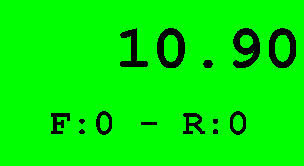

Falls ihr etwas ausgefeilteres oder anpassbares benötigt, könnt ihr [unser anpassbares HTML](https://github.com/ZonEcron/FlowAgilityStreamingInfo) verwenden. Es ist ebenfalls dafür gedacht, mit FlowAgility verbunden zu werden, dies ist jedoch nicht zwingend erforderlich, und ungenutzte Informationen können ausgeblendet werden. Passt es nach euren Wünschen an und verbindet es mit der Anzeigetafel für ein beeindruckendes Streaming-/Videowall-Erlebnis.  
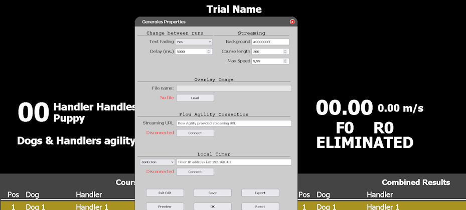  

---

## 4 Kontakt

Für technischen Support, Fragen oder Vorschläge kontaktieren Sie uns per E-Mail: [ZonEcron@gmail.com](mailto:ZonEcron@gmail.com?subject=ZonEcron%20Anzeigetafel).
