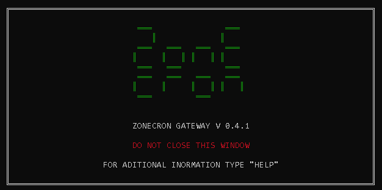
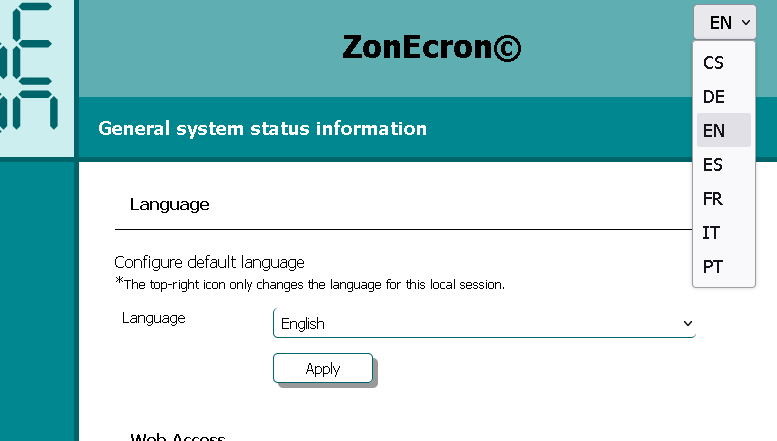
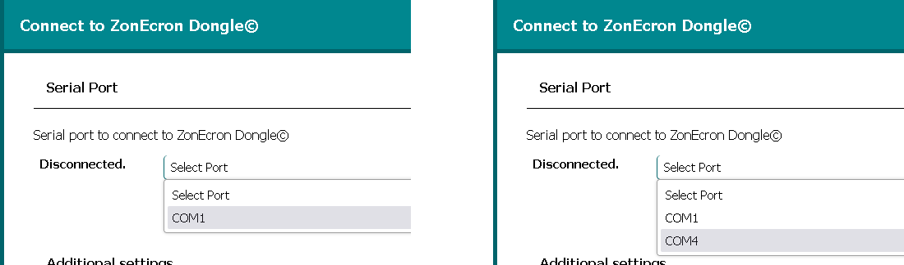
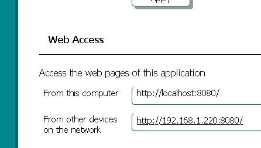
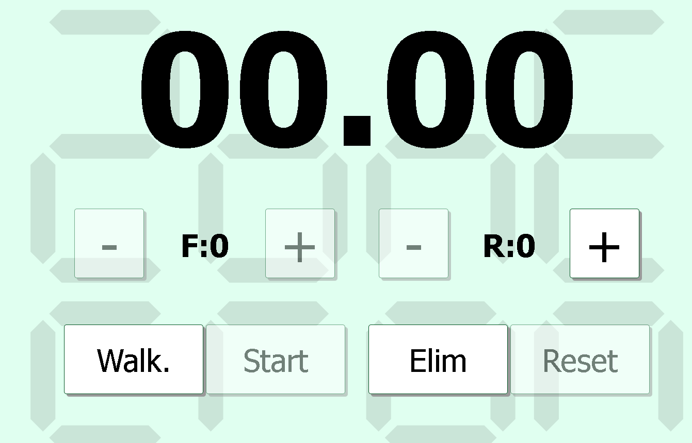
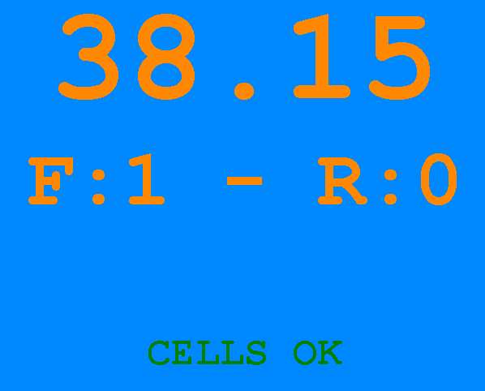
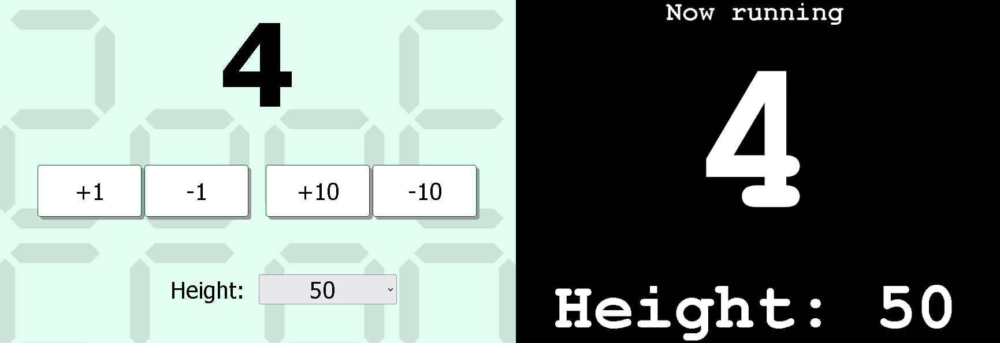
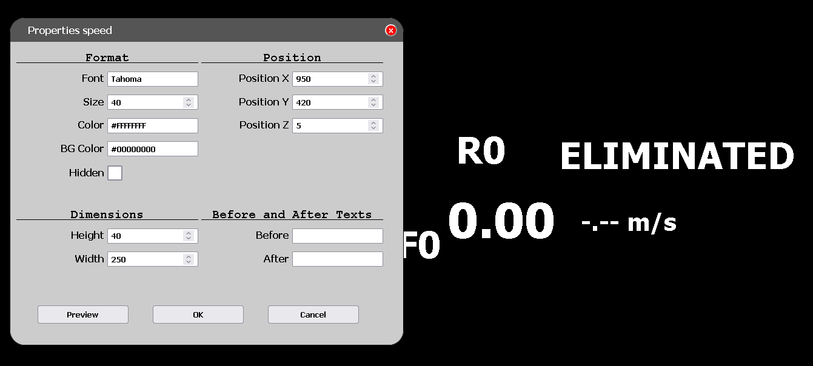

# ZONECRON DONGLE + APP
## User Manual

### Contents

1. [Introduction](#1-introduction)
2. [Preparations](#2-preparations)
   - [2.1 "Do not close" window](#21-do-not-close-window)
   - [2.2 Before starting](#22-before-starting)
3. [Connections and accesibility](#3-connections-and-accesibility)
   - [3.1 Connecting to zonecron dongle](#31-connecting-to-zonecron-dongle)
   - [3.2 Connecting to flowagility](#32-connecting-to-flowagility)
   - [3.3 Accessing from other devices on the network](#33-accessing-from-other-devices-on-the-network)
4. [Displays and operating](#4-displays-and-operating)
   - [4.1 Operating the timer from the application](#41-operating-the-timer-from-the-application)
   - [4.2 Displaying the timer on a screen](#42-displaying-the-timer-on-a-screen)
   - [4.3 Turn](#43-turn)
   - [4.4 Streaming displays](#44-streaming-displays)
   - [4.5 Streaming customization](#45-streaming-customization)
5. [Miscelaneous](#5-miscelaneous)
   - [5.1 Multiple timers](#51-multiple-timers)
   - [5.2 Information](#52-information)
   - [5.3 Exiting the application](#53-exiting-the-application)

---

## 1 Introduction

The ZonEcron©, and when we say ZonEcron©, we want you to imagine neon lights and fireworks in the background (okay, I'll skip this part for the rest of the manual, otherwise, it'll get too long)—as I was saying, the ZonEcron© was designed to meet the need to time the execution of zones (runway, palisade, and seesaw) and, logically, also to time short sequences to determine which option is better.

Adding a dongle to manage the timer from a computer was a logical evolution. The ZonEcron© scoreboard already has its own web server, making this app-backpack combination redundant. Therefore, if you have a ZonEcron© scoreboard, this backpack with the APP is a redundant way to communicate with the timer.

The APP can be downloaded [here](https://zonecron.github.io/ZonEcronGW/).

---

## 2 Preparations

### 2.1 "Do not close" window

1. When the application starts, a window will open that must not be closed. In the window itself, "DO NOT CLOSE THIS WINDOW" appears in English.
2. A series of commands can be typed into this window for testing or troubleshooting. In that window, type "HELP" and press the Enter key for more information.
3. The commands and responses in this window are in English. Only the manual and help are translated to the default configured language.

Do Not Close Window

---

### 2.2 Before starting

1. When the application starts, a browser (Firefox, Chrome, etc.) should also open with the web page containing this manual. If it does not open, it may be due to security restrictions on the machine running the application. In that case, open a browser and type the following address: 
    - http://localhost:8080 
2. You may need to try different ports between 8081 and 8100 if port 8080 was already occupied when the application started: 
    - http://localhost:8081
    - http://localhost:8082
    - ...
3. In the upper-right corner, the language for the current session can be changed, but the default language will not be altered.
4. The menu on the left has four options: "Information," "Connect," "Controls," and "Screens." When clicking, for example, on the "Information" section, a submenu with four more options appears: "Manual," "System," "Times," and "License." Clicking, for example, on "System" redirects to the web page with options for configuring the default language (so you don't have to change it each time the application starts) and other system information. From here on, references to each section will be abbreviated. This example is abbreviated as **Information -> System**.
5. The computer must recognize the ZonEcron dongle when it's connected. Usually, a tone should sound when any USB device is connected. If not, you will need to install drivers for the CH340G chip. Here is the manufacturer's website: https://www.wch-ic.com/downloads/CH341SER_ZIP.html .
6. For the following steps, the dongle must remain disconnected from the computer until instructed otherwise.
7. If you intend to connect to the FlowAgility platform, ensure the computer has internet access, for example, by browsing to a news website.

Language selector for permanent or momentary (upper right corner) change.

---

## 3 Connections and accesibility

### 3.1 Connecting to zonecron dongle

1. To connect the dongle to the application, click on the menu on the left **Connect -> Dongle**.
2. The "serial port" section has a dropdown with the serial ports available on the computer. Pay close attention to which ones they are.
3. Connect the ZonEcron dongle to the computer.
4. Click refresh and check the serial ports again. The dongle will be the new port that wasn’t there before.
5. Click connect, and a gray message will appear: "Opened. Waiting for a signal from the dongle." If everything goes well, after two or three seconds, it will turn light green, indicating "Dongle found. Waiting for timer signal."
6. When starting or stopping the timer by cutting the beam of the cells, the message should change to "Dongle and timer verified." in dark green. If not, review the entire connection process.

Serial port list before and after pluging the dongle. 
In this example dongle is COM4

---

### 3.2 Connecting to flowagility

1. Select in the menu on the left **Connect -> FlowAgility**.
2. Copy the 12-character MAC address.
3. On the FlowAgility website https://FlowAgility.com , after logging in, access the test where you have organizer-level access.
4. Select the icon for timer management at the top. Once there, paste the previously copied MAC address into the corresponding field and click "Pair with timer."
5. The page will change, and a URL similar to "flowagility.com/ws/timer/123456ABCDEF" will appear. Copy that URL.
6. Back on the **Connect -> FlowAgility** page, paste the URL into the "URL" field and click connect.
7. If everything is correct, the message "Connected." should appear in green. If not, review the entire process from step 2. Be careful not to include any spaces before or after the text when copying, and do not include "https://" or "www"—just copy the provided URL.
8. Once connected, the timer should also appear as connected on the FlowAgility page. If not, refresh the page.
9. You can test starting and stopping the timer, and it should start and stop on the FlowAgility page. You can also test resetting the timer from the FlowAgility page and check that the timer has been reset.
10. Two-way communication is now established.

---

### 3.3 Accessing from other devices on the network

1. This application makes the computer on which it is running act as a local web server. Therefore, the web pages can be accessed from any other device (PC, tablet, mobile phone) that is on the same network.
2. To access from another device, simply open a web browser (Firefox, Chrome, ...) and type the address that appears in **Information -> System** under the "Web Access" section, in the "From other devices on the network" line.
3. **For example**, it is possible to:
    - Have the computer set aside on a table with the dongle connected and the application running without supervision
    - Mark faults and refusals from a mobile phone at the edge of the arena
    - Display the time, faults, and refusals on a television at the ring entrance

Example of IP to access from another device in same network.

---

## 4 Displays and operating

### 4.1 Operating the timer from the application

1. The timer can be controlled from the application by clicking on the **Controls -> Timer** section in the left-hand menu.
2. In the previous example, this would be what is opened on the mobile phone.
3. The controls are quite intuitive. You can increase and decrease faults and refusals, delete and undelete, mark recognition times, and more.
4. It is worth noting that to reset the timer, the pair must first be eliminated. This is to prevent accidental resets, as a reset cannot be undone.
5. If the application is connected to FlowAgility, these controls are not needed, as using both options at once (controls and FlowAgility) may cause errors when recording the results.

Remote control on a PC

---

### 4.2 Displaying the timer on a screen

1. Select **Screens -> Monitor** from the left-hand menu.
2. In the previous example, this would be what is opened in the web browser of a smart TV.
3. This page is designed to display the timer to the public on a medium-to-large monitor/television that allows the information to be read from a certain distance.
4. The running timer will be displayed, as well as the faults and refusals received from the controls or the FlowAgility platform.
5. At the bottom, there are two selectors to change the background and text colors if you want to give a more festive or corporate look. We recommend using colors with good contrast between them.

Timer display screen with customized colors.

---

### 4.3 Turn

1. This functionality is a bonus that is unrelated to the timer itself. The idea is similar to the timer example, where, from a mobile phone, you indicate the dog’s number in the ring, and on a separate monitor or television, that number is displayed in large format.
2. The control for this function is located in the left-hand menu under **Controls -> Turn**. It is possible to manage the indication of the dog number in the ring, as well as the current jump height number: 20 (XS in Spain), 30 (S), 40 (M), 50 (I), and 60 (L).
3. To display the turn to the public, show the screen located in the left-hand menu under **Screens -> Turn** on a monitor or smart TV. This information is very useful for competitors to see the number from a distance and organize their preparation times.
4. As with the timer screen, the background and number colors can be changed with the dropdowns at the bottom.

Turn remote and display screens

---

### 4.4 Streaming displays

1. The sections **Screens -> Streaming** and **Screens -> Streaming FA** are designed to be captured by streaming programs.
2. They differ in that the first is a simplified version of the second for when FlowAgility is not used, but with the same customization options.

Streaming webpage being customized.

---

### 4.5 Streaming customization

Since the streaming screens are specially designed and highly customizable, we are dedicating a section to explain the possibilities they offer.

1. Double-clicking on an empty area of the screen will open the general window.
2. In this general window, you can manually enter the course distance to display the speed calculation in real-time. The speed will not be displayed during the first 5 seconds of the course. The "Max Speed" input field is used to avoid showing excessively high speeds. If the application is connected to FlowAgility, the distance information will be updated automatically. Otherwise, the distance must be entered manually for each run.
3. From this general window, you can also upload a background image, which will be saved with the rest of the customizations when you save.
4. In the "streaming FA" screen, this window will include the option to connect to FlowAgility. To update the information, you must enter the connection URL provided by FlowAgility in this menu and press the connect button.
5. At the bottom of this general window, there is a button to enter edit mode. In this mode, you can drag and drop each text (time, faults, dog’s name, etc.) to position it wherever you want. Double-clicking on each text opens a properties window where you can change its size, color, transparency, etc. If any window is open, you cannot drag and drop anything except the window itself. It must be closed to drag or edit other texts.
6. Activating the "Hide" option for an element will not hide it until you exit edit mode. In normal mode (non-edit), the "Eliminated" element and the "Faults" and "Refusals" elements will alternate (one or the other) depending on whether the pair has been eliminated or not. In edit mode, both will be visible so that they can be edited. For example, if you decide to permanently hide "Faults" and "Refusals" by activating the "Hide" option, the "Eliminated" element will maintain its behavior in normal mode, only becoming visible when the pair is eliminated, and vice versa.
7. In edit mode, you can undo the last 100 actions with Ctrl + Z or redo the last 100 undone actions with Shift + Ctrl + Z.
8. Once you have finished customizing, double-click on an empty area to display the general window again and press the exit edit mode button.
9. In the same window, pressing the save button will save the adjustments made and keep them even if the web page is closed and opened later.
10. Pressing the save button will also sync these adjustments across all **same browser** windows displaying the same streaming page. This feature allows you to modify the design of the window in one instance, and when you save, it updates the window being streamed without showing the menus and properties opened for modifications.
11. In the event of a communication error with the timer or the FlowAgility platform, a reconnection attempt will be made continuously with a 5-second pause between attempts.
12. The Import/Export button allows you to save the configuration to a file for backups or migrations. The import function is only available for new or recently reset configurations. If the import option does not appear, you need to press the reset button to restart the configurations, as any change will turn the import button into an export button.
13. Some buttons or actions will show a pop-up help message when clicked or when the mouse hovers over the element for a couple of seconds.

---

## 5 Miscelaneous 

### 5.1 Multiple timers

1. It is possible to run the program multiple times if you have several dongles with their timers for simultaneous courses, for example.
2. In this case, each application instance will create a different access point, with the same address but a different port, for example: 
    - http://localhost:8080 
    - http://localhost:8081 
3. The codes needed to connect with FlowAgility (MAC address) will be consecutive.
4. The pages for the first 8 instances will open with different colors to differentiate them easily. Starting from the ninth, if that ever happens, they will open with the default color.

Several executinos of the app in the same PC.

---

### 5.2 Information

1. On the **Information -> System** web page, you can:
   - Select the default language.
   - View the addresses to access the application from the computer where it is running or from another device on the same network. For example, if your computer is connected to Wi-Fi and your mobile phone is also connected to the same network, you can access the application from your mobile by entering the address shown in the "Web Access" section, on the line "From other devices on the network."
   - View the battery status of the ZonEcron cells.
   - View basic information about the dongle (boooriiiing).
   - View the last 10 times recorded by the timer on the current day in reverse order (most recent first) if the application has been connected to the dongle.
2. On the **Information -> Times** web page, all the times recorded by the timer on the current day are displayed. Times from previous days are also available in text files (one per day) in the "logs" folder inside the application folder.
3. On the **Information -> Manual** web page, you can consult this manual.
4. On the **Information -> About** web page, you can read the usage license.

---

### 5.3 Exiting the application

1. To close the application, simply close the "DO NOT CLOSE" window or type the command "exit" into it.
2. All web pages opened on any device will lose communication and stop receiving updated information.
3. All configuration data will be saved. If a successful connection was made with the dongle or FlowAgility, that configuration will also be saved. The next time the application starts, it will automatically attempt to connect to the dongle and FlowAgility using that configuration.
4. On different days, the FlowAgility connection changes, so it will not work from one day to the next.
