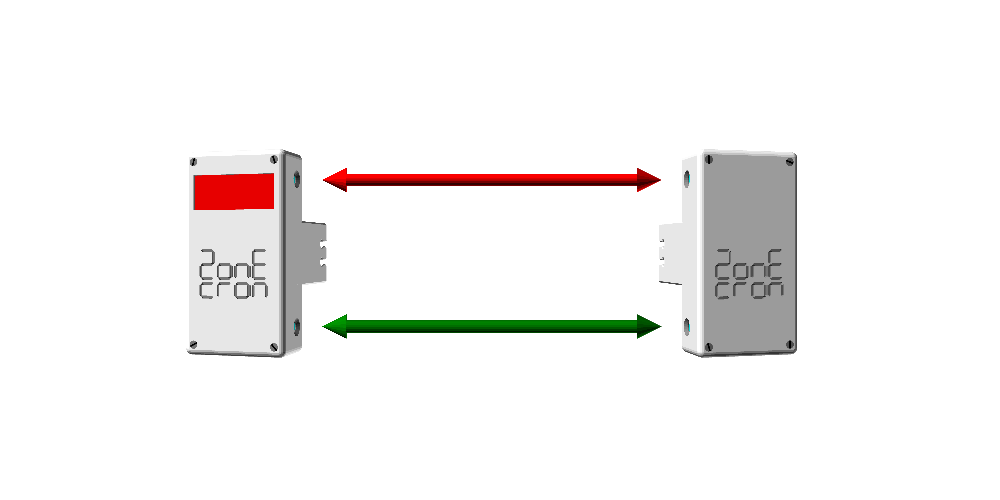

# ZonEcron© Original
## User Manual

## Table of Contents

1. [Introduction](#1-introduction)
   - [1.1 Team Objective](#11-team-objective)
   - [1.2 Main Features](#12-main-features)
   - [1.3 Compare Us](#13-compare-us)
2. [Usage](#2-usage)
   - [2.1 Setup and Power On](#21-setup-and-power-on)
   - [2.2 Alignment and Detection](#22-alignment-and-detection)
   - [2.3 Infrared Self-Interference](#23-infrared-self-interference)
   - [2.4 Radio Communication](#24-radio-communication)
   - [2.5 Screen Display](#25-screen-display)
   - [2.6 Power and Charging](#26-power-and-charging)
   - [2.7 Battery Life](#27-battery-life)
   - [2.8 Sun and Rain](#28-sun-and-rain)
   - [2.9 Storage](#29-storage)
3. [Epilogue](#3-epilogue)
4. [Contact](#4-contact)

---

## 1 Introduction

### 1.1 Team Objective

The ZonEcron© and when we say ZonEcron©, imagine neon lights and fireworks in the background (okay, I’ll skip this part for the rest of the manual)—was designed to meet the need to time the execution of zones (walkway, dog walk, and seesaw) and, of course, allow short sequences to be timed to determine the best option.

Under this premise, driven by our tendency toward minimal effort, we added some conditions such as easy installation, no wires, etc., and began experimenting with different technologies (infrared, radio, batteries, screens, etc.) that brought us closer to our final result.

Ultimately, the original ZonEcron® (from now on, simply ZonEcron®) was born to fulfill the timing needs in agility training, which is the environment we intend to limit it to. Although the device can be used as a competition timer, some additions (large display, connection to competition software, an additional spare pair, etc.) are recommended for that purpose.

---

### 1.2 Main Features

- Compact, small size with everything integrated.
- Quick to set up, avoiding laziness (or at least not too much).
- Outdoor-ready, visible in sunlight, and somewhat rain-protected.
- Rechargeable via USB, with over 30 hours of battery life.
- Safe: Harmless signals (infrared and Wi-Fi) with no sharp edges.
- Firm grip on wings, adaptable to any material (plastic, aluminum, iron).
- Wireless: No cables are used except for battery charging.
- Long communication range. Tested up to 80m; recommended range is 40m.
- Integrated 4-digit display with the highest resolution possible for the time displayed (milliseconds, hundredths, tenths, or seconds).
- Dual sensors (upper and lower) on each gate.

---

### 1.3 Compare Us

We believe we have developed a product with unique features. We haven't found any other product that combines all the characteristics of the ZonEcron©, which we won’t repeat here.

When we realized we needed a training timer, we searched extensively and did find other products aimed at the same goal, but none met all our requirements, so we decided to create our own.

If you have a specific need that ZonEcron© doesn't meet, there are other similar products. We invite you to search, compare, and if you find… well, you know… A questioning mind is an awakened mind.

---

## 2 Usage

### 2.1 Setup and Power On

A pair of ZonEcron© originals consists of an infrared transmitter (the box without a screen) and an infrared receiver (the box with a screen).

Both feature a clamp with one fixed side on the box and the other sliding along two steel rods. An internal elastic band keeps the clamp sides together. This band can be quickly adjusted to three tension levels by moving the tied ends of the band, adapting to different wing or pole thicknesses. See the following images:

|                 Minimum Tension                     |                 Medium Tension                      |                 Maximum Tension                     |
|-----------------------------------------------------|-----------------------------------------------------|-----------------------------------------------------|
|  |  |  |
| Wide rail profile.                                  | For round tubes.                                    | Narrow rail profile.                                |
| e.g., aluminum jumps.                               | e.g., PVC jumps or length poles.                    | e.g., galvanized steel jumps.                       |

By sliding the clamp to open it, place the ZonEcron© on the vertical part of the wing (or a length jump post). The transmitter goes on the right and the receiver on the left, aligning the two transmitters with the two receivers:

Next, proceed to turn on the transmitter and receiver. To verify the transmitter is on, check the blue LED, which will be steady or blinking (if the battery is low). In the case of the receiver, the blue light will turn on immediately upon powering up, displaying various messages on the screen. Once the time reads zero (0.0), the blue light will turn off if it detects the transmitter's infrared signal correctly. Although the order of setup and power-on doesn't matter, we recommend placing the devices in position first, then turning on the transmitter (no screen) before the receiver (with a screen). This allows checking the battery level of both devices during the initial screen messages.  

**It is vital** to leave a gap between the pole and the lower transmitter to maximize detection probability. We recommend positioning the lower transmitter 10cm above the pole for XS, S, and M, and 15cm for L and XL. For example, for M, it should look like this:

---

### 2.2 Alignment and Detection

Once the transmitter and receiver are positioned facing each other and turned on, the blue light on the receiver will turn off if the alignment is correct and no obstacles block the infrared beam. When the beam is interrupted (due to passing or misalignment), the blue LED on the receiver will light up for a minimum of 0.5s, or longer if the interruption lasts more time.

The transmitter has two infrared LEDs, one upper and one lower, and the receiver has an upper and lower receptor. The reception is selective, so the upper receiver only responds to the infrared from the upper transmitter, and similarly for the lower pair. This creates two straight barriers between the transmitter and receiver. There is no cross-detection. If any of these barriers are interrupted, timing starts or stops.

Be cautious when placing the transmitter and receiver too close together or parallel to walls, as the transmitter's power is sufficient to reflect off nearby surfaces or its (invisible) glow might bypass a hand if tested on a table.

We recommend a minimum operating distance of 1m. The maximum distance depends on ambient light, ranging from 2 meters in bright sunlight to 20m in darkness with artificial track lighting.

---

### 2.3 Infrared Self-Interference

Due to the power used in the infrared beams to operate in full sunlight, a receiver might pick up signals from two transmitters. This effect is more pronounced in low-light conditions or enclosed spaces.

The most apparent symptom is that a receiver's blue light keeps turning on and off, and the timer may start or stop unexpectedly without the beam being cut.

This occurs because a receiver picks up infrared signals from two transmitters simultaneously due to track positioning or reflections from nearby surfaces (walls or glass). For example, in this case, receiver 1 (R1) receives infrared from both transmitter 1 (T1) and transmitter 2 (T2):

To avoid this, position the receivers so they only receive infrared from a single transmitter, for example, by switching sides of the jump. In the previous example, do this:

If it is unavoidable to keep pair 2 on the same side of the jump, use length jump posts or, as a last resort, position them upside down:

---

### 2.4 Radio Communication

Radio communication is automatically established among all ZonEcrón© family elements. This communication operates within the Wi-Fi frequency range and may be affected in environments with numerous Wi-Fi networks.

The original ZonEcrón© has an internal antenna in each receiver (box with a screen) to establish this communication. Optimal communication reliability and range are achieved when both receivers are vertical, in their usual mounting position.

The theoretical maximum range is 80m in open space. Experimentally, a range of 200m was achieved in a residential park with multiple surrounding Wi-Fi networks, without communication failures. However, it is recommended not to exceed 40m on a standard track for optimal performance.

---

### 2.5 Screen Display

Once the receiver is turned on and the various messages have been displayed as previously explained, the screen will display "0.0" in the central digits. If timing starts on one of the transmitter-receiver pairs, the time will begin to run on both screens. While the timer is running, seconds and tenths of seconds will be displayed, and digit positions may shift if seconds exceed 99, or tenths may disappear if seconds exceed 999.

After timing stops, the display will show the time with the highest possible resolution:

| Resolution   | From    | To      | Example |
|--------------|---------|---------|---------|
| milliseconds | 0.000s  | 9.999s  | 5.417   |
| hundredths   | 10.00s  | 99.99s  | 54.17   |
| tenths       | 100.0s  | 999.9s  | 541.7   |
| seconds      | 1000s   | 9999s   | 5417    |

Both screens will display the same time as they synchronize at the start, during, and end of timing.

---

### 2.6 Power and Charging

All four devices (two transmitters and two receivers) have built-in rechargeable lithium batteries, so no power or communication cables are required during use.

Battery levels can be checked using the ZonEcrón app or the ZonEcrón scoreboard, depending on the display system you use. We recommend consulting the respective manuals for additional details. The devices also indicate battery levels via the blue LED blinking:

- **Battery above 30%**: Blue LED steady.
- **Battery between 30% and 15%**: Blue LED blinks slowly.
- **Battery below 15%**: Blue LED blinks quickly.

This charge indicator is **approximate**, as it is based on battery voltage measurement, which does not always accurately reflect the remaining charge. Therefore, it is normal for the charge percentage to drop quickly from 100% to 90%, remain stable between 90% and 10%, and then quickly drop from 10% to 0%. We recommend avoiding draining the battery excessively to prevent unwelcome surprises.

The devices feature a USB-C port located at the bottom, next to the switch. To recharge the batteries, turn off the devices and simply connect a standard USB cable to a USB charger. The design of USB connectors ensures they cannot be incorrectly connected, so even the clumsiest user is safe.

**WARNING: EXTREME TEMPERATURES.**  
Lithium batteries have an operating and recharging range between 5°C and 50°C. Outside this range, their energy supply may fluctuate, leading to erratic behavior of the timer. The charge duration will also be shorter.  
We strongly recommend not using or recharging the batteries outside this range, especially if they are too cold, as this will drastically shorten their lifespan or render them completely unusable. If the day has been very cold or hot, turn off the devices, leave them in a reasonably temperate place for an hour, and then recharge them.

**WARNING: DO NOT CHARGE DEVICES UNATTENDED.**  
No battery-powered device should be charged without supervision. It’s common to leave a phone plugged in overnight without issue, but just because it doesn't happen doesn’t mean it can’t. Not long ago, a major company had issues with their phone batteries overheating and even exploding during charging. So, protect yourself and your loved ones. You don’t need to stare at the device for 4 hours, but if you start charging, it’s advisable to stay nearby doing other tasks. If staying nearby is not possible, it’s better to unplug and resume charging later. These batteries do not have memory and can be charged in "installments" without problems.

**WARNING: INSPECT AFTER IMPACT.**  
It’s highly likely that at some point, a dog will collide with the wing holding the ZonEcrón©. The design aims to make the device as resistant as possible, firmly securing internal parts, but in such cases, it is mandatory to inspect the device thoroughly. If any damage is observed, loose parts are heard inside, or it overheats during charging, turn off and unplug the device immediately and place it in a safe area where it cannot cause a fire. Contact us to discuss possible solutions.

With that said, the ZonEcrón© features an electronic circuit that controls battery charging and discharging, preventing overcharging or overdischarging. The 0% battery indication is the recommended minimum battery level at which the ZonEcrón© should be recharged. However, the device will continue running, squeezing the battery to its limit until the protection circuit cuts power. While this might allow for emergency use, it is not advisable as a regular practice, as it will negatively affect battery lifespan.

Finally, the popular wisdom suggesting fully discharging batteries before recharging applies to old Ni-Cd batteries. For these "new" (though no longer new) lithium batteries, **it’s better not to fully discharge them** (in fact, it is harmful). It is much better to recharge them when they are half full. Even charging them in intervals, a little now and a little later, has no negative impact.

---

### 2.7 Battery Life

A new original ZonEcrón has a battery life of over 40 hours, which is more than enough for use as cells in a competition timer for a day, and plenty for training sessions. This battery life will decrease over time due to the normal lifespan of lithium batteries.

Ambient temperature can also negatively affect battery life:
- During use: Colder temperatures reduce battery life. It is not advisable to use the devices in temperatures below 0°C.
- During charging: Charging is recommended at moderate temperatures between 10°C and 30°C to ensure a proper and complete charge.

To extend battery life, the following strategies have been implemented:
- When the timer is running, the screen brightness is reduced, as the critical information is the final timing. When the timer stops, screen brightness increases to maximum.
- After the timer stops, if there is no activity for 30 seconds, the screen brightness reduces again, and after another 30 seconds, the screen will turn off, lighting up only intermittently for 1 second every 5 seconds.

---

### 2.8 Sun and Rain

The original ZonEcrón was designed to operate perfectly outdoors in both sunlight and rain.
- Its characteristic white color was purposely chosen to prevent overheating under the sun.
- Its design allows use in the rain, provided it is placed vertically with connectors facing downward to prevent water entry through the openings.

---

### 2.9 Storage

When storing the ZonEcrón, consider humidity and battery care:
- As mentioned earlier, the ZonEcrón is rainproof but not humidity-proof. If left damp for several days, moisture will slowly penetrate the casing, potentially causing irreversible damage to the electronic components. Therefore, if used in the rain, leave it in a dry environment for a day to completely eliminate possible moisture before storing it.
- Regarding the battery, if you do not plan to use the ZonEcrón for a while, it is best to store the batteries at half charge to maximize their lifespan. Storing fully charged or fully discharged lithium batteries for extended periods can significantly reduce their performance.

---

## 3 Epilogue

Enjoy your time with your dogs, and don’t let frustration take over when comparing times with others (although friendly competition makes training more fun). You only need to compete against yourselves.

This timer is intended to help you find the smoothest and fastest line for you and your dogs.

We hope you get the most out of the ZonEcrón©, and remember: no refusals just to save a step, no refusals out of laziness. Give it your all, people!

---

## 4 Contact

For technical support, questions, or suggestions, you can reach us via email at: [zonecron@gmail.com](mailto:zonecron@gmail.com)
