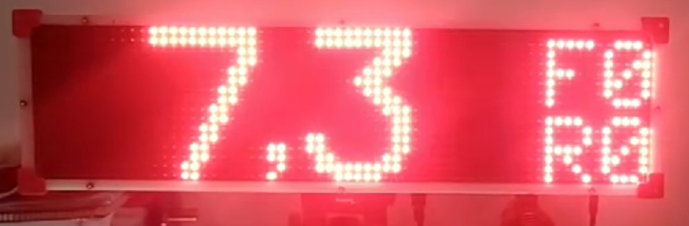
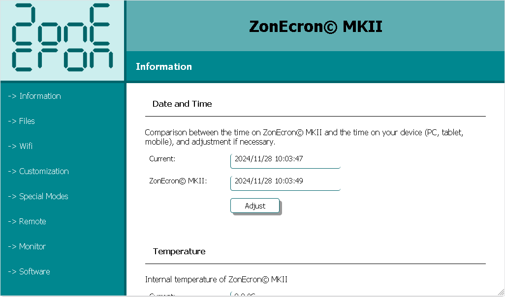
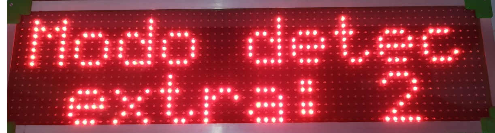
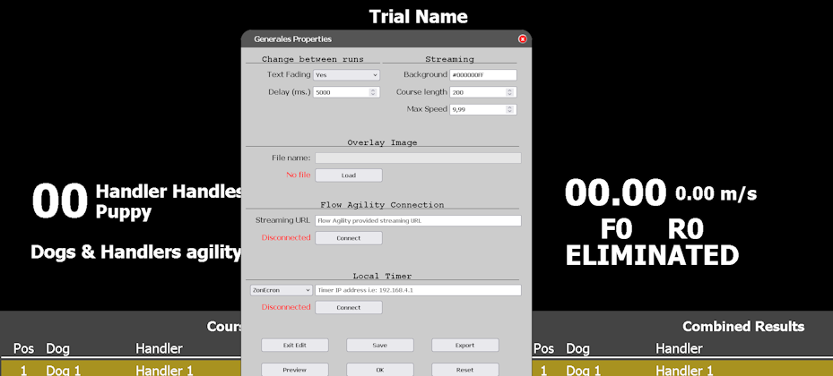

# ZonEcron Scoreboard
## User Manual

1. [Introduction](#1-introduction)
   - [1.1 Technical Specifications](#11-technical-specifications)
   - [1.2 Key Features](#12-key-features)
   - [1.3 Components](#13-components)
   - [1.4 Setup and Power Supply](#14-setup-and-power-supply)
2. [Display](#2-display)
   - [2.1 General Description](#21-general-description)
   - [2.2 External/Internal Buzzer](#22-externalinternal-buzzer)
   - [2.3 Communication with ZonEcron Ecosystem](#23-communication-with-zonecron-ecosystem)
   - [2.4 Display Operating Modes](#24-display-operating-modes)
     - [2.4.1 Timer Mode](#241-timer-mode)
     - [2.4.2 Start Mode](#242-start-mode)
     - [2.4.3 Track Recognition Mode](#243-track-recognition-mode)
     - [2.4.4 Games Mode](#244-games-mode)
   - [2.5 Message Display](#25-message-display)
     - [2.5.1 Initial Messages](#251-initial-messages)
     - [2.5.2 Sensor Battery](#252-sensor-battery)
     - [2.5.3 Sensor Error Messages](#253-sensor-error-messages)
     - [2.5.4 Screensaver](#254-screensaver)
     - [2.5.5 Custom Messages](#255-custom-messages)
   - [2.6 Limits](#26-limits)
3. [Embedded Web Server](#3-embedded-web-server)
   - [3.1 Description](#31-description)
   - [3.2 WiFi Networks](#32-wifi-networks)
     - [3.2.1 Connecting to the Scoreboard's WiFi Network](#321-connecting-to-the-scoreboards-wifi-network)
     - [3.2.2 Changing Name, Password, and Security](#322-changing-name-password-and-security)
     - [3.2.3 Recovering WiFi Credentials](#323-recovering-wifi-credentials)
     - [3.2.4 Connecting the Scoreboard to an External WiFi Network](#324-connecting-the-scoreboard-to-an-external-wifi-network)
   - [3.3 Web Pages](#33-web-pages)
     - [3.3.1 Info](#331-info)
     - [3.3.2 Files](#332-files)
     - [3.3.3 WiFi](#333-wifi)
     - [3.3.4 Customization](#334-customization)
     - [3.3.5 Special Modes](#335-special-modes)
     - [3.3.6 Remote Control](#336-remote-control)
     - [3.3.7 Monitor](#337-monitor)
     - [3.3.8 Software](#338-software)
     - [3.3.9 Streaming](#339-streaming)
4. [Contact](#4-contact)

---

## 1. Introduction

### 1.1 Technical Specifications
**General**
- 16x64 high-brightness LED screen, displaying up to 999.99s, faults, and refusals.
- Power supply: 230V ±10% 50Hz
- Dimensions (without tripod): 66cm x 18cm x 12cm
- Weight: 5kg

**Time control**
- 16 MHz XO quartz crystal clock signal.
- Maximum resolution: 0.001s.
- Average deviation over 24 hours: ±20 ppm. (±0.07 s/h)
- Accuracy of the system with [ZonEcron Original](./original.md) (timer + cells): from +0ms to +2ms.
- Accuracy of the system with [bars](./sensorBars.md) or [invisible](./invisible.md) (timer + cells): from +0ms to +6ms.

**Web server**
- Up to 4 simultaneous users.
- Real-time clock with TCXO ±2ppm for date and time with a replaceable battery for 10 years.
- 2.4GHz wireless communication.
- Memory: 350 KB FLASH approx. 3000 result logs, including date and time.

---

### 1.2 Key Features
- Millisecond resolution for times under 10 seconds, centisecond resolution for times 10 seconds or greater.
- On-screen indicators for faults (maximum 9), refusals, and disqualification.
- On-screen alerts for misaligned photocells.
- Real-time clock with date and time.
- Internal temperature measurement.
- Customizable screensaver (add your club name, why not?).
- Webpage control from smartphone/tablet/PC.
- Countdown for track recognition, with pause and adjustable in 1-minute steps.
- 15-second countdown for starts in high-level competitions.
- Compatible with gambler and snooker, including acoustic signal.
- Multiple passes through the same cell for complex courses.
- Interface color customization anytime.
- Custom messages displayed for a defined period.

---

### 1.3 Components

The ZonEcron Scoreboard includes:
- A LED display.
- A tripod to hold the display.
- A standard power cable (230V 50Hz).
- A carrying case for convenient transport.
- Depending on the model, an internal or external buzzer/siren.

**Important Note**: Ensure you have a set of ZonEcron wireless cells (original or invisible) configured to communicate with the display.

---

### 1.4 Setup and Power Supply

Setting up the ZonEcron Scoreboard is simple, but here are some tips for a perfect setup:

1. **Start with the tripod**:
   - Open and extend the legs. Secure them with the wingnuts and ensure the tripod is stable on the ground.
   - If you don’t need much height or it’s a windy day, avoid extending the thinnest part of the legs. You can also hang a weight from the bottom hook for extra stability.
   - If the ground is uneven, adjust the legs and use the tripod's bubble levels to ensure the head is horizontal.
   - Certain movements of the tripod have been intentionally restricted to improve stability and prevent the display from falling. The tripod head can only rotate vertically to orient the display. Loosen the rotation with the side knob.

2. **Attach the display to the tripod**:
   - Open the locking wingnut at the top of the tripod.
   - Fit the square base of the display into the tripod mount until it is secure.
   - Close the wingnut and check that everything is firmly attached.

   **Caution!** Do not attempt to move the tripod with the display attached, as you might damage the mounting base. If you need to relocate, detach the display first and then move the tripod.

3. **Connect the power cable**:
   - Plug the cable into the display first, then into a power outlet.
   - If you use an extension cord, leave enough slack to avoid strain in case of accidental pulls.

4. **Turn on the display**:
   - Press the switch at the bottom of the display.
   - If everything is correct, the switch will light up, and in less than 2 seconds, initial messages will appear on the display. Refer to section [2.5.1](#251-initial-messages) for details.
   - If the switch does not light up, the issue is likely with the fuse integrated into the display's power socket. Open the fuse compartment. New scoreboards always include a spare fuse inside the compartment, separated from the active fuse. Replace it and try again.

---

## 2 Display

### 2.1 General Description

The ZonEcron scoreboard is designed with functionality and durability in mind, but also with user convenience. Here are its main features:

- **Material**: The main structure is made of plastic, ideal for facilitating radio communications. The corners are fitted with 3D-printed parts with rounded edges to avoid sharp edges.
- **Maintenance**: No maintenance is required, except for external cleaning with a damp cloth. If internal components need to be accessed, the front and back panels can be removed by unscrewing the screws on the edges and corners. The panels are sealed with silicone to prevent rainwater from entering. This seal can be easily removed, but new silicone will need to be applied after the panels are opened.
- **Ventilation**: Equipped with two grids; one has a fan that extracts hot air from inside, while the other allows cool air to enter, preventing the electronics from overheating.
- **Bottom Section**:
  - Power socket with switch and fuse.
  - Mounting slot for attaching the display to the tripod.
  - In versions with an external buzzer, you’ll find the slot for attaching it and the connector.

---

### 2.2 External/Internal Buzzer

The buzzer will emit acoustic signals in the following cases:
- **End of track recognition time**: It will emit short, intermittent beeps for 8 seconds.
- **Games snooker mode**: When the configured opening time is reached, it will emit a beep for the configured duration.
- **Games gambler mode**: It will beep when the opening time ends and again when the closing time is reached, for the configured duration.

**Note!** For track recognition, the buzzer will always emit an intermittent sound, like an alarm clock. For games modes, the signal sent to the buzzer will be continuous, but some buzzer models integrate the alternation into their electronics. If you want to use your own buzzer, ensure it operates at 12V and consumes less than 0.5A.

---

### 2.3 Communication with ZonEcron Ecosystem

All ZonEcron ecosystem devices are preconfigured to connect automatically with each other. Each set is uniquely coded to avoid interference between nearby rings. Therefore, elements of one set will only communicate with each other, and it will not be possible to use the cells of one set with the scoreboard of another.

The **power-on order** doesn’t matter; it doesn’t matter if you turn on the display, the cells, or the backpack first – everything will connect automatically. However, we recommend turning on and aligning the cells before turning on the display to correctly view the battery levels in the initial messages. Refer to section [2.5.1](#251-initial-messages) for more details.

Additionally, in the [**ZonEcron Original**](./original.md), the time will disappear from the cell's small display and will instead show the battery level by lighting up the 4 dots on the display as follows:
- 100% to 81% -> 4 dots.
- 80% to 61% -> 3 dots.
- 60% to 41% -> 2 dots.
- 40% to 21% -> 1 dot.
- 20% to 0% -> Display off.

---

### 2.4 Display Operating Modes

#### 2.4.1 Timer Mode

This is the main mode of the ZonEcron scoreboard, where the following is displayed:

- **Time**: Displayed prominently.
- **Faults and Refusals**: On the right side, with an "F" and "R" in front of the numbers. If "eliminated" is marked, these are replaced by "ELI," but the timer will continue to run to allow corrections or record the competitor's final time.

Display showing running time.

**Time display**:
- When the time is running: One decimal (updated every tenth of a second).
- When the time is stopped:
  - Milliseconds if under 10 seconds.
  - Hundredths if 10 seconds or more.

**Maximum time**: When the time exceeds 100 seconds (rare in a normal agility course), the numbers narrow to display five digits in total. The maximum time displayed this way is 999.99 seconds. The full time can be viewed on the web on the [remote control](#336-remote-control).

---

#### 2.4.2 Start Mode

In this mode, the screen displays a countdown (seconds and tenths) set beforehand, typically 15 seconds.

The timer operator must reset the scoreboard before each competitor using the [controller](#336-web-controller). Then, at the judge's signal, the pre-set countdown must be started. After this:
- If the dog breaks the cell during the countdown, the timer starts normally.
- If the countdown reaches 0 without breaking the cell, the timer starts regardless, ignoring the first pass through the cell.

---

#### 2.4.3 Track Recognition Mode

This mode displays a countdown in minutes and seconds for track recognition. By default, it starts at 7 minutes, but the time can be adjusted in 1-minute steps while paused or running:
- **Important**: In this mode, the cells have no effect.
- **At the end of the countdown**:
  - The message "Time's Up" is displayed.
  - An intermittent beep sounds for 8 seconds.

---

#### 2.4.4 Games Mode

This mode is designed for the "snooker" and "gambler" games in the WAO (World Agility Open).

- **Snooker**: Normal timing until the configured time is reached, at which point a signal sounds (the duration of this signal is configurable).
- **Gambler**:
  - The time remains hidden behind the message "Tempus Fugit."
  - When the opening time is reached, the first buzzer sounds, and the timer is shown running normally.
  - When the closing time is reached, the second buzzer sounds (available only in gambler mode).
  - In either phase, if the cell is triggered before the set time, the elapsed time is displayed, and the buzzer does not sound.
  - The second buzzer can be disabled by setting the closing time to 0 seconds.

Example of gambler mode with an opening time of 30s and a closing time of 12s:
- At the start of the run, the timer is hidden, displaying "Tempus Fugit" on the screen.
- After 30s of running, the first buzzer sounds, and the timer is displayed running normally.
- At 42s of running (12s after the opening time), the second buzzer sounds.

**TIP**: If the environment is noisy, consider reinforcing the acoustic signal with a whistle or other manual alert.

---

## 2.5 Message Display

### 2.5.1 Initial Messages

When you turn on the ZonEcron scoreboard, four messages will appear on the screen within the first few seconds:
1. Brand and model.

2. Club name (configured screensaver).

3. Device time and date.

4. WiFi network name (own or external) and IP address.

If any cell detects a passage during these messages, they will be interrupted, and the timer will automatically switch to the main screen and start counting. Therefore, if you need to review the time, date, or network data, it is better to turn on the cells after viewing all the messages.

Pay special attention to messages 3 and 4: ensure the date and time are correctly configured [see section 3.3.1](#331-info) and remember the WiFi network and assigned IP to manage the web server [see section 3.2](#32-connect-to-the-server).

---

### 2.5.2 Sensor Battery

When turning on a pair of cells for the first time, the battery percentage of the receiver will be displayed. The battery level of the transmitter will also be shown if it is properly aligned with the receiver. If you want to check the battery status later without turning everything off and on again, you can do so via the web interface [see section 3.3.1](#331-info).

---

### 2.5.3 Sensor Error Messages

If a sensor becomes misaligned (except in track recognition mode), an alarm message will appear indicating the affected sensor. If the timer is running, it will continue to count but will not display the time until the sensor is properly aligned.

---

### 2.5.4 Screensaver

If the timer remains stopped for more than 2 minutes, the screensaver will activate. This will display scrolling text alternating with the current time every 10 seconds. You can configure the text to display [see section 3.3.4](#334-customization).

---

### 2.5.5 Custom Messages

You can configure custom messages on two lines, with up to 10 characters per line. [Section 3.3.4](#334-customization) explains how to do this. These messages will only be displayed when the timer is stopped and will disappear if a reset command is sent or if any cell detects a passage.

---

### 2.6 Limits

- The timer can measure more than 1,000 seconds, but the display can only show up to 999.99 seconds. For longer times, refer to the web pages of the [remote control](#336-remote-control) or the [monitor](#337-monitor).
- The maximum number of faults the scoreboard can register is 9.
- The maximum number of refusals it can register is 2. From the third refusal onwards, it will display as eliminated.

---

## 3 Embedded Web Server

### 3.1 Description

The ZonEcron scoreboard includes a built-in web server that allows you to check, configure, and control the timer from any device with WiFi connectivity (smartphone, tablet, PC) without needing additional software. This web server can connect to an existing WiFi network or create its own WiFi network, so no Internet connection is required.

---

### 3.2 WiFi Networks

#### 3.2.1 Connecting to the Scoreboard's WiFi Network

When you turn on the ZonEcron scoreboard, if no other network has been configured (e.g., the first time you turn it on), it will create its own WiFi network. Each scoreboard comes with a unique network name and password:

  - **Network Name**: ZonEcronXXXXXXXXXXXX
  - **Password**: XXXXXXXXXXXX

Where "XXXXXXXXXXXX" are numbers and uppercase letters from A to F. Therefore, when searching for and finding the network, you already know the password... you and everyone else... so as soon as possible, change the password (and network name) as explained in [section 3.3.3](#333-wifi).

Connect to this WiFi network, and once connected:

1. Your device may warn you that the network has no Internet connection (obviously). Ensure you stay connected.

2. **Important Note**: Some smartphones have a "WiFi+" feature (or similar) that automatically switches to mobile data if the WiFi network has no Internet. Disable this feature to avoid issues.
3. Open a web browser (Chrome, Firefox, etc.) and enter the address `http://192.168.4.1`. This will take you to the scoreboard's main web page, where you can view its status [see section 3.3.1](#331-info).

---

#### 3.2.2 Changing Name, Password, and Security

We recommend changing the default network name and password by following the instructions in [section 3.3.3](#333-wifi). This is important to secure your device, just as you would with your home router.

For official competitions, avoid using the WiFi network generated by the display. The server is simple, and its only protection is the network password. In such cases, connect the display to a robust WiFi network created by a suitable router for crowded environments or, as a last resort, disable WiFi.

---

#### 3.2.3 Recovering WiFi Credentials

Forgot your ZonEcron display's network password? Don't worry, there is a simple procedure to reconnect to the display:

1. Turn off the ZonEcron display and the cells.
2. Create a hotspot (WiFi sharing) on your smartphone named "**Recuperame**" (Spanish for "recover me") with the password "**Admin1234**" (case-sensitive).

3. Turn on the ZonEcron display.
4. Wait for it to connect to the "**Recuperame**" network (your smartphone's).
5. The ZonEcron display screen will show the network name ("Recuperame") and the IP address assigned by your smartphone.
6. Access that IP address from your smartphone's browser to reconfigure the name and password of the network created by the ZonEcron display as explained in [section 3.3.3](#333-wifi).

**Can't access?**:
- If "Recuperame" doesn't appear on the screen, it means the display did not connect to the network shared by your smartphone. Ensure the network name and password are entered correctly (case-sensitive) and that your smartphone is creating a 2.4GHz network. Newer 5GHz networks are not compatible.
- If the "Recuperame" network appears, ensure it is your network and not one being generated by another smartphone in the area.
- If you still can't access it, contact us for personalized support at [ZonEcron@gmail.com](mailto:ZonEcron@gmail.com?subject=Connection%20issues).

---

#### 3.2.4 Connecting the Scoreboard to an External WiFi Network

1. When turning on the display, check the WiFi network and IP in the [initial messages](#251-initial-messages).
2. Connect your smartphone/tablet/PC to the same WiFi network. If it is the network created by the display, follow the steps in [section 3.2.1](#321-connect-to-the-displays-wifi-network).
3. Access the web page with the [WiFi settings](#333-wifi).
4. In the "Connect to Another Wi-Fi Network" section, make sure it is enabled; if not, enable it.
5. In the dropdown menu of that section, select the WiFi network you want the display to connect to and enter and confirm the password.
6. When you click apply, a warning will appear; after accepting it, the web server will restart.
7. Watch the messages on the screen to verify that it has connected to the WiFi network you configured. If not, repeat the steps, ensuring the password is entered correctly.
8. **Important**: The password cannot contain special characters, a backslash ( \ ), or a semicolon ( ; ). The WiFi network must be 2.4GHz. Newer 5GHz networks are not supported.

**TIP**: To avoid missing messages on the screen while the timer may start, configure this with the cells turned off.

Watch the video (Activate subtitles in your preferred language, as the audio is in Spanish):  
[Watch the video on YouTube](https://youtu.be/FqYA5eCeje0) 

---

### 3.3 Web Pages

When you access the ZonEcron display's web page, the main page will be the "Info" tab. Depending on whether you access it from a smartphone or a PC, the tabs will appear at the top or on the left side, respectively. Each tab provides different options for configuring the display or simply checking certain information.

---

#### 3.3.1 Info

In this section, you can:

- **Synchronize date and time**: Adjust the timer's date and time to match your device's by simply pressing the button.
- **Check internal temperature**: Very useful to ensure everything is functioning correctly.
- **View cell status**: If they are turned on, you can check the battery percentage of each.
- **View the version information of your display**.

Information page:

---

#### 3.3.2 Files

In this tab, you can manage the files stored on the ZonEcron display's server. Of particular note are the **time logs**, which are files named `cronoLog#.txt` containing time records. Here, `#` is a number from 0 to 3. Click on them to view and check all the times recorded by the display.

- **File list**: Shows a list of all files, and at the end of the list, the total space occupied and available. This server is very lightweight, using only a few KB.
- **Upload files**: This option should not be used under normal circumstances. For this reason, we do not share the necessary key here. If you ever need it under our guidance, we will provide the key. One example might be replacing the ZonEcron logo with that of your association, but the file must meet certain requirements, so we will request to review it before uploading it.
- **Delete files**: Same as above.
- **Delete time logs**: By entering the key "disturbingLackOfFaith," the server will delete all **time logs** and start recording from scratch. This can be useful if you don't want to keep records from a previous competition when starting a new one, but generally, it is unnecessary as the display will overwrite the oldest logs to avoid running out of space.

**TIP**: If you have multiple **time logs**, the current one the display is writing to will be the smallest in size.

Example of time logs: 

---

#### 3.3.3 WiFi

The ZonEcron display can create its own WiFi network or connect to an existing one. By default, it will remember the last network used and attempt to connect to it. If unsuccessful, it will create its own WiFi network.

In this tab, you can manage the WiFi network created by the display and/or the one it should connect to. Only one mode (own network or external network) will be active at a time. Although it is possible to enable both simultaneously for temporary configuration changes, we do not recommend operating with both modes active as it may cause connection issues.

- **Create own WiFi network**: Enable or disable the network and change the name and password as needed. This is useful for WiFi recovery.
- **Connect to an existing network**: Scan available networks and select the one to connect to. It also shows the signal quality once connected.
- **Restart**:
  - **Restart**: This option will turn the server (not the display) off and back on, cutting all active WiFi connections.
  - **Reset**: This option will clear the WiFi settings and restore factory defaults, followed by a server restart as in the previous option.

As mentioned, this server is very compact and has limited capacity. We recommend a maximum of 3 simultaneous users for smooth connections.

**TIP**: If you disable both modes (own network and external network), the ZonEcron display will be left without WiFi (cells will still function) until restarted. This can be useful if you suspect malicious interference.

---

#### 3.3.4 Customization

Here you can adjust various aspects to tailor the ZonEcron scoreboard to your needs:

- **Club**: Configure two lines of text with up to 10 characters each, typically the name of your club. This text will be used as a screensaver when the scoreboard has been idle for more than 2 minutes.
- **Temporary messages**: Define messages that will appear on the screen while the timer is stopped. You can set their duration or leave them indefinite (time 0). These messages will disappear if the timer is reset or a cell detects a passage.
- **Colors**: Change the colors of the web interface. Changes are immediately visible but will not be saved until you confirm. Avoid combinations that might be unpleasant to the eye. For example:

---

#### 3.3.5 Special Modes

In this section, you can configure special modes for competitions or training:

- **Games**: Configure parameters for running a games round as explained in [section 2.4.4](#244-games-mode).
- **Multiple detections**: Set up extra detections needed for the timer to stop and display the frozen time during intermediate detections while the timer continues running.
- **Start time**: Activate the start mode and configure the start time (default is 15 seconds) to operate as explained in [section 2.4.2](#242-start-mode).

When applying the Games mode or Multiple Detection mode, a confirmation message will be displayed on the screen (if the timer is stopped):  

- Games mode:  
  

- Multiple detection mode:  
  

---

#### 3.3.6 Remote Control

From this screen, the timer operator can manage (from their smartphone, for instance) the main timer functions, including:

- Marking faults, refusals, and eliminations.
- Resetting the timer.
- Activating the course recognition mode and adjusting its time.

Remote control on a mobile:

The remote also displays the time running, the low battery status or misalignment of the cells, and the last 5 results at the bottom for quick reference by the track team.  

Some rules:

- **Start refusals**: If the timer is reset, marking a refusal will start the timer and ignore the first cell passage. (If the timer is not reset, the refusal will be added to the result displayed on the screen).
- **Corrections**: You can correct faults, refusals, and eliminations even after the course is finished.
- **Reset**: This button is active only for 5 seconds after a course ends or when the competitor is eliminated, to avoid accidental resets (which cannot be undone).

---

#### 3.3.7 Monitor

The monitor screen displays the same information as the remote control but without buttons. It is ideal for public-facing video scoreboards, as it can also display the club's logo as a background.

---

#### 3.3.8 Software

In this section, you can configure the scoreboard's connection to third-party software via websocket. Although initially designed to communicate with the [FlowAgility](https://www.flowagility.com/) platform, the scoreboard can connect to any software with a websocket server using the message protocol [described here](https://github.com/ZonEcron/ZonEcron-Interfacing/blob/main/WebsocketClient.md#4-mode-meanings-and-examples).

Note that to connect the scoreboard in this way, it must be connected to an external WiFi network, as described in [section 3.2.4](#324-connect-the-scoreboard-to-an-external-wifi-network). Additionally, if the software is an online platform such as FlowAgility, the external WiFi must have internet access.

This page includes:

- **Software address**: This section contains the data needed to connect to the FlowAgility platform (and eventually, other third-party software):
  - URL: The address the scoreboard should try to connect to. This address must be provided by the software you want to connect to.
  - MAC address: The MAC address of the scoreboard. FlowAgility requires this address to generate the connection URL mentioned above.
  - Lastly, there is an indicator showing the current connection status.
- **Serial & WS client connection log**: Displays messages coming from the timer and third-party software. This log has a maximum of 5000 characters, so older messages will be deleted to show the most recent ones once the limit is reached. Additionally, this log is not saved; if the webpage is left or refreshed, the log will start from scratch.
- **DANGER ZONE - KEEP AWAY BUTTERFINGERS**: In this section, which is not recommended to use unless you know what you are doing, pressing the button will reveal these fields:
  - SSL: To use secure websocket connections (wss) or normal ones (ws).
  - Port: To change the port of the server the scoreboard should connect to.
  - Extra Info: To display additional information in the log.

---

#### 3.3.9 Streaming

This screen is not directly accessible through the menu, but it can be viewed in the file list.

It is designed to be captured by streaming programs to display the count in real time.  

If you need something more sophisticated or customizable, you can use [our customizable HTML](https://github.com/ZonEcron/FlowAgilityStreamingInfo). It is designed to connect with FlowAgility as well, but this is not mandatory, and unused information can be hidden. Customize it to your liking and connect it to the scoreboard for an impressive streaming/videowall setup.  
  

--- 

## 4 Contact

For technical support, questions, or suggestions, contact us via email: [ZonEcron@gmail.com](mailto:ZonEcron@gmail.com?subject=ZonEcron%20Scoreboard).
