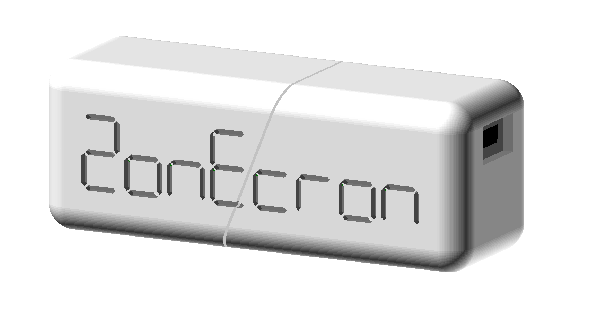

# ZONECRON MOCHILA + APP
## Manual de Usuario

### Contenidos

1. [Introducción](#1-introducción)
2. [Preparativos](#2-preparativos)
   - [2.1 Ventana "No cerrar"](#21-ventana-no-cerrar)
   - [2.2 Antes de comenzar](#22-antes-de-comenzar)
3. [Conexiones y accesibilidad](#3-conexiones-y-accesibilidad)
   - [3.1 Conexión con la Mochila de Zonecron](#31-conexión-con-la-mochila-de-zonecron)
   - [3.2 Conexión con Flowagility](#32-conexión-con-flowagility)
   - [3.3 Acceso desde otros dispositivos en la red](#33-acceso-desde-otros-dispositivos-en-la-red)
4. [Pantallas y manejo](#4-pantallas-y-manejo)
   - [4.1 Manejar el crono desde la aplicación](#41-manejar-el-crono-desde-la-aplicación)
   - [4.2 Mostrar el crono en una pantalla](#42-mostrar-el-crono-en-una-pantalla)
   - [4.3 Turno](#43-turno)
   - [4.4 Pantallas de Streaming](#44-pantallas-de-streaming)
   - [4.5 Personalizar Streaming](#45-personalizar-streaming)
5. [Misceláneos](#5-misceláneos)
   - [5.1 Múltiples cronos](#51-múltiples-cronos)
   - [5.2 Información](#52-información)
   - [5.3 Salir de la aplicación](#53-salir-de-la-aplicación)

---

## 1 Introducción

El ZonEcron©, y cuando decimos ZonEcron© queremos que imaginéis luces de neón y fuegos artificiales al fondo (vale, esta parte me la voy a saltar el resto del manual que si no se va a hacer muy largo), como decía, el ZonEcron© se ideó para cubrir la necesidad de cronometrar el tiempo de ejecución de zonas (pasarela, empalizada y balancín) y lógicamente, también permitiría cronometrar secuencias cortas para determinar qué opción es mejor.

Añadir un dongle para poder gestionar el crono desde un ordenador era una evolución lógica. El marcador ZonEcron© ya dispone de su propio servidor web que hacen redundante el uso de esta mochila con la app, por lo que en caso de disponer de un marcador ZonEcron© esta mochila con la APP son una forma redundante de comunicar con el crono.

La APP se puede descargar [aquí](https://zonecron.github.io/ZonEcronGW/).

---

## 2 Preparativos

## 2.1 Ventana "No cerrar"

1. Al arrancar la aplicación, se abre una ventana que no se debe cerrar. En la propia ventana aparece en inglés "DO NOT CLOSE THIS WINDOW".
2. Es posible teclear una serie de comandos en esa ventana para hacer pruebas o buscar fallos. En esa ventana, teclea "HELP" y presiona la tecla intro para más información.
3. Los comandos y las respuestas en esa ventana están en inglés. Solamente se traducen al idioma configurado por defecto el manual y la ayuda.

---

## 2.2 Antes de comenzar

1. Al arrancar la aplicación, también debería abrirse un navegador (Firefox, Chrome, ...) con la página web que contiene este manual. Si no se abre, puede ser debido a restricciones de seguridad de la máquina en la que se esté ejecutando la aplicación. En tal caso, hay que abrir un navegador y teclear la siguiente dirección: 
    - http://localhost:8080
2. Puede que haya que probar diferentes puertos entre el 8081 y el 8100 si al ejecutar la aplicación el 8080 ya estaba ocupado: 
    - http://localhost:8081 
    - http://localhost:8082
    - ...
3. En la esquina superior derecha se puede cambiar el idioma para la sesión actual, pero no se cambiará el idioma por defecto.
4. El menú de la izquierda dispone de 4 opciones: "Información", "Conectar", "Mandos" y "Pantallas". Al hacer clic, por ejemplo, en la sección "Información" aparece el submenú con otras 4 opciones: "Manual", "Sistema", "Tiempos" y "Licencia". Al hacer clic, por ejemplo, en "Sistema", redirige a la web con las opciones de configuración del idioma por defecto (para no tener que cambiar el idioma cada vez que se inicia la aplicación) y demás información del sistema. De aquí en adelante, la referencia a cada sección se representará de forma abreviada. Este ejemplo se abrevia como: **Información -> Sistema**.
5. Es necesario que el ordenador reconozca la mochila ZonEcron al conectarla. Normalmente debería sonar un tono al conectar cualquier dispositivo USB. Si no es así, será necesario instalar los drivers para el chip CH340G. Esta es la web del fabricante: https://www.wch-ic.com/downloads/CH341SER_ZIP.html .
6. Para los siguientes pasos, es necesario que la mochila esté desconectada del ordenador hasta que se indique lo contrario.
7. Si se pretende conectar con la plataforma FlowAgility, hay que asegurarse de que el ordenador tiene acceso a internet, por ejemplo, navegando a alguna página web de noticias.

---

## 3 Conexiones y accesibilidad

## 3.1 Conexión con la Mochila de Zonecron

1. Para conectar la mochila con la aplicación hay que pinchar en el menú de la izquierda **Conectar -> Mochila**.
2. La sección "puerto serie" dispone de un desplegable con los puertos serie que tiene el ordenador. Hay que fijarse bien en cuáles son.
3. Se conecta la mochila ZonEcron al ordenador.
4. Se pincha en refrescar y se mira de nuevo los puertos serie que aparecen. La mochila será el nuevo puerto que antes no estaba.
5. Se pincha en conectar y aparecerá un mensaje en gris "Abierto. Esperando señal de la mochila". Si todo va bien, al de dos o tres segundos se pondrá en verde claro indicando "Mochila encontrada. Esperando señal del crono".
6. Al arrancar o parar el crono cortando el haz de las células, el mensaje debería cambiar a "Mochila y crono verificados." en verde intenso. Si no es así, hay que repasar todo el proceso de conexión.

---

## 3.2 Conexión con Flowagility

1. Seleccionando en el menú de la izquierda **Conectar -> FlowAgility**.
2. Hay que copiar los 12 caracteres de la dirección MAC.
3. En la página de FlowAgility https://FlowAgility.com , después de iniciar sesión, hay que acceder a la prueba donde se dispone de acceso a nivel de organizador. 
4. Hay que seleccionar el ícono para la gestión del crono en la parte superior. Una vez ahí, en la casilla correspondiente, hay que pegar la dirección MAC copiada anteriormente y darle a "Pair with timer".
5. La página cambiará y habrá una URL parecida a: "flowagility.com/ws/timer/123456ABCDEF". Hay que copiar esa URL.
6. De vuelta a la página **Conectar -> FlowAgility**, en la casilla "URL" hay que pegarla y darle a conectar.
7. Si todo está correcto, debería aparecer el mensaje "Conectado." en verde. Si no es así, hay que repasar todo el proceso desde el punto 2. Ojo, al copiar no se haya incluido algún espacio en blanco antes o después del texto; tampoco hay que poner "https://" ni "www", solamente copiar la URL indicada.
8. Una vez conectado, en la página de FlowAgility, también debería aparecer el crono como conectado. Si no es así, hay que refrescar la página.
9. Se puede probar a arrancar y parar el crono, y debería arrancar y parar en la página de FlowAgility. También se puede probar a resetear el crono desde la página de FlowAgility y comprobar que el crono efectivamente se haya reseteado. 
10. Ya está establecida la comunicación en ambas direcciones.

---

## 3.3 Acceso desde otros dispositivos en la red

1. Esta aplicación hace que el ordenador en el que se ejecuta actúe como servidor web local. Por lo tanto, se puede acceder a las paginas web desde cualquier otro equipo (PC, tablet, móvil) que esté en la misma red informática.
2. Para acceder desde otro equipo, basta con abrir un navegador web (Firefox, Chrome, ...) y teclear la dirección que aparece en **Información -> Sistema** en la sección "Acceso web" en la línea "Desde otros equipos en red".
3. Así, **por ejemplo**, es posible:
    - tener el ordenador apartado en una mesa con la mochila conectada y la aplicación corriendo sin nadie atendiendolo
    - marcar faltas y rehúses desde un móvil a pie de pista 
    - mostrar el tiempo, faltas y rehúses en una televisión en la entrada del ring

---

## 4 Pantallas y manejo

## 4.1 Manejar el crono desde la aplicación

1. Se puede manejar el crono desde la aplicación pinchando en la sección **Mandos -> Crono** en el menú de la izquierda.
2. En el ejemplo anterior, esto sería lo que se abre en el teléfono móvil.
3. El mando resulta bastante intuitivo. Se puede subir y bajar faltas y rehúses, eliminar y deseliminar, marcar tiempos de reconocimiento, ...
4. Solo cabe destacar que, para poder resetear el crono, primero el binomio tiene que estar eliminado. Esto es así para evitar un reset involuntario, ya que un reset no se puede deshacer.
5. Si la aplicación se ha conectado a FlowAgility, no se necesita este mando, ya que usar ambas opciones a la vez (mando y FlowAgility), puede provocar errores al anotar los resultados.

---

## 4.2 Mostrar el crono en una pantalla

1. Seleccionando en el menú de la izquierda **Pantallas -> Monitor**.
2. En el ejemplo anterior, esto sería lo que se abre en el navegador web de una smart TV.
3. Esta página está pensada para mostrar el tiempo de cara al público en un monitor/televisión medianamente grande que permita leer la información desde cierta distancia.
4. Aparecerá el tiempo del crono corriendo, así como las faltas y rehúses que lleguen desde el mando o la plataforma FlowAgility.
5. Abajo del todo, hay dos selectores para cambiar el color del fondo y del texto por si se quiere dar un aspecto más festivo o corporativo. Recomendamos usar colores que tengan un buen contraste entre ellos.

---

## 4.3 Turno

1. Esta funcionalidad es un bonus que nada tiene que ver con el crono en sí. La idea es similar al ejemplo del crono, donde, desde un móvil, se va indicando el número de perro en pista y en un monitor o televisión aparte se muestra ese número en gran formato.
2. El mando para esta función está ubicado en el menú de la izquierda, en la sección **Mandos -> Turno**. Es posible manejar la indicación del número de perro que está en pista, así como la altura actual de salto en número: 20 (XS en España), 30 (S), 40 (M), 50 (I) y 60 (L).
3. Para mostrar el turno de cara al público, mostraremos en un monitor o smart TV la pantalla ubicada en el menú de la izquierda en **Pantallas -> Turno**. Esta información resulta muy útil para que los competidores puedan ver el número desde lejos y organizar sus tiempos de preparación.
4. Al igual que con la pantalla del crono, se pueden cambiar los colores del fondo y los números con los desplegables en la parte inferior.

---

## 4.4 Pantallas de Streaming

1. Las secciones **Pantallas -> Streaming** y **Pantallas -> Streaming FA** están pensadas para ser capturadas por programas de streaming.
2. Se diferencian en que la primera es una versión simplificada de la segunda para cuando no se utiliza FlowAgility, pero con las mismas opciones de personalización.

---

## 4.5 Personalizar Streaming

Dado que las pantallas dedicadas al streaming están especialmente elaboradas y son altamente personalizables, vamos a dedicar una sección solamente a explicar las posibilidades que ofrecen.

1. Haciendo doble clic en un punto vacío de la pantalla se abre la ventana general.
2. En esta ventana general se puede introducir manualmente la distancia del recorrido para mostrar el cálculo de velocidad en pantalla en tiempo real. La velocidad no se mostrará en ningún caso durante los primeros 5 segundos del recorrido. El campo de entrada "Max Speed" sirve para evitar mostrar velocidades demasiado altas. Si la aplicación está conectada a FlowAgility, la información de la distancia se actualizará automáticamente, si no, habrá que introducir la distancia manualmente en cada manga.
3. Desde esta ventana general, también se puede cargar una imagen de fondo que quedará almacenada con el resto de personalizaciones al guardar.
4. En la pantalla de "streaming FA", en esta ventana, aparecerá la opción de conexión a FlowAgility. Para que la información se actualice, será necesario ingresar la URL de conexión proporcionada por dicha plataforma en este menú y presionar el botón de conectar.
5. En la parte inferior de esta ventana general, hay un botón para entrar en modo edición. En este modo, se puede arrastrar y soltar cada texto (tiempo, faltas, nombre del perro,...) para posicionarlo donde interese. Al hacer doble clic sobre cada texto, se abre una ventana de propiedades donde se puede cambiar su tamaño, color, transparencia... Si alguna ventana está abierta, no se puede arrastrar y soltar nada, excepto la propia ventana. Es necesario cerrarla para poder arrastrar o editar otros textos.
6. Al activar la opcion "Hide" de un elemento, no se ocultará hasta salir del modo edición. En modno normal (no edicion) el elemento "Eliminated" y los elementos "Faults" y "Refusals" se mostaran alternativamente (uno u otro) en funcion a si el binomio ha sido eliminado o no. En modo edición se verán ambos para poder editarlos. Si, por ejemplo, se decide ocultar "Faults" y "Refusals" permanentemente activando la opcion "Hide", el elemento "Eliminated" mantendrá su comportamiento, en modo normal, haciendose visible solo cuando el binomio ha sido eliminado, y vice versa.
7. En el modo de edición, se pueden deshacer las últimas 100 acciones con Ctrl + Z o rehacer las últimas 100 acciones deshechas con Shift + Ctrl + Z.
8. Una vez que se ha terminado de personalizar, hay que hacer doble clic en un área vacía para mostrar la ventana general de nuevo y presionar el botón de salir del modo de edición.
9. En esa misma ventana, con el botón de guardar, se guardarán los ajustes realizados y se mantendrán aunque se cierre la página web y se abra más tarde.
10. Al presionar el botón de guardar, también sincronizará con esos ajustes todas las ventanas del **mismo navegador** que estén mostrando la esa misma página de streaming. Esta característica permite que el diseño de la ventana se pueda modificar en una ventana y, al guardar, se actualice en la ventana desde la que se está transmitiendo sin mostrar los menús y propiedades que se han ido abriendo para realizar las modificaciones.
11. En caso de error de comunicación con el cronómetro o la plataforma FlowAgility, se intentará una nueva conexión de forma continua con una pausa de 5 segundos entre intentos.
12. El botón Importar/Exportar te permite guardar la configuración en un archivo para hacer copias de seguridad o migraciones. La función de importación solo estará disponible en configuraciones nuevas o recién restablecidas. En caso de que no aparezca la opcion de importar, es necesario presionar el boton reset para reiniciar las configuraciones, dado que, cualquier cambio convertirá el botón de importación en exportación.
13. Algunos botones o acciones mostrarán una ayuda emergente al hacer clic o al pausar el ratón sobre el elemento durante un par de segundos.

---

## 5 Misceláneos

## 5.1 Múltiples cronos

1. Es posible ejecutar el programa varias veces si se dispone de varias mochilas con sus cronos para pistas simultáneas, por ejemplo.
2. En ese caso, cada ejecución de la aplicación creará un acceso diferente, que tendrá la misma dirección pero diferente puerto, por ejemplo: 
    - http://localhost:8080 
    - http://localhost:8081 
3. Los códigos necesarios para conectar con FlowAgility (dirección MAC) serán consecutivos.
4. Las páginas de las 8 primeras ejecuciones se abrirán con colores diferentes para poder diferenciarlas cómodamente. A partir del noveno, si es que alguna vez se llega a dar el caso, se abrirán con el color normal.

---

## 5.2 Información

1. En la web **Información -> Sistema** se puede:
   - Seleccionar el idioma por defecto.
   - Ver las direcciones para acceder a la aplicación desde el ordenador donde se ejecuta o desde otro dispositivo en la misma red que el ordenador. Si, por ejemplo, tienes el ordenador conectado a una wifi, y tu móvil también, puedes acceder a la aplicación desde el móvil poniendo en el navegador web la dirección que aparece en la sección "Acceso web" en la línea "Desde otros equipos en red".
   - Ver el estado de las baterías de las células ZonEcron.
   - Ver información básica de la mochila (aburrriiiiidooooooo).
   - Ver los últimos 10 tiempos que ha registrado el crono el día actual en orden inverso (el mas reciente primero) si la aplicacion ha estado conectada con la mochila.
2. En la web **Información -> Tiempos** están todos los tiempos que ha registrado el crono el día actual. También están los de días pasados en archivos de texto (uno por día) en la carpeta "logs" dentro de la carpeta de la aplicación.
3. En la web **Información -> Manual** se puede consultar este manual.
4. En la web **Información -> Acerca de** se puede leer la licencia de uso.

---

## 5.3 Salir de la aplicación

1. Para finalizar la aplicación basta con cerrar la ventana "NO CERRAR" o teclear en ella el comando "exit".
2. Todas las paginas web abiertas, en cualquier dispositivo, perderán la comunicación y dejarán de recibir información actualizada.
3. Todos los datos de configuración se guardarán. Si se ha establecido una comunicación exitosa con la mochila o FlowAgility también se guardará dicha configuración. La próxima vez que arranque la aplicación, intentará conectar automáticamente con la mochila y con FlowAgility usando esa configuración.
4. En jornadas diferentes la conexión con FlowAgility cambia por lo que no funcionará de un dia para otro.
