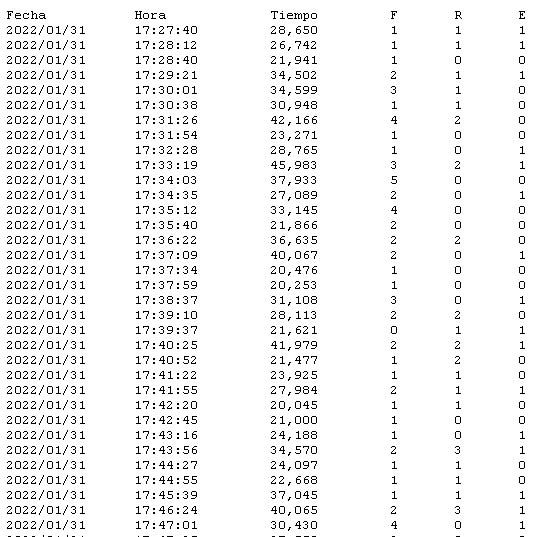
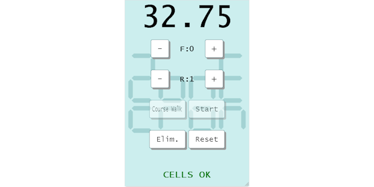

# Marcador ZonEcron
## Manual de Usuario

1. [Introducción](#1-introducción)
   - [1.1 Especificaciones técnicas](#11-especificaciones-técnicas)
   - [1.2 Funciones reseñables](#12-funciones-reseñables)
   - [1.3 Componentes](#13-componentes)
   - [1.4 Montaje y alimentación](#14-montaje-y-alimentación)
2. [Pantalla](#2-pantalla)
   - [2.1 Descripción general](#21-descripción-general)
   - [2.2 Zumbador externo/interno](#22-zumbador-externointerno)
   - [2.3 Comunicación con ecosistema ZonEcron](#23-comunicación-con-ecosistema-ZonEcron)
   - [2.4 Visualización modos de operación](#24-visualización-modos-de-operación)
    - [2.4.1 Modo cronometraje](#241-modo-cronometraje)
    - [2.4.2 Modo salida](#242-modo-salida)
    - [2.4.3 Modo Reconocimiento de pista](#243-modo-reconocimiento-de-pista)
    - [2.4.4 Modo Games](#244-modo-games)
   - [2.5 Visualización Mensajes](#25-visualización-mensajes)
     - [2.5.1 Mensajes iniciales](#251-mensajes-iniciales)
     - [2.5.2 Batería de los sensores](#252-batería-de-los-sensores)
     - [2.5.3 Mensajes de error de sensores](#253-mensajes-de-error-de-sensores)
     - [2.5.4 Salvapantallas](#254-salvapantallas)
     - [2.5.5 Mensajes personalizados](#255-mensajes-personalizados)
   - [2.6 Limites](#26-limites)
3. [Servidor web embebido](#3-servidor-web-embebido)
   - [3.1 Descripción](#31-descripción)
   - [3.2 Redes WiFi](#32-redes-wifi)
     - [3.2.1 Conectar a la red WiFi del marcador](#321-conectar-a-la-red-wifi-del-marcador)
     - [3.2.2 Cambio de nombre, contraseña y seguridad](#322-cambio-de-nombre-contraseña-y-seguridad)
     - [3.2.3 Recuperación de claves WiFi](#323-recuperación-de-claves-wifi)
     - [3.2.4 Conectar el marcador a una red WiFi ajena](#324-conectar-el-marcador-a-una-red-wifi-ajena)
  - [3.3 Páginas web](#33-páginas-web)
     - [3.3.1 Info](#331-info)
     - [3.3.2 Archivos](#332-archivos)
     - [3.3.3 WiFi](#333-wifi)
     - [3.3.4 Personalización](#334-personalización)
     - [3.3.5 Especiales](#335-especiales)
     - [3.3.6 Mando](#336-mando)
     - [3.3.7 Monitor](#337-monitor)
     - [3.3.8 Software](#338-software)
     - [3.3.9 Streaming](#339-streaming)
4. [Contacto](#4-contacto)

---

## 1. Introducción

### 1.1 Especificaciones técnicas
**Generales**
- Pantalla de 16x64 leds de alto brillo, con indicación de hasta 999,99s, faltas y rehúses.
- Alimentación 230V ±10% 50Hz
- Dimensiones (sin trípode): 66cm x 18cm x 12cm
- Peso 5kg

**Control de tiempos**
- Señal de reloj cristal de cuarzo 16 MHz XO.
- Resolución máxima 0.001s.
- Desviación media en 24 horas: ±20 ppm. (±0.07 s/h)
- Precisión del conjunto con [ZonEcron Original](./original.md) (marcador + células): de +0ms a +2ms.
- Precisión del conjunto con [barras](./sensorBars.md) o [invisible](./invisible.md) (marcador + células): de +0ms a +6ms.

**Servidor web**
- Hasta 4 usuarios simultáneos.
- Reloj de tiempo real con TCXO ±2ppm para fecha y hora con batería (reemplazable) para 10 años.
- Comunicaciones inalámbricas 2,4GHz.
- Memoria: 350 KB FLASH aprox. 3000 registros de resultados, incluyendo fecha y hora.

---

### 1.2 Funciones reseñables
- Resolución de tiempos de milésimas para tiempos menores a 10 segundos o centésimas para 10 segundos o más.
- Indicadores en pantalla de faltas (máximo 9), rehúses y eliminado.
- Aviso en pantalla de fotocélulas desalineadas.
- Reloj en tiempo real con fecha y hora.
- Medición de la temperatura interna.
- Salvapantallas personalizable (añade el nombre de tu club, ¡por qué no!).
- Manejo por página web desde móvil/tablet/PC.
- Cuenta atrás para reconocimiento de pista, con pausa y configurable en pasos de 1 minuto.
- Cuenta atrás 15s para salida para competiciones de alto nivel.
- Compatible con gambler y snooker, con señal acústica incluida.
- Múltiples pasadas por célula en recorridos enrevesados.
- Personalización de los colores de la interfaz web cuando quieras.
- Mensajes personalizados en pantalla durante un tiempo definido.

---

### 1.3 Componentes

El marcador ZonEcron se compone de:
- Una pantalla de leds.
- Un trípode para sujetar la pantalla.
- Un cable de alimentación estándar (230V 50Hz).
- Una maleta para transportarlo todo cómodamente.
- En función del modelo, un zumbador/sirena externo o interno.

**Nota importante**: Asegúrate de tener un conjunto de células inalámbricas ZonEcron (original o invisible) configuradas para que puedan comunicarse con la pantalla.

---

### 1.4 Montaje y alimentación

Montar el marcador ZonEcron es sencillo, pero hay algunos trucos para hacerlo perfecto:

1. **Empieza con el trípode**:
  - Abre las patas y desplégalas. Asegúralas con las palomillas y revisa que el trípode quede firme en el suelo.
  - Si no necesitas mucha altura o el día está ventoso, mejor deja el tramo más fino de las patas recogido. También puedes colgar un peso en el gancho inferior para darle más estabilidad.
  - Si el terreno no está nivelado, ajusta las patas y usa los niveles de burbuja del trípode para asegurarte de que la cabeza del trípode queda horizontal.
  - En el trípode se han bloqueado intencionalmente ciertos movimientos para mejorar la estabilidad y evitar caídas de la pantalla. La cabeza del trípode solo puede girar en torno al eje vertical para orientar la pantalla. Para ello afloja el giro con la ruleta que está en un lateral de la cabeza del trípode.

2. **Coloca la pantalla en el trípode**:
  - Abre la palomilla de cierre en la parte superior del trípode.
  - Encaja la base cuadrada de la pantalla en el alojamiento del trípode hasta que quede firme.
  - Empuja la palomilla para que se cierre y verifica que todo esté bien asegurado.

  **¡Ojo aquí!** No intentes mover el trípode con la pantalla colocada, o podrías romper la base de encaje. Si necesitas cambiar de lugar, desmonta la pantalla primero y luego mueve el trípode.

3. **Conecta el cable de alimentación**:
  - Enchufa el cable a la pantalla primero y después a una toma de corriente.
  - Si usas una alargadera, desenrolla bastante cable dejando holgura para evitar tirones en caso de tropiezos.

4. **Enciende la pantalla**:
  - Pulsa el interruptor en la parte inferior de la pantalla.
  - Si todo está bien, el interruptor se iluminará y, en menos de 2 segundos, empezarán a aparecer los mensajes iniciales en pantalla. Consulta la sección [2.5.1](#251-mensajes-iniciales) para más detalles.
  - Si el interruptor no se ilumina, lo más probable es que el problema esté en el fusible integrado en la toma de corriente de la pantalla. Abre el compartimento del fusible. En los marcadores nuevos, siempre incluimos un fusible de repuesto que encontrarás dentro del mismo compartimento, separado del fusible en uso. Cámbialo y prueba de nuevo.

---

## 2 Pantalla

### 2.1 Descripción general

El marcador ZonEcron está diseñado pensando en su funcionalidad y durabilidad, pero también en la comodidad para los usuarios. Aquí te contamos sus principales características:

- **Material**: La estructura principal es de plástico, ideal para favorecer las comunicaciones por radio. En las esquinas instalamos piezas impresas en 3D con los bordes redondeados para evitar los cantos vivos de la estructura.
- **Mantenimiento**: No es necesario realizar ningún mantenimiento, salvo una limpieza exterior con un paño húmedo. En caso de ser necesario acceder a los componentes internos, los paneles frontal y posterior se pueden desmontar quitando los tornillos de las aristas y esquinas. Los paneles tienen un sellado con silicona para evitar la entrada del agua de lluvia. Este sellado se despega fácilmente, pero habrá que aplicar silicona nueva después de haber abierto los paneles.
- **Ventilación**: Dispone de dos rejillas; una tiene un ventilador que extrae aire caliente del interior, mientras que la otra permite la entrada de aire fresco, evitando que la electrónica se sobrecaliente.
- **Parte inferior**:
  - Toma de corriente con interruptor y fusible.
  - Acoplamiento para montar la pantalla en el trípode.
  - En versiones con zumbador externo, encontrarás la pestaña para acoplarlo y el conector.

---

### 2.2 Zumbador externo/interno

El zumbador emitirá señales acústicas en los siguientes casos:
- **Fin del tiempo de reconocimiento de pista**: Emitirá pitidos cortos e intermitentes durante 8 segundos.
- **Modo games snooker**: Cuando se cumple el tiempo de apertura configurado, sonará un pitido durante el tiempo configurado.
- **Modo games gambler**: Cuando se cumple el tiempo de apertura y una segunda vez cuando se cumpla el tiempo de cierre, sonará un pitido durante el tiempo configurado.

**¡Ojo!** En el caso del reconocimiento de pista, el zumbador siempre emitirá un pitido discontinuo, como si fuese la alarma de un despertador. En el caso de los games, la señal enviada al zumbador será continua, pero dependiendo del modelo de zumbador, algunos modelos de zumbador integran la alternancia en su propia electrónica. Si quieres usar tu propio zumbador, usa uno que funcione a 12V y consuma menos de 0.5A.

---

### 2.3 Comunicación con ecosistema ZonEcron

Todos los dispositivos del ecosistema ZonEcron vienen preconfigurados para conectarse automáticamente entre sí. Cada conjunto está codificado de manera única para evitar interferencias entre rings cercanos. Por lo tanto, los elementos de un set solo se comunicarán entre sí, y no será posible usar las células de un set con el marcador de otro set, por ejemplo.

El **orden de encendido** es indiferente; no importa si enciendes primero la pantalla, las células o la mochila, todo se conectará automáticamente. Aún así, recomendamos tener las células ya encendidas y alineadas antes de encender la pantalla para poder visualizar los niveles de batería correctamente en los mensajes iniciales. Consulta la sección [2.5.1](#251-mensajes-iniciales) para más detalles.

Además, en el [**ZonEcron original**](./original.md), desaparecerá el tiempo en su pequeño display, y en su lugar mostrará el nivel de batería iluminando los 4 puntos del display de esta manera:
- 100% a 81% -> 4 puntos.
- 80% a 61% -> 3 puntos.
- 60% a 41% -> 2 puntos.
- 40% a 21% -> 1 punto.
- 20% a 0% -> Pantalla apagada.

---

### 2.4 Visualización modos de operación

#### 2.4.1 Modo cronometraje

Este es el modo principal del marcador ZonEcron, donde se muestra:

- **Tiempo**: Aparece en grande.
- **Faltas y rehúses**: En la parte derecha, con una "F" y una "R" delante de los números. Si marcas "eliminado", estos se sustituyen por "ELI", pero el cronómetro seguirá corriendo para que puedas corregir errores o registrar el tiempo final del competidor.

Display con el tiempo corriendo.

**Visualización de tiempo**:
- Cuando el tiempo está corriendo: Un solo decimal (refrescado cada décima de segundo).
- Cuando el tiempo está detenido:
  - Milésimas si es inferior a 10 segundos.
  - Centésimas si es igual o superior a 10 segundos.

**Tiempo máximo**: Al pasar de 100 segundos (raro en un recorrido normal de agility), verás que los números se estrechan para poder mostrar cinco dígitos en total. El tiempo máximo a mostrar de esta manera son 999,99s. En el [mando web](#336-mando) podrás ver el tiempo completo.

---

#### 2.4.2 Modo salida

En este modo, la pantalla muestra una cuenta regresiva (segundos y décimas) configurada previamente, normalmente en 15 segundos.

El operador del crono debe resetear el marcador antes de cada competidor con el [mando](#336-mando). Después, a la señal del juez, debe iniciar la cuenta atrás preestablecida. Tras esto:
- Si el perro corta la célula durante la cuenta atrás, el cronómetro empieza normalmente.
- Si la cuenta atrás llega a 0 sin cortar la célula, el cronómetro comienza de todas formas, y se ignorará el primer paso por célula.

---

#### 2.4.3 Modo Reconocimiento de pista

Este modo muestra una cuenta regresiva con minutos y segundos, para el reconocimiento de pista. Por defecto, comienza en 7 minutos, pero puedes ajustar el tiempo en pasos de 1 minuto mientras esté en pausa o en marcha:
- **Importante**: En este modo, las células no tienen efecto.
- **Al finalizar la cuenta atrás**:
  - Aparece el mensaje "Tiempo finalizado".
  - Suena un pitido intermitente durante 8 segundos.

---

#### 2.4.4 Modo Games

Este modo está diseñado para los juegos "snooker" y "gambler" del WAO (World Agility Open).

- **Snooker**: Cronometraje normal hasta que se cumple el tiempo configurado, momento en el que suena una señal (la duración de esta señal es configurable).
- **Gambler**:
  - El tiempo queda oculto tras el mensaje "Tempus Fugit".
  - Al cumplirse el tiempo de apertura, suena la primera bocina y se vuelve a mostrar el tiempo corriendo normalmente.
  - Al cumplirse el tiempo de cierre, suena la segunda bocina (solo disponible en gambler).
  - En cualquiera de las dos fases, si se corta la célula antes del tiempo fijado, se muestra el tiempo transcurrido y no suena la bocina.
  - El segundo pitido puede desactivarse configurando el tiempo de cierre en 0 segundos.

Ejemplo gambler con tiempo de apertura 30s y tiempo de cierre 12s:
- Al iniciar el recorrido, el crono se oculta mostrando en pantalla "Tempus Fugit".
- A los 30s de recorrido suena el primer pitido y se muestra el crono corriendo normalmente.
- A los 42s de recorrido (12s después del tiempo de apertura) suena el segundo pitido.

**CONSEJO**: Si el entorno es ruidoso, se recomienda reforzar la señal acústica con un silbato u otro aviso manual.

---

## 2.5 Visualización Mensajes

### 2.5.1 Mensajes iniciales

Cuando enciendas el marcador ZonEcron, en los primeros segundos aparecerán cuatro mensajes en la pantalla:
1. Marca y modelo.

2. Nombre del club (salvapantallas configurado).

3. Hora y fecha del equipo.

4. Nombre de la red WiFi (propia o ajena) y dirección IP.

Si alguna célula detecta un paso durante estos mensajes, se interrumpirán y el cronómetro pasará automáticamente a la pantalla principal, comenzando a contar. Por eso, si necesitas revisar la hora, fecha o datos de la red, es mejor encender las células después de haber visto todos los mensajes.

Especial atención a los mensajes 3 y 4: asegúrate de que la fecha y la hora estén bien configuradas [ver sección 3.3.1](#331-info) y que recuerdes [la red WiFi y la IP asignada](#32-redes-wifi) para manejar el servidor web.

---

### 2.5.2 Batería de los sensores

Al encender una pareja de células por primera vez, verás el porcentaje de batería del receptor. También se muestra la batería del emisor si este está alineado correctamente con el receptor. Si quieres verificar el estado de las baterías más adelante sin tener que apagar y encender todo, puedes hacerlo a través de la web, [ver sección 3.3.1](#331-info).

---

### 2.5.3 Mensajes de error de sensores

Si un sensor se desalinea (excepto en modo reconocimiento de pista), aparecerá un mensaje de alarma indicando el sensor afectado. Si el cronómetro está en marcha, seguirá contando, pero no mostrará el tiempo hasta que el sensor esté correctamente alineado.

---

### 2.5.4 Salvapantallas

Si el cronómetro permanece parado durante más de 2 minutos, se activará el salvapantallas. Este mostrará un texto deslizante alternándose con la hora cada 10 segundos. Puedes configurar el texto a mostrar [ver sección 3.3.4](#334-personalización).

---

### 2.5.5 Mensajes personalizados

Puedes configurar mensajes personalizados de dos líneas, con hasta 10 caracteres por línea. La [sección 3.3.4](#334-personalización) explica cómo hacerlo. Estos mensajes solo se mostrarán cuando el cronómetro esté parado y desaparecerán si envías un comando de reinicio o si alguna célula detecta un paso.

---

### 2.6 Limites

- El cronómetro puede medir más de 1,000 segundos, pero la pantalla solo muestra hasta 999,99 segundos. Para visualizar tiempos superiores, se pueden ver en la web del [mando](#336-mando) o en la del [monitor](#337-monitor).
- El número máximo de faltas que puede registrar el marcador es 9.
- El número máximo de rehúses que puede registrar el marcador es 2. A partir del rehúse 3, se mostrará como eliminado.

---

## 3 Servidor web embebido

### 3.1 Descripción

El marcador ZonEcron incluye un servidor web interno que te permite consultar, configurar y manejar el cronómetro desde cualquier dispositivo con conexión WiFi (móvil, tableta, PC) sin necesidad de instalar software adicional. Este servidor web se puede conectar a una red WiFi existente o crear su propia red WiFi, por lo que no necesitas conexión a Internet.

---

### 3.2 Redes WiFi

#### 3.2.1 Conectar a la red WiFi del marcador

Cuando enciendas el marcador ZonEcron, si no se le ha configurado ninguna otra red (por ejemplo, la primera vez que lo enciendas), creará su propia red WiFi. Cada marcador viene con un nombre de red y contraseña únicos que serán:

  - **Nombre de red**: ZonEcronXXXXXXXXXXXX
  - **Contraseña**: XXXXXXXXXXXX

Donde "XXXXXXXXXXXX" son números y letras mayúsculas de la A a la F. Por lo tanto, al buscar y encontrar la red, ya sabes cuál es la contraseña... tú y todo el mundo... así que en cuanto puedas, cambia la contraseña (y el nombre de la red) según se explica en la [sección 3.3.3](#333-wifi).

Conéctate a esa red WiFi y, una vez conectado:

1. Tu dispositivo puede advertirte que la red no tiene conexión a Internet (obviamente). Asegúrate de mantener la conexión.

2. **Nota importante**: Algunos smartphones tienen la función "WiFi+" (o similar) que cambia automáticamente a datos móviles si la red WiFi no tiene Internet. Desactiva esa función para evitar problemas.
3. Abre un navegador web (Chrome, Firefox, etc.) y escribe la dirección `http://192.168.4.1`. Esto te llevará a la página web inicial del marcador, donde podrás ver su estado [sección 3.3.1](#331-info).

---

#### 3.2.2 Cambio de nombre, contraseña y seguridad

Te recomendamos cambiar el nombre de la red y la contraseña por defecto, siguiendo las instrucciones en la [sección 3.3.3](#333-wifi). Esto es importante para proteger tu dispositivo, igual que lo harías con el router de tu casa.

En competiciones oficiales, evita usar la red WiFi generada por la pantalla. El servidor es sencillo y su única protección es la contraseña de la red. En estos casos, conecta la pantalla a una red WiFi robusta creada por un router adecuado para entornos concurridos o, como último recurso, desactiva la WiFi.

---

#### 3.2.3 Recuperación de claves WiFi

¿Olvidaste la contraseña de red de tu marcador ZonEcron? No te preocupes, hay un procedimiento sencillo para volver a conectar con el marcador:

1. Apaga el marcador ZonEcron y las células.
2. En tu móvil, crea un punto de acceso (compartir WiFi) llamado "**Recuperame**" con la contraseña "**Admin1234**" (cuidado con mayúsculas y minúsculas).

3. Enciende el marcador ZonEcron.
4. Espera a que se conecte a la red "**Recuperame**" (la de tu móvil).
5. En la pantalla del marcador ZonEcron aparecerán el nombre de la red (Recuperame) y la dirección IP que le haya asignado tu móvil.
6. Accede a esa dirección IP desde el navegador de tu móvil y podrás reconfigurar el nombre y la clave de la red que crea el marcador ZonEcron según la [sección 3.3.3](#333-wifi).

**¿No puedes acceder?**:
- Si no aparece "Recuperame" en la pantalla cuando se muestra la red, es que no se ha conectado a la red que comparte tu móvil. Asegúrate de haber escrito bien el nombre de la red y la contraseña (cuidado con mayúsculas y minúsculas) y que el móvil cree una red de 2,4GHz. Las nuevas redes de 5GHz no son compatibles.
- Si aparece la red "Recuperame", asegúrate de que es tu red, y no la red que esté generando otro móvil en la zona.
- Si aun así no puedes acceder, escríbenos para ofrecerte un soporte más personalizado a [ZonEcron@gmail.com](mailto:ZonEcron@gmail.com?subject=Problemas%20de%20conexion%20web).

---

#### 3.2.4 Conectar el marcador a una red WiFi ajena

1. Al encender el marcador verifica en los [mensajes iniciales](#251-mensajes-iniciales) la red WiFi y la IP.
2. Conéctate con tu móvil/tablet/PC a la misma red WiFi. Si es la red que crea el marcador, sigue los pasos de la [sección 3.2.1](#321-conectar-a-la-red-wifi-del-marcador).
3. Accede a la página web con los [ajustes para la WiFi](#333-wifi).
4. En la sección "Connect to Another Wi-Fi Network", verifica que está encendido, y si no, dale a encender.
5. En el menú desplegable de esa sección, elige la red WiFi a la que quieres conectar el marcador e introduce y repite la contraseña.
6. Al darle a aplicar, aparecerá una advertencia y al darle a aceptar se reiniciará el servidor web.
7. Atento a los mensajes en pantalla para verificar que se ha conectado a la red WiFi que has configurado. Si no es así, repite los pasos, asegurándote de poner bien la contraseña.
8. **Importante**: La contraseña no puede tener símbolos raros ni barra inclinada ( \ ) ni punto y coma ( ; ). La red WiFi tiene que ser de 2,4GHz. Las redes más nuevas de 5GHz no están soportadas.

**TRUCO**: Para no perderte los mensajes en pantalla porque el crono se ponga en marcha, haz esta configuración con las células apagadas.

Mira el video:
[Ver el video en YouTube](https://youtu.be/FqYA5eCeje0)

---

### 3.3 Páginas web

Cuando accedes a la web del marcador ZonEcron, la página principal será la pestaña "Info". Dependiendo de si accedes desde un móvil o un PC, las pestañas aparecerán en la parte superior o en el lateral izquierdo, respectivamente. En cada pestaña tendrás diferentes opciones que te permitirán configurar el marcador o simplemente consultar cierta información.

---

#### 3.3.1 Info

En esta sección podrás:

- **Sincronizar fecha y hora**: Ajusta la fecha y hora del cronómetro para que coincidan con las de tu dispositivo sencillamente pulsando el botón.
- **Comprobar la temperatura interna**: Muy útil para asegurarte de que todo funciona correctamente.
- **Ver estado de las células**: Si están encendidas, podrás comprobar el porcentaje de batería de cada una.
- **Ver la información de la versión de tu marcador**.

Página información:

---

#### 3.3.2 Archivos

En esta pestaña podrás gestionar los archivos almacenados en el servidor del marcador ZonEcron. Mencionaremos en especial los **registros de tiempos**. Estos son los archivos con nombre `cronoLog#.txt` que contienen los registros de tiempos, donde `#` es un número del 0 al 3. Haz clic en ellos para visualizarlos y consultar todos los tiempos que ha ido registrando el marcador.

- **Lista de archivos**: Muestra una lista de todos los archivos, y al final de la lista el espacio total ocupado y disponible. Verás que hablamos de KB, así de pequeño es este servidor.
- **Subir archivos**: Esta opción no tendría que ser usada nunca. Por eso mismo no compartiremos aquí la clave necesaria. Si en su momento llegarais a necesitarlo por indicación nuestra, os facilitaríamos dicha clave. Un ejemplo de uso sería si queréis sustituir el logo de ZonEcron por el de vuestra asociación. En este caso, el formato del fichero tiene que cumplir una serie de condiciones, y por ello os pediremos que nos dejéis revisarlo antes de subirlo al marcador.
- **Borrar archivos**: Ídem del apartado anterior.
- **Borrar registros de tiempo**: Insertando la clave "disturbingLackOfFaith" el servidor borrará todos los **registros de tiempos** y empezará a registrar de cero. Puede ser útil si no quieres conservar registros de una competición anterior al iniciar una nueva, pero por lo general no es necesario ya que el marcador irá sobreescribiendo los registros más antiguos para no quedarse nunca sin espacio.

**TRUCO**: Si tienes varios **registros de tiempos**, el actual en el que el marcador está escribiendo nuevos registros será el de menor tamaño.

Ejemplo de registro de tiempos: 

---

#### 3.3.3 WiFi

El marcador ZonEcron puede crear su propia red WiFi o conectarse a una red existente. Por defecto, recordará la última red usada e intentará conectarse a ella. Si no lo consigue, creará su propia red WiFi.

En esta pestaña puedes gestionar la red WiFi propia que crea el marcador y/o aquella a la que debe conectarse. Solo uno de los dos modos (red propia o red ajena) estará activo. Aunque es posible encender ambos a la vez para hacer cambios puntuales de configuración, no recomendamos operar de modo habitual con ambos modos encendidos ya que puede provocar problemas de conexión.

- **Crear red WiFi propia**: Activa o desactiva la red y cambia el nombre y la contraseña según tus necesidades. Esto es útil para la recuperación de WiFi.
- **Conectar a una red existente**: Escanea redes disponibles y selecciona a cuál conectarte. También muestra la calidad de la señal una vez conectado.
- **Reiniciar**:
  - **Reiniciar**: Esta opción apagará y encenderá el servidor (no el marcador). Esto cortará todas las conexiones WiFi que haya en ese momento.
  - **Reset**: Esta opción borrará las configuraciones WiFi y volverá a los valores de fábrica. Seguido hará un reinicio del servidor como en la opción anterior.

Como ya hemos mencionado, este servidor tiene el tamaño de un dedo y sus capacidades son limitadas. Recomendamos un máximo de 3 usuarios simultáneos para que las conexiones sean fluidas.

**TRUCO**: Si apagas ambos modos (red propia y red ajena), el marcador ZonEcron quedará sin WiFi (las células seguirán funcionando) hasta que lo reinicies. Esto puede ser útil si sospechas interferencias malintencionadas.

---

#### 3.3.4 Personalización

Aquí puedes ajustar varios aspectos para que el marcador ZonEcron se adapte a tus necesidades:

- **Club**: Configura dos líneas de texto de 10 caracteres cada una, normalmente el nombre del club. Este texto se usará como salvapantallas cuando el marcador lleve más de 2 minutos sin actividad.
- **Mensajes temporales**: Define mensajes que aparecerán en pantalla mientras el cronómetro esté parado. Puedes configurar su duración o dejarlos indefinidos (tiempo 0). Estos mensajes desaparecen si el cronómetro se reinicia o una célula detecta un paso.
- **Colores**: Cambia los colores de la interfaz web. Los cambios son visibles inmediatamente, pero no se guardan hasta que confirmes. Evita combinaciones que puedan resultar molestas para la vista. Por ejemplo:

---

#### 3.3.5 Especiales

En esta sección puedes configurar modos especiales de funcionamiento para competición o entrenamientos:

- **Games**: Configura los parámetros para el desarrollo de una manga de games según el funcionamiento explicado en la [sección 2.4.4](#244-modo-games).
- **Detección múltiple**: Configura las detecciones extra necesarias para que el cronómetro pare y la pantalla muestre el tiempo congelado en las detecciones intermedias mientras el crono sigue corriendo.
- **Tiempo de salida**: Activa el modo salida y configura el tiempo de salida (por defecto, 15 segundos) para funcionar según lo explicado en la [sección 2.4.2](#242-modo-salida).

Al aplicar el modo games o detección múltiple se mostrará un mensaje de confirmacion en pantalla (si el crono está parado):

- Modo games

- Modo detección múltiple:

---

#### 3.3.6 Mando

Desde esta pantalla, el operador de crono puede manejar (desde su móvil, por ejemplo) las funciones principales del crono como son:

- Marcar faltas, rehúses y eliminados.
- Reiniciar el cronómetro.
- Activar el modo de reconocimiento de pista y ajustar su tiempo.

Mando en un movil:

El mando también muestra el tiempo corriendo, el estado de bateria baja o desalineamiento de las celulas y los últimos 5 resultados abajo del todo para consulta rápida del equipo de pista.

Algunas reglas:

- **Rehúses al inicio**: Si el marcador está reseteado, marcar un rehúse iniciará el tiempo e ignorará el primer paso por célula. (Si el crono no está reseteado, se añadirá el rehúse al resultado en pantalla).
- **Correcciones**: Puedes corregir faltas, rehúses y eliminados incluso después de que el recorrido haya terminado.
- **Reset**: Este botón solo está activo 5 segundos después de terminar un recorrido o cuando el competidor está eliminado, para evitar reinicios accidentales (que no se pueden corregir).

---

#### 3.3.7 Monitor

La pantalla de monitor muestra la misma información que el mando, pero sin los botones. Es ideal para videomarcadores de cara al público, ya que también puede mostrar el logotipo del club como fondo.

---

#### 3.3.8 Software

En esta sección puedes configurar la conexión del marcador con un software de terceros por websocket. Aunque originalmente se pensó para comunicar con la plataforma [FlowAgility](https://www.flowagility.com/), el marcador se podrá conectar con cualquier software que disponga de un servidor websocket utilizando el protocolo de mensajes [aquí descrito](https://github.com/ZonEcron/ZonEcron-Interfacing/blob/main/WebsocketClient.md#4-mode-meanings-and-examples).

Ten en cuenta que para conectar de esta forma el marcador, este debe estar conectado a una WiFi ajena, según hemos descrito en la [sección 3.2.4](#324-conectar-el-marcador-a-una-red-wifi-ajena). Además, si el software es una plataforma online como es el caso de FlowAgility, esa WiFi ajena tiene que tener conexión a Internet.

En esta página podemos encontrar:

- **Software address**: En esta sección están los datos necesarios para conectar con la plataforma FlowAgility (y eventualmente, cualquier otro software de terceros):
  - URL: Dirección a la que se debe intentar conectar el marcador. Esta dirección debe proporcionarla el software al que se va a conectar.
  - MAC address: Dirección MAC del marcador. FlowAgility pide esta dirección para generar la URL de conexión mencionada en el punto anterior.
  - Por último, tenemos un indicador del estado actual de la conexión.
- **Serial & WS client connection log**: Para ver los mensajes que van llegando de la parte del crono y de la parte del software de terceros. Este log tiene un máximo de 5000 caracteres, por lo que, llegado al máximo, se irán borrando los más antiguos para mostrar los mensajes más recientes. Además, este log no se guarda en ningún sitio; si se abandona la página web o se recarga, el log empezará de cero.
- **DANGER ZONE - KEEP AWAY BUTTERFINGERS**: En esta parte, en la que recomendamos no tocar (a los dedos de mantequilla) a no ser que se sepa lo que se está haciendo, después de presionar el botón aparecerán estos campos:
  - SSL: Para usar conexión websocket protegida (wss) o normal (ws).
  - Port: Para cambiar el puerto del servidor al que tiene que conectarse el marcador.
  - Extra Info: Para que el log muestre más información.

---

#### 3.3.9 Streaming

Esta pantalla no esta accesible a través del menú directamente, pero se puede ver en el listado de archivos.

Está pensada para ser capturada por programas de streaming para poder mostrar el contaje en tiempo real.

Si necesitais algo mas sofisticado o configurable podeis utilizar [nuestro html personalizable](https://github.com/ZonEcron/FlowAgilityStreamingInfo). Esta pensado para conectar tambien con FlowAgility, pero no es obligatorio y la informacion que no se usa se puede ocultar. Ponedlo a vuestro gusto y conectad con el marcador para un streaming/videowall impresionante.

---

## 4 Contacto

Para soporte técnico, dudas o sugerencias, puedes contactar con nosotros a través de nuestro correo electrónico: [ZonEcron@gmail.com](mailto:ZonEcron@gmail.com?subject=Marcador%20ZonEcron).
