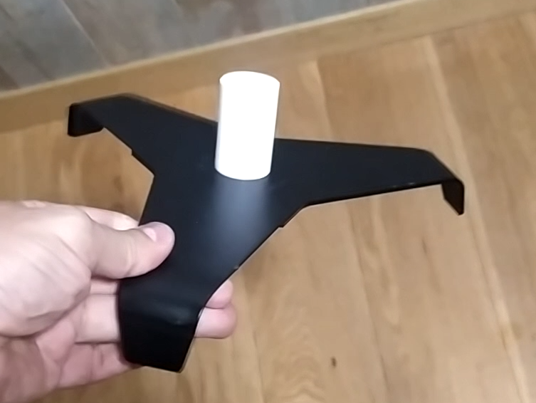
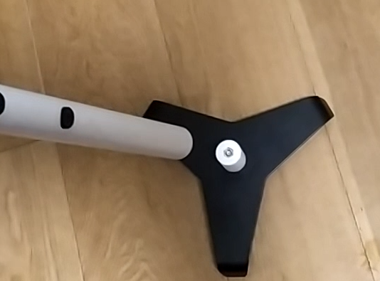

# ZonEcron Barras
## Manual de Usuario

## Contenido

1. [Introducción](#1-introducción)
   - [1.1 Objetivo del equipo](#11-objetivo-del-equipo)
   - [1.2 Principales características](#12-principales-características)
   - [1.3 Comparadnos](#13-comparadnos)
2. [Uso](#2-uso)
   - [2.1 Montaje y encendido](#21-montaje-y-encendido)
   - [2.2 Alineación y detección](#22-alineación-y-detección)
   - [2.3 Auto-interferencia de infrarrojos](#23-auto-interferencia-de-infrarrojos)
   - [2.4 Comunicación radio](#24-comunicación-radio)
   - [2.5 Visualización en pantalla](#25-visualización-en-pantalla)
   - [2.6 Alimentación y recarga](#26-alimentación-y-recarga)
   - [2.7 Autonomía](#27-autonomía)
   - [2.8 Sol y lluvia](#28-sol-y-lluvia)
   - [2.9 Almacenaje](#29-almacenaje)
3. [Epílogo](#3-epílogo)
4. [Contacto](#4-contacto)

---

## 1 Introducción

### 1.1 Objetivo del equipo

Las barras ZonEcron®, y cuando decimos ZonEcron® queremos que imaginéis luces de neón y fuegos artificiales al fondo, como decía, las barras ZonEcron® se idearon después del sistema invisible, por la actualizacion de normativa que permite que el recorrido no empiece o termine en un salto.

Al igual que con el sistema invisible, dada nuestra naturaleza tendente al mínimo esfuerzo, añadimos los mismos condicionantes, o sea, fácil instalación, sin cables, no tener que modificar la altura de detección y la de que todo quedase instalado dentro un tubo para que obstaculice lo mínimo imprescindible.

Finalmente, las barras ZonEcron® (a partir de ahora ZonEcron® a secas) nacen con el objetivo de mejorar los sistemas de cronometraje disponibles actualmente, aportando mayor sencillez de uso y seguridad para perros y guías.

---

### 1.2 Principales características

- Disposicion compacta. Todos los elementos en el interior de la barra (tubo)
- Rápido de colocar, tan rápido como montar un salto.
- Apto para exterior, apto para su uso al sol y bajo la lluvia.
- Recargable, por USB y autonomía superior a 30h.
- Seguro: Señales inocuas (infrarrojos y wifi) y sin esquinas.
- Inalámbrico. No se usa ningún cable salvo para cargar baterías.
- Largo alcance de comunicación. Probado 200m., recomendado 40m.
- Séis sensores y olvídate de tener que mover las células en los cambios de altura.

---

### 1.3 Comparadnos

Creemos que hemos desarrollado un producto único en prestaciones. Nosotros no hemos encontrado otro producto que reúna todas las características que reúne el ZonEcron®, que no repetiremos ahora.

Cuando nos surgió la necesidad de disponer de un crono de competición, estuvimos buscando mucho y bien y si encontramos otros productos, que tenían el mismo objetivo, pero ninguno reunía todas las exigencias así que por eso nos decidimos a crearlo nosotros mismos.

Si tenéis una necesidad concreta que el ZonEcron® no satisface, hay otros productos similares. Os invitamos a que busquéis, comparéis y si encuen… bueno eso, … una mente que pregunta es una mente despierta.

---

## 2 Uso

### 2.1 Montaje y encendido

Toda la electronica, bateria, antena, etc... está instalado dentro de la barra(tubo), y como no se puede ver... lo hemos llamado barras... voy a tener que hablar con los de marketing porque no veo que se estén esforzando mucho. En cada pareja, una barra tendrá en su interior los emisores de infrarrojos (la parte superior tiene 1 led y los embellecedores son blancos), y la otra barra, tendrá en su interior los receptores de infrarrojos (la parte superior tiene 2 leds y los embellecedores son negros):

Aqui se puede ver los dos leds del receptor en la parte superior y el emisor en frente con los embellecedores blancos

Prestad atención, no vayáis a poner dos barras con emisores en la misma pareja porque lógicamente no funcionarán (no sería la primera vez que pasa). Los más avispados se habrán dado cuenta que, igualmente, dos barras con receptores en la misma pareja tampoco funcionarán.

No sé si hemos sido suficientemente claros... Por si acaso no, en cada pareja tendréis que poner un ala con emisores y un ala con receptores.

Antes de situar las barras una en frente de la otra, hay que encenderlas ya que el interruptor y el puerto para cargar la batería, se encuentran en la parte inferior dentro del tubo por lo que no se puede encender ni apagar una vez colocada en la peana.

Los leds (1 o 2 según el tipo) se encenderán instantáneamente. En el caso del receptor permanecerán fijos durante 5 segundos mientras se establecen las comunicaciones por radio. Los leds azules permanecerán encendidos para indicar que la barrao está… pues eso… a ver quién lo dice… ¡muy bien!, se quedan encendidos para indicar que la barra está encendida. Voy a tener que hablar también con los de I+D porque están siguiendo los pasos de los de marketing.

Para sostener las barras verticalmente, es necesario ensamblar los cilindros de encaje en las peanas de tres apoyos. Estos cilindros se fijan a la peana mediante un tornillo y una tuerca que conectan las dos partes del cilindro, asegurándose de que la parte más larga, destinada a insertarse en el tubo, quede en la parte superior de la base. No es necesario apretarlos con una llave, ya que la fuerza manual es suficiente. Utilizar una llave podría dañar el plástico con el que están fabricados estos cilindros de encaje:

Por último, hay que encajar las barras en los cilindros de las peanas, asegurándose de alinear correctamente los 6 emisores de una barra con los 6 receptores de la otra barra:

---

### 2.2 Alineación y Detección

Una vez Emisor y Receptor se encuentra uno en frente del otro y están encendidos, se crearán 6 haces de infrarrojos entre los 6 emisores y los 6 receptores, para poder detectar el paso de cualquier perro a cualquier altura:

El led blanco, de la barra de los receptores, se apagará si la alineación es correcta y se encenderá para indicar que alguno de estos haces se ha interrumpido. El led se encenderá durante un mínimo de 0,5s, o si la interrupción dura más tiempo, se mantendrá encendido ese tiempo. Si cualquiera de estos haces, es interrumpido, se iniciará o detendrá la cuenta de tiempo.

El uso normal será antes del primer obstaculo y despues del ultimo en un recorrido de competicion, pero también puede usarse para cronometrar secuencias montando las barras a la salida de un túnel, por ejemplo. Ojo a la hora de colocar emisor y receptor demasiado cerca uno del otro o en paralelo a paredes, ya que la potencia del emisor es suficiente como para rebotar en objetos cercanos o su resplandor (invisible) es capar de sortear una mano si tenemos ambos demasiado cerca. Recomendamos una distancia mínima de uso de 1m. La distancia máxima depende de la cantidad de luz ambiental. Varía, desde 2 metros a plena luz del día, hasta 20m en condiciones de oscuridad con iluminación de focos artificiales en pista.

---

### 2.3 Auto-interferencia de infrarrojos

Debido a la potencia empleada en los infrarrojos para funcionar a plena luz del sol, puede ocurrir que un receptor reciba los infrarrojos de 2 emisores. Este efecto es más acusado en condiciones de poca luminosidad ambiental o en espacios cerrados.
El síntoma más evidente es que el led blanco de un receptor se enciende y apaga constantemente pudiendo llegar a iniciarse y pararse el contaje de tiempo sin que se haya cortado ningún haz.
Esto puede ocurrir si las barras están más o menos alineadas. Ejemplo:

En este caso el receptor 1 (R1) recibe los infrarrojos del emisor 1 (E1) y el emisor 2 (E2) y se volverá loco.

Para evitar esto colocaremos los 2 receptores en sentidos opuestos, de forma que solo puedan recibir los infrarrojos de un solo emisor. En el ejemplo anterior haremos esto:

---

### 2.4 Comunicación radio

La comunicación de radio se establece de forma automática entre las células y otros posibles accesorios añadidos de la familia ZonEcron®. Esta comunicación funciona en el rango de las frecuencias wifi, y puede verse afectada si se utiliza en entornos con muchas redes wifi presentes.

El ZonEcron® dispone de una antena interna en cada receptor para establecer esta comunicación. El alcance máximo teórico es de 80m. en campo abierto. Nosotros hemos comprobado un alcance de 200m. en un parque de un entorno residencial con varias redes wifi de las viviendas circundantes, sin fallos de comunicación. Recomendamos no exceder los 40m en su uso en una pista de dimensiones reglamentarias, para un desempeño óptimo.

---

### 2.5 Visualización en pantalla

A diferencia del ZonEcron® original, el sistema invisible no dispone de display integrado. Para visualizar los tiempos será necesario un marcador ZonEcron®, o un dongle(mochila) ZonEcron® conectado a un ordenador junto con nuestra aplicacion. Os remitimos a los manuales de dichos elementos para mas información.

---

### 2.6 Alimentación y recarga

Los cuatro equipos (dos emisores y dos receptores) cuentan con una batería interna de litio recargable, por lo que no es necesario utilizar cables de alimentación o comunicación durante su uso.

Los niveles de batería se pueden consultar en la app ZonEcron o en el marcador ZonEcron, según el sistema de visualización que utilicéis. Os recomendamos revisar los manuales de cada uno para detalles adicionales. Además, los equipos indican el nivel de batería mediante el parpadeo de los LEDs azules:
- **Batería superior al 30%**: LED azul fijo.
- **Batería entre el 30% y el 15%**: parpadeo lento del LED azul.
- **Batería por debajo del 15%**: parpadeo rápido del LED azul.

Este indicador de carga es **aproximado**, ya que se basa en la medición de la tensión de la batería, lo cual no siempre refleja con precisión la carga restante. Por ello, es normal que el porcentaje de carga baje rápidamente del 100% al 90%, se mantenga estable entre el 90% y el 10%, y luego descienda rápidamente del 10% al 0%. Recomendamos no apurar la batería en exceso para evitar sorpresas que luego vienen los ayayais y los uyuyuis.

Los equipos cuentan con una toma usb-C en la parte inferior al lado del interruptor. Para la recargar las baterías, deben estar apagados y basta con conectar un cable USB estandar a un cargador USB. Por la diferencia de los conectores en los cables USB, no es físicamente posible conectarlos mal, así que hasta el más torpe está a salvo.

**ATENCIÓN: TEMPERATURAS EXTREMAS.**

Las baterías de litio, tienen un rango de uso y recarga entre 5ºC y 50ºC. Fuera de ese rango de temperaturas el suministro de energía del que son capaces, puede fluctuar llevando a un comportamiento errático del crono. La duración de la carga también será más corta.

Recomendamos encarecidamente no usar ni recargar las baterías fuera de ese rango, sobre todo si están demasiado frías, ya que esto acortará drásticamente su vida útil o dejarlas inservibles directamente. Si el día ha sido muy frio o caluroso, apaga los equipos y déjalos en un local a una temperatura razonable. Espera una hora a que se atemperen, y ponlos a cargar.

**ATENCIÓN PELIGRO: NO CARGAR LOS EQUIPOS SIN SUPERVISON.**

Ningún equipo a baterías debería ser cargado sin supervisión. Es habitual dejar el móvil enchufado toda la noche y no pasa nada. Pero el hecho de que no pase, no quiere decir que no pueda pasar. No hace mucho, una gran empresa tuvo problemas con las baterías de sus móviles que al cargarlas se sobrecalentaban, llegando a explotar. Por eso, protegeos y proteged a los vuestros. No se trata de estar 4 horas mirando fijamente que todo vaya bien, pero si se ponén a cargar los equipos, es recomendable estar cerca haciendo otras cosas, y si no es posible quedarse cerca, recomendable desconectarlos, y proseguir la carga en otro momento. Estas baterías no tienen memoria y se pueden cargar "a plazos" sin problema.

**ATENCIÓN PELIGRO: REVISAR EN CASO DE IMPACTO.**

Es más que probable que en algún momento, algún perro impacte con el ala en la que está el ZonEcron. En el diseño se ha procurado hacer el equipo lo mas resistente posible, y sujetar firmemente las partes internas, pero ante tal circunstancia es obligatorio inspeccionar el equipo minuciosamente. Si se observá algún desperfecto, si suenan partes sueltas en el interior o si se sobrecalienta al cargarlo, se deba apagar y desconectar el equipo inmediatamente y se debe colocar en una zona donde no pueda provocar un incendio. Poneos en contacto con nosotros para ver que soluciones podemos aplicar.

Dicho lo cual, el ZonEcron dispone de un circuito electrónico que controla la carga y descarga de las baterías. Impide que se carguen o descarguen en exceso. La indicación de 0% de batería, es el nivel mínimo de batería recomendado, a partir del cual se debería recargar el ZonEcron. No obstante, seguirá encendido exprimiendo al máximo la batería hasta que el circuito electrónico de protección corte la alimentación. Esto puede permitir usar el ZonEcron el caso de apuro, pero no es recomendable que sea la práctica habitual ya que afectará negativamente a la vida util de las baterías.

Por ultimo, esa sabiduría popular que recomienda descargar las baterías del todo antes de volver a cargarlas, es válida para las antiguas baterías de Ni-Cd. Para estas "nuevas" (esta tecnología ya no es nueva) baterías de litio, **es mejor no descargarlas del todo** (de hecho, resulta perjudicial). Es mucho mas recomendable recargarlas estando a media carga. Incluso cargarlas a intervalos, un rato ahora y otro, no tiene impacto negativo.

---

### 2.7 Autonomía

Un equipo nuevo tiene una autonomia superior a 35 horas, un margen muy amplio para una de competicion de dos jornadas. Esta autonomía irá disminuyendo con el paso del tiempo por la vida util normal de las baterias de litio.

La temperatura ambiente tambien pueden afectar negativamente a la duracion de la bateria:
- Para el uso, a más frío, menos duración. No es aconsejable usar los equipos en temperaturas inferiores a 0ºC
- Para la recarga, se aconseja que se haga a temperaturas moderadas entre 10ºC y 30ºC para garantizar una carga correcta y completa

Para incrementar la autonomía se han adoptado las siguientes estrategias:
- Cuando el crono está corriendo la pantalla baja el brillo puesto que la información del tiempo util es la medición final. Cuando el crono se detiene el brillo de la pantalla se pone a tope.
- Una vez parado el crono, pasados 30s de inactividad, se vuelve a reducir el brillo del a pantalla. y pasados otros 30s la pantalla se apagará y solo se encenderá intermitentemente 1s de cada 5s.

---

## 2.8 Sol y lluvia

El ZonEcron original ha sido diseñado para funcionar perfectamente en exteriores bajo el sol o la lluvia.
- Su caracteristico color blanco ha sido elejido a proposito para evitar que se caliente bajo el sol,
- Su diseño permite su uso bajo la lluvia siempre que se respete su colocacion en vertical con los conectores hacia abajo para evitar la entrada de agua por dichos orificios.

---

## 2.9 Almacenaje

A la hora de guardar el ZonEcron hay que tener en cuanta la humedad y la bateria:
- En primer lugar, y como ya se ha mencionado, el ZonEcron **es a prueba de lluvia pero no de humedad**. Si se mantiene humedo varios días, la humedad ira penetrando poco a poco en la envolvente y puede llegar a dañar irremediablemente los componentes electronicos. Por ello, si se ha usado bajo la lluvia, antes de guardarlo se debe dejar en un ambiente seco durante un dia para eliminar completamene la posible humedad.
- En segundo lugar, en lo relativo a la batería, si se tiene previsto no utilizar el ZonEcron en una temporada, **lo mejor es dejar las baterías a media carga** para maximizar su vida útil. Almacenar baterías de litio totalmente cargadas o descargadas periodos prolongados, puede disminuir sus prestaciones enormemente.

---

## 3 Epílogo

Disfrutad con vuestros perros, no os dejéis llevar por la frustración al comparar tiempos con los de los demás (aunque el pique sano hace que esto sea más divertido). Solo tenéis que competir contra vosotros mismos.

Este crono pretende hacer que vuestras competiciones sean más sencillas a la hora de usar el crono y en los cambios de altura.

Os deseamos que le saquéis el máximo partido al ZonEcron, y ya sabéis, ni un puto rehúse por ahorrar un paso, un rehúse por vagos no... Echadle ganas hostiasssss...

---

## 4 Contacto

Para soporte técnico, dudas o sugerencias, podéis contactar con nosotros a través de nuestro correo electrónico: [ZonEcron@gmail.com](mailto:ZonEcron@gmail.com)
