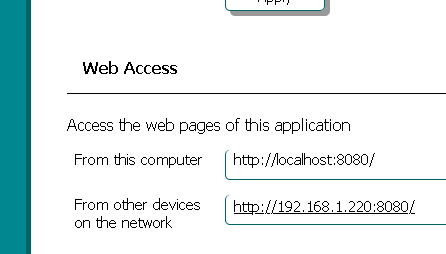
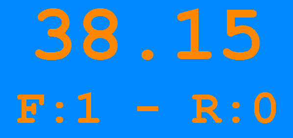
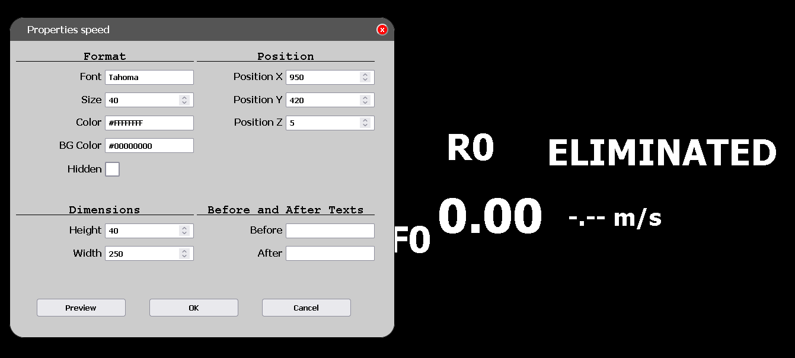

# GATEWAY ZONECRON - MANUEL
## Manuel de l'Utilisateur

### Contenu

1. [Introduction](#1-introduction)
2. [Préparations](#2-préparations)
   - [2.1 Fenêtre "Ne pas fermer"](#21-fenêtre-ne-pas-fermer)
   - [2.2 Avant de commencer](#22-avant-de-commencer)
3. [Connexions et accessibilité](#3-connexions-et-accessibilité)
   - [3.1 Connexion au dongle Zonecron](#31-connexion-au-dongle-zonecron)
   - [3.2 Connexion à Flowagility](#32-connexion-à-flowagility)
   - [3.3 Accès depuis d'autres appareils sur le réseau](#33-accès-depuis-dautres-appareils-sur-le-réseau)
4. [Affichage et fonctionnement](#4-affichage-et-fonctionnement)
   - [4.1 Utilisation du minuteur depuis l'application](#41-utilisation-du-minuteur-depuis-lapplication)
   - [4.2 Affichage du minuteur sur un écran](#42-affichage-du-minuteur-sur-un-écran)
   - [4.3 Tour](#43-tour)
   - [4.4 Affichages en streaming](#44-affichages-en-streaming)
   - [4.5 Personnalisation du streaming](#45-personnalisation-du-streaming)
5. [Divers](#5-divers)
   - [5.1 Plusieurs minuteurs](#51-plusieurs-minuteurs)
   - [5.2 Informations](#52-informations)
   - [5.3 Quitter l'application](#53-quitter-lapplication)

---

## 1 Introduction

Le ZonEcron©, et lorsque nous disons ZonEcron©, nous voulons que vous imaginiez des néons et des feux d'artifice en arrière-plan (d'accord, je vais sauter cette partie pour le reste du manuel, sinon ce sera trop long)—comme je le disais, le ZonEcron© a été conçu pour répondre au besoin de chronométrer l'exécution des zones (piste, palissade et balançoire) et, logiquement, également pour chronométrer de courtes séquences afin de déterminer quelle option est meilleure.

Ajouter un dongle pour gérer le minuteur depuis un ordinateur était une évolution logique. Le tableau d'affichage ZonEcron© possède déjà son propre serveur web, rendant cette combinaison sac à dos-application redondante. Par conséquent, si vous possédez un tableau d'affichage ZonEcron©, ce sac à dos avec l'APP est un moyen redondant de communiquer avec le minuteur.

L'APP peut être téléchargée [ici](https://zonecron.github.io/ZonEcronGW/).

---

## 2. Préparations

### 2.1 Fenêtre "Ne pas fermer"

1. Lorsque l'application démarre, une fenêtre s'ouvrira qui ne doit pas être fermée. Dans cette fenêtre, il est écrit "NE PAS FERMER CETTE FENÊTRE" en anglais.
2. Une série de commandes peut être saisie dans cette fenêtre pour des tests ou des dépannages. Dans cette fenêtre, tapez "HELP" et appuyez sur la touche Entrée pour plus d'informations.
3. Les commandes et les réponses dans cette fenêtre sont en anglais. Seul le manuel et l'aide sont traduits dans la langue par défaut configurée.

Ne pas fermer la fenêtre

---

### 2.2 Avant de commencer

1. Lorsque l'application démarre, un navigateur (Firefox, Chrome, etc.) doit également s'ouvrir avec la page Web contenant ce manuel. Si cela ne s'ouvre pas, cela peut être dû à des restrictions de sécurité sur la machine exécutant l'application. Dans ce cas, ouvrez un navigateur et tapez l'adresse suivante : 
    - http://localhost:8080 
2. Vous devrez peut-être essayer différents ports entre 8081 et 8100 si le port 8080 était déjà occupé lorsque l'application a démarré: 
    - http://localhost:8081
    - http://localhost:8082
    - ...
3. Dans le coin supérieur droit, la langue de la session actuelle peut être changée, mais la langue par défaut ne sera pas modifiée.
4. Le menu à gauche a quatre options : "Informations", "Connecter", "Contrôles" et "Écrans". En cliquant, par exemple, sur la section "Informations", un sous-menu avec quatre autres options apparaît : "Manuel", "Système", "Temps" et "Licence". En cliquant, par exemple, sur "Système", vous serez redirigé vers la page Web avec des options pour configurer la langue par défaut (pour ne pas avoir à la changer chaque fois que l'application démarre) et d'autres informations système. À partir de là, les références à chaque section seront abrégées. Cet exemple est abrégé en tant que **Informations -> Système**.
5. L'ordinateur doit reconnaître le dongle ZonEcron lorsqu'il est connecté. En général, un son doit retentir lorsque tout appareil USB est connecté. Si ce n'est pas le cas, vous devrez installer les pilotes pour le chip CH340G. Voici le site du fabricant : https://www.wch-ic.com/downloads/CH341SER_ZIP.html .
6. Pour les étapes suivantes, le dongle doit rester déconnecté de l'ordinateur jusqu'à ce qu'il en soit ordonné autrement.
7. Si vous souhaitez vous connecter à la plateforme FlowAgility, assurez-vous que l'ordinateur a accès à Internet, par exemple, en naviguant sur un site d'actualités.

Sélecteur de langue pour un changement permanent ou temporaire (coin supérieur droit).

---

## 3. Connexions et accessibilité

### 3.1 Connexion au dongle Zonecron

1. Pour connecter le dongle à l'application, cliquez dans le menu à gauche sur **Connecter -> Dongle**.
2. La section "port série" a un menu déroulant avec les ports série disponibles sur l'ordinateur. Faites attention à lesquels ils sont.
3. Connectez le dongle ZonEcron à l'ordinateur.
4. Cliquez sur rafraîchir et vérifiez à nouveau les ports série. Le dongle sera le nouveau port qui n'était pas là auparavant.
5. Cliquez sur connecter, et un message gris apparaîtra : "Ouvert. En attente d'un signal du dongle." Si tout se passe bien, après deux ou trois secondes, il deviendra vert clair, indiquant "Dongle trouvé. En attente du signal du minuteur."
6. Lors du démarrage ou de l'arrêt du minuteur en coupant le faisceau des cellules, le message doit changer en "Dongle et minuteur vérifiés." en vert foncé. Si ce n'est pas le cas, vérifiez tout le processus de connexion.

Liste des ports série avant et après avoir connecté le dongle.  
Dans cet exemple, le dongle est sur le port COM4.

---

### 3.2 Connexion à Flowagility

1. Sélectionnez dans le menu à gauche **Connecter -> FlowAgility**.
2. Copiez l'adresse MAC de 12 caractères.
3. Sur le site Web de FlowAgility https://FlowAgility.com , après vous être connecté, accédez au test où vous avez un accès de niveau organisateur.
4. Sélectionnez l'icône de gestion du minuteur en haut. Une fois là, collez l'adresse MAC copiée précédemment dans le champ correspondant et cliquez sur "Appairer avec le minuteur."
5. La page changera, et une URL similaire à "flowagility.com/ws/timer/123456ABCDEF" apparaîtra. Copiez cette URL.
6. De retour sur la page **Connecter -> FlowAgility**, collez l'URL dans le champ "URL" et cliquez sur connecter.
7. Si tout est correct, le message "Connecté." doit apparaître en vert. Si ce n'est pas le cas, vérifiez tout le processus à partir de l'étape 2. Faites attention à ne pas inclure d'espaces avant ou après le texte lors de la copie, et n'incluez pas "https://" ou "www" – copiez simplement l'URL fournie.
8. Une fois connecté, le minuteur doit également apparaître comme connecté sur la page de FlowAgility. Si ce n'est pas le cas, rafraîchissez la page.
9. Vous pouvez tester le démarrage et l'arrêt du minuteur, et il doit démarrer et s'arrêter sur la page de FlowAgility. Vous pouvez également tester la réinitialisation du minuteur à partir de la page de FlowAgility et vérifier que le minuteur a été réinitialisé.
10. La communication bidirectionnelle est maintenant établie.

---

### 3.3 Accès depuis d'autres appareils sur le réseau

1. Cette application fait en sorte que l'ordinateur sur lequel elle s'exécute agisse comme un serveur web local. Par conséquent, les pages web peuvent être consultées depuis n'importe quel autre appareil (PC, tablette, téléphone mobile) qui est sur le même réseau.
2. Pour accéder depuis un autre appareil, il suffit d'ouvrir un navigateur web (Firefox, Chrome, ...) et de taper l'adresse qui apparaît dans **Informations -> Système** sous la section "Accès Web", dans la ligne "Depuis d'autres appareils sur le réseau".
3. **Par exemple**, il est possible de :
    - Avoir l'ordinateur réservé sur une table avec le dongle connecté et l'application en cours d'exécution sans supervision
    - Marquer les défauts et les refus depuis un téléphone mobile au bord de l'arène
    - Afficher le temps, les défauts et les refus sur une télévision à l'entrée du ring

Exemple d’IP pour accéder depuis un autre appareil sur le même réseau.

---

## 4. Affichage et fonctionnement

### 4.1 Utilisation du minuteur depuis l'application

1. Le timer peut être contrôlé depuis l'application en cliquant sur la section **Contrôles -> Timer** dans le menu de gauche.
2. Dans l'exemple précédent, ce serait ce qui est ouvert sur le téléphone mobile.
3. Les contrôles sont assez intuitifs. Vous pouvez augmenter et diminuer les défauts et les refus, supprimer et restaurer, marquer les temps de reconnaissance, et plus encore.
4. Il est à noter que pour réinitialiser le timer, le couple doit d'abord être éliminé. Cela est destiné à éviter des réinitialisations accidentelles, car une réinitialisation ne peut pas être annulée.
5. Si l'application est connectée à FlowAgility, ces contrôles ne sont pas nécessaires, car utiliser les deux options en même temps (contrôles et FlowAgility) peut entraîner des erreurs lors de l'enregistrement des résultats.

Contrôle à distance sur un PC.

---

### 4.2 Affichage du minuteur sur un écran

1. Sélectionnez **Écrans -> Moniteur** dans le menu de gauche.
2. Dans l'exemple précédent, ce serait ce qui est ouvert dans le navigateur d'une smart TV.
3. Cette page est conçue pour afficher le timer au public sur un moniteur/télévision de taille moyenne à grande, permettant de lire les informations à une certaine distance.
4. Le timer en cours d'exécution sera affiché, ainsi que les défauts et les refus reçus des contrôles ou de la plateforme FlowAgility.
5. En bas, il y a deux sélecteurs pour changer les couleurs de fond et de texte si vous souhaitez donner un aspect plus festif ou d'entreprise. Nous recommandons d'utiliser des couleurs avec un bon contraste entre elles.

Écran de minuteur avec des couleurs personnalisées.

---

### 4.3 Tour

1. Cette fonctionnalité est un bonus qui n'est pas liée au timer lui-même. L'idée est similaire à l'exemple du timer, où, à partir d'un téléphone mobile, vous indiquez le numéro du chien dans l'anneau, et sur un moniteur ou une télévision séparé, ce numéro est affiché en grand format.
2. Le contrôle pour cette fonction est situé dans le menu de gauche sous **Contrôles -> Tour**. Il est possible de gérer l'indication du numéro du chien dans l'anneau, ainsi que le numéro de la hauteur de saut actuelle : 20 (XS en Espagne), 30 (S), 40 (M), 50 (I) et 60 (L).
3. Pour afficher le tour au public, montrez l'écran situé dans le menu de gauche sous **Écrans -> Tour** sur un moniteur ou une smart TV. Cette information est très utile pour que les concurrents voient le numéro de loin et organisent leurs temps de préparation.
4. Comme pour l'écran du timer, les couleurs de fond et de numéro peuvent être changées avec les menus déroulants en bas.

Écrans d’allumage de la télécommande et de l’affichage.

---

### 4.4 Affichages en streaming

1. Les sections **Écrans -> Streaming** et **Écrans -> Streaming FA** sont conçues pour être capturées par des programmes de streaming.
2. Elles diffèrent en ce sens que la première est une version simplifiée de la seconde pour lorsque FlowAgility n'est pas utilisé, mais avec les mêmes options de personnalisation.

Page web de streaming en cours de personnalisation.

---

### 4.5 Personnalisation du streaming

Étant donné que les écrans de streaming sont spécialement conçus et hautement personnalisables, nous consacrons une section pour expliquer les possibilités qu'ils offrent.

1. Un double-clic sur une zone vide de l'écran ouvrira la fenêtre générale.
2. Dans cette fenêtre générale, vous pouvez saisir manuellement la distance du parcours pour afficher le calcul de vitesse en temps réel. La vitesse ne sera pas affichée pendant les 5 premières secondes du parcours. Le champ de saisie "Vitesse Maximale" est utilisé pour éviter d'afficher des vitesses excessivement élevées. Si l'application est connectée à FlowAgility, les informations de distance seront mises à jour automatiquement. Sinon, la distance doit être saisie manuellement pour chaque course.
3. À partir de cette fenêtre générale, vous pouvez également télécharger une image d'arrière-plan, qui sera enregistrée avec le reste des personnalisations lorsque vous sauvegarderez.
4. Dans l'écran "streaming FA", cette fenêtre inclura l'option de se connecter à FlowAgility. Pour mettre à jour les informations, vous devez saisir l'URL de connexion fournie par FlowAgility dans ce menu et appuyer sur le bouton de connexion.
5. En bas de cette fenêtre générale, il y a un bouton pour entrer en mode édition. En mode édition, vous pouvez faire glisser et déposer chaque texte (temps, fautes, nom du chien, etc.) pour le positionner où vous le souhaitez. Un double-clic sur chaque texte ouvrira une fenêtre de propriétés où vous pourrez modifier sa taille, sa couleur, sa transparence, etc. Si une fenêtre est ouverte, vous ne pouvez pas faire glisser et déposer quoi que ce soit d'autre que la fenêtre elle-même. Elle doit être fermée pour faire glisser ou éditer d'autres textes.
6. Activer l'option "Masquer" pour un élément ne le masquera pas tant que vous ne sortez pas du mode édition. En mode normal (non édition), l'élément "Éliminé" et les éléments "Fautes" et "Refus" alterneront (l'un ou l'autre) selon que le couple a été éliminé ou non. En mode édition, les deux seront visibles afin qu'ils puissent être modifiés. Par exemple, si vous décidez de masquer définitivement "Fautes" et "Refus" en activant l'option "Masquer", l'élément "Éliminé" conservera son comportement en mode normal, ne devenant visible que lorsque le couple est éliminé, et vice versa.
7. En mode édition, vous pouvez annuler les 100 dernières actions avec Ctrl + Z ou refaire les 100 dernières actions annulées avec Shift + Ctrl + Z.
8. Une fois que vous avez terminé la personnalisation, double-cliquez sur une zone vide pour afficher à nouveau la fenêtre générale et appuyez sur le bouton pour quitter le mode édition.
9. Dans la même fenêtre, en appuyant sur le bouton de sauvegarde, vous enregistrerez les ajustements effectués et les conserverez même si la page Web est fermée puis ouverte ultérieurement.
10. Appuyer sur le bouton de sauvegarde synchronisera également ces ajustements sur toutes les **mêmes fenêtres du navigateur** affichant la même page de streaming. Cette fonctionnalité vous permet de modifier le design de la fenêtre dans une instance et, lorsque vous sauvegardez, elle met à jour la fenêtre diffusée sans afficher les menus et propriétés ouverts pour les modifications.
11. En cas d'erreur de communication avec le chronomètre ou la plateforme FlowAgility, une tentative de reconnexion sera effectuée en continu avec une pause de 5 secondes entre les tentatives.
12. Le bouton Importer/Exporter vous permet d'enregistrer la configuration dans un fichier pour des sauvegardes ou des migrations. La fonction d'importation est disponible uniquement pour de nouvelles configurations ou des configurations récemment réinitialisées. Si l'option d'importation n'apparaît pas, vous devez appuyer sur le bouton de réinitialisation pour redémarrer les configurations, car tout changement transformera le bouton d'importation en bouton d'exportation.
13. Certains boutons ou actions afficheront un message d'aide contextuel lorsqu'ils sont cliqués ou lorsque la souris passe sur l'élément pendant quelques secondes.

---

## 5. Divers

### 5.1 Plusieurs minuteurs

1. Il est possible d'exécuter le programme plusieurs fois si vous avez plusieurs dongles avec leurs chronomètres pour des cours simultanés, par exemple.
2. Dans ce cas, chaque instance de l'application créera un point d'accès différent, avec la même adresse mais une port différente, par exemple : 
    - http://localhost:8080 
    - http://localhost:8081 
3. Les codes nécessaires pour se connecter à FlowAgility (adresse MAC) seront consécutifs.
4. Les pages pour les 8 premières instances s'ouvriront avec des couleurs différentes pour les différencier facilement. À partir de la neuvième, si cela se produit, elles s'ouvriront avec la couleur par défaut.

Plusieurs exécutions de l’application sur le même PC.

---

### 5.2 Informations

1. Sur la page Web **Informations -> Système**, vous pouvez :
   - Sélectionner la langue par défaut.
   - Afficher les adresses pour accéder à l'application depuis l'ordinateur où elle s'exécute ou depuis un autre appareil sur le même réseau. Par exemple, si votre ordinateur est connecté au Wi-Fi et que votre téléphone portable est également connecté au même réseau, vous pouvez accéder à l'application depuis votre téléphone en saisissant l'adresse indiquée dans la section "Accès Web", sur la ligne "D'autres appareils sur le réseau".
   - Afficher l'état de la batterie des cellules ZonEcron.
   - Afficher des informations de base sur le dongle (ennuyeux).
   - Afficher les 10 derniers temps enregistrés par le chronomètre le jour actuel dans l'ordre inverse (le plus récent en premier) si l'application est connectée au dongle.
2. Sur la page Web **Informations -> Temps**, tous les temps enregistrés par le chronomètre le jour actuel sont affichés. Les temps des jours précédents sont également disponibles dans des fichiers texte (un par jour) dans le dossier "logs" à l'intérieur du dossier de l'application.
3. Sur la page Web **Informations -> Manuel**, vous pouvez consulter ce manuel.
4. Sur la page Web **Informations -> À propos**, vous pouvez lire la licence d'utilisation.

---

### 5.3 Quitter l'application

1. Pour fermer l'application, fermez simplement la fenêtre "NE PAS FERMER" ou tapez la commande "sortir" dedans.
2. Toutes les pages Web ouvertes sur n'importe quel appareil perdront la communication et cesseront de recevoir des informations mises à jour.
3. Toutes les données de configuration seront sauvegardées. Si une connexion réussie a été établie avec le dongle ou FlowAgility, cette configuration sera également sauvegardée. La prochaine fois que l'application sera lancée, elle tentera automatiquement de se connecter au dongle et à FlowAgility en utilisant cette configuration.
4. Les jours différents, la connexion à FlowAgility change, donc cela ne fonctionnera pas d'un jour à l'autre.
