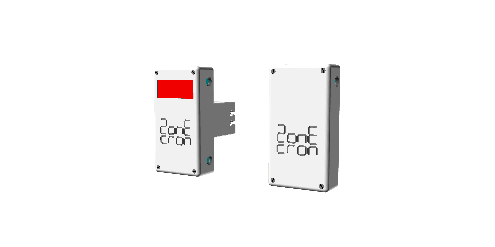
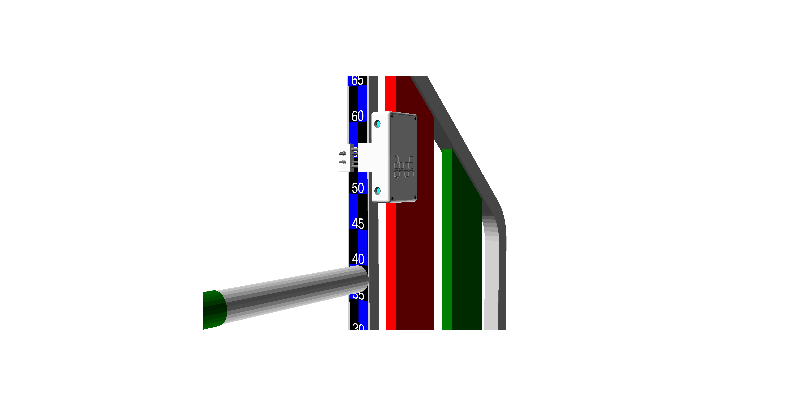

# ZonEcrón© Original
## Manuel d'Utilisateur

### Contenu

1. [Introduction](#1-introduction)
   - [1.1 Objectif de l'équipement](#11-objectif-de-léquipement)
   - [1.2 Caractéristiques principales](#12-caractéristiques-principales)
   - [1.3 Comparez-nous](#13-comparez-nous)
2. [Utilisation](#2-utilisation)
   - [2.1 Montage et mise sous tension](#21-montage-et-mise-sous-tension)
   - [2.2 Alignement et détection](#22-alignement-et-détection)
   - [2.3 Auto-interférence infrarouge](#23-auto-interférence-infrarouge)
   - [2.4 Communication radio](#24-communication-radio)
   - [2.5 Affichage à l'écran](#25-affichage-à-lécran)
   - [2.6 Alimentation et recharge](#26-alimentation-et-recharge)
   - [2.7 Autonomie](#27-autonomie)
   - [2.8 Soleil et pluie](#28-soleil-et-pluie)
   - [2.9 Stockage](#29-stockage)
3. [Épilogue](#3-épilogue)
4. [Contact](#4-contact)

---

## 1 Introduction

### 1.1 Objectif de l'équipement

Le ZonEcrón© (et quand nous disons ZonEcrón©, imaginez des lumières néon et des feux d’artifice en arrière-plan – d'accord, je vais passer cette partie pour le reste du manuel pour éviter de le rendre trop long) a été conçu pour répondre au besoin de chronométrer des zones spécifiques (passerelle, palissade et bascule) et, logiquement, pour chronométrer des séquences courtes afin de déterminer quelle option est la meilleure.

Avec cet objectif en tête et notre inclination pour le moindre effort, nous avons ajouté plusieurs conditions : installation facile, sans fil, etc., et avons commencé à expérimenter différentes technologies (infrarouge, radio, batteries, écrans, etc.) pour nous rapprocher de notre résultat final.

Finalement, le ZonEcrón® original a été créé pour satisfaire les besoins de chronométrage lors des entraînements d’agility, et c’est dans ce contexte que nous envisageons de l'utiliser. Bien que les caractéristiques de l'équipement permettent son utilisation en tant que chronomètre de compétition, certains équipements supplémentaires (grand écran, connexion au logiciel de la compétition, une paire de rechange, etc.) seraient recommandés pour cet usage.

---

### 1.2 Caractéristiques principales

- Compact, de petite taille avec tout intégré.
- Rapide à installer, conçu pour encourager une utilisation fréquente.
- Adapté à l'extérieur, visible en plein soleil et avec une certaine résistance à la pluie.
- Rechargeable par USB, avec une autonomie supérieure à 30 heures.
- Sécurisé : signaux inoffensifs (infrarouge et wifi) et bords arrondis.
- Fixation solide, adaptée à tout matériau (plastique, aluminium, fer).
- Sans fil. Aucun câble n'est utilisé sauf pour recharger les batteries.
- Longue portée de communication. Testé jusqu'à 80 m, recommandé pour 40 m.
- Écran intégré à 4 chiffres avec la résolution maximale pour le temps affiché (millisecondes, centièmes, dixièmes ou secondes).
- Double capteur, supérieur et inférieur, sur chaque porte.

---

### 1.3 Comparez-nous

Nous pensons avoir développé un produit unique en termes de fonctionnalités. Nous n'avons trouvé aucun autre produit qui combine toutes les caractéristiques du ZonEcrón©, que nous ne répéterons pas ici.

Quand le besoin d'un chronomètre d'entraînement est apparu, nous avons cherché longtemps et minutieusement et, oui, nous avons trouvé d’autres produits avec le même objectif, mais aucun ne répondait à tous nos critères, c’est pourquoi nous avons décidé de le créer nous-mêmes.

Si vous avez un besoin spécifique que le ZonEcrón© ne satisfait pas, il existe d'autres produits similaires. Nous vous encourageons à chercher, à comparer et si vous trouvez… eh bien, un esprit curieux est un esprit éveillé.

---

## 2 Utilisation

### 2.1 Configuration et Mise sous Tension

Une paire de dispositifs ZonEcron© originaux se compose d’un émetteur infrarouge (la boîte sans écran) et d’un récepteur infrarouge (la boîte avec écran).

Les deux disposent d’une pince avec un côté fixe sur la boîte et l’autre coulissant le long de deux tiges en acier. Une bande élastique interne maintient les côtés de la pince ensemble. Cette bande peut être rapidement ajustée sur trois niveaux de tension en déplaçant les extrémités attachées de la bande, s’adaptant ainsi à différentes largeurs ou épaisseurs de poteaux. Voir les images suivantes :

|                   Tension Minimale                   |                   Tension Moyenne                    |                   Tension Maximale                   |
|------------------------------------------------------|------------------------------------------------------|------------------------------------------------------|
|  |  |  |
| Profil de rail large.                                | Pour des tubes ronds.                                | Profil de rail étroit.                               |
| ex. sauts en aluminium.                              | ex. sauts en PVC ou poteaux ronds.                   | ex. sauts en acier galvanisé.                        |

En faisant coulisser la pince pour l’ouvrir, placez le ZonEcron© sur la partie verticale de l’aile ou sur un poteau de saut. L’émetteur se place à droite et le récepteur à gauche, en alignant les deux émetteurs avec les deux récepteurs :

Ensuite, procédez à la mise sous tension de l’émetteur et du récepteur. Pour vérifier que l’émetteur est allumé, observez la LED bleue, qui sera fixe ou clignotera (si la batterie est faible). Dans le cas du récepteur, la lumière bleue s’allume immédiatement après la mise sous tension et affiche divers messages sur l’écran. Une fois que le chronomètre indique zéro (0,0), la lumière bleue s’éteint si le signal infrarouge de l’émetteur est correctement détecté. Bien que l’ordre de configuration et de mise sous tension n’ait pas d’importance, nous recommandons de positionner d’abord les dispositifs, en allumant l’émetteur (sans écran) avant le récepteur (avec écran). Cela permet de vérifier le niveau de batterie des deux dispositifs pendant les messages d’écran initiaux.

**Il est crucial** de laisser un espace entre le poteau et l’émetteur inférieur pour maximiser la probabilité de détection. Nous recommandons de positionner l’émetteur inférieur à 10 cm au-dessus du poteau pour XS, S et M, et à 15 cm pour L et XL. Par exemple, pour M, cela devrait ressembler à ceci :

---

### 2.2 Alignement et Détection

Une fois l’émetteur et le récepteur positionnés face à face et allumés, la lumière bleue du récepteur s’éteint si l’alignement est correct et qu’aucun obstacle ne bloque le faisceau infrarouge. Lorsque le faisceau est interrompu (par passage ou désalignement), la LED bleue du récepteur s’allume pendant un minimum de 0,5 seconde, ou plus si l’interruption persiste.

L’émetteur dispose de deux LED infrarouges, une supérieure et une inférieure, et le récepteur dispose de deux capteurs, un supérieur et un inférieur. La réception est sélective : le capteur supérieur répond uniquement à l’infrarouge de la LED supérieure de l’émetteur, et de même pour la paire inférieure. Cela crée deux barrières linéaires entre l’émetteur et le récepteur. Il n’y a pas de détection croisée. Si l’une de ces barrières est interrompue, le chronométrage commence ou s’arrête.

Veillez à ne pas positionner l’émetteur et le récepteur trop près ou parallèlement aux murs, car la puissance de l’émetteur est suffisante pour se réfléchir sur les surfaces proches ou son éclat (invisible) pourrait contourner une main si testé sur une table.

Nous recommandons une distance d’exploitation minimale de 1 m. La distance maximale dépend de la lumière ambiante, allant de 2 m en plein soleil à 20 m dans l’obscurité avec un éclairage artificiel de la piste.

---

### 2.3 Auto-Interférence Infrarouge

En raison de la puissance utilisée par les faisceaux infrarouges pour fonctionner en plein soleil, un récepteur peut capter les signaux de deux émetteurs. Cet effet est plus prononcé dans des conditions de faible luminosité ou dans des espaces fermés.

Le symptôme le plus évident est que la lumière bleue du récepteur s’allume et s’éteint continuellement, et que le chronomètre peut démarrer ou s’arrêter de manière inattendue sans que le faisceau soit interrompu.

Cela se produit car un récepteur capte les signaux infrarouges de deux émetteurs simultanément en raison de leur positionnement sur la piste ou de réflexions sur des surfaces proches (murs ou verre). Par exemple, dans ce cas, le récepteur 1 (R1) reçoit les signaux infrarouges des deux émetteurs 1 (T1) et 2 (T2) :

Pour éviter cela, positionnez les récepteurs de manière à ce qu’ils ne reçoivent que les signaux infrarouges d’un seul émetteur, par exemple, en changeant de côté sur le saut. Dans l’exemple précédent, procédez ainsi :

Si vous ne pouvez pas placer la paire 2 de l’autre côté du saut, utilisez des poteaux de saut plus longs ou, en dernier recours, placez-les à l’envers :

---

### 2.4 Communication Radio

La communication radio est automatiquement établie entre tous les éléments de la famille ZonEcron©. Cette communication fonctionne dans la plage de fréquences Wi-Fi et peut être affectée dans des environnements avec de nombreux réseaux Wi-Fi.

Le ZonEcron© original dispose d’une antenne interne dans chaque récepteur (boîte avec écran) pour établir cette communication. La fiabilité et la portée optimales de la communication sont atteintes lorsque les deux récepteurs sont verticaux, dans leur position de montage habituelle.

La portée maximale théorique est de 80 m en espace ouvert. Expérimentalement, une portée de 200 m a été atteinte dans un parc résidentiel avec de nombreux réseaux Wi-Fi environnants, sans échec de communication. Cependant, il est recommandé de ne pas dépasser 40 m sur une piste standard pour des performances optimales.

---

### 2.5 Affichage à l'écran

Une fois le récepteur allumé et les différents messages affichés comme expliqué précédemment, l'écran affichera "0,0" sur les chiffres centraux. Si le chronométrage démarre sur l'une des paires émetteur-récepteur, le temps commencera à s'écouler sur les deux écrans. Pendant que le chronomètre fonctionne, les secondes et dixièmes de seconde seront affichés, et la position des chiffres pourra changer si les secondes dépassent 99, ou les dixièmes disparaîtront si les secondes dépassent 999.

Après l'arrêt du chronométrage, l'écran affichera le temps avec la résolution maximale possible :

| Résolution     | De       | À       | Exemple |
|----------------|----------|---------|---------|
| millisecondes  | 0,000s   | 9,999s  | 5,417   |
| centièmes      | 10,00s   | 99,99s  | 54,17   |
| dixièmes       | 100,0s   | 999,9s  | 541,7   |
| secondes       |  1000s   |  9999s  | 5417    |

Les deux écrans afficheront le même temps, car ils sont synchronisés au début, pendant et à la fin de la mesure.

---

### 2.6 Alimentation et Recharge

Les quatre appareils (deux émetteurs et deux récepteurs) sont équipés de batteries lithium rechargeables intégrées, ce qui élimine la nécessité de câbles d'alimentation ou de communication pendant l'utilisation.

Les niveaux de batterie peuvent être vérifiés via l'application ZonEcron ou le tableau de bord ZonEcron, en fonction du système d'affichage utilisé. Nous recommandons de consulter les manuels respectifs pour plus de détails. Les appareils indiquent également les niveaux de batterie via le clignotement de la LED bleue :

- **Batterie supérieure à 30 %** : LED bleue allumée en continu.
- **Batterie entre 30 % et 15 %** : LED bleue clignote lentement.
- **Batterie inférieure à 15 %** : LED bleue clignote rapidement.

Cet indicateur de charge est **approximatif**, car il est basé sur la mesure de la tension de la batterie, qui ne reflète pas toujours avec précision la charge restante. Il est donc normal que le pourcentage de charge chute rapidement de 100 % à 90 %, reste stable entre 90 % et 10 %, puis chute rapidement de 10 % à 0 %. Nous recommandons d'éviter une décharge excessive de la batterie pour prévenir les surprises désagréables.

Les appareils disposent d'un port USB-C situé en bas, à côté de l'interrupteur. Pour recharger les batteries, éteignez les appareils et connectez simplement un câble USB standard à un chargeur USB. La conception des connecteurs USB garantit qu'ils ne peuvent pas être mal branchés, même pour les utilisateurs les moins habiles.

**ATTENTION : TEMPÉRATURES EXTRÊMES.**  
Les batteries lithium ont une plage de fonctionnement et de recharge comprise entre 5 °C et 50 °C. En dehors de cette plage, leur alimentation en énergie peut fluctuer, ce qui entraîne un comportement irrégulier du chronomètre. De plus, la durée de charge sera réduite.  
Nous recommandons fortement de ne pas utiliser ou recharger les batteries en dehors de cette plage, en particulier si elles sont trop froides, car cela réduira drastiquement leur durée de vie ou les rendra totalement inutilisables. Si la journée a été très froide ou chaude, éteignez les appareils, laissez-les dans un endroit tempéré pendant une heure, puis rechargez-les.

**ATTENTION : NE PAS RECHARGER LES APPAREILS SANS SURVEILLANCE.**  
Aucun appareil alimenté par batterie ne doit être rechargé sans surveillance. Il est courant de laisser un téléphone branché toute la nuit sans problème, mais le fait que rien ne soit arrivé ne signifie pas que cela ne peut pas arriver. Il y a quelque temps, un grand fabricant a eu des problèmes de surchauffe et même d'explosion des batteries de téléphones lors du chargement. Protégez-vous et protégez vos proches. Il n'est pas nécessaire de surveiller l'appareil pendant 4 heures, mais si vous commencez à charger, il est conseillé de rester à proximité pour faire d'autres tâches. Si cela n'est pas possible, il est préférable de débrancher l'appareil et de reprendre la charge plus tard. Ces batteries n'ont pas d'effet mémoire et peuvent être rechargées par "tranches" sans problème.

**ATTENTION : INSPECTEZ APRÈS UN CHOC.**  
Il est très probable qu'un chien entre en collision avec l'aile supportant le ZonEcron©. Le design de l'appareil vise à être le plus résistant possible, en fixant solidement les pièces internes, mais dans de tels cas, il est obligatoire d'inspecter minutieusement l'appareil. Si des dommages visibles sont observés, si des pièces détachées sont entendues à l'intérieur ou si l'appareil surchauffe pendant la charge, éteignez et débranchez immédiatement l'appareil, puis placez-le dans un endroit sûr où il ne peut pas provoquer d'incendie. Contactez-nous pour discuter des solutions possibles.

Pour conclure, le ZonEcron© est équipé d'un circuit électronique qui contrôle la charge et la décharge de la batterie, empêchant les surcharges ou les décharges profondes. L'indication de batterie à 0 % est le niveau minimum recommandé auquel le ZonEcron© doit être rechargé. Cependant, l'appareil continuera de fonctionner jusqu'à ce que le circuit de protection coupe l'alimentation. Bien que cela puisse permettre une utilisation d'urgence, cela n'est pas recommandé comme pratique régulière, car cela affectera négativement la durée de vie de la batterie.

Enfin, la sagesse populaire qui recommande de décharger complètement les batteries avant de les recharger s'applique aux anciennes batteries Ni-Cd. Pour ces batteries au lithium "nouvelles" (bien que plus si nouvelles), **il vaut mieux ne pas les décharger complètement** (en fait, c'est nuisible). Il est bien mieux de les recharger lorsqu'elles sont à moitié pleines. Même les recharger en plusieurs fois, un peu maintenant et un peu plus tard, n'a aucun impact négatif.

---

### 2.7 Autonomie de la batterie

Un ZonEcrón original neuf dispose d’une autonomie de batterie supérieure à 40 heures, largement suffisante pour une journée d’utilisation en tant que chronomètre de compétition et parfaitement adaptée aux sessions d’entraînement. Cette autonomie diminuera avec le temps en raison de la durée de vie naturelle des batteries au lithium.

La température ambiante peut également avoir un impact négatif sur l’autonomie de la batterie :
- Pendant l’utilisation : Les températures plus froides réduisent l’autonomie. Il n’est pas recommandé d’utiliser les appareils à des températures inférieures à 0°C.
- Pendant la charge : Il est conseillé de recharger les batteries à des températures modérées comprises entre 10°C et 30°C afin de garantir une charge correcte et complète.

Pour prolonger la durée de vie de la batterie, les stratégies suivantes ont été mises en place :
- Lorsque le chronomètre est actif, la luminosité de l’écran est réduite, car l’information essentielle est le temps final. Lorsque le chronomètre s’arrête, la luminosité de l’écran augmente au maximum.
- Après l’arrêt du chronomètre, si aucune activité n’est détectée pendant 30 secondes, la luminosité de l’écran est à nouveau réduite, et après 30 secondes supplémentaires, l’écran s’éteint, ne s’allumant qu’intermittemment pendant 1 seconde toutes les 5 secondes.

---

### 2.8 Soleil et Pluie

Le ZonEcrón original a été conçu pour fonctionner parfaitement à l’extérieur, aussi bien sous le soleil que sous la pluie.
- Sa couleur blanche caractéristique a été spécifiquement choisie pour éviter la surchauffe au soleil.
- Son design permet une utilisation sous la pluie, à condition qu’il soit placé verticalement, avec les connecteurs orientés vers le bas, pour empêcher l’eau de pénétrer dans les ouvertures.

---

### 2.9 Stockage

Lors du stockage du ZonEcrón, tenez compte de l’humidité et des soins apportés à la batterie :
- Comme mentionné précédemment, le ZonEcrón est étanche à la pluie mais pas à une humidité prolongée. S’il est laissé humide pendant plusieurs jours, l’humidité pénétrera lentement dans le boîtier, risquant de causer des dommages irréversibles aux composants électroniques. Par conséquent, si l’appareil a été utilisé sous la pluie, laissez-le dans un environnement sec pendant une journée pour éliminer complètement toute humidité avant de le stocker.
- Concernant la batterie, si vous ne prévoyez pas d’utiliser le ZonEcrón pendant un certain temps, il est préférable de stocker les batteries à moitié chargées pour maximiser leur durée de vie. Stocker des batteries au lithium complètement chargées ou totalement déchargées pendant de longues périodes peut réduire considérablement leurs performances.

---

## 3 Épilogue

Profitez de votre temps avec vos chiens et ne laissez pas la frustration vous envahir lorsque vous comparez vos temps à ceux des autres (bien qu’une compétition amicale rende l’entraînement plus amusant). Vous devez uniquement vous mesurer à vous-même.

Ce chronomètre est conçu pour vous aider à trouver la ligne la plus fluide et la plus rapide pour vous et vos chiens.

Nous espérons que vous tirerez le meilleur parti du ZonEcrón© et souvenez-vous : pas d’excuses pour économiser un pas, pas d’excuses par paresse. Donnez tout ce que vous avez, les amis !

---

## 4 Contact

Pour un support technique, des questions ou des suggestions, vous pouvez nous contacter par e-mail : [zonecron@gmail.com](mailto:zonecron@gmail.com)
