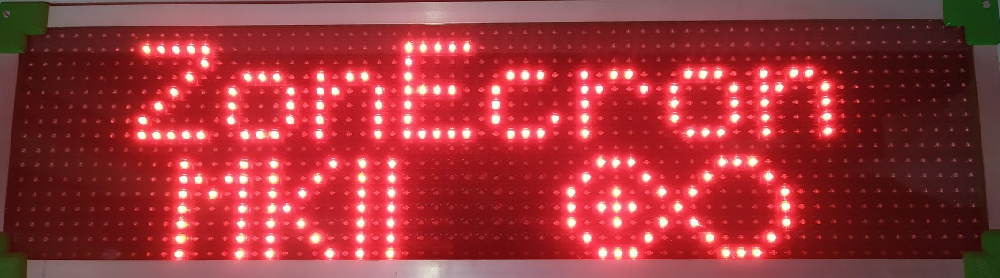
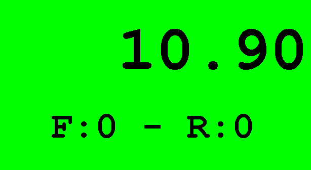

# Tableau de Bord ZonEcron
## Manuel d'Utilisateur

1. [Introduction](#1-introduction)
   - [1.1 Spécifications Techniques](#11-spécifications-techniques)
   - [1.2 Fonctions Principales](#12-fonctions-principales)
   - [1.3 Composants](#13-composants)
   - [1.4 Installation et Alimentation](#14-installation-et-alimentation)
2. [Affichage](#2-affichage)
   - [2.1 Description Générale](#21-description-générale)
   - [2.2 Buzzer Intégré](#22-buzzer-intégré)
   - [2.3 Communication avec l'Écosystème ZonEcron](#23-communication-avec-lécosystème-zonecron)
   - [2.4 Affichage des Modes de Fonctionnement](#24-affichage-des-modes-de-fonctionnement)
     - [2.4.1 Mode Chronométrage](#241-mode-chronométrage)
     - [2.4.2 Mode Départ](#242-mode-départ)
     - [2.4.3 Mode Reconnaissance de Piste](#243-mode-reconnaissance-de-piste)
     - [2.4.4 Mode Jeux](#244-mode-jeux)
   - [2.5 Affichage des Messages](#25-affichage-des-messages)
     - [2.5.1 Messages Initiaux](#251-messages-initiaux)
     - [2.5.2 Batterie des Capteurs](#252-batterie-des-capteurs)
     - [2.5.3 Messages d’Erreur des Capteurs](#253-messages-derreur-des-capteurs)
     - [2.5.4 Économiseur d’Écran](#254-économiseur-décran)
     - [2.5.5 Messages Personnalisés](#255-messages-personnalisés)
   - [2.6 Limites](#26-limites)
3. [Serveur Web Intégré](#3-serveur-web-intégré)
   - [3.1 Description](#31-description)
   - [3.2 Réseaux WiFi](#32-réseaux-wifi)
     - [3.2.1 Connexion au Réseau WiFi du Tableau de Bord](#321-connexion-au-réseau-wifi-du-tableau-de-bord)
     - [3.2.2 Modification du Nom, du Mot de Passe et de la Sécurité](#322-modification-du-nom-du-mot-de-passe-et-de-la-sécurité)
     - [3.2.3 Récupération des Identifiants WiFi](#323-récupération-des-identifiants-wifi)
     - [3.2.4 Connexion du Tableau de Bord à un Réseau WiFi Externe](#324-connexion-du-tableau-de-bord-à-un-réseau-wifi-externe)
   - [3.3 Pages Web](#33-pages-web)
     - [3.3.1 Info](#331-info)
     - [3.3.2 Fichiers](#332-fichiers)
     - [3.3.3 WiFi](#333-wifi)
     - [3.3.4 Personnalisation](#334-personnalisation)
     - [3.3.5 Fonctions Spéciales](#335-fonctions-spéciales)
     - [3.3.6 Télécommande](#336-télécommande)
     - [3.3.7 Moniteur](#337-moniteur)
     - [3.3.8 Logiciel](#338-logiciel)
     - [3.3.9 Streaming](#339-streaming)
4. [Contact](#4-contact)

---

## 1. Introduction

### 1.1 Spécifications Techniques
- Écran LED 16x64 à haute luminosité, affichant jusqu'à 999,99s, fautes et refus.
- Résolution maximale de 0,001s.
- Horloge principale avec cristal de quartz 16 MHz.
- Déviation moyenne sur 24 heures : ±20 ppm.
- Précision du système avec [ZonEcron Original](./original.md) (tableau de bord + cellules) : de +0ms à +2ms.
- Précision du système avec [barres](./sensorBars.md) ou [invisible](./invisible.md) (tableau de bord + cellules) : de +0ms à +6ms.
- Horloge en temps réel avec TCXO ±2ppm pour la date et l’heure, avec une batterie remplaçable (10 ans d’autonomie).
- Connexion sans fil 2,4 GHz avec l’écosystème ZonEcron.
- Serveur web pour jusqu’à 4 utilisateurs simultanés.
- Mémoire pour les 3000 derniers résultats, avec date et heure.

---

### 1.2 Fonctions Principales
- Résolution au milliseconde pour les temps inférieurs à 10 secondes ou au centième de seconde pour 10 secondes ou plus.
- Indicateurs d’écran pour fautes (maximum 9), refus et disqualification.
- Alertes à l’écran pour cellules photoélectriques désalignées.
- Horloge en temps réel avec date et heure.
- Mesure de la température interne.
- Économiseur d’écran personnalisable (ajoutez le nom de votre club, pourquoi pas !).
- Contrôle via une page web sur smartphone/tablette/PC.
- Compte à rebours pour la reconnaissance de piste, avec pause et ajustable par tranches d’une minute.
- Compte à rebours de 15 secondes pour les départs en compétitions de haut niveau.
- Compatible avec le gambler et le snooker, avec signal sonore inclus.
- Passages multiples par une même cellule pour des parcours complexes.
- Personnalisation des couleurs de l’interface web à tout moment.
- Messages personnalisés affichés pendant une durée définie.

---

### 1.3 Composants

Le tableau de bord ZonEcron est composé de :
- Un écran LED.
- Un trépied pour soutenir l’écran.
- Un câble d’alimentation standard (230V 50Hz).
- Une valise de transport pratique.
- Selon le modèle, un buzzer/sirène interne ou externe.

**Note Importante** : Assurez-vous de disposer d’un ensemble de cellules sans fil ZonEcron (originales ou invisibles) configurées pour communiquer avec l’écran.

---

### 1.4 Installation et Alimentation

L’installation du tableau de bord ZonEcron est simple, mais voici quelques conseils pour un résultat optimal :

1. **Commencez par le trépied** :
   - Déployez et ajustez les pieds. Serrez les vis papillon et assurez-vous que le trépied est stable au sol.
   - Si vous n’avez pas besoin de beaucoup de hauteur ou s’il y a du vent, il est préférable de ne pas déployer la partie la plus fine des pieds. Vous pouvez également suspendre un poids au crochet inférieur pour plus de stabilité.
   - Si le sol est irrégulier, ajustez les pieds et utilisez les niveaux à bulle pour vous assurer que la tête du trépied est horizontale.
   - Certains mouvements du trépied ont été intentionnellement restreints pour améliorer la stabilité et éviter les chutes de l’écran. La tête du trépied ne peut pivoter que verticalement pour orienter l’écran. Desserrez la rotation avec la molette latérale.

2. **Fixez l’écran au trépied** :
   - Ouvrez la vis papillon en haut du trépied.
   - Insérez la base carrée de l’écran dans le support du trépied jusqu’à ce qu’il soit solidement fixé.
   - Serrez la vis papillon et vérifiez que tout est bien sécurisé.

   **Attention!** Ne tentez pas de déplacer le trépied avec l’écran fixé, car cela pourrait endommager la base de fixation. Si vous devez changer d’endroit, démontez d’abord l’écran, puis déplacez le trépied.

3. **Connectez le câble d’alimentation** :
   - Branchez d’abord le câble sur l’écran, puis sur une prise électrique.
   - Si vous utilisez une rallonge, laissez suffisamment de mou pour éviter les tensions en cas de trébuchement.

4. **Allumez l’écran** :
   - Appuyez sur l’interrupteur situé en bas de l’écran.
   - Si tout est correct, l’interrupteur s’illuminera, et en moins de 2 secondes, les messages initiaux apparaîtront à l’écran. Consultez la section [2.5.1](#251-messages-initiaux) pour plus de détails.
   - Si l’interrupteur ne s’allume pas, le problème vient probablement du fusible intégré dans la prise de l’écran. Ouvrez le compartiment à fusibles. Les tableaux de bord neufs incluent toujours un fusible de rechange dans le même compartiment, séparé du fusible actif. Remplacez-le et essayez à nouveau.

---

## 2 Écran

### 2.1 Description Générale

Le tableau de bord ZonEcron est conçu pour être fonctionnel et durable, tout en offrant un confort d’utilisation. Voici ses principales caractéristiques :

- **Matériau** : La structure principale est en plastique, idéale pour faciliter les communications radio. Les coins sont équipés de pièces imprimées en 3D avec des bords arrondis pour éviter les arêtes vives.
- **Entretien** : Aucun entretien n’est nécessaire, à l’exception d’un nettoyage extérieur avec un chiffon humide. Si vous devez accéder aux composants internes, les panneaux avant et arrière peuvent être démontés en dévissant les vis sur les arêtes et les coins. Les panneaux sont scellés avec du silicone pour empêcher l’entrée d’eau de pluie. Ce joint peut être facilement retiré, mais il faudra appliquer du nouveau silicone après ouverture des panneaux.
- **Ventilation** : Équipé de deux grilles ; l’une dispose d’un ventilateur qui extrait l’air chaud de l’intérieur, tandis que l’autre permet l’entrée d’air frais, empêchant la surchauffe de l’électronique.
- **Partie Inférieure** :
  - Prise d’alimentation avec interrupteur et fusible.
  - Fixation pour monter l’écran sur le trépied.
  - Sur les versions avec buzzer externe, vous trouverez l’encoche pour le fixer et le connecteur correspondant.

---

### 2.2 Buzzer Externe/Interne

Le buzzer émettra des signaux sonores dans les cas suivants :
- **Fin du temps de reconnaissance de la piste** : émettra des bips courts et intermittents pendant 8 secondes.
- **Mode jeux snooker** : lorsque le temps d’ouverture configuré est atteint, un bip retentit pendant la durée programmée.
- **Mode jeux gambler** : un bip retentit à la fin du temps d’ouverture et un autre à la fin du temps de fermeture, chacun pendant la durée programmée.

**Attention !** Dans le cas de la reconnaissance de piste, le buzzer émettra toujours un signal intermittent, comme une alarme de réveil. Dans les modes jeux, le signal envoyé au buzzer sera continu, mais certains modèles de buzzer intègrent une alternance dans leur électronique. Si vous souhaitez utiliser votre propre buzzer, choisissez-en un fonctionnant à 12V et consommant moins de 0,5A.

---

### 2.3 Communication avec l’Écosystème ZonEcron

Tous les dispositifs de l’écosystème ZonEcron sont préconfigurés pour se connecter automatiquement entre eux. Chaque ensemble est codé de manière unique pour éviter les interférences entre pistes voisines. Par conséquent, les éléments d’un ensemble communiqueront uniquement entre eux, et il ne sera pas possible, par exemple, d’utiliser les cellules d’un ensemble avec le tableau de bord d’un autre.

L’**ordre d’allumage** est indifférent ; que vous allumiez d’abord l’écran, les cellules ou le sac à dos, tout se connectera automatiquement. Cependant, il est recommandé d’allumer et d’aligner les cellules avant d’allumer l’écran pour afficher correctement les niveaux de batterie dans les messages initiaux. Consultez la section [2.5.1](#251-messages-initiaux) pour plus de détails.

De plus, dans le [**ZonEcron Original**](./original.md), le temps disparaîtra du petit écran des cellules et sera remplacé par le niveau de batterie en illuminant les 4 points de l’écran comme suit :
- 100 % à 81 % -> 4 points.
- 80 % à 61 % -> 3 points.
- 60 % à 41 % -> 2 points.
- 40 % à 21 % -> 1 point.
- 20 % à 0 % -> Écran éteint.

---

### 2.4 Affichage des Modes de Fonctionnement

#### 2.4.1 Mode Chronométrage

C’est le mode principal du tableau de bord ZonEcron, où s’affichent :

- **Temps** : affiché en grand.
- **Fautes et Refus** : sur la droite, avec un "F" et un "R" devant les chiffres. Si "éliminé" est marqué, ces indications seront remplacées par "ELI", mais le chronomètre continuera de fonctionner pour permettre les corrections ou enregistrer le temps final du concurrent.

Écran affichant un temps en cours.

**Affichage du temps** :
- Lorsque le temps est en cours : un seul chiffre décimal (mis à jour toutes les dixièmes de seconde).
- Lorsque le temps est arrêté :
  - Millisecondes si inférieur à 10 secondes.
  - Centièmes si égal ou supérieur à 10 secondes.

**Temps maximum** : Si le temps dépasse 100 secondes (cas rare sur un parcours normal d’agility), les chiffres se resserrent pour afficher cinq caractères au total. Le temps maximum affiché de cette manière est 999,99 secondes. Le temps total peut être consulté sur le web via la [télécommande](#336-télécommande).

---

#### 2.4.2 Mode Départ

Dans ce mode, l’écran affiche un compte à rebours (secondes et dixièmes) configuré à l’avance, généralement à 15 secondes.

L’opérateur du chronomètre doit réinitialiser le tableau de bord avant chaque concurrent à l’aide du [contrôleur](#336-contrôleur). Ensuite, sur le signal du juge, il doit lancer le compte à rebours prédéfini. Par la suite :
- Si le chien coupe la cellule pendant le compte à rebours, le chronomètre commence normalement.
- Si le compte à rebours atteint 0 sans couper la cellule, le chronomètre démarre tout de même, en ignorant le premier passage à travers la cellule.

---

#### 2.4.3 Mode Reconnaissance de la Piste

Ce mode affiche un compte à rebours en minutes et secondes pour la reconnaissance de la piste. Par défaut, il commence à 7 minutes, mais le temps peut être ajusté par paliers d’une minute pendant la pause ou l’exécution :
- **Important** : Dans ce mode, les cellules n’ont aucun effet.
- **À la fin du compte à rebours** :
  - Le message "Temps écoulé" s’affiche.
  - Un bip intermittent retentit pendant 8 secondes.

---

#### 2.4.4 Mode Jeux

Ce mode est conçu pour les jeux "snooker" et "gambler" du WAO (World Agility Open).

- **Snooker** : Chronométrage normal jusqu'à ce que le temps configuré soit atteint, moment où un signal sonore est émis (la durée de ce signal est configurable).
- **Gambler** :
  - Le temps reste caché derrière le message "Tempus Fugit."
  - Lorsque le temps d'ouverture est atteint, le premier signal sonore retentit et le chronomètre est à nouveau affiché normalement.
  - Lorsque le temps de fermeture est atteint, le second signal sonore retentit (disponible uniquement en mode gambler).
  - Dans les deux phases, si la cellule est déclenchée avant le temps défini, le temps écoulé est affiché et le signal sonore n'est pas émis.
  - Le second signal peut être désactivé en réglant le temps de fermeture à 0 secondes.

Exemple de gambler avec un temps d'ouverture de 30s et un temps de fermeture de 12s :
- Au début du parcours, le chronomètre est caché et le message "Tempus Fugit" s'affiche à l'écran.
- Après 30 secondes de parcours, le premier signal sonore retentit et le chronomètre est affiché normalement.
- Après 42 secondes de parcours (12 secondes après le temps d'ouverture), le second signal sonore retentit.

**CONSEIL** : Si l'environnement est bruyant, il est recommandé de renforcer le signal sonore avec un sifflet ou un autre avertissement manuel.

---

## 2.5 Affichage des Messages

### 2.5.1 Messages Initiaux

Lorsque vous allumez le tableau de bord ZonEcron, quatre messages apparaîtront à l'écran dans les premières secondes :
1. Marque et modèle.

2. Nom du club (économiseur d'écran configuré).

3. Heure et date de l'appareil.

4. Nom du réseau WiFi (propre ou externe) et adresse IP.

Si une cellule détecte un passage pendant ces messages, ils seront interrompus et le chronomètre passera automatiquement à l'écran principal et commencera à compter. Par conséquent, si vous devez vérifier l'heure, la date ou les données du réseau, il est préférable d'allumer les cellules après avoir visualisé tous les messages.

Faites particulièrement attention aux messages 3 et 4 : assurez-vous que la date et l'heure sont correctement configurées [voir section 3.3.1](#331-info) et mémorisez le réseau WiFi ainsi que l'adresse IP assignée pour gérer le serveur web [voir section 3.2](#32-connexion-au-serveur).

---

### 2.5.2 Batterie des Capteurs

Lorsque vous allumez une paire de cellules pour la première fois, le pourcentage de batterie du récepteur s'affiche. La batterie de l'émetteur est également affichée si celui-ci est correctement aligné avec le récepteur. Si vous souhaitez vérifier l'état des batteries ultérieurement sans devoir tout éteindre et rallumer, vous pouvez le faire via l'interface web [voir section 3.3.1](#331-info).

---

### 2.5.3 Messages d'Erreur des Capteurs

Si un capteur est désaligné (sauf en mode reconnaissance de piste), un message d'alerte indiquant le capteur concerné s'affiche. Si le chronomètre est en cours d'exécution, il continuera à compter mais n'affichera pas le temps tant que le capteur ne sera pas correctement aligné.

---

### 2.5.4 Économiseur d'Écran

Si le chronomètre reste arrêté pendant plus de 2 minutes, l'économiseur d'écran s'active. Celui-ci affiche un texte défilant alternant avec l'heure toutes les 10 secondes. Vous pouvez configurer le texte à afficher [voir section 3.3.4](#334-personnalisation).

---

### 2.5.5 Messages Personnalisés

Vous pouvez configurer des messages personnalisés sur deux lignes, avec un maximum de 10 caractères par ligne. La [section 3.3.4](#334-personnalisation) explique comment procéder. Ces messages ne seront affichés que lorsque le chronomètre est arrêté et disparaîtront si une commande de réinitialisation est envoyée ou si une cellule détecte un passage.

---

### 2.6 Limites

- Le chronomètre peut mesurer plus de 1 000 secondes, mais l'écran n'affiche que jusqu'à 999,99 secondes. Pour les temps plus longs, consultez les pages web de la [télécommande](#336-télécommande) ou du [moniteur](#337-moniteur).
- Le nombre maximum de fautes que le tableau peut enregistrer est de 9.
- Le nombre maximum de refus qu'il peut enregistrer est de 2. À partir du troisième refus, il sera affiché comme éliminé.

---

## 3 Serveur Web Intégré

### 3.1 Description

Le tableau de bord ZonEcron comprend un serveur web intégré qui vous permet de consulter, configurer et contrôler le chronomètre depuis tout appareil doté d'une connexion WiFi (smartphone, tablette, PC) sans besoin de logiciel supplémentaire. Ce serveur web peut se connecter à un réseau WiFi existant ou créer son propre réseau WiFi, éliminant ainsi le besoin d'une connexion Internet.

---

### 3.2 Réseaux WiFi

#### 3.2.1 Connexion au Réseau WiFi du Tableau

Lorsque vous allumez le tableau ZonEcron, s'il n'est configuré pour aucun autre réseau (par exemple, lors du premier allumage), il créera son propre réseau WiFi. Chaque tableau a un nom de réseau et un mot de passe uniques :

  - **Nom du réseau** : ZonEcronXXXXXXXXXXXX
  - **Mot de passe** : XXXXXXXXXXXX

Où "XXXXXXXXXXXX" sont des chiffres et des lettres majuscules de A à F. Ainsi, lorsque vous recherchez et trouvez le réseau, vous connaissez déjà le mot de passe... vous et tout le monde... alors dès que possible, modifiez le mot de passe (et le nom du réseau) comme expliqué dans [section 3.3.3](#333-wifi).

Connectez-vous à ce réseau WiFi et, une fois connecté :

1. Votre appareil peut vous avertir que le réseau n'a pas de connexion Internet (évidemment). Assurez-vous de rester connecté.

2. **Remarque importante** : Certains smartphones ont une fonction "WiFi+" (ou similaire) qui bascule automatiquement sur les données mobiles si le réseau WiFi n'a pas d'accès Internet. Désactivez cette fonction pour éviter les problèmes.
3. Ouvrez un navigateur web (Chrome, Firefox, etc.) et saisissez l'adresse `http://192.168.4.1`. Cela vous amènera à la page d'accueil du tableau où vous pourrez consulter son état [voir section 3.3.1](#331-info).

---

#### 3.2.2 Changer le nom, le mot de passe et la sécurité

Nous vous recommandons de changer le nom du réseau et le mot de passe par défaut en suivant les instructions de la [section 3.3.3](#333-wifi). Cela est important pour protéger votre appareil, tout comme vous le feriez avec le routeur de votre maison.

Lors des compétitions officielles, évitez d'utiliser le réseau WiFi généré par l'écran. Le serveur est simple et sa seule protection est le mot de passe du réseau. Dans ces cas, connectez l'écran à un réseau WiFi robuste créé par un routeur adapté aux environnements fréquentés ou, en dernier recours, désactivez le WiFi.

---

#### 3.2.3 Récupération des identifiants WiFi

Vous avez oublié le mot de passe du réseau de votre écran ZonEcron ? Pas de souci, il existe une procédure simple pour reconnecter l'écran :

1. Éteignez l'écran ZonEcron et les cellules.
2. Crie um hotspot (compartilhamento de Wi-Fi) no seu smartphone chamado "**Recuperame**" (espanhol para "recupere-me") com a senha "**Admin1234**" (diferencia maiúsculas de minúsculas).

3. Allumez l'écran ZonEcron.
4. Attendez qu'il se connecte au réseau "**Recuperame**" (celui de votre téléphone).
5. Sur l'écran ZonEcron, le nom du réseau ("Recuperame") et l'adresse IP attribuée par votre téléphone s'afficheront.
6. Accédez à cette adresse IP depuis le navigateur de votre téléphone pour reconfigurer le nom et le mot de passe du réseau créé par l'écran ZonEcron, comme expliqué dans la [section 3.3.3](#333-wifi).

**Impossible d'accéder ?** :
- Si "Recuperame" n'apparaît pas sur l'écran, cela signifie que l'écran ne s'est pas connecté au réseau partagé par votre téléphone. Vérifiez que le nom du réseau et le mot de passe sont correctement saisis (attention aux majuscules et minuscules) et que votre téléphone crée un réseau 2,4 GHz. Les réseaux 5 GHz récents ne sont pas compatibles.
- Si le réseau "Recuperame" apparaît, assurez-vous qu'il s'agit de votre réseau et non d'un réseau généré par un autre téléphone à proximité.
- Si vous ne pouvez toujours pas accéder, contactez-nous pour une assistance personnalisée à [ZonEcron@gmail.com](mailto:ZonEcron@gmail.com?subject=Problèmes%20de%20connexion).

---

#### 3.2.4 Connecter l'écran à un réseau WiFi externe

1. Lors de l'allumage de l'écran, vérifiez le réseau WiFi et l'adresse IP dans les [messages initiaux](#251-messages-initiaux).
2. Connectez votre téléphone/tablette/PC au même réseau WiFi. S'il s'agit du réseau créé par l'écran, suivez les étapes de la [section 3.2.1](#321-connexion-au-réseau-wifi-de-l'écran).
3. Accédez à la page web avec les [paramètres WiFi](#333-wifi).
4. Dans la section "Connect to Another Wi-Fi Network", vérifiez qu'elle est activée ; sinon, activez-la.
5. Dans le menu déroulant de cette section, sélectionnez le réseau WiFi auquel vous souhaitez connecter l'écran, entrez et confirmez le mot de passe.
6. Après avoir cliqué sur "Appliquer", un avertissement apparaîtra. En l'acceptant, le serveur web redémarrera.
7. Surveillez les messages à l'écran pour vérifier qu'il s'est connecté au réseau WiFi configuré. Sinon, répétez les étapes en vous assurant de saisir correctement le mot de passe.
8. **Important** : Le mot de passe ne doit pas contenir de caractères spéciaux, ni de barre oblique ( \ ) ni de point-virgule ( ; ). Le réseau WiFi doit être en 2,4 GHz. Les réseaux récents en 5 GHz ne sont pas pris en charge.

**ASTUCE** : Pour ne pas manquer les messages à l'écran parce que le chronomètre pourrait se mettre en marche, effectuez cette configuration avec les cellules éteintes.

Regardez la vidéo (Activez les sous-titres dans votre langue préférée, car l'audio est en espagnol):  
[Regarder la vidéo sur YouTube](https://youtu.be/FqYA5eCeje0)  

---

### 3.3 Pages web

Lorsque vous accédez à la page web de l'écran ZonEcron, la page principale sera l'onglet "Info". Selon que vous accédez via un téléphone ou un PC, les onglets apparaîtront en haut ou sur le côté gauche, respectivement. Chaque onglet propose différentes options pour configurer l'écran ou simplement consulter certaines informations.

---

#### 3.3.1 Info

Dans cette section, vous pouvez :

- **Synchroniser la date et l'heure** : Ajustez la date et l'heure du chronomètre pour qu'elles correspondent à celles de votre appareil en appuyant simplement sur un bouton.
- **Vérifier la température interne** : Très utile pour s'assurer que tout fonctionne correctement.
- **Consulter l'état des cellules** : Si elles sont allumées, vous pouvez vérifier le pourcentage de batterie de chacune.
- **Consulter les informations de version de votre écran**.

Page d'information :

---

#### 3.3.2 Fichiers

Dans cet onglet, vous pouvez gérer les fichiers stockés sur le serveur de l'écran ZonEcron. Nous mentionnons en particulier les **journaux de temps**, qui sont des fichiers nommés `cronoLog#.txt` contenant les enregistrements de temps. Ici, `#` est un nombre de 0 à 3. Cliquez dessus pour les afficher et consulter tous les temps enregistrés par l'écran.

- **Liste des fichiers** : Affiche une liste de tous les fichiers et, à la fin, l'espace total occupé et disponible. Ce serveur est très léger, utilisant seulement quelques Ko.
- **Télécharger des fichiers** : Cette option ne devrait jamais être utilisée dans des conditions normales. Pour cette raison, nous ne partageons pas ici la clé nécessaire. Si vous en avez besoin sur notre recommandation, nous vous fournirons la clé. Un exemple serait de remplacer le logo ZonEcron par celui de votre association, mais le fichier doit répondre à certaines exigences, et nous vous demanderons de le vérifier avant de le télécharger.
- **Supprimer des fichiers** : Idem ci-dessus.
- **Effacer les journaux de temps** : En saisissant la clé "disturbingLackOfFaith", le serveur effacera tous les **journaux de temps** et commencera à enregistrer à partir de zéro. Cela peut être utile si vous ne souhaitez pas conserver les enregistrements d'une compétition précédente avant d'en commencer une nouvelle. En général, ce n'est pas nécessaire, car l'écran écrasera les journaux les plus anciens pour ne jamais manquer d'espace.

**ASTUCE** : Si vous avez plusieurs **journaux de temps**, celui actuellement utilisé pour enregistrer sera le plus petit en taille.

Exemple d'enregistrement des temps : 

---

#### 3.3.3 WiFi

L'écran ZonEcron peut créer son propre réseau WiFi ou se connecter à un réseau existant. Par défaut, il mémorise le dernier réseau utilisé et essaie de s'y connecter. En cas d'échec, il crée son propre réseau WiFi.

Dans cet onglet, vous pouvez gérer le réseau WiFi créé par l'écran et/ou celui auquel il doit se connecter. Un seul mode (réseau propre ou réseau externe) sera actif. Bien qu'il soit possible d'activer les deux simultanément pour des modifications ponctuelles, il n'est pas recommandé de fonctionner en mode habituel avec les deux modes activés, car cela peut provoquer des problèmes de connexion.

- **Créer un réseau WiFi propre** : Activez ou désactivez le réseau et modifiez le nom et le mot de passe selon vos besoins. Utile pour la récupération du WiFi.
- **Se connecter à un réseau existant** : Analysez les réseaux disponibles et sélectionnez celui auquel vous connecter. Montre également la qualité du signal une fois connecté.
- **Redémarrer** :
  - **Redémarrer** : Cette option éteindra et rallumera le serveur (pas l'écran). Toutes les connexions WiFi actives seront coupées.
  - **Réinitialiser** : Cette option supprimera les configurations WiFi et rétablira les paramètres d'usine. Ensuite, le serveur redémarrera comme dans l'option précédente.

Comme mentionné, ce serveur est très compact et a une capacité limitée. Nous recommandons un maximum de 3 utilisateurs simultanés pour maintenir des connexions fluides.

**ASTUCE** : Si vous désactivez les deux modes (réseau propre et réseau externe), l'écran ZonEcron sera sans WiFi (les cellules continueront de fonctionner) jusqu'à ce qu'il soit redémarré. Cela peut être utile si vous soupçonnez des interférences malveillantes.

---

#### 3.3.4 Personnalisation

Ici, vous pouvez ajuster différents aspects pour adapter le tableau ZonEcron à vos besoins :

- **Club** : Configurez deux lignes de texte avec un maximum de 10 caractères chacune, généralement le nom du club. Ce texte sera utilisé comme économiseur d'écran lorsque le tableau reste inactif pendant plus de 2 minutes.
- **Messages temporaires** : Définissez des messages qui apparaîtront sur l'écran tant que le chronomètre est arrêté. Vous pouvez définir leur durée ou les laisser indéfinis (temps 0). Ces messages disparaissent si le chronomètre est réinitialisé ou si une cellule détecte un passage.
- **Couleurs** : Modifiez les couleurs de l'interface web. Les modifications sont immédiatement visibles, mais ne seront enregistrées qu'après confirmation. Évitez les combinaisons qui pourraient être désagréables pour les yeux. Par exemple :

---

#### 3.3.5 Modes Spéciaux

Dans cette section, vous pouvez configurer des modes spéciaux pour les compétitions ou les entraînements :

- **Games** : Configurez les paramètres pour exécuter une manche de games selon le fonctionnement expliqué dans la [section 2.4.4](#244-mode-games).
- **Détection multiple** : Configurez des détections supplémentaires nécessaires pour que le chronomètre s'arrête et que l'écran affiche le temps figé lors des détections intermédiaires, tandis que le chronomètre continue de fonctionner.
- **Temps de départ** : Activez le mode départ et configurez le temps de départ (par défaut, 15 secondes) pour fonctionner comme expliqué dans la [section 2.4.2](#242-mode-départ).

Lors de l'application du mode Jeux ou du mode Détection multiple, un message de confirmation s'affichera à l'écran (si le chronomètre est arrêté) :

- Mode games :

- Mode détection multiple :

---

#### 3.3.6 Télécommande

Depuis cet écran, l'opérateur du chronomètre peut gérer (par exemple, via son smartphone) les principales fonctions du chronomètre, telles que :

- Marquer les fautes, refus et éliminations.
- Réinitialiser le chronomètre.
- Activer le mode reconnaissance de parcours et ajuster son temps.

Télécommande sur un mobile :

La télécommande affiche également le temps en cours, l'état de la batterie faible ou le désalignement des cellules, ainsi que les 5 derniers résultats en bas pour une consultation rapide par l'équipe de piste.

Quelques règles :

- **Refus au départ** : Si le chronomètre est réinitialisé, marquer un refus démarrera le chronomètre et ignorera le premier passage à travers la cellule. (Si le chronomètre n'est pas réinitialisé, le refus sera ajouté au résultat affiché à l'écran).
- **Corrections** : Vous pouvez corriger les fautes, refus et éliminations même après la fin du parcours.
- **Réinitialisation** : Ce bouton n'est actif que pendant 5 secondes après la fin d'un parcours ou lorsque le compétiteur est éliminé, pour éviter les réinitialisations accidentelles (qui ne peuvent pas être corrigées).

---

#### 3.3.7 Moniteur

L'écran de moniteur affiche les mêmes informations que la télécommande, mais sans les boutons. Il est idéal pour les tableaux d'affichage vidéo destinés au public, car il peut également afficher le logo du club en arrière-plan.

---

#### 3.3.8 Logiciel

Dans cette section, vous pouvez configurer la connexion du tableau à un logiciel tiers via websocket. Bien qu'il ait été initialement conçu pour communiquer avec la plateforme [FlowAgility](https://www.flowagility.com/), le tableau peut se connecter à tout logiciel disposant d'un serveur websocket en utilisant le protocole de messages [décrit ici](https://github.com/ZonEcron/ZonEcron-Interfacing/blob/main/WebsocketClient.md#4-mode-meanings-and-examples).

Notez que, pour connecter le tableau de cette manière, il doit être connecté à un réseau WiFi externe, comme décrit dans la [section 3.2.4](#324-connexion-du-tableau-à-un-réseau-wifi-externe). De plus, si le logiciel est une plateforme en ligne, comme FlowAgility, ce réseau WiFi externe doit avoir accès à Internet.

Sur cette page, vous trouverez :

- **Adresse du logiciel** : Cette section contient les données nécessaires pour se connecter à la plateforme FlowAgility (et éventuellement à d'autres logiciels tiers) :
  - URL : L'adresse à laquelle le tableau doit essayer de se connecter. Cette adresse doit être fournie par le logiciel auquel vous souhaitez vous connecter.
  - Adresse MAC : L'adresse MAC du tableau. FlowAgility demande cette adresse pour générer l'URL de connexion mentionnée ci-dessus.
  - Enfin, un indicateur affiche l'état actuel de la connexion.
- **Serial & WS client connection log** : Affiche les messages provenant du chronomètre et du logiciel tiers. Ce journal a une limite de 5000 caractères ; une fois cette limite atteinte, les messages les plus anciens seront supprimés pour afficher les plus récents. De plus, ce journal n'est pas sauvegardé ; si la page web est quittée ou actualisée, le journal recommencera à zéro.
- **DANGER ZONE - KEEP AWAY BUTTERFINGERS** : Dans cette section, que nous recommandons de ne pas utiliser (sauf si vous savez ce que vous faites), après avoir appuyé sur le bouton, les champs suivants apparaîtront :
  - SSL : Pour utiliser une connexion websocket sécurisée (wss) ou normale (ws).
  - Port : Pour modifier le port du serveur auquel le tableau doit se connecter.
  - Informations supplémentaires : Pour afficher plus d'informations dans le journal.

---

#### 3.3.9 Streaming

Cet écran n'est pas directement accessible via le menu, mais il peut être visualisé dans la liste des fichiers.

Il est conçu pour être capturé par des programmes de streaming afin d'afficher le comptage en temps réel.  

Si vous avez besoin de quelque chose de plus sophistiqué ou personnalisable, vous pouvez utiliser [notre HTML personnalisable](https://github.com/ZonEcron/FlowAgilityStreamingInfo). Il est également conçu pour se connecter avec FlowAgility, mais ce n'est pas obligatoire, et les informations non utilisées peuvent être masquées. Personnalisez-le à votre convenance et connectez-le au tableau d'affichage pour un streaming/mur vidéo impressionnant.  
  

---

## 4 Contact

Pour une assistance technique, des questions ou des suggestions, contactez-nous par e-mail : [ZonEcron@gmail.com](mailto:ZonEcron@gmail.com?subject=Tableau%20ZonEcron).
