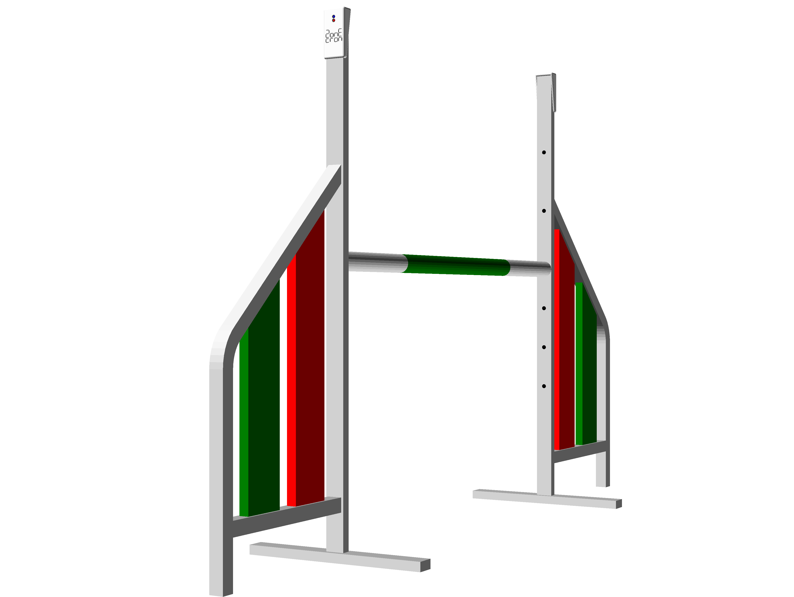
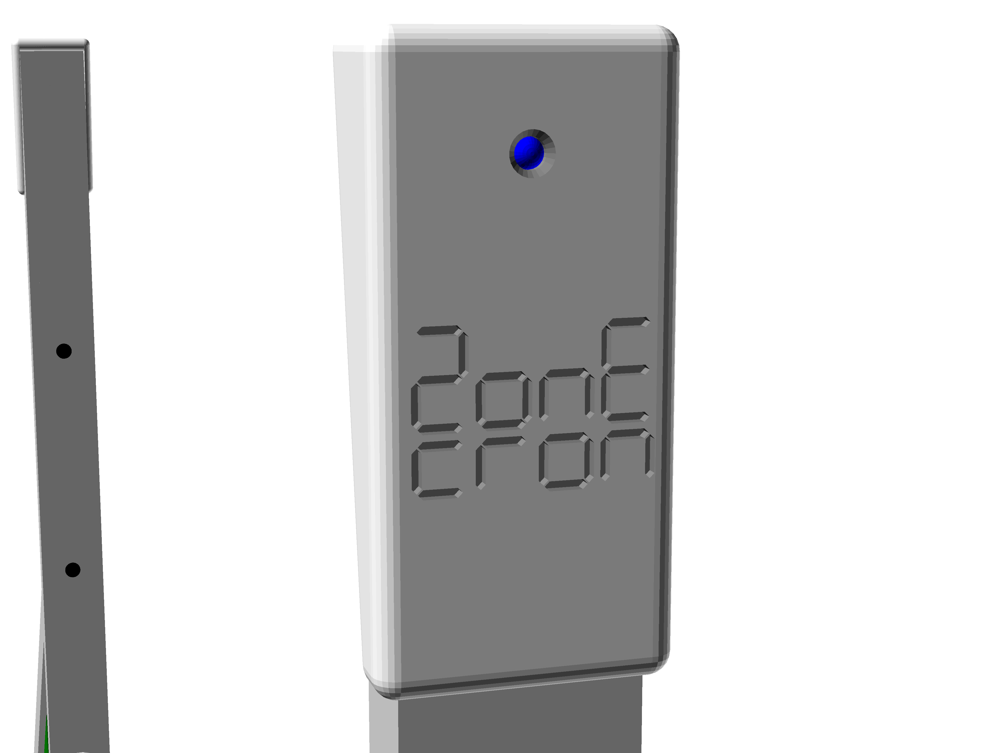
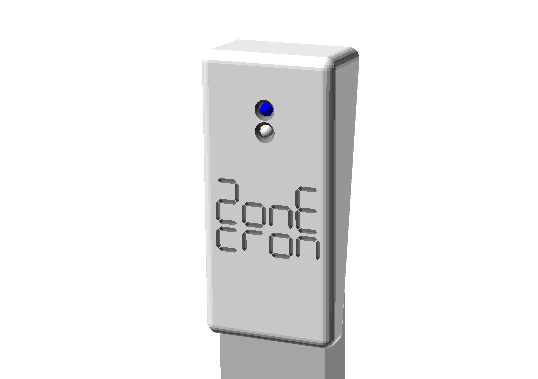
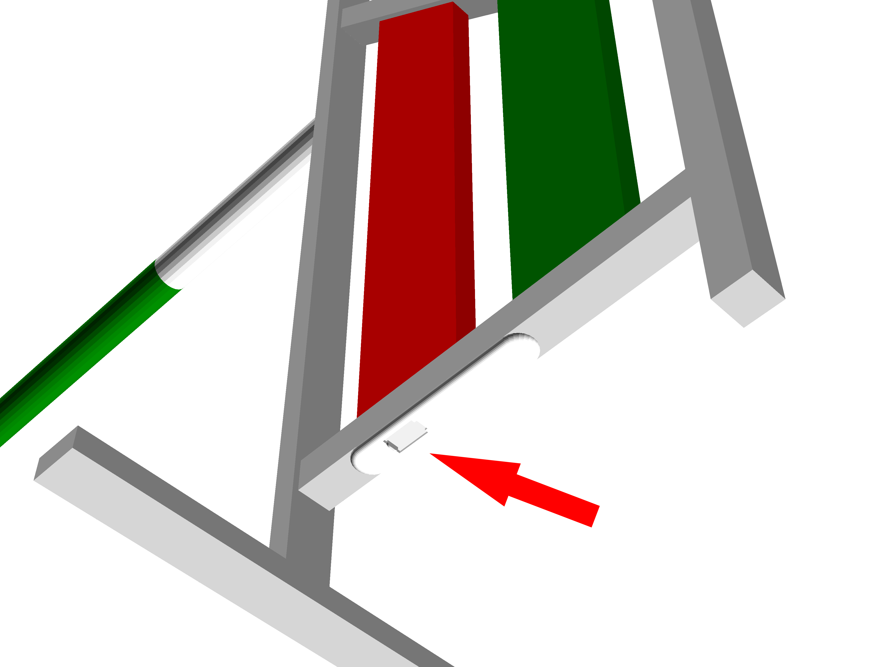
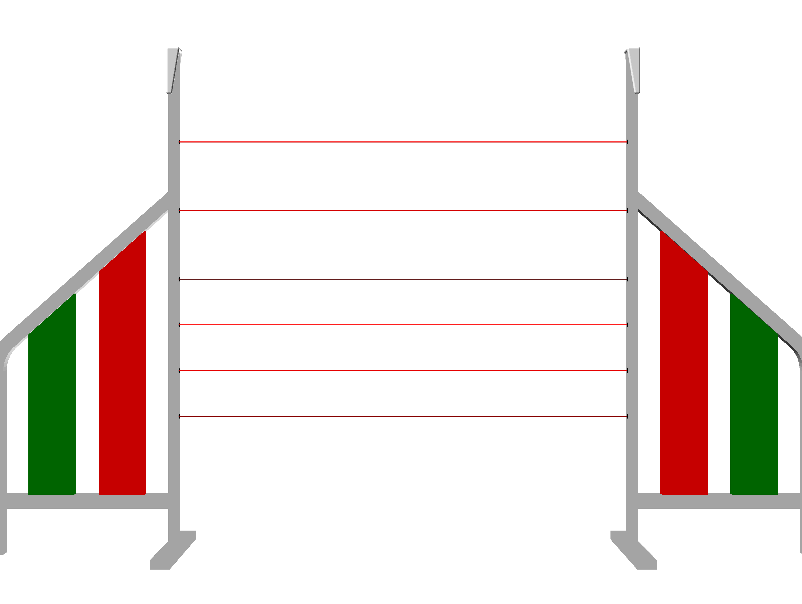
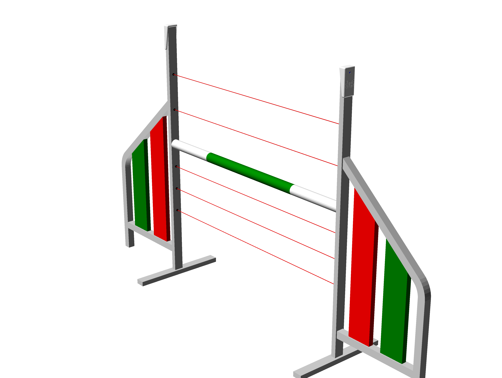

# ZonEcrón© Invisible
## Manuale d'Uso

## Contenuto

1. [Introduzione](#1-introduzione)
   - [1.1 Obiettivo del dispositivo](#11-obiettivo-del-dispositivo)
   - [1.2 Caratteristiche principali](#12-caratteristiche-principali)
   - [1.3 Confrontateci](#13-confrontateci)
2. [Utilizzo](#2-utilizzo)
   - [2.1 Montaggio e accensione](#21-montaggio-e-accensione)
   - [2.2 Allineamento e rilevamento](#22-allineamento-e-rilevamento)
   - [2.3 Auto-interferenza degli infrarossi](#23-auto-interferenza-degli-infrarossi)
   - [2.4 Comunicazione radio](#24-comunicazione-radio)
   - [2.5 Visualizzazione su schermo](#25-visualizzazione-su-schermo)
   - [2.6 Alimentazione e ricarica](#26-alimentazione-e-ricarica)
   - [2.7 Autonomia](#27-autonomia)
   - [2.8 Sole e pioggia](#28-sole-e-pioggia)
   - [2.9 Conservazione](#29-conservazione)
3. [Epilogo](#3-epilogo)
4. [Contatti](#4-contatti)

---

## 1 Introduzione

### 1.1 Obiettivo del dispositivo

Il ZonEcrón® Invisible—e quando diciamo ZonEcrón® immaginate luci al neon e fuochi d’artificio, ecc.—è stato progettato come sostituto dei sistemi convenzionali solitamente installati accanto o sopra il primo e l’ultimo salto, che spesso ostacolano, in misura maggiore o minore, la corsa della guida o del cane.

Partendo da questo presupposto e con la nostra naturale inclinazione al minimo sforzo, abbiamo aggiunto una serie di condizioni simili a quelle del ZonEcrón® originale: installazione semplice, senza cavi, ecc. Basandoci sulla nostra esperienza con lo sviluppo del ZonEcrón® originale, abbiamo aggiunto l’obbligo di mantenere costante l’altezza di rilevamento e di installare tutto all’interno delle ali di un salto.

Infine, il ZonEcrón® Invisible (da ora in poi semplicemente ZonEcrón®) nasce con l’obiettivo di migliorare i sistemi di cronometraggio attualmente disponibili, offrendo maggiore semplicità d’uso e sicurezza per cani e guide.

---

### 1.2 Caratteristiche principali

- Invisibile (o quasi): tutti i componenti sono all’interno della struttura delle ali.
- Rapido da installare: veloce quanto montare un salto.
- Adatto per esterni: utilizzabile al sole e sotto la pioggia.
- Ricaricabile: tramite USB, con un’autonomia superiore a 30 ore.
- Sicuro: segnali innocui (infrarossi e WiFi) e senza angoli pericolosi.
- Senza fili: nessun cavo utilizzato, salvo per la ricarica delle batterie.
- Comunicazione a lungo raggio: testata fino a 200m, consigliata a 40m.
- Sei sensori: dimenticatevi di spostare le cellule nei cambi d’altezza.

---

### 1.3 Confrontateci

Pensiamo di aver sviluppato un prodotto unico per caratteristiche. Non abbiamo trovato altri dispositivi che combinino tutte le funzionalità del ZonEcrón®, che non ripeteremo qui.

Quando abbiamo sentito la necessità di avere un cronometro per le competizioni, abbiamo cercato a lungo e trovato altri prodotti con lo stesso obiettivo. Tuttavia, nessuno di essi soddisfaceva tutti i nostri requisiti, quindi abbiamo deciso di crearne uno nostro.

Se avete esigenze specifiche che il ZonEcrón® non soddisfa, esistono altri prodotti simili. Vi invitiamo a cercare, confrontare e, se trovate… beh, ecco, una mente curiosa è una mente sveglia.

---

## 2 Utilizzo

### 2.1 Montaggio e accensione

Il ZonEcrón® è installato all'interno della struttura di un ostacolo e, poiché non è visibile... lo abbiamo chiamato invisibile... devo parlare con il team marketing perché non sembra che si stiano impegnando molto. Per ogni ostacolo, un’ala conterrà gli emettitori a infrarossi (il cappuccio superiore ha 1 LED e le coperture decorative sono bianche), mentre l’altra ala ospiterà i ricevitori a infrarossi (il cappuccio superiore ha 2 LED e le coperture decorative sono nere):

|                   Emettitore                   |                    Ricevitore                   |
|------------------------------------------------|-------------------------------------------------|
|  |  |

Quindi, in realtà, è “quasi invisibile,” ma fate attenzione a non montare due ali con emettitori sullo stesso ostacolo perché, logicamente, non funzioneranno (non sarebbe la prima volta che succede). I più attenti noteranno che, allo stesso modo, due ali con ricevitori sullo stesso ostacolo non funzioneranno.

Siamo stati abbastanza chiari? Per sicurezza, in ogni ostacolo dovrete montare un’ala con emettitori e un’ala con ricevitori.

Una volta posizionate le ali una di fronte all’altra, basterà accenderle. L’interruttore e il connettore per la ricarica della batteria si trovano nella parte inferiore dell’ala, all’interno del profilo orizzontale. Sono protetti da un coperchio scorrevole con molla. Fate scorrere il coperchio e posizionate l’interruttore su acceso (I).

I LED (1 o 2 a seconda del tipo) si accenderanno immediatamente. Nel caso del ricevitore, i LED rimarranno accesi per 5 secondi mentre viene stabilita la comunicazione radio. I LED blu rimarranno accesi per indicare che il ZonEcrón® è… vediamo chi lo dice… esatto! Rimangono accesi per indicare che il ZonEcrón® è attivo. Anche con il team R&D dovrò parlare perché sembrano seguire il marketing.

---

### 2.2 Allineamento e Rilevamento

Quando l’emettitore e il ricevitore sono posizionati uno di fronte all’altro e accesi, si creano sei fasci a infrarossi tra i sei emettitori e i sei ricevitori, per rilevare il passaggio di qualsiasi cane a qualsiasi altezza:

Il LED bianco sull’ala del ricevitore si spegnerà se l’allineamento è corretto e si accenderà per indicare che uno dei fasci è stato interrotto. Il LED rimarrà acceso per almeno 0,5 secondi o, se l’interruzione dura più a lungo, rimarrà acceso per quella durata.

Se uno qualsiasi di questi fasci viene interrotto, il timer inizierà o si fermerà. Se, a causa della posizione della barra, una coppia di emettitore e ricevitore rimane bloccata permanentemente, dopo 5 secondi quella coppia verrà ignorata, e il LED bianco si spegnerà. Più coppie possono essere bloccate contemporaneamente se necessario, ad esempio, aggiungendo barre sotto quella dell’ostacolo per evitare che il cane passi sotto l’ostacolo durante un allenamento. L’unica coppia che non può essere bloccata permanentemente è quella superiore.

L’utilizzo standard è per un ostacolo, ma può essere utilizzato anche per cronometraggi di sequenze posizionando le ali senza barra, ad esempio all’uscita di un tunnel. Fate attenzione a non posizionare emettitore e ricevitore troppo vicini o paralleli a pareti, poiché la potenza dell’emettitore è sufficiente a rimbalzare su oggetti vicini o il suo bagliore (invisibile) può aggirare una mano se i due sono troppo vicini. Si consiglia una distanza minima di utilizzo di 1 metro. La distanza massima dipende dalla quantità di luce ambientale, variando da 2 metri alla luce del giorno fino a 20 metri in condizioni di oscurità con illuminazione artificiale.

---

### 2.3 Auto-interferenza degli infrarossi

A causa della potenza degli infrarossi progettata per funzionare in piena luce solare, può accadere che un ricevitore riceva segnali da due emettitori. Questo effetto è più evidente in condizioni di scarsa luminosità o in spazi chiusi.

Il sintomo più evidente è che il LED bianco di un ricevitore si accende e si spegne continuamente, e il timer può avviarsi e fermarsi senza che alcun fascio sia stato interrotto.

Ciò può accadere se le ali non sono ben allineate. Ad esempio:

In questo caso, il Ricevitore 1 (R1) riceve segnali dall’Emettitore 1 (E1) e dall’Emettitore 2 (E2), causando confusione.

Per evitare ciò, posizionare i due ricevitori in direzioni opposte, in modo che ricevano segnali solo da un emettitore. Nell’esempio precedente, faremo così:

---

### 2.4 Comunicazione radio

La comunicazione radio si stabilisce automaticamente tra le cellule e altri possibili accessori della famiglia ZonEcrón®. Questa comunicazione utilizza la gamma di frequenze Wi-Fi e può essere influenzata in ambienti con molte reti Wi-Fi attive.

Ogni ricevitore contiene un’antenna interna per stabilire questa comunicazione. La portata massima teorica è di 80 metri in campo aperto. Abbiamo testato una portata di 200 metri in un parco residenziale con diverse reti Wi-Fi circostanti senza problemi di comunicazione. Per prestazioni ottimali, si consiglia di non superare i 40 metri in una pista regolamentare.

---

### 2.5 Visualizzazione su schermo

A differenza del ZonEcrón® originale, il sistema invisibile non dispone di un display integrato. Per visualizzare i tempi sarà necessario un display ZonEcrón® o un dongle ZonEcrón® collegato a un computer con la nostra applicazione. Vi rimandiamo ai manuali di tali elementi per ulteriori informazioni.

---

### 2.6 Alimentazione e ricarica

I quattro dispositivi (due trasmettitori e due ricevitori) sono dotati di una batteria interna al litio ricaricabile, quindi non è necessario utilizzare cavi di alimentazione o comunicazione durante l'uso.

I livelli di batteria possono essere consultati tramite l'app ZonEcron o sul display ZonEcron, a seconda del sistema di visualizzazione utilizzato. Si consiglia di consultare i manuali specifici per ulteriori dettagli. Inoltre, i dispositivi indicano il livello della batteria tramite il lampeggio dei LED blu:
- **Batteria superiore al 30%**: LED blu fisso.
- **Batteria tra il 30% e il 15%**: lampeggio lento del LED blu.
- **Batteria inferiore al 15%**: lampeggio rapido del LED blu.

Questo indicatore di carica è **approssimativo**, poiché si basa sulla misurazione della tensione della batteria, che non sempre riflette con precisione la carica residua. Per questo motivo, è normale che la percentuale di carica scenda rapidamente dal 100% al 90%, rimanga stabile tra il 90% e il 10%, e poi cali velocemente dal 10% allo 0%. Si raccomanda di non esaurire la batteria per evitare spiacevoli sorprese e commenti tipo "ahi ahi" o "oh no".

I dispositivi dispongono di una porta USB-C nella parte inferiore accanto all'interruttore. Per ricaricare le batterie, i dispositivi devono essere spenti e basta collegare un cavo USB standard a un caricatore USB. Grazie alla differenza nei connettori dei cavi USB, non è fisicamente possibile collegarli in modo errato, quindi anche i più maldestri sono al sicuro.

**ATTENZIONE: TEMPERATURE ESTREME.**

Le batterie al litio hanno un intervallo di utilizzo e ricarica compreso tra 5°C e 50°C. Al di fuori di questo intervallo, l'energia fornita può variare, causando comportamenti irregolari del cronometro. Anche la durata della carica sarà più breve.

Si consiglia vivamente di non utilizzare né ricaricare le batterie al di fuori di questo intervallo, soprattutto se troppo fredde, poiché ciò ridurrebbe drasticamente la loro durata o le renderebbe inutilizzabili. Se il giorno è stato molto freddo o caldo, spegnete i dispositivi e lasciateli in un ambiente a temperatura ragionevole. Attendete un'ora affinché si adattino, quindi procedete alla ricarica.

**ATTENZIONE PERICOLO: NON RICARICARE I DISPOSITIVI SENZA SUPERVISIONE.**

Nessun dispositivo a batteria dovrebbe essere ricaricato senza supervisione. È comune lasciare il cellulare in carica tutta la notte senza problemi, ma il fatto che non accada nulla non significa che sia impossibile. Recentemente, una grande azienda ha avuto problemi con le batterie dei suoi cellulari che, durante la ricarica, si surriscaldavano fino a esplodere. Perciò, proteggete voi stessi e chi vi sta vicino. Non è necessario monitorare continuamente per 4 ore, ma è consigliabile rimanere nelle vicinanze mentre i dispositivi sono in carica. Se non è possibile, è meglio scollegarli e continuare la ricarica in un altro momento. Queste batterie non soffrono di "memoria" e possono essere ricaricate a intervalli senza problemi.

**ATTENZIONE PERICOLO: ISPEZIONARE IN CASO DI IMPATTO.**

È probabile che, prima o poi, un cane colpisca l'ala in cui si trova il ZonEcron©. Nel design si è cercato di rendere il dispositivo il più resistente possibile e fissare saldamente le parti interne, ma in questi casi è obbligatorio ispezionare attentamente il dispositivo. Se si nota un danno, se si sentono parti allentate all'interno o se si surriscalda durante la ricarica, spegnere immediatamente il dispositivo, scollegarlo e posizionarlo in un'area sicura lontano da materiali infiammabili. Contattateci per valutare le soluzioni possibili.

Detto ciò, il ZonEcron© è dotato di un circuito elettronico che controlla la carica e la scarica delle batterie. Impedisce che vengano caricate o scaricate eccessivamente. L'indicazione dello 0% di batteria è il livello minimo consigliato, a partire dal quale è necessario ricaricare il ZonEcron©. Tuttavia, il dispositivo rimarrà acceso finché il circuito di protezione elettronico non interromperà l'alimentazione. Questo può permettere di utilizzare il ZonEcron© in caso di emergenza, ma non è consigliabile farlo abitualmente poiché ciò influirà negativamente sulla durata delle batterie.

Infine, quel consiglio popolare che suggerisce di scaricare completamente le batterie prima di ricaricarle si applica alle vecchie batterie al Ni-Cd. Per queste batterie al litio "moderne" (ormai non così nuove), **è meglio non scaricarle completamente** (in realtà, è dannoso). È molto più consigliabile ricaricarle quando sono a metà carica. Anche ricaricarle a intervalli non ha alcun impatto negativo.

---

### 2.7 Autonomia

Un dispositivo nuovo ha un'autonomia superiore a 35 ore, ampiamente sufficiente per una competizione di due giornate. Questa autonomia diminuirà nel tempo a causa del normale ciclo di vita delle batterie al litio.

Anche la temperatura ambientale può influire negativamente sulla durata della batteria:
- Durante l'uso, temperature più basse riducono l'autonomia. Si sconsiglia di utilizzare i dispositivi a temperature inferiori a 0°C.
- Durante la ricarica, si consiglia di effettuare il processo a temperature moderate tra 10°C e 30°C per garantire una carica corretta e completa.

Per aumentare l'autonomia, sono state adottate le seguenti strategie:
- Durante il funzionamento del cronometro, la luminosità dello schermo si riduce, poiché l'informazione principale è il tempo misurato. Quando il cronometro si ferma, la luminosità aumenta.
- Una volta fermo il cronometro, dopo 30 secondi di inattività, la luminosità dello schermo si riduce ulteriormente, e dopo altri 30 secondi lo schermo si spegne, accendendosi solo per 1 secondo ogni 5 secondi.

---

### 2.8 Sole e pioggia

Il ZonEcron originale è stato progettato per funzionare perfettamente all'aperto, sotto il sole o la pioggia.
- Il caratteristico colore bianco è stato scelto appositamente per evitare il surriscaldamento sotto il sole.
- Il design consente l'uso sotto la pioggia, purché venga mantenuto in posizione verticale con i connettori rivolti verso il basso, per evitare l'ingresso di acqua nei fori.

---

### 2.9 Conservazione

Quando si ripone il ZonEcron, è importante considerare l'umidità e la batteria:
- Come già menzionato, il ZonEcron **è resistente alla pioggia, ma non all'umidità**. Se rimane umido per diversi giorni, l'umidità penetrerà gradualmente nell'involucro, danneggiando irreparabilmente i componenti elettronici. Pertanto, se utilizzato sotto la pioggia, è necessario lasciarlo in un ambiente asciutto per un giorno prima di riporlo, per eliminare completamente l'umidità residua.
- Per quanto riguarda la batteria, se si prevede di non utilizzare il ZonEcron© per un lungo periodo, **è meglio lasciare le batterie a metà carica** per massimizzarne la durata. Conservare batterie al litio completamente cariche o scariche per lunghi periodi può ridurne significativamente le prestazioni.

---

### 3 Epilogo

Godetevi il tempo con i vostri cani, non lasciatevi prendere dalla frustrazione confrontando i vostri tempi con quelli degli altri (anche se una sana competizione rende tutto più divertente). Dovete competere solo con voi stessi.

Questo cronometro è progettato per rendere più semplici le vostre gare, sia nell'utilizzo che nei cambi di altezza.

Vi auguriamo di sfruttare al massimo il ZonEcron© e, ricordate, nessun errore per pigrizia... Date il massimo, forzaaaaa!

---

### 4 Contatti

Per supporto tecnico, dubbi o suggerimenti, potete contattarci via e-mail: [zonecron@gmail.com](mailto:zonecron@gmail.com)
