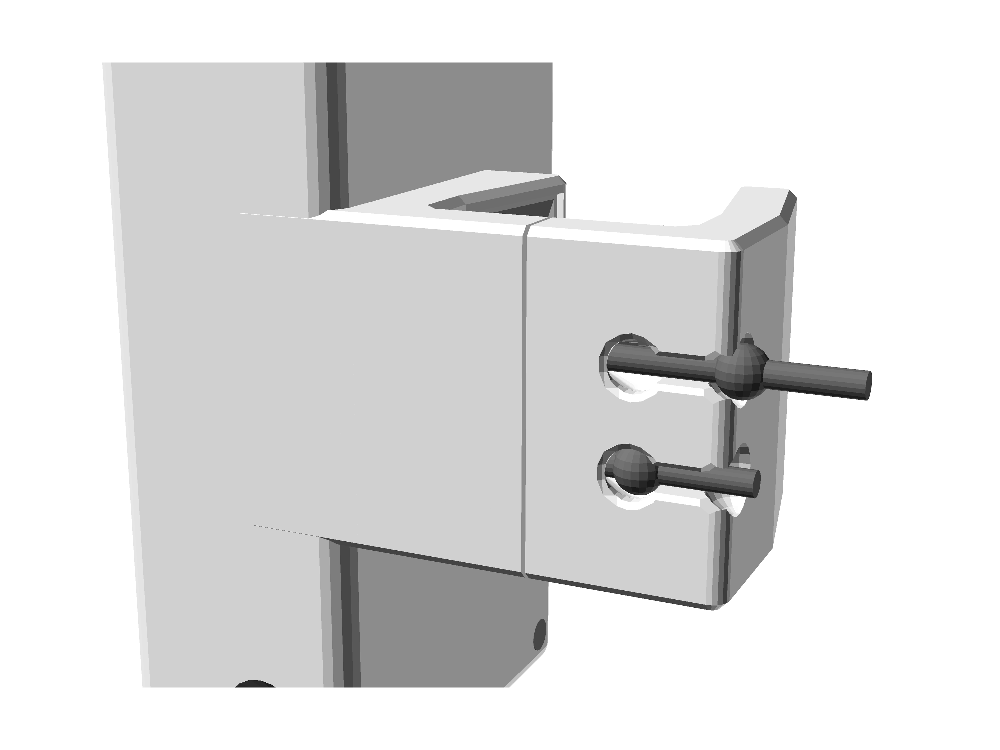

# ZonEcrón© Originale
## Manuale d'uso

### Contenuto

1. [Introduzione](#1-introduzione)
   - [1.1 Obiettivo del dispositivo](#11-obiettivo-del-dispositivo)
   - [1.2 Caratteristiche principali](#12-caratteristiche-principali)
   - [1.3 Confrontaci](#13-confrontaci)
2. [Uso](#2-uso)
   - [2.1 Montaggio e accensione](#21-montaggio-e-accensione)
   - [2.2 Allineamento e rilevamento](#22-allineamento-e-rilevamento)
   - [2.3 Auto-interferenza a infrarossi](#23-auto-interferenza-a-infrarossi)
   - [2.4 Comunicazione radio](#24-comunicazione-radio)
   - [2.5 Visualizzazione su schermo](#25-visualizzazione-su-schermo)
   - [2.6 Alimentazione e ricarica](#26-alimentazione-e-ricarica)
   - [2.7 Autonomia](#27-autonomia)
   - [2.8 Sole e pioggia](#28-sole-e-pioggia)
   - [2.9 Stoccaggio](#29-stoccaggio)
3. [Epilogo](#3-epilogo)
4. [Contatti](#4-contatti)

---

## 1 Introduzione

### 1.1 Obiettivo del dispositivo

Il ZonEcrón© (e quando diciamo ZonEcrón© immaginate luci al neon e fuochi d'artificio sullo sfondo – ok, questa parte la salterò per il resto del manuale per evitare di farlo troppo lungo) è stato progettato per soddisfare la necessità di cronometrare il tempo di esecuzione in aree specifiche (passerella, palizzata e bilanciere) e, logicamente, anche per cronometrare sequenze brevi per determinare quale opzione è migliore.

Con questo obiettivo in mente e grazie alla nostra propensione per il minimo sforzo, abbiamo aggiunto diverse condizioni, come installazione semplice, senza cavi, ecc., e abbiamo iniziato a sperimentare con varie tecnologie (infrarossi, radio, batterie, schermi, ecc.) per avvicinarci al nostro risultato finale.

Alla fine, il ZonEcrón® originale (d'ora in poi semplicemente ZonEcrón®) è nato con l'obiettivo di soddisfare la necessità di cronometrare durante l'addestramento di agility, ed è in questo contesto che intendiamo circoscriverlo. Anche se le caratteristiche del dispositivo permettono di utilizzarlo come cronometro in competizioni, sarebbero raccomandati alcuni accessori aggiuntivi (schermo grande, connessione al software della gara, una coppia di riserva, ecc.) per usarlo con questo scopo.

---

### 1.2 Caratteristiche principali

- Compatto, di piccole dimensioni con tutto integrato.
- Rapido da installare, per non scoraggiare l'uso frequente.
- Adatto all'uso esterno, visibile al sole e con una certa protezione dalla pioggia.
- Ricaricabile tramite USB, con un'autonomia superiore alle 30 ore.
- Sicuro: segnali innocui (infrarossi e wifi) e senza angoli taglienti.
- Fissaggio solido, adatto a materiali diversi (plastica, alluminio, ferro).
- Senza fili. Non si usano cavi, tranne per caricare le batterie.
- Lunga portata di comunicazione. Testato fino a 80 m, raccomandato per 40 m.
- Schermo integrato a 4 cifre con la massima risoluzione consentita per il tempo visualizzato (millisecondi, centesimi, decimi o secondi).
- Doppio sensore, superiore e inferiore, su ciascuna porta.

---

### 1.3 Confrontaci

Crediamo di aver sviluppato un prodotto unico in termini di prestazioni. Non abbiamo trovato altri prodotti che combinino tutte le caratteristiche del ZonEcrón©, che ora non ripeteremo.

Quando è emersa la necessità di avere un cronometro per l'allenamento, abbiamo cercato molto e bene e sì, abbiamo trovato altri prodotti con lo stesso obiettivo, ma nessuno soddisfaceva tutte le nostre esigenze, quindi abbiamo deciso di crearlo noi stessi.

Se avete una necessità specifica che il ZonEcrón© non soddisfa, ci sono prodotti simili. Vi invitiamo a cercare, confrontare e se trovate… beh, una mente curiosa è una mente sveglia.

---

## 2 Utilizzo

### 2.1 Configurazione e Accensione

Un paio di dispositivi ZonEcron© originali è composto da un trasmettitore a infrarossi (la scatola senza schermo) e un ricevitore a infrarossi (la scatola con schermo).

Entrambi presentano una pinza con un lato fisso sulla scatola e l'altro scorrevole lungo due aste di acciaio. Una fascia elastica interna mantiene i lati della pinza uniti. Questa fascia può essere rapidamente regolata su tre livelli di tensione spostando le estremità legate della fascia, adattandosi a diverse larghezze o spessori di pali. Consultare le immagini seguenti:

|                 Tensione Minima                        |                 Tensione Media                         |                 Tensione Massima                       |
|--------------------------------------------------------|--------------------------------------------------------|--------------------------------------------------------|
|  |  |  |
| Profilo binario largo.                                 | Per tubi rotondi.                                      | Profilo binario stretto.                               |
| es. salti in alluminio.                                | es. salti in PVC o pali.                               | es. salti in acciaio galvanizzato.                     |

Facendo scorrere la pinza per aprirla, posizionare lo ZonEcron© sulla parte verticale del palo o su un montante di salto. Il trasmettitore va a destra e il ricevitore a sinistra, allineando i due trasmettitori con i due ricevitori:

Successivamente, accendere il trasmettitore e il ricevitore. Per verificare che il trasmettitore sia acceso, controllare il LED blu, che sarà fisso o lampeggiante (se la batteria è scarica). Per quanto riguarda il ricevitore, la luce blu si accenderà immediatamente all'avvio, visualizzando vari messaggi sullo schermo. Quando il tempo segna zero (0.0), la luce blu si spegnerà se rileva correttamente il segnale a infrarossi del trasmettitore. Anche se l'ordine di configurazione e accensione non è importante, si consiglia di posizionare prima i dispositivi, accendendo il trasmettitore (senza schermo) prima del ricevitore (con schermo). Questo permette di controllare il livello della batteria di entrambi i dispositivi durante i messaggi iniziali sullo schermo.

**È fondamentale** lasciare uno spazio tra il palo e il trasmettitore inferiore per massimizzare la probabilità di rilevamento. Si consiglia di posizionare il trasmettitore inferiore 10 cm sopra il palo per XS, S e M, e 15 cm per L e XL. Per esempio, per M, dovrebbe apparire così:

---

### 2.2 Allineamento e Rilevamento

Una volta che il trasmettitore e il ricevitore sono posizionati di fronte e accesi, la luce blu sul ricevitore si spegnerà se l'allineamento è corretto e non ci sono ostacoli che bloccano il fascio a infrarossi. Quando il fascio viene interrotto (per passaggio o disallineamento), il LED blu sul ricevitore si accenderà per un minimo di 0,5 secondi o più, se l'interruzione persiste.

Il trasmettitore ha due LED a infrarossi, uno superiore e uno inferiore, e il ricevitore ha un sensore superiore e uno inferiore. La ricezione è selettiva, quindi il sensore superiore risponde solo all'infrarosso del LED superiore del trasmettitore, e lo stesso vale per la coppia inferiore. Questo crea due barriere lineari tra il trasmettitore e il ricevitore. Non c'è rilevamento incrociato. Se una di queste barriere viene interrotta, il cronometraggio inizia o si ferma.

Prestare attenzione a non posizionare trasmettitore e ricevitore troppo vicini o paralleli alle pareti, poiché la potenza del trasmettitore è sufficiente per riflettersi sulle superfici vicine o il suo bagliore (invisibile) potrebbe bypassare una mano se testato su un tavolo.

Si consiglia una distanza operativa minima di 1 m. La distanza massima dipende dalla luce ambientale, variando da 2 m alla luce diretta del sole fino a 20 m al buio con illuminazione artificiale della pista.

---

### 2.3 Auto-Interferenza a Infrarossi

A causa della potenza utilizzata dai fasci a infrarossi per operare in piena luce solare, un ricevitore potrebbe rilevare segnali da due trasmettitori. Questo effetto è più pronunciato in condizioni di scarsa illuminazione o in spazi chiusi.

Il sintomo più evidente è che la luce blu del ricevitore continua ad accendersi e spegnersi, e il timer potrebbe avviarsi o fermarsi inaspettatamente senza che il fascio venga interrotto.

Questo accade perché un ricevitore rileva segnali a infrarossi da due trasmettitori contemporaneamente a causa della posizione sulla pista o dei riflessi delle superfici vicine (pareti o vetro). Ad esempio, in questo caso, il ricevitore 1 (R1) riceve segnali a infrarossi sia dal trasmettitore 1 (T1) che dal trasmettitore 2 (T2):

Per evitare questo, posizionare i ricevitori in modo che ricevano segnali a infrarossi da un solo trasmettitore, ad esempio, cambiando lato del salto. Nell'esempio precedente, fare così:

Se non è possibile tenere la coppia 2 sul lato opposto del salto, utilizzare montanti di salto più lunghi o, come ultima risorsa, posizionarli al contrario:

---

### 2.4 Comunicazione Radio

La comunicazione radio viene stabilita automaticamente tra tutti gli elementi della famiglia ZonEcron©. Questa comunicazione opera nella gamma di frequenze Wi-Fi e può essere influenzata in ambienti con numerose reti Wi-Fi.

Lo ZonEcron© originale ha un'antenna interna in ciascun ricevitore (scatola con schermo) per stabilire questa comunicazione. L'affidabilità e il raggio di comunicazione ottimali si ottengono quando entrambi i ricevitori sono verticali, nella loro posizione di montaggio abituale.

La portata massima teorica è di 80 m in spazio aperto. Sperimentalmente, è stata raggiunta una portata di 200 m in un parco residenziale con numerose reti Wi-Fi circostanti, senza guasti di comunicazione. Tuttavia, si consiglia di non superare i 40 m su una pista standard per prestazioni ottimali.

---

### 2.5 Affichage à l'écran

Une fois le récepteur allumé et les différents messages affichés comme expliqué précédemment, l'écran affichera "0,0" sur les chiffres centraux. Si le chronométrage démarre sur l'une des paires émetteur-récepteur, le temps commencera à s'écouler sur les deux écrans. Pendant que le chronomètre fonctionne, les secondes et dixièmes de seconde seront affichés, et la position des chiffres pourra changer si les secondes dépassent 99, ou les dixièmes disparaîtront si les secondes dépassent 999.

Après l'arrêt du chronométrage, l'écran affichera le temps avec la résolution maximale possible :

| Résolution     | De       | À       | Exemple |
|----------------|----------|---------|---------|
| millisecondes  | 0,000s   | 9,999s  | 5,417   |
| centièmes      | 10,00s   | 99,99s  | 54,17   |
| dixièmes       | 100,0s   | 999,9s  | 541,7   |
| secondes       | 1000s    | 9999s   | 5417    |

Les deux écrans afficheront le même temps, car ils sont synchronisés au début, pendant et à la fin de la mesure.

---

### 2.6 Alimentation et Recharge

Les quatre appareils (deux émetteurs et deux récepteurs) sont équipés de batteries lithium rechargeables intégrées, ce qui élimine la nécessité de câbles d'alimentation ou de communication pendant l'utilisation.

Les niveaux de batterie peuvent être vérifiés via l'application ZonEcron ou le tableau de bord ZonEcron, en fonction du système d'affichage utilisé. Nous recommandons de consulter les manuels respectifs pour plus de détails. Les appareils indiquent également les niveaux de batterie via le clignotement de la LED bleue :

- **Batterie supérieure à 30 %** : LED bleue allumée en continu.
- **Batterie entre 30 % et 15 %** : LED bleue clignote lentement.
- **Batterie inférieure à 15 %** : LED bleue clignote rapidement.

Cet indicateur de charge est **approximatif**, car il est basé sur la mesure de la tension de la batterie, qui ne reflète pas toujours avec précision la charge restante. Il est donc normal que le pourcentage de charge chute rapidement de 100 % à 90 %, reste stable entre 90 % et 10 %, puis chute rapidement de 10 % à 0 %. Nous recommandons d'éviter une décharge excessive de la batterie pour prévenir les surprises désagréables.

Les appareils disposent d'un port USB-C situé en bas, à côté de l'interrupteur. Pour recharger les batteries, éteignez les appareils et connectez simplement un câble USB standard à un chargeur USB. La conception des connecteurs USB garantit qu'ils ne peuvent pas être mal branchés, même pour les utilisateurs les moins habiles.

**ATTENTION : TEMPÉRATURES EXTRÊMES.**  
Les batteries lithium ont une plage de fonctionnement et de recharge comprise entre 5 °C et 50 °C. En dehors de cette plage, leur alimentation en énergie peut fluctuer, ce qui entraîne un comportement irrégulier du chronomètre. De plus, la durée de charge sera réduite.  
Nous recommandons fortement de ne pas utiliser ou recharger les batteries en dehors de cette plage, en particulier si elles sont trop froides, car cela réduira drastiquement leur durée de vie ou les rendra totalement inutilisables. Si la journée a été très froide ou chaude, éteignez les appareils, laissez-les dans un endroit tempéré pendant une heure, puis rechargez-les.

**ATTENTION : NE PAS RECHARGER LES APPAREILS SANS SURVEILLANCE.**  
Aucun appareil alimenté par batterie ne doit être rechargé sans surveillance. Il est courant de laisser un téléphone branché toute la nuit sans problème, mais le fait que rien ne soit arrivé ne signifie pas que cela ne peut pas arriver. Il y a quelque temps, un grand fabricant a eu des problèmes de surchauffe et même d'explosion des batteries de téléphones lors du chargement. Protégez-vous et protégez vos proches. Il n'est pas nécessaire de surveiller l'appareil pendant 4 heures, mais si vous commencez à charger, il est conseillé de rester à proximité pour faire d'autres tâches. Si cela n'est pas possible, il est préférable de débrancher l'appareil et de reprendre la charge plus tard. Ces batteries n'ont pas d'effet mémoire et peuvent être rechargées par "tranches" sans problème.

**ATTENTION : INSPECTEZ APRÈS UN CHOC.**  
Il est très probable qu'un chien entre en collision avec l'aile supportant le ZonEcron©. Le design de l'appareil vise à être le plus résistant possible, en fixant solidement les pièces internes, mais dans de tels cas, il est obligatoire d'inspecter minutieusement l'appareil. Si des dommages visibles sont observés, si des pièces détachées sont entendues à l'intérieur ou si l'appareil surchauffe pendant la charge, éteignez et débranchez immédiatement l'appareil, puis placez-le dans un endroit sûr où il ne peut pas provoquer d'incendie. Contactez-nous pour discuter des solutions possibles.

Pour conclure, le ZonEcron© est équipé d'un circuit électronique qui contrôle la charge et la décharge de la batterie, empêchant les surcharges ou les décharges profondes. L'indication de batterie à 0 % est le niveau minimum recommandé auquel le ZonEcron© doit être rechargé. Cependant, l'appareil continuera de fonctionner jusqu'à ce que le circuit de protection coupe l'alimentation. Bien que cela puisse permettre une utilisation d'urgence, cela n'est pas recommandé comme pratique régulière, car cela affectera négativement la durée de vie de la batterie.

Enfin, la sagesse populaire qui recommande de décharger complètement les batteries avant de les recharger s'applique aux anciennes batteries Ni-Cd. Pour ces batteries au lithium "nouvelles" (bien que plus si nouvelles), **il vaut mieux ne pas les décharger complètement** (en fait, c'est nuisible). Il est bien mieux de les recharger lorsqu'elles sont à moitié pleines. Même les recharger en plusieurs fois, un peu maintenant et un peu plus tard, n'a aucun impact négatif.

---

### 2.7 Durata della Batteria

Un nuovo ZonEcrón originale ha una durata della batteria superiore a 40 ore, più che sufficiente per un giorno di utilizzo come cronometro in una competizione e ampiamente adeguata per le sessioni di allenamento. Questa durata della batteria diminuirà nel tempo a causa della normale usura delle batterie al litio.

La temperatura ambientale può anche influire negativamente sulla durata della batteria:
- Durante l'uso: Temperature più fredde riducono la durata della batteria. Non è consigliabile utilizzare i dispositivi a temperature inferiori a 0°C.
- Durante la ricarica: Si raccomanda di caricare le batterie a temperature moderate, tra 10°C e 30°C, per garantire una ricarica corretta e completa.

Per prolungare la durata della batteria, sono state implementate le seguenti strategie:
- Quando il cronometro è in funzione, la luminosità dello schermo è ridotta, poiché l'informazione critica è il tempo finale. Quando il cronometro si ferma, la luminosità dello schermo aumenta al massimo.
- Dopo che il cronometro si ferma, se non c'è attività per 30 secondi, la luminosità dello schermo si riduce di nuovo e, dopo altri 30 secondi, lo schermo si spegne, accendendosi solo per 1 secondo ogni 5 secondi.

---

### 2.8 Sole e Pioggia

Lo ZonEcrón originale è stato progettato per funzionare perfettamente all'aperto sia sotto il sole che sotto la pioggia.
- Il suo caratteristico colore bianco è stato scelto appositamente per evitare il surriscaldamento sotto il sole.
- Il suo design consente l'uso sotto la pioggia, a condizione che venga posizionato verticalmente con i connettori rivolti verso il basso per evitare l'ingresso di acqua attraverso le aperture.

---

### 2.9 Conservazione

Quando si conserva lo ZonEcrón, bisogna considerare l'umidità e la cura della batteria:
- Come già accennato, lo ZonEcrón è resistente alla pioggia ma non all'umidità prolungata. Se lasciato umido per diversi giorni, l'umidità penetrerà lentamente nella custodia, causando potenzialmente danni irreversibili ai componenti elettronici. Pertanto, se utilizzato sotto la pioggia, lasciarlo in un ambiente asciutto per un giorno per eliminare completamente l'umidità prima di riporlo.
- Per quanto riguarda la batteria, se non si prevede di utilizzare lo ZonEcrón per un po' di tempo, è meglio conservare le batterie a metà carica per massimizzarne la durata. Conservare batterie al litio completamente cariche o completamente scariche per lunghi periodi può ridurne significativamente le prestazioni.

---

## 3 Epilogo

Divertitevi con i vostri cani e non lasciate che la frustrazione prenda il sopravvento quando confrontate i tempi con gli altri (anche se una competizione amichevole rende l'allenamento più divertente). Dovete competere solo contro voi stessi.

Questo cronometro è pensato per aiutarvi a trovare la linea più fluida e veloce per voi e per i vostri cani.

Speriamo che possiate sfruttare al massimo lo ZonEcrón© e ricordate: niente rifiuti solo per risparmiare un passo, niente rifiuti per pigrizia. Date il massimo, ragazzi!

---

## 4 Contatti

Per supporto tecnico, domande o suggerimenti, potete contattarci via email all'indirizzo: [zonecron@gmail.com](mailto:zonecron@gmail.com)
