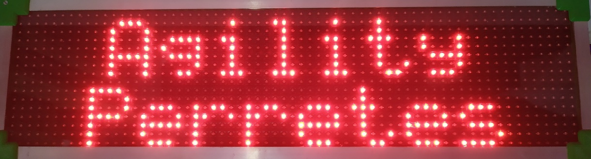

# Marcador ZonEcron
## Manuale d'Uso

1. [Introduzione](#1-introduzione)
   - [1.1 Specifiche tecniche](#11-specifiche-tecniche)
   - [1.2 Funzioni principali](#12-funzioni-principali)
   - [1.3 Componenti](#13-componenti)
   - [1.4 Montaggio e alimentazione](#14-montaggio-e-alimentazione)
2. [Schermo](#2-schermo)
   - [2.1 Descrizione generale](#21-descrizione-generale)
   - [2.2 Cicalino esternointerno](#22-cicalino-esternointerno)
   - [2.3 Comunicazione con l'ecosistema ZonEcron](#23-comunicazione-con-lecosistema-zonecron)
   - [2.4 Visualizzazione delle modalità operative](#24-visualizzazione-delle-modalità-operative)
     - [2.4.1 Modalità cronometraggio](#241-modalità-cronometraggio)
     - [2.4.2 Modalità partenza](#242-modalità-partenza)
     - [2.4.3 Modalità ricognizione della pista](#243-modalità-ricognizione-della-pista)
     - [2.4.4 Modalità games](#244-modalità-games)
   - [2.5 Visualizzazione dei messaggi](#25-visualizzazione-dei-messaggi)
     - [2.5.1 Messaggi iniziali](#251-messaggi-iniziali)
     - [2.5.2 Batteria dei sensori](#252-batteria-dei-sensori)
     - [2.5.3 Messaggi di errore dei sensori](#253-messaggi-di-errore-dei-sensori)
     - [2.5.4 Salvaschermo](#254-salvaschermo)
     - [2.5.5 Messaggi personalizzati](#255-messaggi-personalizzati)
   - [2.6 Limiti](#26-limiti)
3. [Server web integrato](#3-server-web-integrato)
   - [3.1 Descrizione](#31-descrizione)
   - [3.2 Reti WiFi](#32-reti-wifi)
     - [3.2.1 Connessione alla rete WiFi del tabellone](#321-connessione-alla-rete-wifi-del-tabellone)
     - [3.2.2 Cambio del nome, password e sicurezza](#322-cambio-del-nome-password-e-sicurezza)
     - [3.2.3 Recupero delle credenziali WiFi](#323-recupero-delle-credenziali-wifi)
     - [3.2.4 Collegare il display a una rete WiFi esterna](#324-collegare-il-display-a-una-rete-wifi-esterna)
   - [3.3 Pagine web](#33-pagine-web)
     - [3.3.1 Info](#331-info)
     - [3.3.2 File](#332-file)
     - [3.3.3 WiFi](#333-wifi)
     - [3.3.4 Personalizzazione](#334-personalizzazione)
     - [3.3.5 Speciali](#335-speciali)
     - [3.3.6 Telecomando](#336-telecomando)
     - [3.3.7 Monitor](#337-monitor)
     - [3.3.8 Software](#338-software)
     - [3.3.9 Streaming](#339-streaming)
4. [Contatti](#4-contatti)

---

## 1. Introduzione

### 1.1 Specifiche tecniche
**Generali**
- Schermo a LED ad alta luminosità 16x64, con indicazione fino a 999,99s, errori e rifiuti.
- Alimentazione: 230V ±10% 50Hz
- Dimensioni (senza treppiede): 66cm x 18cm x 12cm
- Peso: 5kg

**Controllo dei tempi**
- Segnale di orologio al cristallo di quarzo 16 MHz XO.
- Risoluzione massima: 0,001s.
- Deviazione media in 24 ore: ±20 ppm. (±0,07 s/h)
- Precisione del sistema con [ZonEcron Original](./original.md) (cronometro + sensori): da +0ms a +2ms.
- Precisione del sistema con [barre](./sensorBars.md) o [invisibile](./invisible.md) (cronometro + sensori): da +0ms a +6ms.

**Server web**
- Fino a 4 utenti simultanei.
- Orologio in tempo reale con TCXO ±2ppm per data e ora con batteria sostituibile della durata di 10 anni.
- Comunicazioni wireless 2,4GHz.
- Memoria: 350 KB FLASH, circa 3000 registrazioni di risultati, inclusi data e ora.

---

### 1.2 Funzioni principali
- Risoluzione in millisecondi per tempi inferiori a 10 secondi o in centesimi per tempi pari o superiori a 10 secondi.
- Indicazioni su schermo di penalità (massimo 9), rifiuti ed eliminazione.
- Avvisi su schermo per cellule fotoelettriche non allineate.
- Orologio in tempo reale con data e ora.
- Misurazione della temperatura interna.
- Salvaschermo personalizzabile (aggiungi il nome del tuo club!).
- Controllo tramite pagina web da smartphone/tablet/PC.
- Conto alla rovescia per riconoscimento pista, con pausa e configurazione in step di 1 minuto.
- Conto alla rovescia di 15s per partenze in competizioni di alto livello.
- Compatibile con gambler e snooker, con segnale acustico incluso.
- Molteplici passaggi per cellula in percorsi complessi.
- Personalizzazione dei colori dell'interfaccia web.
- Messaggi personalizzati su schermo per un periodo definito.

---

### 1.3 Componenti

Il dispositivo ZonEcron è composto da:
- Uno schermo a LED.
- Un treppiede per supportare lo schermo.
- Un cavo di alimentazione standard (230V 50Hz).
- Una valigetta per un comodo trasporto.
- A seconda del modello, un cicalino/sirena interno o esterno.

**Nota importante**: Assicurati di avere un set di cellule wireless ZonEcron (originale o invisibile) configurate per comunicare con lo schermo.

---

### 1.4 Montaggio e alimentazione

Montare il dispositivo ZonEcron è semplice, ma ci sono alcuni accorgimenti per un risultato ottimale:

1. **Inizia con il treppiede**:
   - Apri le gambe e dispiegale. Fissale con le viti a farfalla e assicurati che il treppiede sia stabile sul terreno.
   - Se non è necessaria molta altezza o c’è vento, è meglio non estendere la parte più sottile delle gambe. Puoi anche appendere un peso al gancio inferiore per una maggiore stabilità.
   - Se il terreno è irregolare, regola le gambe e usa le livelle a bolla per assicurarti che la testa del treppiede sia orizzontale.
   - Alcuni movimenti del treppiede sono stati bloccati intenzionalmente per migliorare la stabilità ed evitare cadute dello schermo. La testa del treppiede può ruotare solo sull’asse verticale per orientare lo schermo. Allenta la rotazione con la manopola laterale.

2. **Fissa lo schermo al treppiede**:
   - Apri la vite di bloccaggio sulla parte superiore del treppiede.
   - Inserisci la base quadrata dello schermo nella sede del treppiede fino a che non sia ben fissata.
   - Chiudi la vite di bloccaggio e verifica che tutto sia ben assicurato.

   **Attenzione!** Non spostare il treppiede con lo schermo montato, per evitare di danneggiare la base di fissaggio. Se devi spostarti, smonta lo schermo prima e poi muovi il treppiede.

3. **Collega il cavo di alimentazione**:
   - Inserisci il cavo nello schermo e poi in una presa di corrente.
   - Se utilizzi una prolunga, lascia sufficiente margine di cavo per evitare strappi in caso di inciampo.

4. **Accendi lo schermo**:
   - Premi l’interruttore nella parte inferiore dello schermo.
   - Se tutto funziona correttamente, l’interruttore si illuminerà e, in meno di 2 secondi, appariranno i messaggi iniziali sullo schermo. Consulta la sezione [2.5.1](#251-messaggi-iniziali) per maggiori dettagli.
   - Se l’interruttore non si illumina, probabilmente il problema è nel fusibile integrato nella presa dello schermo. Apri il vano del fusibile. Nei dispositivi nuovi, includiamo sempre un fusibile di ricambio che troverai nello stesso vano, separato dal fusibile in uso. Sostituiscilo e riprova.

---

## 2 Schermo

### 2.1 Descrizione Generale

Il pannello ZonEcron è progettato pensando alla sua funzionalità e durata, ma anche al comfort per gli utenti. Ecco le sue principali caratteristiche:

- **Materiale**: La struttura principale è realizzata in plastica, ideale per favorire le comunicazioni radio. Gli angoli sono dotati di pezzi stampati in 3D con bordi arrotondati per evitare spigoli vivi.
- **Manutenzione**: Non è necessaria alcuna manutenzione, salvo una pulizia esterna con un panno umido. In caso di necessità di accedere ai componenti interni, i pannelli anteriore e posteriore possono essere rimossi svitando le viti sugli spigoli e sugli angoli. I pannelli sono sigillati con silicone per impedire l’ingresso di acqua piovana. Questa sigillatura si stacca facilmente, ma sarà necessario applicare nuovo silicone dopo aver aperto i pannelli.
- **Ventilazione**: Dispone di due griglie; una dotata di una ventola che espelle l’aria calda dall’interno, mentre l’altra consente l’ingresso di aria fresca, evitando il surriscaldamento dell’elettronica.
- **Parte Inferiore**:
  - Presa di corrente con interruttore e fusibile.
  - Attacco per montare lo schermo sul treppiede.
  - Nelle versioni con cicalino esterno, troverai la linguetta per fissarlo e il connettore.

---

### 2.2 Cicalino Esterno/Interno

Il cicalino emetterà segnali acustici nei seguenti casi:
- **Fine del tempo di ricognizione della pista**: Emetterà brevi segnali intermittenti per 8 secondi.
- **Modalità giochi snooker**: Quando scade il tempo di apertura configurato, emetterà un segnale acustico per la durata impostata.
- **Modalità giochi gambler**: Quando scade il tempo di apertura e una seconda volta alla chiusura del tempo configurato, emetterà un segnale acustico per la durata impostata.

**Attenzione!** Nel caso della ricognizione della pista, il cicalino emetterà sempre un segnale intermittente, simile a una sveglia. Nel caso dei giochi, il segnale inviato al cicalino sarà continuo, ma alcuni modelli di cicalini integrano l’alternanza nella loro elettronica. Se desideri utilizzare il tuo cicalino, scegline uno che funzioni a 12V e consumi meno di 0,5A.

---

### 2.3 Comunicazione con l'Ecosistema ZonEcron

Tutti i dispositivi dell'ecosistema ZonEcron sono preconfigurati per connettersi automaticamente tra loro. Ogni set è codificato in modo univoco per evitare interferenze tra piste vicine. Pertanto, gli elementi di un set comunicheranno solo tra loro, e non sarà possibile utilizzare le cellule di un set con il pannello di un altro.

L'**ordine di accensione** è indifferente; non importa se accendi prima lo schermo, le cellule o lo zaino, tutto si connetterà automaticamente. Tuttavia, si consiglia di accendere e allineare le cellule prima di accendere lo schermo per poter visualizzare correttamente i livelli della batteria nei messaggi iniziali. Consulta la sezione [2.5.1](#251-messaggi-iniziali) per maggiori dettagli.

Inoltre, con il [**ZonEcron Original**](./original.md), il tempo sparirà dal piccolo display delle cellule e verrà mostrato il livello della batteria illuminando i 4 punti del display in questo modo:
- 100% a 81% -> 4 punti.
- 80% a 61% -> 3 punti.
- 60% a 41% -> 2 punti.
- 40% a 21% -> 1 punto.
- 20% a 0% -> Display spento.

---

### 2.4 Visualizzazione delle Modalità Operative

#### 2.4.1 Modalità Cronometraggio

Questa è la modalità principale del pannello ZonEcron, in cui viene mostrato:

- **Tempo**: Mostrato in grande.
- **Falli e Rifiuti**: Nella parte destra, con una "F" e una "R" davanti ai numeri. Se viene segnato "eliminato", questi vengono sostituiti da "ELI", ma il cronometro continuerà a scorrere per consentire correzioni o registrare il tempo finale del concorrente.

Display con il tempo in corso.

**Visualizzazione del tempo**:
- Quando il tempo è in corso: Un solo decimale (aggiornato ogni decimo di secondo).
- Quando il tempo è fermo:
  - Millesimi se inferiore a 10 secondi.
  - Centesimi se uguale o superiore a 10 secondi.

**Tempo massimo**: Quando si supera il limite di 100 secondi (raro in un percorso normale di agility), i numeri si restringono per mostrare un totale di cinque cifre. Il tempo massimo visualizzabile in questo modo è 999,99s. Il tempo totale può essere visualizzato sul web tramite il [telecomando](#336-telecomando).

---

#### 2.4.2 Modalità Partenza

In questa modalità, lo schermo mostra un conto alla rovescia (secondi e decimi) configurato in precedenza, solitamente di 15 secondi.

L'operatore del cronometro deve resettare il pannello prima di ogni concorrente con il [telecomando](#336-telecomando). Successivamente, al segnale del giudice, deve avviare il conto alla rovescia preimpostato. Dopo di ciò:
- Se il cane interrompe la cellula durante il conto alla rovescia, il cronometro inizierà normalmente.
- Se il conto alla rovescia raggiunge 0 senza che la cellula venga interrotta, il cronometro inizierà comunque, ignorando il primo passaggio attraverso la cellula.

---

#### 2.4.3 Modalità Ricognizione della Pista

Questa modalità mostra un conto alla rovescia con minuti e secondi, per la ricognizione della pista. Per impostazione predefinita, inizia da 7 minuti, ma è possibile regolare il tempo in passi di 1 minuto mentre è in pausa o in corso:
- **Importante**: In questa modalità, le cellule non hanno effetto.
- **Alla fine del conto alla rovescia**:
  - Viene visualizzato il messaggio "Tempo scaduto".
  - Suona un segnale acustico intermittente per 8 secondi.

---

#### 2.4.4 Modalità Games

Questa modalità è progettata per i giochi "snooker" e "gambler" del WAO (World Agility Open).

- **Snooker**: Cronometraggio normale fino al raggiungimento del tempo configurato, momento in cui viene emesso un segnale acustico (la durata del segnale è configurabile).
- **Gambler**:
  - Il tempo rimane nascosto dietro il messaggio "Tempus Fugit".
  - Al termine del tempo di apertura, suona il primo segnale acustico e il cronometro viene mostrato nuovamente in esecuzione.
  - Al termine del tempo di chiusura, suona il secondo segnale acustico (disponibile solo nel gambler).
  - In entrambe le fasi, se la cellula viene interrotta prima del tempo stabilito, viene mostrato il tempo trascorso e il segnale acustico non suona.
  - Il secondo segnale può essere disattivato impostando il tempo di chiusura a 0 secondi.

Esempio di gambler con tempo di apertura di 30s e tempo di chiusura di 12s:
- All'inizio del percorso, il cronometro è nascosto mostrando sullo schermo "Tempus Fugit".
- Dopo 30s di percorso, suona il primo segnale acustico e il cronometro viene mostrato normalmente.
- Dopo 42s di percorso (12s dopo il tempo di apertura), suona il secondo segnale acustico.

**CONSIGLIO**: Se l'ambiente è rumoroso, si consiglia di rafforzare il segnale acustico con un fischietto o un altro avviso manuale.

---

## 2.5 Visualizzazione dei Messaggi

### 2.5.1 Messaggi Iniziali

Quando accendi il pannello ZonEcron, nei primi secondi appariranno quattro messaggi sullo schermo:
1. Marca e modello.

2. Nome del club (screensaver configurato).

3. Ora e data del dispositivo.

4. Nome della rete WiFi (propria o esterna) e indirizzo IP.

Se una cellula rileva un passaggio durante questi messaggi, essi verranno interrotti e il cronometro passerà automaticamente alla schermata principale, iniziando a contare. Pertanto, se hai bisogno di verificare l'ora, la data o i dati di rete, è meglio accendere le cellule dopo aver visualizzato tutti i messaggi.

Particolare attenzione ai messaggi 3 e 4: assicurati che la data e l'ora siano corrette [vedi sezione 3.3.1](#331-info) e di ricordare la rete WiFi e l'IP assegnato per gestire il server web [vedi sezione 3.2](#32-connettersi-al-server).

---

### 2.5.2 Batteria dei Sensori

Quando accendi una coppia di cellule per la prima volta, vedrai la percentuale di batteria del ricevitore. Viene inoltre mostrata la batteria dell'emettitore, se quest'ultimo è correttamente allineato con il ricevitore. Se desideri verificare lo stato delle batterie successivamente senza dover spegnere e riaccendere tutto, puoi farlo tramite il web [vedi sezione 3.3.1](#331-info).

---

### 2.5.3 Messaggi di Errore dei Sensori

Se un sensore si disallinea (eccetto in modalità riconoscimento della pista), apparirà un messaggio di allarme che indica il sensore interessato. Se il cronometro è in esecuzione, continuerà a contare, ma non mostrerà il tempo finché il sensore non sarà correttamente allineato.

---

### 2.5.4 Salvaschermo

Se il cronometro rimane fermo per più di 2 minuti, si attiverà lo screensaver. Questo mostrerà un testo scorrevole alternato con l'ora ogni 10 secondi. È possibile configurare il testo da visualizzare [vedi sezione 3.3.4](#334-personalizzazione).

---

### 2.5.5 Messaggi Personalizzati

È possibile configurare messaggi personalizzati su due righe, con un massimo di 10 caratteri per riga. La [sezione 3.3.4](#334-personalizzazione) spiega come farlo. Questi messaggi verranno visualizzati solo quando il cronometro è fermo e scompariranno se viene inviato un comando di reset o se una cellula rileva un passaggio.

---

### 2.6 Limiti

- Il cronometro può misurare oltre 1.000 secondi, ma il display può mostrare solo fino a 999,99 secondi. Per tempi superiori, è possibile consultarli sulla pagina web del [telecomando](#336-telecomando) o del [monitor](#337-monitor).
- Il numero massimo di penalità che il display può registrare è 9.
- Il numero massimo di rifiuti registrabili è 2. Dal terzo rifiuto in poi, sarà mostrato come eliminato.

---

## 3 Server Web Integrato

### 3.1 Descrizione

Il pannello ZonEcron include un server web interno che ti consente di consultare, configurare e gestire il cronometro da qualsiasi dispositivo con connessione WiFi (smartphone, tablet, PC) senza bisogno di installare software aggiuntivi. Questo server web può connettersi a una rete WiFi esistente o creare la propria rete WiFi, quindi non è necessaria una connessione Internet.

---

### 3.2 Reti WiFi

#### 3.2.1 Connessione alla Rete WiFi del Tabellone

Quando accendi il tabellone ZonEcron, se non è stata configurata un'altra rete (ad esempio, al primo avvio), creerà la propria rete WiFi. Ogni pannello ha un nome di rete e una password univoci che saranno:

  - **Nome della rete**: ZonEcronXXXXXXXXXXXX
  - **Password**: XXXXXXXXXXXX

Dove "XXXXXXXXXXXX" sono numeri e lettere maiuscole dalla A alla F. Quindi, cercando e trovando la rete, saprai qual è la password... tu e tutti gli altri... quindi appena possibile, cambia la password (e il nome della rete) come spiegato nella [sezione 3.3.3](#333-wifi).

Collegati a questa rete WiFi e, una volta connesso:

1. Il tuo dispositivo potrebbe avvisarti che la rete non ha connessione Internet (ovviamente). Assicurati di mantenere la connessione.

2. **Nota importante**: Alcuni smartphone hanno una funzione "WiFi+" (o simile) che passa automaticamente ai dati mobili se la rete WiFi non ha Internet. Disattiva questa funzione per evitare problemi.
3. Apri un browser web (Chrome, Firefox, ecc.) e inserisci l'indirizzo `http://192.168.4.1`. Questo ti porterà alla pagina iniziale del pannello, dove potrai vedere il suo stato [sezione 3.3.1](#331-info).

---

#### 3.2.2 Cambio del nome, password e sicurezza

Ti consigliamo di cambiare il nome della rete e la password predefiniti, seguendo le istruzioni nella [sezione 3.3.3](#333-wifi). Questo è importante per proteggere il tuo dispositivo, proprio come faresti con il router di casa tua.

Durante le competizioni ufficiali, evita di utilizzare la rete WiFi generata dallo schermo. Il server è semplice e la sua unica protezione è la password della rete. In questi casi, collega lo schermo a una rete WiFi robusta creata da un router adatto per ambienti affollati o, come ultima risorsa, disattiva il WiFi.

---

#### 3.2.3 Recupero delle credenziali WiFi

Hai dimenticato la password della rete del tuo display ZonEcron? Non preoccuparti, esiste una procedura semplice per riconnetterti al display:

1. Spegni il display ZonEcron e le cellule.
2. Crea un hotspot (condivisione WiFi) sul tuo smartphone con il nome "**Recuperame**" (spagnolo per "recuperami") e la password "**Admin1234**" (sensibile alle maiuscole/minuscole).

3. Accendi il display ZonEcron.
4. Aspetta che si connetta alla rete "**Recuperame**" (quella del tuo smartphone).
5. Sul display ZonEcron appariranno il nome della rete ("Recuperame") e l'indirizzo IP assegnato dal tuo smartphone.
6. Accedi a quell'indirizzo IP dal browser del tuo smartphone e potrai riconfigurare il nome e la password della rete creata dal display ZonEcron come spiegato nella [sezione 3.3.3](#333-wifi).

**Non riesci ad accedere?**:
- Se "Recuperame" non appare sullo schermo, significa che il display non si è connesso alla rete condivisa dal tuo smartphone. Assicurati di aver scritto correttamente il nome della rete e la password (attenzione a maiuscole e minuscole) e che il tuo smartphone stia creando una rete a 2,4GHz. Le reti nuove a 5GHz non sono compatibili.
- Se appare la rete "Recuperame", assicurati che sia la tua rete e non quella generata da un altro smartphone nelle vicinanze.
- Se ancora non riesci ad accedere, scrivici per ricevere assistenza personalizzata all'indirizzo [ZonEcron@gmail.com](mailto:ZonEcron@gmail.com?subject=Problemi%20di%20connessione%20web).

---

#### 3.2.4 Collegare il display a una rete WiFi esterna

1. Quando accendi il display, controlla nei [messaggi iniziali](#251-messaggi-iniziali) la rete WiFi e l'IP.
2. Connettiti con il tuo smartphone/tablet/PC alla stessa rete WiFi. Se si tratta della rete creata dal display, segui i passi nella [sezione 3.2.1](#321-connettersi-alla-rete-wifi-del-display).
3. Accedi alla pagina web con le [impostazioni del WiFi](#333-wifi).
4. Nella sezione "Connect to Another Wi-Fi Network", verifica che sia attiva; in caso contrario, attivala.
5. Nel menu a discesa di quella sezione, seleziona la rete WiFi a cui desideri connettere il display e inserisci e conferma la password.
6. Dopo aver cliccato su "Applica", apparirà un avviso e, accettandolo, il server web si riavvierà.
7. Controlla i messaggi sullo schermo per verificare che il display si sia connesso alla rete WiFi configurata. In caso contrario, ripeti i passi, assicurandoti di inserire correttamente la password.
8. **Importante**: La password non può contenere simboli particolari, né barra inversa ( \ ) né punto e virgola ( ; ). La rete WiFi deve essere a 2,4GHz. Le reti più recenti a 5GHz non sono supportate.

**SUGGERIMENTO**: Per non perdere i messaggi sullo schermo mentre il cronometro potrebbe avviarsi, effettua questa configurazione con le cellule spente.

Guarda il video (Attiva i sottotitoli nella tua lingua preferita, poiché l'audio è in spagnolo):  
[Guarda il video su YouTube](https://youtu.be/FqYA5eCeje0)  

---

### 3.3 Pagine web

Quando accedi alla pagina web del display ZonEcron, la pagina principale sarà la scheda "Info". A seconda che tu stia utilizzando uno smartphone o un PC, le schede appariranno nella parte superiore o sul lato sinistro. In ogni scheda troverai opzioni diverse che ti permetteranno di configurare il display o semplicemente consultare alcune informazioni.

---

#### 3.3.1 Info

In questa sezione puoi:

- **Sincronizzare data e ora**: Regola data e ora del cronometro per farle coincidere con quelle del tuo dispositivo semplicemente premendo un pulsante.
- **Controllare la temperatura interna**: Molto utile per assicurarsi che tutto funzioni correttamente.
- **Verificare lo stato delle cellule**: Se sono accese, puoi controllare la percentuale di batteria di ciascuna.
- **Visualizzare le informazioni sulla versione del display**.

Pagina informativa:

---

#### 3.3.2 File

In questa scheda puoi gestire i file memorizzati sul server del display ZonEcron. Menzioniamo in particolare i **registri dei tempi**, che sono i file denominati `cronoLog#.txt` e contengono i registri dei tempi. Qui `#` è un numero da 0 a 3. Clicca su di essi per visualizzarli e consultare tutti i tempi registrati dal display.

- **Elenco file**: Mostra un elenco di tutti i file e, in fondo, lo spazio totale occupato e disponibile. Si tratta di pochi KB, dato che questo server è molto leggero.
- **Caricare file**: Questa opzione non dovrebbe mai essere utilizzata. Per questo motivo, non condividiamo qui la chiave necessaria. Se in futuro dovessi averne bisogno, ti forniremo noi la chiave. Un esempio di utilizzo potrebbe essere sostituire il logo ZonEcron con quello della tua associazione, ma il file deve rispettare determinati requisiti e richiederemo di verificarlo prima di caricarlo.
- **Eliminare file**: Come sopra.
- **Cancellare registri dei tempi**: Inserendo la chiave "disturbingLackOfFaith", il server cancellerà tutti i **registri dei tempi** e inizierà a registrare da zero. Può essere utile se non vuoi conservare i registri di una gara precedente prima di iniziarne una nuova, ma generalmente non è necessario poiché il display sovrascriverà i registri più vecchi per non esaurire mai lo spazio.

**SUGGERIMENTO**: Se hai più registri dei tempi, quello in cui il display sta attualmente registrando sarà il più piccolo.

Esempio di registrazione dei tempi: 

---

#### 3.3.3 WiFi

Il display ZonEcron può creare la propria rete WiFi o connettersi a una rete esistente. Per impostazione predefinita, ricorderà l'ultima rete utilizzata e tenterà di connettersi ad essa. Se non riesce, creerà la propria rete WiFi.

In questa scheda puoi gestire la rete WiFi propria creata dal display e/o quella a cui deve connettersi. Solo una delle due modalità (rete propria o esterna) sarà attiva. Anche se è possibile accendere entrambe contemporaneamente per modifiche temporanee, non è consigliabile operare abitualmente con entrambe accese, poiché ciò potrebbe causare problemi di connessione.

- **Creare rete WiFi propria**: Attiva o disattiva la rete e modifica il nome e la password secondo le tue esigenze. Utile per il recupero del WiFi.
- **Connettersi a una rete esistente**: Scansiona le reti disponibili e seleziona quella a cui connettersi. Mostra anche la qualità del segnale una volta connesso.
- **Riavvio**:
  - **Riavvio**: Questa opzione spegnerà e riaccenderà il server (non il display). Tutte le connessioni WiFi attive verranno interrotte.
  - **Reset**: Cancella tutte le configurazioni WiFi e ripristina i valori di fabbrica. Successivamente esegue un riavvio del server come nella precedente opzione.

Come già accennato, questo server è molto piccolo e ha capacità limitate. Si consiglia un massimo di 3 utenti simultanei per mantenere le connessioni fluide.

**SUGGERIMENTO**: Se disattivi entrambe le modalità (rete propria e rete esterna), il display ZonEcron rimarrà senza WiFi (le cellule continueranno a funzionare) fino a quando non verrà riavviato. Utile in caso di sospette interferenze intenzionali.

---

#### 3.3.4 Personalizzazione

Qui puoi regolare diversi aspetti per adattare il display ZonEcron alle tue esigenze:

- **Club**: Configura due righe di testo con un massimo di 10 caratteri ciascuna, solitamente il nome del club. Questo testo sarà utilizzato come salvaschermo quando il display rimane inattivo per più di 2 minuti.
- **Messaggi temporanei**: Definisci messaggi che appariranno sullo schermo mentre il cronometro è fermo. Puoi impostare la loro durata o lasciarli indefiniti (tempo 0). Questi messaggi scompariranno se il cronometro viene resettato o se una cellula rileva un passaggio.
- **Colori**: Modifica i colori dell'interfaccia web. Le modifiche sono visibili immediatamente, ma non saranno salvate finché non le confermi. Evita combinazioni che possano risultare fastidiose per la vista. Ad esempio:

---

#### 3.3.5 Speciali

In questa sezione puoi configurare modalità speciali per competizioni o allenamenti:

- **Games**: Configura i parametri per lo svolgimento di una manche di games secondo il funzionamento spiegato nella [sezione 2.4.4](#244-modalità-games).
- **Rilevamento multiplo**: Imposta le rilevazioni extra necessarie affinché il cronometro si fermi e lo schermo mostri il tempo congelato durante le rilevazioni intermedie mentre il cronometro continua a scorrere.
- **Tempo di partenza**: Attiva la modalità partenza e imposta il tempo di partenza (di default, 15 secondi) per funzionare come descritto nella [sezione 2.4.2](#242-modalità-partenza).

Quando si applica la modalità Giochi o la modalità Rilevamento Multiplo, verrà visualizzato un messaggio di conferma sullo schermo (se il timer è fermo):

- Modalità games:

- Modalità rilevamento multiplo:

---

#### 3.3.6 Telecomando

Da questa schermata, l'operatore del cronometro può gestire (ad esempio, tramite il proprio smartphone) le principali funzioni del cronometro, tra cui:

- Segnalare penalità, rifiuti e eliminazioni.
- Resettare il cronometro.
- Attivare la modalità di riconoscimento del percorso e regolare il suo tempo.

Telecomando su un cellulare:

Il telecomando mostra il tempo corrente, lo stato della batteria scarica o il disallineamento delle celle e gli ultimi 5 risultati in fondo per una rapida consultazione da parte del team di pista.

Alcune regole:

- **Rifiuti all'inizio**: Se il cronometro è resettato, segnare un rifiuto farà partire il tempo e ignorerà il primo passaggio sulla cellula. (Se il cronometro non è resettato, il rifiuto sarà aggiunto al risultato mostrato sullo schermo).
- **Correzioni**: Puoi correggere penalità, rifiuti ed eliminazioni anche dopo che il percorso è terminato.
- **Reset**: Questo pulsante è attivo solo per 5 secondi dopo il termine di un percorso o quando il concorrente è eliminato, per evitare reset accidentali (che non possono essere corretti).

---

#### 3.3.7 Monitor

La schermata del monitor mostra le stesse informazioni del telecomando, ma senza i pulsanti. È ideale per videomarcatori rivolti al pubblico, poiché può anche mostrare il logo del club come sfondo.

---

#### 3.3.8 Software

In questa sezione puoi configurare la connessione del display con un software di terze parti tramite websocket. Sebbene inizialmente pensato per comunicare con la piattaforma [FlowAgility](https://www.flowagility.com/), il display può connettersi a qualsiasi software che disponga di un server websocket utilizzando il protocollo di messaggi [descritto qui](https://github.com/ZonEcron/ZonEcron-Interfacing/blob/main/WebsocketClient.md#4-mode-meanings-and-examples).

Nota che, per connettere il display in questo modo, è necessario che sia collegato a una rete WiFi esterna, come descritto nella [sezione 3.2.4](#324-connettere-il-display-a-una-rete-wifi-esterna). Inoltre, se il software è una piattaforma online, come nel caso di FlowAgility, questa rete WiFi deve avere accesso a Internet.

In questa pagina trovi:

- **Indirizzo del software**: In questa sezione sono riportati i dati necessari per connettersi alla piattaforma FlowAgility (o ad altri software di terze parti):
  - URL: L'indirizzo a cui il display deve tentare di connettersi. Questo indirizzo deve essere fornito dal software al quale ci si vuole connettere.
  - MAC address: L'indirizzo MAC del display. FlowAgility richiede questo indirizzo per generare l'URL di connessione menzionato sopra.
  - Un indicatore dello stato attuale della connessione.
- **Serial & WS client connection log**: Per visualizzare i messaggi provenienti dal cronometro e dal software di terze parti. Questo log ha un massimo di 5000 caratteri; al raggiungimento del limite, i messaggi più vecchi saranno eliminati per mostrare i più recenti. Inoltre, il log non viene salvato; se si abbandona o si ricarica la pagina, il log riparte da zero.
- **DANGER ZONE - KEEP AWAY BUTTERFINGERS**: In questa sezione, che si consiglia di non utilizzare senza conoscenze tecniche, premendo il pulsante appariranno i seguenti campi:
  - SSL: Per utilizzare una connessione websocket sicura (wss) o normale (ws).
  - Port: Per modificare la porta del server a cui il display deve connettersi.
  - Extra Info: Per mostrare ulteriori informazioni nel log.

---

#### 3.3.9 Streaming

Questa schermata non è direttamente accessibile tramite il menu, ma può essere visualizzata nell'elenco dei file.

È progettata per essere catturata da programmi di streaming per mostrare il conteggio in tempo reale.  

Se avete bisogno di qualcosa di più sofisticato o personalizzabile, potete utilizzare [il nostro HTML personalizzabile](https://github.com/ZonEcron/FlowAgilityStreamingInfo). È pensato per connettersi anche con FlowAgility, ma non è obbligatorio, e le informazioni non utilizzate possono essere nascoste. Personalizzatelo come preferite e collegatelo al tabellone per uno streaming/videowall impressionante.  
  

---

## 4 Contatti

Per supporto tecnico, domande o suggerimenti, puoi contattarci via email: [ZonEcron@gmail.com](mailto:ZonEcron@gmail.com?subject=Display%20ZonEcron).
