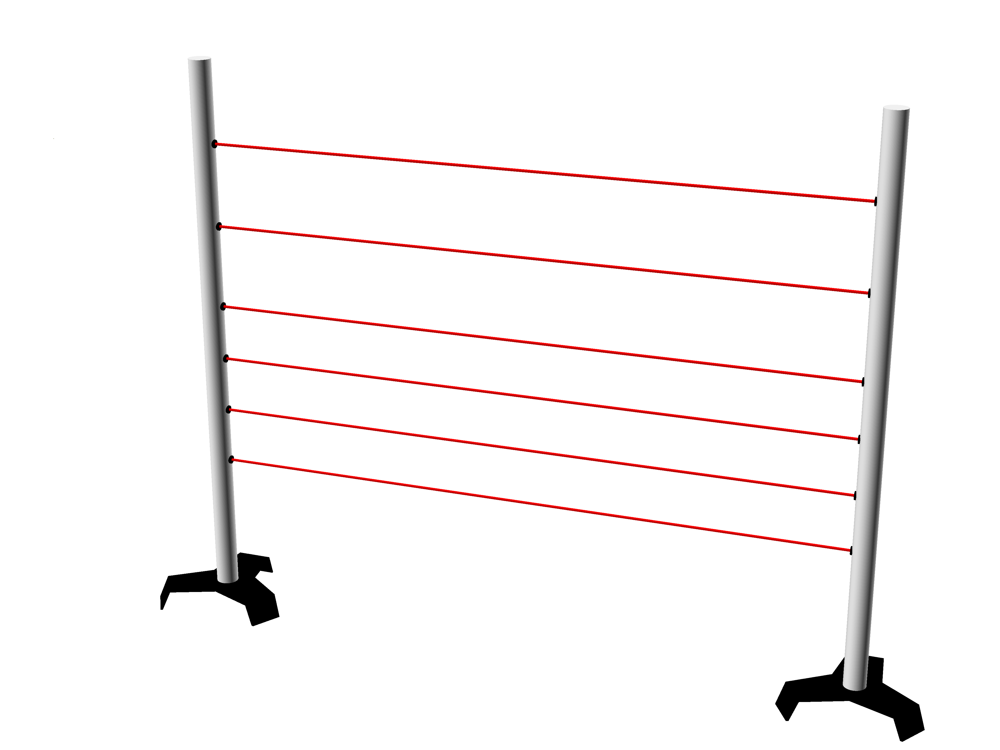
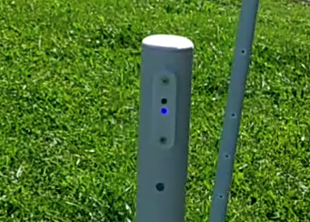
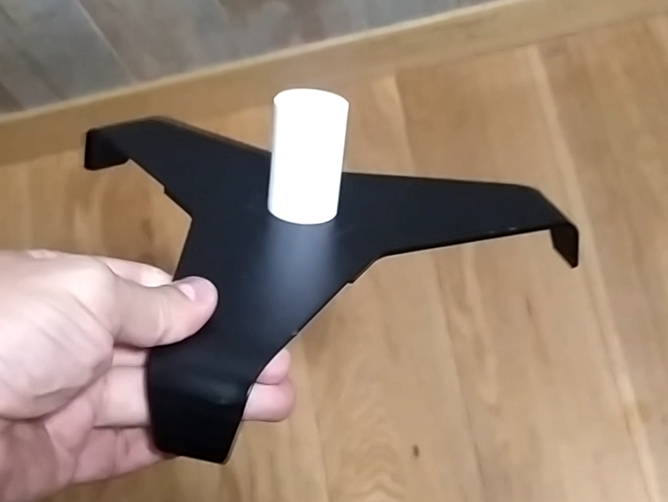
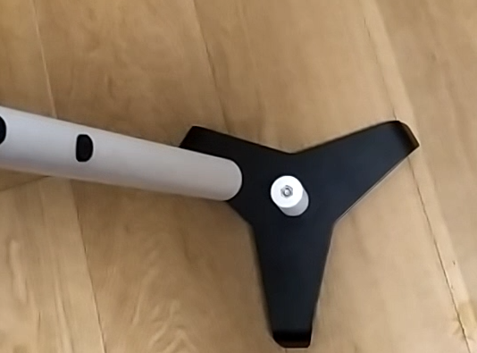

# ZonEcrón© Barre
## Manuale d'Uso

## Contenuto

1. [Introduzione](#1-introduzione)
   - [1.1 Obiettivo dell’attrezzatura](#11-obiettivo-dell’attrezzatura)
   - [1.2 Caratteristiche principali](#12-caratteristiche-principali)
   - [1.3 Confrontateci](#13-confrontateci)
2. [Utilizzo](#2-utilizzo)
   - [2.1 Montaggio e accensione](#21-montaggio-e-accensione)
   - [2.2 Allineamento e rilevamento](#22-allineamento-e-rilevamento)
   - [2.3 Auto-interferenza degli infrarossi](#23-auto-interferenza-degli-infrarossi)
   - [2.4 Comunicazione radio](#24-comunicazione-radio)
   - [2.5 Visualizzazione su schermo](#25-visualizzazione-su-schermo)
   - [2.6 Alimentazione e ricarica](#26-alimentazione-e-ricarica)
   - [2.7 Autonomia](#27-autonomia)
   - [2.8 Sole e pioggia](#28-sole-e-pioggia)
   - [2.9 Conservazione](#29-conservazione)
3. [Epilogo](#3-epilogo)
4. [Contatti](#4-contatti)

---

## 1 Introduzione

### 1.1 Obiettivo dell’attrezzatura

Le barre ZonEcrón®, e quando diciamo ZonEcrón® vogliamo che immaginiate luci al neon e fuochi d'artificio sullo sfondo, come dicevamo, le barre ZonEcrón® sono state concepite dopo il sistema invisibile, a seguito dell’aggiornamento delle normative che consente che il percorso non inizi o termini con un salto.

Proprio come per il sistema invisibile, data la nostra natura incline al minimo sforzo, abbiamo aggiunto gli stessi requisiti, ovvero installazione facile, senza cavi, senza necessità di modificare l'altezza di rilevamento e il fatto che tutto fosse installato all'interno di un tubo per ridurre al minimo l'ingombro.

Infine, le barre ZonEcrón® (da ora in poi semplicemente ZonEcrón®) nascono con l’obiettivo di migliorare i sistemi di cronometraggio disponibili attualmente, offrendo maggiore semplicità d’uso e sicurezza per cani e conduttori.

---

### 1.2 Caratteristiche principali

- Design compatto: tutti gli elementi sono all’interno della barra (tubo).
- Rapido da installare, veloce quanto montare un salto.
- Adatto all’esterno: utilizzabile sia sotto il sole che sotto la pioggia.
- Ricaricabile: tramite USB, con autonomia superiore a 30 ore.
- Sicuro: segnali innocui (infrarossi e Wi-Fi) e senza spigoli.
- Senza fili: nessun cavo utilizzato, tranne per la ricarica delle batterie.
- Lunga portata di comunicazione: testato fino a 200 m, consigliato fino a 40 m.
- 6 sensori che eliminano la necessità di spostare le cellule durante i cambi di altezza.

---

### 1.3 Confrontateci

Crediamo di aver sviluppato un prodotto unico nelle sue prestazioni. Noi non abbiamo trovato nessun altro prodotto che combini tutte le caratteristiche del ZonEcrón®, che non ripeteremo qui.

Quando abbiamo avuto la necessità di disporre di un cronometro da competizione, abbiamo cercato a lungo e con attenzione. Abbiamo trovato altri prodotti con lo stesso obiettivo, ma nessuno soddisfaceva tutte le nostre esigenze. Ecco perché abbiamo deciso di crearlo noi stessi.

Se avete una necessità specifica che il ZonEcrón® non soddisfa, ci sono altri prodotti simili. Vi invitiamo a cercare, confrontare e, se trovat... beh, insomma… una mente che domanda è una mente sveglia.

---

## 2 Uso

### 2.1 Montaggio e accensione

Tutta l'elettronica, la batteria, l'antenna, ecc., è installata all'interno della barra (tubo) e, dato che non si può vedere... l'abbiamo chiamata barre. Dovrò parlare con il reparto marketing, perché sembra che non si stiano impegnando molto. In ogni coppia, una barra avrà all'interno gli emettitori a infrarossi (la parte superiore ha 1 LED e le finiture sono bianche), mentre l'altra barra avrà all'interno i ricevitori a infrarossi (la parte superiore ha 2 LED e le finiture sono nere):

Qui potete vedere i due LED del ricevitore nella parte superiore e l'emettitore di fronte con le finiture bianche.

Prestate attenzione a non mettere due barre con emettitori nella stessa coppia, perché ovviamente non funzioneranno (non sarebbe la prima volta che succede). I più attenti avranno notato che, allo stesso modo, due barre con ricevitori nella stessa coppia non funzioneranno.

Non sappiamo se siamo stati abbastanza chiari... Nel dubbio, in ogni coppia dovrete mettere un'ala con emettitori e un'ala con ricevitori.

Prima di posizionare le barre una di fronte all'altra, bisogna accenderle, poiché l'interruttore e la porta per caricare la batteria si trovano nella parte inferiore del tubo e non possono essere accesi o spenti una volta montati sulla base.

I LED (1 o 2 a seconda del tipo) si accendono istantaneamente. Nel caso del ricevitore, rimangono accesi per 5 secondi mentre si stabiliscono le comunicazioni radio. I LED blu rimarranno accesi per indicare che la barra è… esatto… accesa. Dovrò parlare anche con il reparto R&D, perché sembra che seguano le orme del marketing.

Per mantenere le barre in posizione verticale, è necessario assemblare i cilindri di fissaggio alle basi a tre supporti. Questi cilindri sono fissati alla base con una vite e un dado che collegano le due parti del cilindro, assicurandosi che la parte più lunga, destinata a inserirsi nel tubo, sia posizionata nella parte superiore della base. Non è necessario stringerli con una chiave: la forza manuale è sufficiente. Usare una chiave potrebbe danneggiare la plastica con cui sono realizzati questi cilindri di fissaggio:

Infine, bisogna inserire le barre nei cilindri delle basi, assicurandosi di allineare correttamente i 6 emettitori di una barra con i 6 ricevitori dell'altra barra:

---

### 2.2 Allineamento e Rilevamento

Una volta che l'emettitore e il ricevitore sono uno di fronte all'altro e accesi, si creano 6 fasci a infrarossi tra i 6 emettitori e i 6 ricevitori, in grado di rilevare il passaggio di qualsiasi cane a qualsiasi altezza:

Il LED bianco sulla barra dei ricevitori si spegne se l'allineamento è corretto e si accende per indicare che uno di questi fasci è stato interrotto. Il LED rimarrà acceso per un minimo di 0,5 secondi o, se l'interruzione dura più a lungo, rimarrà acceso per tutto quel tempo. Se uno qualsiasi di questi fasci viene interrotto, il cronometro inizierà o si fermerà.

L'uso normale è prima del primo ostacolo e dopo l'ultimo in un percorso di gara, ma può essere utilizzato anche per cronometrare sequenze, montando le barre all'uscita di un tunnel, per esempio. Attenzione a non posizionare emettitore e ricevitore troppo vicini o paralleli a pareti, poiché la potenza dell'emettitore è sufficiente per rimbalzare su oggetti vicini o il suo bagliore (invisibile) può attraversare una mano se sono troppo vicini. Si consiglia una distanza minima di utilizzo di 1 m. La distanza massima dipende dalla quantità di luce ambientale. Varia da 2 metri in piena luce solare fino a 20 metri in condizioni di oscurità con illuminazione artificiale.

---

### 2.3 Auto-interferenza degli Infrarossi

A causa della potenza impiegata per funzionare alla luce diretta del sole, può accadere che un ricevitore riceva gli infrarossi da 2 emettitori. Questo effetto è più evidente in condizioni di scarsa luminosità o in spazi chiusi.
Il sintomo più evidente è che il LED bianco del ricevitore si accende e si spegne costantemente, e il conteggio del tempo può iniziare e fermarsi senza che nessun fascio sia stato interrotto.
Ciò può accadere anche se le barre sono più o meno allineate. Esempio:

In questo caso il ricevitore 1 (R1) riceve gli infrarossi dall'emettitore 1 (E1) e dall'emettitore 2 (E2), causando confusione.

Per evitare questo, posizioneremo i 2 ricevitori in direzioni opposte, in modo che ricevano gli infrarossi solo da un singolo emettitore. Nell'esempio precedente faremo così:

---

### 2.4 Comunicazione Radio

La comunicazione radio si stabilisce automaticamente tra le celle e altri accessori della famiglia ZonEcrón®. Questa comunicazione opera nella gamma di frequenze Wi-Fi e può essere influenzata in ambienti con molte reti Wi-Fi.

Ogni ricevitore ZonEcrón® è dotato di un'antenna interna per stabilire questa comunicazione. La portata massima teorica è di 80 m in campo aperto. Abbiamo testato una portata di 200 m in un parco in un'area residenziale con diverse reti Wi-Fi nelle vicinanze, senza problemi di comunicazione. Si consiglia di non superare i 40 m in una pista regolamentare per prestazioni ottimali.

---

### 2.5 Visualizzazione sul Display

A differenza del ZonEcrón® originale, il sistema invisibile non dispone di display integrato. Per visualizzare i tempi sarà necessario un display ZonEcrón® o un dongle ZonEcrón® collegato a un computer insieme alla nostra applicazione. Rimandiamo ai manuali di questi elementi per ulteriori informazioni.

---

### 2.6 Alimentazione e ricarica

I quattro dispositivi (due trasmettitori e due ricevitori) sono dotati di una batteria interna al litio ricaricabile, quindi non è necessario utilizzare cavi di alimentazione o comunicazione durante l'uso.

I livelli di batteria possono essere consultati tramite l'app ZonEcron o sul display ZonEcron, a seconda del sistema di visualizzazione utilizzato. Si consiglia di consultare i manuali specifici per ulteriori dettagli. Inoltre, i dispositivi indicano il livello della batteria tramite il lampeggio dei LED blu:
- **Batteria superiore al 30%**: LED blu fisso.
- **Batteria tra il 30% e il 15%**: lampeggio lento del LED blu.
- **Batteria inferiore al 15%**: lampeggio rapido del LED blu.

Questo indicatore di carica è **approssimativo**, poiché si basa sulla misurazione della tensione della batteria, che non sempre riflette con precisione la carica residua. Per questo motivo, è normale che la percentuale di carica scenda rapidamente dal 100% al 90%, rimanga stabile tra il 90% e il 10%, e poi cali velocemente dal 10% allo 0%. Si raccomanda di non esaurire la batteria per evitare spiacevoli sorprese e commenti tipo "ahi ahi" o "oh no".

I dispositivi dispongono di una porta USB-C nella parte inferiore accanto all'interruttore. Per ricaricare le batterie, i dispositivi devono essere spenti e basta collegare un cavo USB standard a un caricatore USB. Grazie alla differenza nei connettori dei cavi USB, non è fisicamente possibile collegarli in modo errato, quindi anche i più maldestri sono al sicuro.

**ATTENZIONE: TEMPERATURE ESTREME.**

Le batterie al litio hanno un intervallo di utilizzo e ricarica compreso tra 5°C e 50°C. Al di fuori di questo intervallo, l'energia fornita può variare, causando comportamenti irregolari del cronometro. Anche la durata della carica sarà più breve.

Si consiglia vivamente di non utilizzare né ricaricare le batterie al di fuori di questo intervallo, soprattutto se troppo fredde, poiché ciò ridurrebbe drasticamente la loro durata o le renderebbe inutilizzabili. Se il giorno è stato molto freddo o caldo, spegnete i dispositivi e lasciateli in un ambiente a temperatura ragionevole. Attendete un'ora affinché si adattino, quindi procedete alla ricarica.

**ATTENZIONE PERICOLO: NON RICARICARE I DISPOSITIVI SENZA SUPERVISIONE.**

Nessun dispositivo a batteria dovrebbe essere ricaricato senza supervisione. È comune lasciare il cellulare in carica tutta la notte senza problemi, ma il fatto che non accada nulla non significa che sia impossibile. Recentemente, una grande azienda ha avuto problemi con le batterie dei suoi cellulari che, durante la ricarica, si surriscaldavano fino a esplodere. Perciò, proteggete voi stessi e chi vi sta vicino. Non è necessario monitorare continuamente per 4 ore, ma è consigliabile rimanere nelle vicinanze mentre i dispositivi sono in carica. Se non è possibile, è meglio scollegarli e continuare la ricarica in un altro momento. Queste batterie non soffrono di "memoria" e possono essere ricaricate a intervalli senza problemi.

**ATTENZIONE PERICOLO: ISPEZIONARE IN CASO DI IMPATTO.**

È probabile che, prima o poi, un cane colpisca l'ala in cui si trova il ZonEcron©. Nel design si è cercato di rendere il dispositivo il più resistente possibile e fissare saldamente le parti interne, ma in questi casi è obbligatorio ispezionare attentamente il dispositivo. Se si nota un danno, se si sentono parti allentate all'interno o se si surriscalda durante la ricarica, spegnere immediatamente il dispositivo, scollegarlo e posizionarlo in un'area sicura lontano da materiali infiammabili. Contattateci per valutare le soluzioni possibili.

Detto ciò, il ZonEcron© è dotato di un circuito elettronico che controlla la carica e la scarica delle batterie. Impedisce che vengano caricate o scaricate eccessivamente. L'indicazione dello 0% di batteria è il livello minimo consigliato, a partire dal quale è necessario ricaricare il ZonEcron©. Tuttavia, il dispositivo rimarrà acceso finché il circuito di protezione elettronico non interromperà l'alimentazione. Questo può permettere di utilizzare il ZonEcron© in caso di emergenza, ma non è consigliabile farlo abitualmente poiché ciò influirà negativamente sulla durata delle batterie.

Infine, quel consiglio popolare che suggerisce di scaricare completamente le batterie prima di ricaricarle si applica alle vecchie batterie al Ni-Cd. Per queste batterie al litio "moderne" (ormai non così nuove), **è meglio non scaricarle completamente** (in realtà, è dannoso). È molto più consigliabile ricaricarle quando sono a metà carica. Anche ricaricarle a intervalli non ha alcun impatto negativo.

---

### 2.7 Autonomia

Un dispositivo nuovo ha un'autonomia superiore a 35 ore, ampiamente sufficiente per una competizione di due giornate. Questa autonomia diminuirà nel tempo a causa del normale ciclo di vita delle batterie al litio.

Anche la temperatura ambientale può influire negativamente sulla durata della batteria:
- Durante l'uso, temperature più basse riducono l'autonomia. Si sconsiglia di utilizzare i dispositivi a temperature inferiori a 0°C.
- Durante la ricarica, si consiglia di effettuare il processo a temperature moderate tra 10°C e 30°C per garantire una carica corretta e completa.

Per aumentare l'autonomia, sono state adottate le seguenti strategie:
- Durante il funzionamento del cronometro, la luminosità dello schermo si riduce, poiché l'informazione principale è il tempo misurato. Quando il cronometro si ferma, la luminosità aumenta.
- Una volta fermo il cronometro, dopo 30 secondi di inattività, la luminosità dello schermo si riduce ulteriormente, e dopo altri 30 secondi lo schermo si spegne, accendendosi solo per 1 secondo ogni 5 secondi.

---

### 2.8 Sole e pioggia

Il ZonEcron originale è stato progettato per funzionare perfettamente all'aperto, sotto il sole o la pioggia.
- Il caratteristico colore bianco è stato scelto appositamente per evitare il surriscaldamento sotto il sole.
- Il design consente l'uso sotto la pioggia, purché venga mantenuto in posizione verticale con i connettori rivolti verso il basso, per evitare l'ingresso di acqua nei fori.

---

### 2.9 Conservazione

Quando si ripone il ZonEcron, è importante considerare l'umidità e la batteria:
- Come già menzionato, il ZonEcron **è resistente alla pioggia, ma non all'umidità**. Se rimane umido per diversi giorni, l'umidità penetrerà gradualmente nell'involucro, danneggiando irreparabilmente i componenti elettronici. Pertanto, se utilizzato sotto la pioggia, è necessario lasciarlo in un ambiente asciutto per un giorno prima di riporlo, per eliminare completamente l'umidità residua.
- Per quanto riguarda la batteria, se si prevede di non utilizzare il ZonEcron© per un lungo periodo, **è meglio lasciare le batterie a metà carica** per massimizzarne la durata. Conservare batterie al litio completamente cariche o scariche per lunghi periodi può ridurne significativamente le prestazioni.

---

### 3 Epilogo

Godetevi il tempo con i vostri cani, non lasciatevi prendere dalla frustrazione confrontando i vostri tempi con quelli degli altri (anche se una sana competizione rende tutto più divertente). Dovete competere solo con voi stessi.

Questo cronometro è progettato per rendere più semplici le vostre gare, sia nell'utilizzo che nei cambi di altezza.

Vi auguriamo di sfruttare al massimo il ZonEcron© e, ricordate, nessun errore per pigrizia... Date il massimo, forzaaaaa!

---

### 4 Contatti

Per supporto tecnico, dubbi o suggerimenti, potete contattarci via e-mail: [zonecron@gmail.com](mailto:zonecron@gmail.com)
