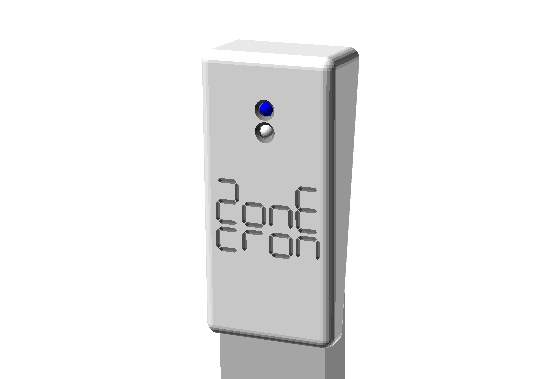

# ZonEcrón© Invisível  
## Manual do Usuário  

  

## Conteúdo  

1. [Introdução](#1-introdução)  
   - [1.1 Objetivo do dispositivo](#11-objetivo-do-dispositivo)  
   - [1.2 Principais características](#12-principais-características)  
   - [1.3 Compare-nos](#13-compare-nos)  
2. [Uso](#2-uso)  
   - [2.1 Montagem e ativação](#21-montagem-e-ativação)  
   - [2.2 Alinhamento e detecção](#22-alinhamento-e-detecção)  
   - [2.3 Auto-interferência de infravermelho](#23-auto-interferência-de-infravermelho)  
   - [2.4 Comunicação por rádio](#24-comunicação-por-rádio)  
   - [2.5 Visualização na tela](#25-visualização-na-tela)  
   - [2.6 Alimentação e recarga](#26-alimentação-e-recarga)  
   - [2.7 Autonomia](#27-autonomia)  
   - [2.8 Sol e chuva](#28-sol-e-chuva)  
   - [2.9 Armazenamento](#29-armazenamento)  
3. [Epílogo](#3-epílogo)  
4. [Contato](#4-contato)  

---

## 1 Introdução  

### 1.1 Objetivo do dispositivo  

O ZonEcrón® Invisível—e quando dizemos ZonEcrón®, imagine luzes de neon e fogos de artifício, etc.—foi projetado como um substituto para os sistemas convencionais que geralmente são instalados ao lado ou sobre o primeiro e o último salto, e que, de certa forma, obstruem a corrida do guia ou do cão.  

Com esse propósito em mente e nossa inclinação natural para minimizar o esforço, adicionamos uma série de condições semelhantes às do ZonEcrón® original: fácil instalação, sem cabos, etc. Com base na nossa experiência no desenvolvimento do ZonEcrón® original, também incorporamos exigências como a manutenção da altura de detecção constante e a instalação de todos os componentes dentro das asas do salto.  

Assim, o ZonEcrón® Invisível (daqui em diante apenas ZonEcrón®) nasceu com o objetivo de melhorar os sistemas de cronometragem disponíveis atualmente, oferecendo maior simplicidade de uso e segurança para cães e guias.  

---

### 1.2 Principais características  

- Invisível (ou quase): todos os componentes estão dentro da estrutura das asas.  
- Rápido de montar: tão rápido quanto montar um salto.  
- Adequado para ambientes externos: resistente ao sol e à chuva.  
- Recarregável: por USB, com autonomia superior a 30 horas.  
- Seguro: sinais inofensivos (infravermelho e Wi-Fi) e sem bordas afiadas.  
- Sem fios: nenhum cabo é usado, exceto para carregar as baterias.  
- Longo alcance de comunicação: testado até 200 m, recomendado a 40 m.  
- 6 sensores: esqueça de ajustar células ao mudar a altura.  

---

### 1.3 Compare-nos  

Acreditamos que desenvolvemos um produto único em funcionalidades. Não encontramos outro produto que reúna todas as características do ZonEcrón®, que não repetiremos aqui.  

Quando sentimos a necessidade de ter um cronômetro para competições, buscamos bastante e encontramos outros produtos com o mesmo objetivo. No entanto, nenhum atendia a todos os nossos requisitos, então decidimos criar o nosso próprio.  

Se você tiver necessidades específicas que o ZonEcrón® não atenda, existem outros produtos similares. Recomendamos que você procure, compare e, se encontrar… bem, uma mente curiosa é uma mente alerta.  

---

## 2 Uso

### 2.1 Montagem e Ligação

O ZonEcrón® é instalado dentro da estrutura de um obstáculo e, como não é visível… chamamos-lhe invisível… acho que vou precisar de falar com a equipe de marketing porque parece que não estão se esforçando muito. Para cada obstáculo, uma das asas conterá os emissores de infravermelho (a tampa superior tem 1 LED e os acabamentos são brancos), enquanto a outra asa conterá os receptores de infravermelho (a tampa superior tem 2 LEDs e os acabamentos são pretos):

|                   Emissor                   |                   Receptor                    |
|---------------------------------------------|-----------------------------------------------|
|  |  |

Assim, é realmente “quase invisível,” mas atenção: não coloquem duas asas com emissores no mesmo obstáculo porque, logicamente, não funcionará (não seria a primeira vez que acontece). Os mais atentos também perceberão que, da mesma forma, duas asas com receptores no mesmo obstáculo não funcionarão.

Fomos claros? Só para garantir: para cada obstáculo, será necessário uma asa com emissores e outra com receptores.

Depois que as asas estiverem posicionadas uma de frente para a outra, resta apenas ligá-las. O interruptor e o conector para carregar a bateria estão localizados na parte inferior da asa, dentro do perfil horizontal. Eles estão protegidos por uma tampa deslizante com mola. Deslize a tampa e coloque o interruptor na posição ligado (I).

Os LEDs (1 ou 2 dependendo do tipo) acendem instantaneamente. No caso do receptor, os LEDs permanecem fixos por 5 segundos enquanto a comunicação por rádio é estabelecida. Os LEDs azuis permanecerão acesos para indicar que o ZonEcrón® está… isso mesmo… ligado. Acho que também vou precisar conversar com a equipe de P&D, porque parece que estão seguindo o mesmo caminho do marketing.

---

### 2.2 Alinhamento e Detecção

Depois que o emissor e o receptor estiverem posicionados um de frente para o outro e ligados, seis feixes de infravermelho serão criados entre os seis emissores e os seis receptores, para detectar a passagem de qualquer cão em qualquer altura:

O LED branco, na asa dos receptores, se apagará se o alinhamento estiver correto e se acenderá para indicar que algum dos feixes foi interrompido. O LED permanecerá aceso por pelo menos 0,5 segundos ou, se a interrupção durar mais tempo, permanecerá aceso por essa duração.

Se qualquer uma dessas barreiras for interrompida, o cronômetro será iniciado ou parado. Se, devido à posição da barra, um par de emissor e receptor ficar permanentemente bloqueado, após 5 segundos, esse par será ignorado, e o LED branco se apagará. Vários pares podem ser bloqueados simultaneamente, se necessário, por exemplo, para adicionar barras abaixo da barra de salto, impedindo que o cão passe por baixo do obstáculo durante o treino. O único par que não pode ser bloqueado permanentemente é o superior.

O uso padrão será em um obstáculo, mas também pode ser usado para cronometrar sequências posicionando as asas sem a barra, por exemplo, na saída de um túnel. Atenção ao posicionar emissor e receptor muito próximos ou paralelos a paredes, pois a potência do emissor é suficiente para refletir em objetos próximos ou seu brilho (invisível) pode atravessar uma mão se ambos estiverem muito próximos. Recomendamos uma distância mínima de 1 metro. A distância máxima depende da quantidade de luz ambiente, variando de 2 metros à luz do dia até 20 metros em condições de escuridão com iluminação artificial.

---

### 2.3 Auto-interferência de Infravermelho

Devido à potência dos infravermelhos projetados para operar sob luz solar direta, pode acontecer que um receptor receba sinais de dois emissores. Esse efeito é mais acentuado em condições de baixa luminosidade ou em ambientes fechados.

O sintoma mais evidente é que o LED branco de um receptor pisca constantemente, e o cronômetro pode ser iniciado e parado sem que nenhum feixe tenha sido interrompido.

Isso pode ocorrer se as asas não estiverem bem alinhadas. Por exemplo:

Nesse caso, o Receptor 1 (R1) recebe sinais do Emissor 1 (E1) e do Emissor 2 (E2), causando confusão.

Para evitar isso, posicione os dois receptores em direções opostas, de forma que só possam receber sinais de um único emissor. No exemplo anterior, faremos isso:

---

### 2.4 Comunicação por Rádio

A comunicação por rádio é estabelecida automaticamente entre as células e outros acessórios da família ZonEcrón®. Essa comunicação funciona na faixa de frequência Wi-Fi e pode ser afetada em ambientes com muitas redes Wi-Fi ativas.
Cada receptor contém uma antena interna para estabelecer essa comunicação. O alcance máximo teórico é de 80 metros em áreas abertas. Testamos um alcance de 200 metros em um parque residencial com várias redes Wi-Fi circundantes, sem problemas de comunicação. Para desempenho ideal, recomendamos não exceder 40 metros em uma pista de dimensões regulamentares.

---

### 2.5 Visualização na Tela

Ao contrário do ZonEcrón® original, o sistema invisível não possui display integrado. Para visualizar os tempos, será necessário um marcador ZonEcrón® ou um dongle ZonEcrón® conectado a um computador com nosso aplicativo. Consulte os manuais desses elementos para mais informações.

---

### 2.6 Alimentação e recarga

Os quatro dispositivos (dois transmissores e dois receptores) possuem uma bateria interna de lítio recarregável, não sendo necessário o uso de cabos de alimentação ou comunicação durante o uso.

Os níveis da bateria podem ser consultados no aplicativo ZonEcron ou no visor ZonEcron, dependendo do sistema de visualização que você estiver usando. Recomendamos consultar os manuais específicos para mais detalhes. Além disso, os dispositivos indicam o nível da bateria por meio do piscar dos LEDs azuis:
- **Bateria acima de 30%**: LED azul fixo.
- **Bateria entre 30% e 15%**: piscar lento do LED azul.
- **Bateria abaixo de 15%**: piscar rápido do LED azul.

Este indicador de carga é **aproximado**, pois é baseado na medição da tensão da bateria, o que nem sempre reflete com precisão a carga restante. Por isso, é normal que a porcentagem de carga diminua rapidamente de 100% para 90%, se mantenha estável entre 90% e 10% e, depois, caia rapidamente de 10% para 0%. Recomendamos não esgotar a bateria para evitar surpresas desagradáveis, como “ai ai” ou “oh não”.

Os dispositivos possuem uma porta USB-C na parte inferior, próxima ao interruptor. Para recarregar as baterias, os dispositivos devem estar desligados e basta conectar um cabo USB padrão a um carregador USB. Graças ao design dos conectores USB, não é possível conectá-los de forma errada, garantindo segurança até para os mais desajeitados.

**ATENÇÃO: TEMPERATURAS EXTREMAS.**

As baterias de lítio têm uma faixa de operação e recarga entre 5°C e 50°C. Fora dessa faixa, a energia fornecida pode variar, causando comportamentos irregulares do cronômetro. Além disso, a duração da carga será reduzida.

Recomendamos fortemente não usar ou recarregar as baterias fora dessa faixa, especialmente se estiverem muito frias, pois isso reduzirá drasticamente sua vida útil ou poderá torná-las inutilizáveis. Se o dia foi extremamente frio ou quente, desligue os dispositivos e deixe-os em um ambiente com temperatura moderada. Aguarde uma hora para que se ajustem antes de colocá-los para carregar.

**ATENÇÃO: NÃO CARREGAR OS DISPOSITIVOS SEM SUPERVISÃO.**

Nenhum dispositivo alimentado por bateria deve ser carregado sem supervisão. É comum deixar o celular carregando durante a noite sem problemas, mas isso não significa que problemas não possam ocorrer. Recentemente, uma grande empresa enfrentou problemas com as baterias de seus celulares que, ao serem carregadas, superaqueciam e explodiam. Por isso, proteja-se e proteja os outros. Não é necessário ficar observando continuamente por 4 horas, mas é recomendável permanecer próximo enquanto os dispositivos estão carregando. Se isso não for possível, desconecte-os e continue a carga em outro momento. Essas baterias não têm efeito memória e podem ser recarregadas em intervalos sem problemas.

**ATENÇÃO: INSPECIONAR EM CASO DE IMPACTO.**

É muito provável que, em algum momento, um cão colida com a asa onde o ZonEcron© está instalado. O design foi pensado para tornar o dispositivo o mais resistente possível e para fixar firmemente as partes internas, mas, nesses casos, é obrigatório inspecionar o dispositivo cuidadosamente. Se forem observados danos, se houver partes soltas dentro ou se ele superaquecer durante a recarga, desligue o dispositivo imediatamente, desconecte-o e coloque-o em um local seguro, longe de materiais inflamáveis. Entre em contato conosco para verificar quais soluções podem ser aplicadas.

Dito isso, o ZonEcron© possui um circuito eletrônico que controla a carga e descarga das baterias. Ele impede que as baterias sejam carregadas ou descarregadas em excesso. A indicação de 0% da bateria é o nível mínimo recomendado, a partir do qual o ZonEcron© deve ser recarregado. No entanto, o dispositivo permanecerá ligado, utilizando o máximo da bateria, até que o circuito de proteção eletrônica corte a alimentação. Isso pode ser útil em emergências, mas não é recomendável como prática habitual, pois afetará negativamente a vida útil das baterias.

Por fim, aquela sabedoria popular que recomenda descarregar completamente as baterias antes de recarregá-las é válida apenas para as antigas baterias de Ni-Cd. Para essas baterias de lítio "modernas" (que já nem são tão novas), **é melhor não descarregá-las completamente** (na verdade, isso é prejudicial). É muito mais recomendável recarregá-las quando estão a meia carga. Mesmo recarregá-las em intervalos não afeta negativamente seu desempenho.

---

### 2.7 Autonomia

Um dispositivo novo possui autonomia superior a 35 horas, mais do que suficiente para uma competição de dois dias. Essa autonomia diminuirá ao longo do tempo devido ao ciclo de vida normal das baterias de lítio.

A temperatura ambiente também pode afetar negativamente a duração da bateria:
- Durante o uso, quanto mais frio, menor a duração. Não é recomendado usar os dispositivos em temperaturas abaixo de 0°C.
- Durante a recarga, recomenda-se realizar o processo em temperaturas moderadas entre 10°C e 30°C para garantir uma recarga correta e completa.

Para aumentar a autonomia, foram adotadas as seguintes estratégias:
- Durante o funcionamento do cronômetro, o brilho da tela é reduzido, pois a informação mais importante é o tempo registrado. Quando o cronômetro é parado, o brilho da tela aumenta.
- Após a parada do cronômetro, depois de 30 segundos de inatividade, o brilho da tela é reduzido ainda mais e, após outros 30 segundos, a tela é desligada, acendendo apenas por 1 segundo a cada 5 segundos.

---

### 2.8 Sol e chuva

O ZonEcron original foi projetado para funcionar perfeitamente ao ar livre, sob o sol ou a chuva.
- Sua característica cor branca foi escolhida especificamente para evitar o superaquecimento sob o sol.
- O design permite o uso sob a chuva, desde que seja mantido na posição vertical, com os conectores voltados para baixo, para evitar a entrada de água pelas aberturas.

---

### 2.9 Armazenamento

Ao guardar o ZonEcron, considere a umidade e o cuidado com a bateria:
- Como mencionado anteriormente, o ZonEcron **é resistente à chuva, mas não à umidade**. Se permanecer úmido por vários dias, a umidade penetrará gradualmente no invólucro, podendo danificar irreparavelmente os componentes eletrônicos. Portanto, se foi utilizado sob chuva, deve ser deixado em um ambiente seco por um dia antes de ser armazenado, para eliminar completamente a umidade residual.
- Em relação à bateria, se você planeja não usar o ZonEcron© por um longo período, **é melhor deixar as baterias a meia carga** para maximizar sua vida útil. Armazenar baterias de lítio completamente carregadas ou descarregadas por períodos prolongados pode reduzir significativamente seu desempenho.

---

### 3 Epílogo

Aproveite o tempo com seus cães e não se deixe levar pela frustração ao comparar seus tempos com os dos outros (embora uma competição saudável torne tudo mais divertido). Você só precisa competir contra si mesmo.

Este cronômetro foi projetado para tornar suas competições mais simples, tanto no uso quanto nas mudanças de altura.

Esperamos que você aproveite ao máximo o ZonEcron© e lembre-se: nada de erros por preguiça... Dê o seu melhor, força!

---

### 4 Contato

Para suporte técnico, dúvidas ou sugestões, entre em contato conosco por e-mail: [zonecron@gmail.com](mailto:zonecron@gmail.com)
