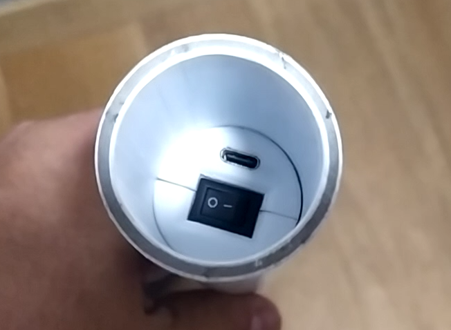

# ZonEcrón© Barras
## Manual do Usuário

## Conteúdo

1. [Introdução](#1-introdução)
   - [1.1 Objetivo do Equipamento](#11-objetivo-do-equipamento)
   - [1.2 Principais Características](#12-principais-características)
   - [1.3 Compare-nos](#13-compare-nos)
2. [Uso](#2-uso)
   - [2.1 Montagem e Ligação](#21-montagem-e-ligação)
   - [2.2 Alinhamento e Detecção](#22-alinhamento-e-detecção)
   - [2.3 Auto-interferência de Infravermelhos](#23-auto-interferência-de-infravermelhos)
   - [2.4 Comunicação por Rádio](#24-comunicação-por-rádio)
   - [2.5 Visualização na Tela](#25-visualização-na-tela)
   - [2.6 Alimentação e Carregamento](#26-alimentação-e-carregamento)
   - [2.7 Autonomia](#27-autonomia)
   - [2.8 Sol e Chuva](#28-sol-e-chuva)
   - [2.9 Armazenamento](#29-armazenamento)
3. [Epílogo](#3-epílogo)
4. [Contato](#4-contato)

---

## 1 Introdução

### 1.1 Objetivo do Equipamento

As barras ZonEcrón®, e quando dizemos ZonEcrón® queremos que imaginem luzes de neon e fogos de artifício ao fundo, como estávamos dizendo, as barras ZonEcrón® foram concebidas após o sistema invisível, devido à atualização das normas que permitem que o percurso não comece ou termine com um salto.

Assim como no sistema invisível, dado o nosso natural desejo de minimizar esforços, incluímos os mesmos requisitos: instalação fácil, sem cabos, sem necessidade de ajustar a altura de detecção, e garantindo que tudo fosse instalado dentro de um tubo para reduzir ao máximo os obstáculos.

Finalmente, as barras ZonEcrón® (daqui em diante simplesmente ZonEcrón®) foram criadas com o objetivo de melhorar os sistemas de cronometragem disponíveis atualmente, oferecendo maior facilidade de uso e segurança para cães e guias.

---

### 1.2 Principais Características

- Design compacto: todos os componentes estão dentro da barra (tubo).
- Rápido de montar: tão rápido quanto montar um obstáculo.
- Adequado para uso externo: projetado para uso sob sol e chuva.
- Recarregável: via USB, com autonomia superior a 30 horas.
- Seguro: sinais inofensivos (infravermelho e Wi-Fi) e sem cantos afiados.
- Sem fios: nenhum cabo é necessário, exceto para carregar as baterias.
- Alcance de comunicação longo: testado até 200 m, recomendado até 40 m.
- Seis sensores, eliminando a necessidade de ajustar as células para mudanças de altura.

---

### 1.3 Compare-nos

Acreditamos que desenvolvemos um produto único em suas funcionalidades. Não encontramos nenhum outro produto que combine todas as características do ZonEcrón® – que não repetiremos aqui.

Quando tivemos a necessidade de um cronômetro de competição, pesquisamos bastante e com atenção. Encontramos outros produtos que tinham o mesmo objetivo, mas nenhum atendia a todos os nossos requisitos. Por isso, decidimos criar o nosso próprio.

Se você tem uma necessidade específica que o ZonEcrón® não atende, existem outros produtos semelhantes. Convidamos você a pesquisar, comparar e, se encontrar… bem, sabe… uma mente que questiona é uma mente desperta.

---

### 2 Uso

#### 2.1 Montagem e Ligação

Toda a eletrônica, bateria, antena, etc., está instalada dentro da barra (tubo), e como não é visível, chamamos de barras. Vou precisar conversar com o pessoal de marketing, porque não parece que estão se esforçando muito. Em cada par, uma barra conterá os emissores de infravermelho (a parte superior possui 1 LED e os acabamentos são brancos), enquanto a outra barra conterá os receptores de infravermelho (a parte superior possui 2 LEDs e os acabamentos são pretos):

Aqui é possível ver os dois LEDs do receptor na parte superior e o emissor em frente com os acabamentos brancos.

Atenção, não coloquem duas barras com emissores no mesmo par, pois, logicamente, não funcionarão (não seria a primeira vez que isso acontece). Os mais atentos perceberão que, igualmente, duas barras com receptores no mesmo par também não funcionarão.

Não sei se fomos claros o suficiente... Caso não tenhamos sido, em cada par será necessário colocar uma barra com emissores e outra com receptores.

Antes de posicionar as barras uma de frente para a outra, é preciso ligá-las, pois o interruptor e a porta para carregar a bateria estão localizados na parte inferior do tubo, o que impede ligar ou desligar uma vez colocada na base.

Os LEDs (1 ou 2 dependendo do tipo) acenderão instantaneamente. No caso do receptor, eles permanecerão acesos por 5 segundos enquanto a comunicação via rádio é estabelecida. Os LEDs azuis permanecerão ligados para indicar que a barra está... bem, isso mesmo... ligada. Acho que também precisarei falar com a equipe de P&D, pois estão seguindo os passos do pessoal de marketing.

Para sustentar as barras verticalmente, é necessário montar os cilindros de encaixe nas bases de três apoios. Esses cilindros são fixados à base por meio de um parafuso e uma porca que conectam as duas partes do cilindro, garantindo que a parte mais longa, destinada a ser inserida no tubo, fique na parte superior da base. Não é necessário apertar com uma chave, pois a força manual é suficiente. Usar uma chave pode danificar o plástico com que esses cilindros de encaixe são feitos:

Por último, encaixe as barras nos cilindros das bases, garantindo que os 6 emissores de uma barra estejam corretamente alinhados com os 6 receptores da outra barra:

---

#### 2.2 Alinhamento e Detecção

Uma vez que o Emissor e o Receptor estejam posicionados um de frente para o outro e ligados, serão criados 6 feixes de infravermelho entre os 6 emissores e os 6 receptores para detectar a passagem de qualquer cão em qualquer altura:

O LED branco da barra dos receptores apagará se o alinhamento estiver correto e acenderá para indicar que algum desses feixes foi interrompido. O LED ficará aceso por no mínimo 0,5 segundos, ou, se a interrupção durar mais, permanecerá aceso durante esse tempo. Se qualquer desses feixes for interrompido, a contagem de tempo será iniciada ou parada.

O uso normal será antes do primeiro obstáculo e após o último em um percurso de competição, mas também pode ser usado para cronometrar sequências ao posicionar as barras na saída de um túnel, por exemplo. Cuidado ao posicionar emissor e receptor muito próximos um do outro ou paralelos a paredes, já que a potência do emissor é suficiente para refletir em objetos próximos ou seu brilho (invisível) pode atravessar uma mão se estiverem muito próximos. Recomendamos uma distância mínima de uso de 1m. A distância máxima depende da quantidade de luz ambiente, variando de 2 metros sob luz solar intensa até 20 metros em condições de escuridão com iluminação artificial na pista.

---

#### 2.3 Auto-interferência de Infravermelho

Devido à potência empregada nos infravermelhos para funcionar sob luz solar intensa, pode acontecer que um receptor receba os infravermelhos de dois emissores. Esse efeito é mais pronunciado em condições de pouca luminosidade ambiente ou em espaços fechados.

O sintoma mais evidente é o LED branco de um receptor acender e apagar constantemente, podendo iniciar e parar a contagem de tempo sem que nenhum feixe tenha sido interrompido. Isso pode ocorrer mesmo que as barras estejam mais ou menos alinhadas. Exemplo:

Nesse caso, o receptor 1 (R1) recebe os infravermelhos do emissor 1 (E1) e do emissor 2 (E2), ficando descontrolado.

Para evitar isso, colocamos os dois receptores em sentidos opostos, de forma que só possam receber os infravermelhos de um único emissor. No exemplo anterior, faremos o seguinte:

---

#### 2.4 Comunicação via Rádio

A comunicação via rádio é estabelecida automaticamente entre as células e outros possíveis acessórios da família ZonEcrón®. Essa comunicação opera na faixa de frequências Wi-Fi e pode ser afetada se utilizada em ambientes com muitas redes Wi-Fi presentes.

O ZonEcrón® possui uma antena interna em cada receptor para estabelecer essa comunicação. O alcance máximo teórico é de 80m em campo aberto. Nós verificamos um alcance de 200m em um parque em área residencial com várias redes Wi-Fi das casas ao redor, sem falhas de comunicação. Recomendamos não exceder os 40m em seu uso em uma pista de dimensões regulamentares, para desempenho ideal.

---

#### 2.5 Visualização na Tela

Diferentemente do ZonEcrón® original, o sistema invisível não possui display integrado. Para visualizar os tempos, será necessário um marcador ZonEcrón® ou um dongle (mochila) ZonEcrón® conectado a um computador juntamente com nosso aplicativo. Consultem os manuais desses elementos para mais informações.

---

### 2.6 Alimentação e recarga

Os quatro dispositivos (dois transmissores e dois receptores) possuem uma bateria interna de lítio recarregável, não sendo necessário o uso de cabos de alimentação ou comunicação durante o uso.

Os níveis da bateria podem ser consultados no aplicativo ZonEcron ou no visor ZonEcron, dependendo do sistema de visualização que você estiver usando. Recomendamos consultar os manuais específicos para mais detalhes. Além disso, os dispositivos indicam o nível da bateria por meio do piscar dos LEDs azuis:
- **Bateria acima de 30%**: LED azul fixo.
- **Bateria entre 30% e 15%**: piscar lento do LED azul.
- **Bateria abaixo de 15%**: piscar rápido do LED azul.

Este indicador de carga é **aproximado**, pois é baseado na medição da tensão da bateria, o que nem sempre reflete com precisão a carga restante. Por isso, é normal que a porcentagem de carga diminua rapidamente de 100% para 90%, se mantenha estável entre 90% e 10% e, depois, caia rapidamente de 10% para 0%. Recomendamos não esgotar a bateria para evitar surpresas desagradáveis, como “ai ai” ou “oh não”.

Os dispositivos possuem uma porta USB-C na parte inferior, próxima ao interruptor. Para recarregar as baterias, os dispositivos devem estar desligados e basta conectar um cabo USB padrão a um carregador USB. Graças ao design dos conectores USB, não é possível conectá-los de forma errada, garantindo segurança até para os mais desajeitados.

**ATENÇÃO: TEMPERATURAS EXTREMAS.**

As baterias de lítio têm uma faixa de operação e recarga entre 5°C e 50°C. Fora dessa faixa, a energia fornecida pode variar, causando comportamentos irregulares do cronômetro. Além disso, a duração da carga será reduzida.

Recomendamos fortemente não usar ou recarregar as baterias fora dessa faixa, especialmente se estiverem muito frias, pois isso reduzirá drasticamente sua vida útil ou poderá torná-las inutilizáveis. Se o dia foi extremamente frio ou quente, desligue os dispositivos e deixe-os em um ambiente com temperatura moderada. Aguarde uma hora para que se ajustem antes de colocá-los para carregar.

**ATENÇÃO: NÃO CARREGAR OS DISPOSITIVOS SEM SUPERVISÃO.**

Nenhum dispositivo alimentado por bateria deve ser carregado sem supervisão. É comum deixar o celular carregando durante a noite sem problemas, mas isso não significa que problemas não possam ocorrer. Recentemente, uma grande empresa enfrentou problemas com as baterias de seus celulares que, ao serem carregadas, superaqueciam e explodiam. Por isso, proteja-se e proteja os outros. Não é necessário ficar observando continuamente por 4 horas, mas é recomendável permanecer próximo enquanto os dispositivos estão carregando. Se isso não for possível, desconecte-os e continue a carga em outro momento. Essas baterias não têm efeito memória e podem ser recarregadas em intervalos sem problemas.

**ATENÇÃO: INSPECIONAR EM CASO DE IMPACTO.**

É muito provável que, em algum momento, um cão colida com a asa onde o ZonEcron© está instalado. O design foi pensado para tornar o dispositivo o mais resistente possível e para fixar firmemente as partes internas, mas, nesses casos, é obrigatório inspecionar o dispositivo cuidadosamente. Se forem observados danos, se houver partes soltas dentro ou se ele superaquecer durante a recarga, desligue o dispositivo imediatamente, desconecte-o e coloque-o em um local seguro, longe de materiais inflamáveis. Entre em contato conosco para verificar quais soluções podem ser aplicadas.

Dito isso, o ZonEcron© possui um circuito eletrônico que controla a carga e descarga das baterias. Ele impede que as baterias sejam carregadas ou descarregadas em excesso. A indicação de 0% da bateria é o nível mínimo recomendado, a partir do qual o ZonEcron© deve ser recarregado. No entanto, o dispositivo permanecerá ligado, utilizando o máximo da bateria, até que o circuito de proteção eletrônica corte a alimentação. Isso pode ser útil em emergências, mas não é recomendável como prática habitual, pois afetará negativamente a vida útil das baterias.

Por fim, aquela sabedoria popular que recomenda descarregar completamente as baterias antes de recarregá-las é válida apenas para as antigas baterias de Ni-Cd. Para essas baterias de lítio "modernas" (que já nem são tão novas), **é melhor não descarregá-las completamente** (na verdade, isso é prejudicial). É muito mais recomendável recarregá-las quando estão a meia carga. Mesmo recarregá-las em intervalos não afeta negativamente seu desempenho.

---

### 2.7 Autonomia

Um dispositivo novo possui autonomia superior a 35 horas, mais do que suficiente para uma competição de dois dias. Essa autonomia diminuirá ao longo do tempo devido ao ciclo de vida normal das baterias de lítio.

A temperatura ambiente também pode afetar negativamente a duração da bateria:
- Durante o uso, quanto mais frio, menor a duração. Não é recomendado usar os dispositivos em temperaturas abaixo de 0°C.
- Durante a recarga, recomenda-se realizar o processo em temperaturas moderadas entre 10°C e 30°C para garantir uma recarga correta e completa.

Para aumentar a autonomia, foram adotadas as seguintes estratégias:
- Durante o funcionamento do cronômetro, o brilho da tela é reduzido, pois a informação mais importante é o tempo registrado. Quando o cronômetro é parado, o brilho da tela aumenta.
- Após a parada do cronômetro, depois de 30 segundos de inatividade, o brilho da tela é reduzido ainda mais e, após outros 30 segundos, a tela é desligada, acendendo apenas por 1 segundo a cada 5 segundos.

---

### 2.8 Sol e chuva

O ZonEcron original foi projetado para funcionar perfeitamente ao ar livre, sob o sol ou a chuva.
- Sua característica cor branca foi escolhida especificamente para evitar o superaquecimento sob o sol.
- O design permite o uso sob a chuva, desde que seja mantido na posição vertical, com os conectores voltados para baixo, para evitar a entrada de água pelas aberturas.

---

### 2.9 Armazenamento

Ao guardar o ZonEcron, considere a umidade e o cuidado com a bateria:
- Como mencionado anteriormente, o ZonEcron **é resistente à chuva, mas não à umidade**. Se permanecer úmido por vários dias, a umidade penetrará gradualmente no invólucro, podendo danificar irreparavelmente os componentes eletrônicos. Portanto, se foi utilizado sob chuva, deve ser deixado em um ambiente seco por um dia antes de ser armazenado, para eliminar completamente a umidade residual.
- Em relação à bateria, se você planeja não usar o ZonEcron© por um longo período, **é melhor deixar as baterias a meia carga** para maximizar sua vida útil. Armazenar baterias de lítio completamente carregadas ou descarregadas por períodos prolongados pode reduzir significativamente seu desempenho.

---

### 3 Epílogo

Aproveite o tempo com seus cães e não se deixe levar pela frustração ao comparar seus tempos com os dos outros (embora uma competição saudável torne tudo mais divertido). Você só precisa competir contra si mesmo.

Este cronômetro foi projetado para tornar suas competições mais simples, tanto no uso quanto nas mudanças de altura.

Esperamos que você aproveite ao máximo o ZonEcron© e lembre-se: nada de erros por preguiça... Dê o seu melhor, força!

---

### 4 Contato

Para suporte técnico, dúvidas ou sugestões, entre em contato conosco por e-mail: [zonecron@gmail.com](mailto:zonecron@gmail.com)
